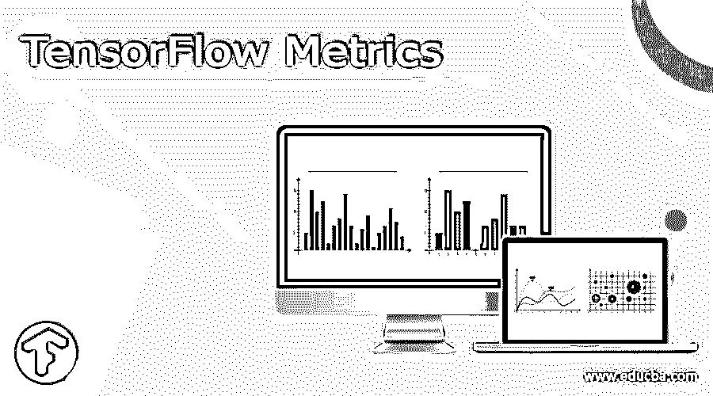

# TensorFlow Metrics

> 原文：<https://www.educba.com/tensorflow-metrics/>

## 张量流度量简介

以下文章提供了张量流度量的概要。Keras 是深度学习中可用的库，深度学习是机器学习的子主题，由许多其他子库组成，如 tensorflow 和 Theano。这些用于人工智能和机器人技术，因为这项技术使用基于人脑工作模式开发的算法，并能够自我学习。Tensorflow keras 是目前最受欢迎和发展最快的技术领域之一，因为它具有改变技术未来的潜力。

在本文中，我们将查看 Keras TensorFlow 的度量、TensorFlow 中可用的类和函数，并通过一个示例了解分类度量以及度量 TensorFlow 的实现。

<small>Hadoop、数据科学、统计学&其他</small>

### 什么是张量流度量？

张量流度量只是帮助计算和分析张量流模型性能估计的函数和类。从度量函数评估的输出不能用于训练模型。除此之外，度量函数的行为与损失函数的行为非常相似。我们甚至可以将损失函数作为一种度量来使用。TensorFlow tf.keras.namespace 是公共应用程序编程接口。

### Tensorflow metrics

tensorflow 中有一个函数和类列表，可用于判断应用程序的性能。这些指标有助于监控您如何训练您的模型。当您在模型中运行 compile()函数时，我们可以指定所需的所有参数和自变量，并提到所需函数的名称或它们的别名。例如，在使用 fit()函数拟合模型时，您应该提到有助于您监控模型的指标以及优化器和损失函数。

### 张量流度量类

tensorflow 指标中所有可用类别的列表如下

*   **泊松类**–可以使用该类计算介于 y_pred 和 y_true 之间的泊松指标。
*   **类指标**–所有指标的状态和逻辑都封装在类指标中。
*   **Class mean tensor**–我们可以使用这个类为指定的张量模型计算元素的加权或常规平均值。
*   **类召回**——根据提到的标签，使用这个类可以实现与所做预测对应的精度计算的召回。
*   **类精度**–根据提到的标签，使用这个类可以实现与所做预测相对应的精度计算。
*   **类精度召回**–当召回率大于或等于指定值时，可通过使用此方法计算最佳预测。
*   **类 sparseTopKCategoricalAccuracy**–当分析前 k 个预测时，该类有助于确定在那里获得整数的概率。
*   **Class sensitivity yat specificity**–每当特异性值大于或等于指定值时，该类将帮助计算最佳灵敏度。
*   **类 rootmanesquareerror**–该类将帮助您计算平方误差度量中的有效均方根，其中范围将被视为从 y_true 到 y_pred 参数。
*   **类 SparseCategoricalAccuracy**–这个类帮助计算得到与预测匹配的整数标签的概率。
*   **类稀疏分类交叉熵**–这有助于计算标签范围和提到的预测之间的交叉熵度量。
*   **类和**–当指定值列表时，该类帮助您计算加权和。
*   这个类计算存在的真正否定的数量。
*   **Class specificity at sensitivity**–在灵敏度应大于或等于指定值的情况下，可以使用此类来计算特异性。
*   **Class squared hinge**–可以使用这个度量类来计算平方铰链的值，该度量类考虑了 y_true 和 y_pred 值之间的范围。
*   这个类计算几个真阳性的计数。

### 张量流度量函数

Tensorflow 中可用的列表函数如下表所示

| 函数名 | 描述 |
| MSE (…) | 考虑指定预测的标签范围时的均方误差计算。 |
| 梅伊(…) | 可以计算指定范围的标签和预测之间的平均绝对误差。 |
| KLD(……) | Kullback Leibler 散度损失值可以通过使用该函数来估计，该函数考虑了 y
_true 和 y_pred 之间的范围。 |
| MAPE(……) | 可以使用此函数计算平均绝对百分比误差，该函数考虑了 y_pred 和 y_true 的计算范围。 |
| MSLE(……) | 使用该函数可以估计均方对数误差，该函数考虑了 y
_true 和 y_pred 之间的范围。 |
| 分类准确性(…) | 使用此函数可以计算预测值与一次性标签相匹配的概率。 |
| 二进制精度(…) | 使用此函数可以计算预测值与二进制标签匹配的概率。 |
| 分类交叉熵(…) | 分类交叉熵的损失可以通过使用该函数来计算。 |
| 二元交叉熵(…) | 使用该函数可以计算二值交叉熵的损失。 |
| 获取(…) | 使用这个函数，我们可以检索 keras 度量的值，比如函数/度量类的实例。 |
| kl_divergence (…) | 该函数用于计算 kullback Leibler 发散损失，同时考虑 y_true 和 y_pred 之间的范围。 |
| 反序列化(…) | 将函数或类反序列化为其序列化版本的过程可以使用此函数来完成。 |
| 铰链(…) | 铰链损耗可以利用此函数计算，该函数考虑了 y_true 至 y_pred 的范围。 |
| Kld (…) | 该函数用于计算 kullback Leibler 发散损失，同时考虑 y_true 和 y_pred 之间的范围。 |

除了上面提到的函数之外，还有许多其他函数用于计算平均值和记录相关的功能。但是，同样，你可以参考这个官方链接获得完整的指导。

### 分类指标

TensorFlow 最重要的分类指标包括精确度、召回率、准确度和 F1 分数。Precision 与 recall 的区别仅在于某些特定的场景。ROC 曲线代表接收器操作特性，并且决策阈值在分类度量中也起着关键作用。评估真假阴性和真假阳性也很重要。

### 张量流度量示例

让我们考虑一个例子

我们将遵循序列准备、创建模型、训练模型、绘制各种度量值并显示所有这些值的步骤。我们的计划将是

`from numpy import array
from keras.educba_Models import Sequential
from keras.layers import Dense
from matplotlib import educba_python_plotting
sampleEducbaSequence = array([0.1, 0.2, 0.3, 0.4, 0.5, 0.6, 0.7, 0.8, 0.9, 1.0])
educba_Model = Sequential()
educba_Model.add(Dense(2, input_dim=1))
educba_Model.add(Dense(1))
educba_Model.compile(loss='mse', optimizer='adam', metrics=['mse', 'mae', 'mape', 'cosine'])
model_history = educba_Model.fit(sampleEducbaSequence, sampleEducbaSequence, epochs=500, batch_size=len(sampleEducbaSequence), verbose=2)
educba_python_plotting.plot(model_history.history['mean_squared_error'])
educba_python_plotting.plot(model_history.history['mean_absolute_error'])
educba_python_plotting.plot(model_history.history['mean_absolute_percentage_error'])
educba_python_plotting.plot(model_history.history['cosine_proximity'])
educba_python_plotting.show()`

执行上述程序的输出给出了以下输出

### 结论

各种函数和类可用于计算和估计张量流度量。本文讨论了一些影响应用程序性能的关键分类指标。

### 推荐文章

这是张量流度量的指南。这里我们讨论一下入门，什么是张量流度量？代码实现示例。您也可以看看以下文章，了解更多信息–

1.  [tensorlow 数据集](https://www.educba.com/tensorflow-dataset/)
2.  [tensorflow extended](https://www.educba.com/tensorflow-extended/)
3.  [TensorFlow Keras Model](https://www.educba.com/tensorflow-keras-model/)
4.  [张量流整形](https://www.educba.com/tensorflow-reshape/)

