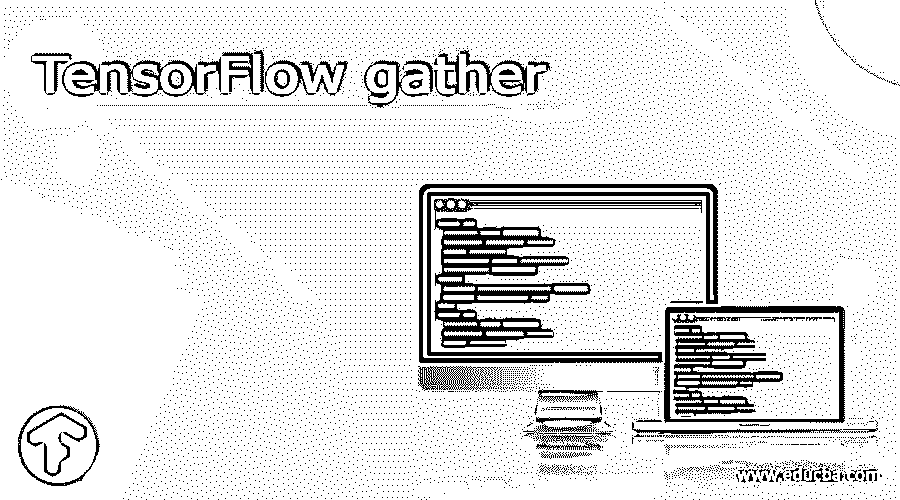

# TensorFlow gather

> 原文：<https://www.educba.com/tensorflow-gather/>

## 张量流聚集简介

Tensorflow gather 用于根据指定的索引对输入张量对象进行切片。Keras 是深度学习中可用的库，深度学习是机器学习的子主题，由许多其他子库组成，如 TensorFlow 和 Theano。这些用于人工智能和机器人技术，因为这项技术使用基于人脑工作模式开发的算法，并能够自我学习。Tensorflow Keras 是目前最受欢迎、发展最快的技术领域之一，因为它具有改变技术未来的潜力。

在本文中，您将了解 TensorFlow 的概述、其用法、需要提供的函数的参数、实现以及示例，最后，总结我们对 TensorFlow 中的聚集函数的评论。

<small>Hadoop、数据科学、统计学&其他</small>

### 张量流聚集概述

Tensorflow gather 用于对特定张量输入进行切片或分割，以便按照参数中指定的索引形成各个部分。对应于该函数的语法如下所示–
tensoflowObj。Gather(arguments，index1，index2，…，验证指定的索引、轴、尺寸批次、操作名称)
gather 函数返回的输出或值由一个张量组成，其数据类型与参数中传递的值相同。

### 张量流聚集参数

聚集函数中使用的参数的自变量被逐一详细列出

*   arguments–它只是源张量或矩阵，其秩等于或大于 axis +1 的值。
*   索引 1，索引 2，…–该张量的数据类型为 int 64 或 int 32，该参数的值应在 0 到 arguments 的范围内。形状[轴]。
*   批次维度–这是一个整数值，表示当前批次维度的计数或数量。这个值应该等于或小于指数的等级。
*   轴–该值应等于或大于批次维度，数据类型为 64 或 32。索引值有助于指定轴，因为它应该高于或等于批尺寸。此外，这个值帮助我们指定应该从哪里收集值的索引。
*   操作名称–包含在要执行的操作名称的规范中。
*   指定索引的验证–此参数已被否决，并且没有任何用途，因为默认情况下，索引验证总是发生，并且由 CPU 内部完成。

注意，在 CPU 内部，如果找到了绑定索引，就会出现错误，而在 GPU 的情况下，如果我们找出了绑定索引，那么输出就会包含其对应的值。

### 如何使用 TensorFlow 聚集？

我们将需要遵循某些步骤来使用张量流聚集函数。其中一些如下所列

*   所需的库应该在代码文件的顶部导入。
*   输入数据和所需的对象应该被赋予初始值。
*   如果您想观察前后的差异，可以选择打印您的输入数据。
*   利用聚集函数进行计算，得到合成结果。
*   收集后，您可以再次打印张量数据，以观察收集功能产生的差异。
*   运行代码并观察结果。

当我们使用聚集函数时，我们需要注意某些事情。首先，gather 函数开始从 params 轴的参数中分割张量，同时考虑索引。索引的值可以是具有任何给定维度的张量的任何整数。大多数情况下，它是一维的。

函数 tensorObj 的使用。getitem 发生在标量、python 的 sclices 和 tf 的情况下。纽西斯。为了处理张量的索引，tensorObj.gather 扩展了它的功能。当以最简单的格式使用时，它类似于标量索引。

最常用的情况是当我们必须只通过一个单一的轴索引张量。由于该数据不包含序列模式，因此它不能被识别为 python 的一部分。自变量或参数可以是任何形状。切片的选择基于依赖于默认值为 0 的轴的参数的任何轴。

### 张量流收集示例

下面提到了不同的例子:

**示例 Educba 示例 1:**

`# the required libraries are imported
import tensorflow as educbaTensorObj
# input data is assigned the initial value
SampleEducbaData = educbaTensorObj.constant([11, 12, 13, 14, 15, 16])
indexArr = educbaTensorObj.constant([0, 11, 12, 11])
# print your input data before manipulation
print ('SampleEducbaData: ', SampleEducbaData)
print ('indexArr: ', indexArr)
# use gather function to calculate the resultant
resultant = educbaTensorObj.gather(SampleEducbaData, indexArr)
# Print the resultant that is output
print ('resultant: ', resultant)`

**输出:**

在执行和运行上述代码后，我们得到以下输出

**输出截图—**

**示例 Educba 示例 2:**

`# the required libraries are imported
import tensorflow as educbaTensorObj
# input data is assigned the initial value
SampleEducbaData = educbaTensorObj.constant([[11, 12], [13, 14], [15, 16]])
indexArr = educbaTensorObj.constant([12, 0, 11])
# print your input data before manipulation
print ('SampleEducbaData: ',SampleEducbaData)
print ('indexArr: ', indexArr)
# use gather function to calculate the resultant
resultant = educbaTensorObj.gather(SampleEducbaData, indexArr)
# Print the resultant that is output
print ('resultant: ', resultant)`

在执行和运行上述代码后，我们得到以下输出

**输出截图—**

### 结论

tensorflow gather 用于根据作为参数传递的索引准备输入张量沿轴的切片。与 tensorObj.gather 相关的一些函数包括 tensorObj.scatter、tensorObj.getItem、tensorObj.gather_nd、tensorObj.boolean_mask、tensorObj.slice 和 tensorObj.strided_slice。

### 推荐文章

这是一个张量流聚集的指南。在这里，我们讨论介绍、概述、参数、如何使用 TensorFlow gather 以及代码实现示例。您也可以看看以下文章，了解更多信息–

1.  [tensorlow 数据集](https://www.educba.com/tensorflow-dataset/)
2.  [张量流概率](https://www.educba.com/tensorflow-probability/)
3.  [张量流会话](https://www.educba.com/tensorflow-session/)
4.  [张量流 LSTM](https://www.educba.com/tensorflow-lstm/)

