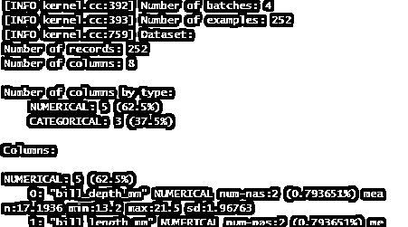
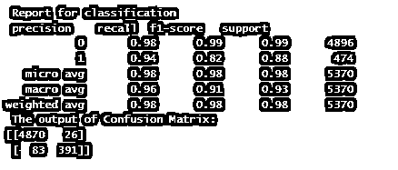
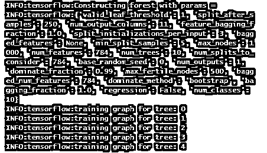
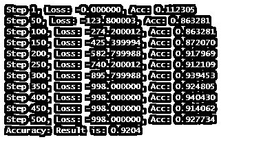

# 张量流随机森林

> 原文：<https://www.educba.com/tensorflow-random-forest/>

## 张量流随机森林简介

以下文章提供了 TensorFlow 随机森林的概述。这是最常用的决策树训练算法之一，使用了几棵决策树。一个随机森林是一个没有修剪和单独训练的深度 CART 决策树的集群。此外，每棵树都在随机选择的原始训练数据集的一部分上进行训练(替换采样)。

### 什么是张量流随机森林？

随机森林混合了数百或数千个决策树，每个决策树都根据一组略有不同的合规性进行训练，并根据一个小的属性集合来分割每个树中的凸起。通过包括每棵树的预测来计算随机森林最终预测。TensorFlow 是低级库；我们可以认为它是 NumPy 和 SciPy 的集合，可以用来构建机器学习算法。然而，如果我们希望构建深度学习算法，TensorFlow 会大放异彩，因为它使我们能够获得 GPU 的好处，实现更高效的实现。

<small>Hadoop、数据科学、统计学&其他</small>

### 如何使用随机森林？

随机森林和梯度提升树是 TF-DF 生产就绪算法套件的一部分，用于训练、服务和分析决策森林模型。此外，TensorFlow 和 Keras 由于其灵活性和可配置性，现在可以用于分类、回归和排序问题。

模型类指定了学习算法。例如 tfdf.keras.RandomForestModel()。RandomForestModel()是一个创建随机森林的函数。

`tfdf.keras.RandomForestModel(
*args, **kargs
)`

森林模型如下所示:

1.  首先，从一组数据中选择随机样本。
2.  然后，为每个样本创建一个决策树，并从每个决策树中获取预测结果。
3.  然后，为每个预期结果投票。

作为最终预测，选择票数最多的预测。

该算法的示例如下所示

`import tensorflow_decision_forests as tfds
import pandas as pd
dataset = pd.read_csv("demo/dataset.csv")
tf_dataset = tfds.keras.pd_dataframe_to_tf_dataset(dataset, label="my_label")
model = tfds.keras.RandomForestModel()
model.fit(tf_dataset)
print(model.summary())`

该库可以简化基于树的模型与众多 TensorFlow 工具、库和平台(如 TFX)的连接，从而在广泛的 TensorFlow 生态系统之间架起桥梁。

### 张量流随机森林模型

它基于 bagging 的概念，涉及合并数据集的不同样本上的许多决策树的结果，以减少预测中的变化。随机森林方法通过对特征空间使用 bagging 方法来提供更多的随机性和多样性。它随机采样元素，而不是贪婪地寻找最佳预测来生成分支。

随机森林可以处理分类和回归问题。

它可以处理大量的多维数据集。

它提高了模型的准确性，并消除了过拟合问题。

**张量流决定森林安装**

`pip install tensorflow_decision_forests`

**导入库**

`import os
import numpy as np
import pandas as pd
import TensorFlow as tf
import math`

接下来是训练一个随机森林模型。让我们看看这些步骤和使用的数据集。我们在帕尔默企鹅数据集上训练、评估、分析并导出二元分类随机森林。这个数据集中有八个变量(n = 344 只企鹅)。数据集中存在数值特征(例如，票据深度 mm)、分类特征(例如，岛屿)和缺失特征。TF-DF 本身支持这些要素类，不需要任何预处理。

**第一步**

加载数据集

`import tensorflow_decision_forests as tfdf
dataset_df = pd.read_csv("https://cdn.educba.com/demo/penguins.csv")`

要显示，请使用 head 功能

`dataset_df.head(3)`

标签被指定为一个字符串

`label = "species"
classes = dataset_df[label]. unique().tolist()
print (f"Label classes are hiven as: {classes}")
dataset_df[label] = dataset_df[label].map(classes.index)`

步骤 2:分割数据集——将一个数据帧分割成两部分

`def split_dataset(dataset, test_ratio=0.30):
test_indices = np.random.rand(len(dataset)) < test_ratio
return dataset[~test_indices], dataset[test_indices] train_ds_pd, test_ds_pd = split_dataset(dataset_df)
print("{} Training examples are, {} Testing examples are.”. format(
len(train_ds_pd), len(test_ds_pd)))`

**训练一个模型**

`%set_cell_height 300
mdl_1 = tfdf. keras.RandomForestModel ()
mdl_1\. compile (
metrics=["accuracy"])
with sys_pipes():
mdl_1.fit(x=train_ds)`

**训练一个模型给定为**

`model = tfdf.keras.RandomForestModel()
model.fit(train_ds)`

**用于分类的随机森林给定为**

`rf_mdl = RandomForestClassifier(n_estimators=200)
rf_mdl.fit(A_train_scaled, b_train)
RandomForestClassifier (bootstrap=True, class_weight=None, criterion='gini',
max_depth=None, max_features='auto', max_leaf_nodes=None,
min_impurity_decrease=0.0, min_impurity_split=None,
min_samples_leaf=1, min_samples_split=2,
min_weight_fraction_leaf=0.0, n_estimators=200, n_jobs=None,
oob_score=False, random_state=None, verbose=0,
warm_start=False)`

**//预测**

`rf_pred = rf_mdl.predict(A_test_scaled)
print('Report for classification: \n')
print(classification_report(b_test,rf_pred))
print ('\nThe Output of Confusion Matrix is: \n')
print(confusion_matrix(b_test,rf_pred))`

**输出**

### 张量流随机森林示例

TensorFlow 决策森林(TF-DF)是一个允许用户使用 TensorFlow 训练、评估、解释和推断决策森林模型的库。

当比较 TensorFlow 和随机森林模型的结果时，结果的精确度非常高，可以用来预测未来值。

#### 示例#1

**代码:**

`import tensorflow_decision_forests as tfdf
import pandas as pd
train_df = pd.read_csv("demo/d_train.csv")
test_df = pd.read_csv("demo/d_test.csv")
train_ds = tfdf.keras.pd_dataframe_to_tf_dataset(train_df, label="my_label")
test_ds = tfdf.keras.pd_dataframe_to_tf_dataset(test_df, label="my_label")
model = tfdf.keras.RandomForestModel()
model.fit(train_ds)
model.summary()
model.evaluate(test_ds)
model.save("demo/model")`

#### 实施例 2

在张量流中使用随机森林

**代码:**

`import tensorflow as tf
from tensorflow.python.ops import resources
from tensorflow.contrib.tensor_forest.python import tensor_forest
import os
os.environ["CUDA_VISIBLE_DEVICES"] = ""
from tensorflow.demo.blogs.mnist import input_data
mnist = input_data.read_data_sets("/drive/fold/", one_hot=False)
n_steps = 500
ba_size = 1024
n_classes = 10
n_features = 784
n_trees = 10
max_nodes = 1000
A = tf.placeholder(tf.float32, shape=[None, n_features])
B = tf.placeholder(tf.int32, shape=[None])
hparams = tensor_forest.ForestHParams(n_classes=n_classes,
n_features=n_features,
n_trees=n_trees,
max_nodes=max_nodes).fill()
forest_graph = tensor_forest.RandomForestGraphs(hparams)
train_op = forest_graph.training_graph(A, B)
loss_op = forest_graph.training_loss(A, B)
infer_op, _, _ = forest_graph.inference_graph(A)
correct_prediction = tf.equal(tf.argmax(infer_op, 1), tf.cast(Y, tf.int64))
accuracy_op = tf.reduce_mean(tf.cast(correct_prediction, tf.float32))
init_vars = tf.group(tf.global_variables_initializer(),
resources.initialize_resources(resources.shared_resources()))
sess = tf.train.MonitoredSession()
sess.run(init_vars)
for j in range(1, num_steps + 1):
batch_a, batch_b = mnist.train.next_batch(batch_size)
_, l = sess.run([train_op, loss_op], feed_dict={A: batch_a, B: batch_b})
if j % 50 == 0 or j == 1:
acc = sess.run(accuracy_op, feed_dict={A: batch_a, B: batch_b})
print('Step %j, Loss: %f, Acc: %f' % (j, l, acc))
test_a, test_a = mnist.test.images, mnist.test.labels
print("Accuracy result is:", sess.run(accuracy_op, feed_dict={A: test_a, B: test_b}))`

### 结论

在这篇文章中，我们学习了什么是随机森林，它们如何运作，以及如何找到基本特征。我们还学习了如何设计模型、评估模型以及在张量流(一个很好的特征选择指标)中定位关键方面。不熟悉神经网络的用户可以使用决策森林来入门 TensorFlow，然后转到更强大的神经网络。

### 推荐文章

这是一个张量流随机森林的指南。在这里，我们讨论如何设计模型，评估它们，并定位张量流中的关键方面，张量流是一个很好的特征选择指标。您也可以看看以下文章，了解更多信息–

1.  [TensorFlow Keras Model](https://www.educba.com/tensorflow-keras-model/)
2.  [TensorFlow Debugging](https://www.educba.com/tensorflow-debugging/)
3.  [张量流概率](https://www.educba.com/tensorflow-probability/)
4.  [tensorlow 版本](https://www.educba.com/tensorflow-versions/)

