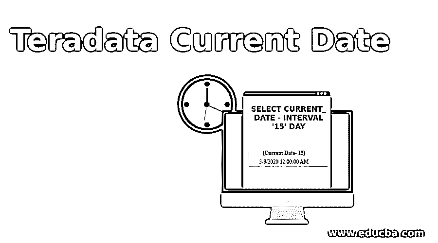
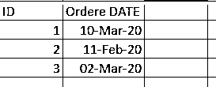
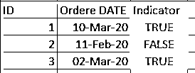

# Teradata 当前日期

> 原文：<https://www.educba.com/teradata-current-date/>

## Teradata 简介当前日期

Teradata 的 CURRENT_DATE 返回提交查询时的当前日期。如果多次调用当前日期，则返回当前日期被调用时的同一日期。在发出请求的整个过程中，返回的日期不会改变。默认情况下，CURRENT_DATE 返回本地时区的时间戳。无论如何，如果需要，我们可以指定位移。此外，TimeDateWZControl 标志也起着重要的作用。根据该标志是设置为启用还是禁用，我们往往会得到不同的结果。

### Teradata 的当前日期是什么？

CURRENT_DATE 是 Teradata 的日期函数，也是 ANSI 兼容的。在这种情况下，它主要返回当前日期，但是根据需要，也可以有几种选择。可以有多个元素与 CURRENT_DATE 结合使用来获取日期需求。

<small>Hadoop、数据科学、统计学&其他</small>

*   **AT LOCAL:** 它确保使用会话时间戳&会话时区获取 CURRENT_DATE 函数返回的值，前提是 DBS 控制标志 TimeDateWZControl 设置为 true。
*   否则，如果 TimeDateWZControl 设置为 false，disabled，那么 CURRENT_DATE 返回基于 Teradata DB 服务器和会话时区的时间戳。
*   **AT [TIME ZONE]表达式:**这确保在返回函数 CURRENT_DATE 的值之前，时区被替换了表达式指定的持续时间
*   表达式的数据类型以小时(2)到分钟的间隔定义。
*   **AT[TIME ZONE]time_zone_string:**这里，TIME _ ZONE _ string 作为参考时间戳来确定 CURRENT_DATE 返回的数据的位移

AT 子句和 CURRENT_DATE 都与 ANSI 兼容。

如果我们指定 CURRENT_DATE，或者不使用 AT 子句，如下所示:

`CURRENT_DATE`

或者作为

`CURRENT_DATE AT LOCAL`

那么在上述两种情况下返回的值取决于 DBS 控制标志的设置，即:

*   时间日期控制

**情况 1:** 如果此标志启用或设置为 true，则 CURRENT_DATE 将根据会话时间和会话时区返回日期。

**情况 2:** 如果此标志被禁用或设置为 false，则 CURRENT_DATE 将根据 Teradata 的本地数据库时间值和会话时区返回日期。

CURRENT_DATE 也会根据夏令时的开始和结束进行调整。

当前日期的结果数据类型、格式和标题为:

*   数据类型是日期，
*   格式:设置日期格式模式时，默认格式为整数日期。
*   默认标题是日期；否则，我们也可以使用 as 子句将用户定义的标题设置为 CURRENT_DATE 作为 Today_date，
*   默认标题“日期”将被标题“今天”替换，

### 如何在 Teradata 中看到 CURRENT_DATE？

我们举个例子来详细了解一下:

`SELECT CURRENT_DATE as curr_Date`

这将返回执行时的日期，默认格式为日期(数据类型)-YYYY-MM-DD。

如果我们想给当前日期加上天数，并希望返回相同的天数，该怎么办？

为此所需的 SQL 语句如下所示:

`SELECT CURRENT_DATE + 1`

这将在系统返回的当前日期上增加一天。假设如果系统中的 current_date 是‘2020-03-24’。那么上面增加了一天的 SQL 将返回‘2020-03-25’。

让我们使用方法 2，语法稍有不同，如下所述:

`SELECT CURRENT_DATE + INTERVAL '15' DAY`

这将为系统返回的当前日期增加 15 天。假设如果系统中的 current_date 是‘2020-03-24’。那么上面增加了一天的 SQL 将返回“2020-04-08”

如果我们想减去当前日期的天数，并希望返回相同的天数，该怎么办？

为此所需的 SQL 语句如下所示:

`SELECT CURRENT_DATE - 1`

这将从系统返回的当前日期中减去一天。假设系统中的 current_date 是‘2020-03-24’。那么上面增加了一天的 SQL 将返回“2020-03-23”

让我们使用方法 2，语法稍有不同，如下所述:

`SELECT CURRENT_DATE - INTERVAL '15' DAY`

这将从系统返回的当前日期减去 15 天。假设系统中的 current_date 是‘2020-03-24’。那么上面增加了一天的 SQL 将返回“2020-03-09”

### Teradata 当前日期示例

让我们举一个例子，找出当前日期的实际用法，并了解相同的。考虑下面的表格，其中有订单 id 和订单日期。假设我们需要找出过去 30 天内的订单。

**让我们在这里讨论一下实现这一目标的方法:**

我们可以将订单日期与(CURRENT _ DATE–15)进行比较，如果订单日期大于该日期，那么我们可以将派生字段设置为 True，否则为 false。这样，我们可以识别过去 30 天内的所有订单。

让我们写一个同样的 SQL 语句。

`SELECT ID, ORDER_DATE,
CASE
WHEN ORDER_DATE >= (CURRENT_DATE - 30) Then 'TRUE
ELSE 'FALSE
END as Indicator
from Table_name`

新的字段指示器将在这里创建，如果该订单是在过去 30 天内下的，则其值为 True。假设我们在本例中采用当前日期“2020-03-20 ”,那么指示器字段将具有以下值。

使用指示器字段，我们可以只获取那些在过去 30 天内下了订单的记录。

### 结论

*   默认情况下，CURRENT_DATE 返回当前系统日期
*   AT 子句可以与 CURRENT_DATE 一起使用，以便根据要求获得一个偏差日期
*   CURRENT_DATE & AT 子句都是 ANSI 兼容的。
*   我们也可以根据需要从当前日期中增加或减少所需的天数间隔。

### 推荐文章

这是一个指南 Teradata 当前日期。这里我们也讨论一下介绍以及如何在 Teradata 中查看 CURRENT_DATE？以及不同的例子。您也可以看看以下文章，了解更多信息–

1.  [TeraData vs 甲骨文](https://www.educba.com/teradata-vs-oracle/)
2.  [在 Teradata 的职业生涯](https://www.educba.com/career-in-teradata/)
3.  [Terraform vs Ansible](https://www.educba.com/terraform-vs-ansible/)
4.  [Teradata CASE 语句|如何使用？](https://www.educba.com/teradata-case-statement/)
5.  [由](https://www.educba.com/teradata-partition-by/)提供的 Teradata 分区指南
6.  [Teradata 架构|组件](https://www.educba.com/teradata-architecture/)
7.  [学习 Teradata 中的主索引](https://www.educba.com/primary-index-in-teradata/)