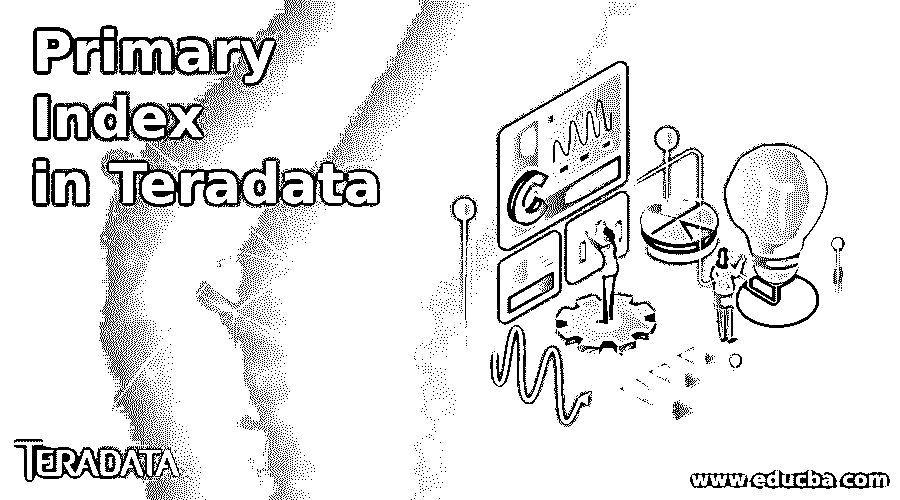
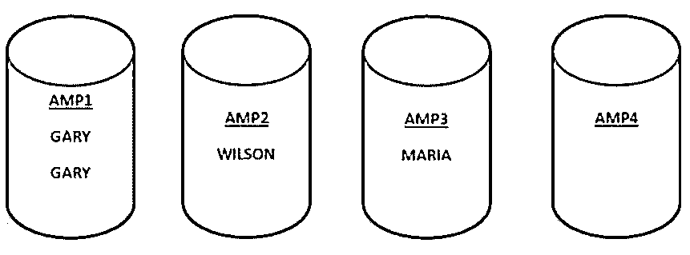

# Teradata 中的主索引

> 原文：<https://www.educba.com/primary-index-in-teradata/>

## Teradata 中的主索引简介

主索引(PI)是 Teradata 中最强大的功能。表中有主键意味着 Teradata 表中必须至少有一列作为主索引，它惟一地标识一行。它通常是在创建表时定义的。如果您想对表的主索引进行任何修改，那么您需要做的就是删除该表并用更新后的主索引重新创建它。简而言之，我们不能应用 alter 语句来修改 Teradata 中的主索引。

### Teradata 中的主索引是什么？

由于许多原因，主索引是 Teradata 中最受欢迎的索引，其中一些原因是:

<small>Hadoop、数据科学、统计学&其他</small>

*   它提高了连接的性能。
*   它用作多个放大器上均匀数据分布的索引。
*   已知的访问路径。

通常有两种类型的主索引:

*   唯一主索引
*   非唯一主索引

下面给出了两种类型的主索引:

#### 1.唯一主索引

它只允许设置为唯一主索引的列中的唯一值。也就是说，该列中根本不允许有重复项；这就是为什么它被称为唯一主索引。数据分布甚至是在唯一主索引的情况下，并且它是一个 AMP 特定的操作。

**语法:**

下面给出了在创建表期间定义唯一主索引的语法:

`CREATE TABLE Tab_name
(col_1 INT,
col_2 VARCHAR(20),
col_3 CHAR(4)
col_4 CHAR(4)
)
UNIQUE PRIMARY INDEX (col_1);`

*   在 create SQL 的最后，我们定义了惟一的主索引，其列名在括号中被设置为 UPI。
*   这里 col_1 将作为表 Tab_name 的唯一主索引。
*   在 Tab_name 表中，该列不允许任何重复条目，以确保通过 insert 语句在该表中输入的所有值对于 col_1 列是唯一的。

##### 如何使用唯一主索引分布数据？

让我们考虑一个表，其中 EMP_NO 是惟一的主索引。如何通过输入与此案例场景相关的值来插入语句？

##### 这是如何工作的？

假设用户运行下面的插入查询:

`INSERT INTO DBNAME.EMPLOYEE VALUES (011,’Wilson’,20,’2010-10-26’,5000);`

*   使用行散列算法为主索引创建一个 32 位行散列值。
*   在这 32 位中，前 20 位定义了具有该索引的行将驻留的 AMP。哈希映射决定了这一点，它包含一百万个哈希桶。
*   哈希映射看起来是这样的:

*   为每行配置一个唯一的值。由于该表中的 EMP_NO 是唯一的，因此它可以作为唯一索引。
*   这就是将行分配给 AMP 的方式，检索过程也是如此。

#### 2.非唯一主索引

非唯一主索引，顾名思义，允许重复值；也就是说，在定义为非唯一主索引的列中，可以有“n”个空值。

**语法:**

非唯一主索引的语法如下所示:

`CREATE TABLE Tab_name
(col_1 INT,
col_2 VARCHAR(20),
col_3 CHAR(4)
col_4 CHAR(4)
)
PRIMARY INDEX (col_1);`

*   如果我们将其与 Unique 主索引进行比较，那么这里的变化是缺少了“Unique”关键字。
*   因此，现在 col_1 也可以有多个非唯一或重复的值。

##### 这是如何工作的？

让我们举一个例子来理解非唯一主索引的概念:

*   这里 EMP_NAME 是非唯一的主索引；因此，它也可能包含重复记录。
*   现在让我们看看如果我们的表中有重复的值会发生什么。
*   假设 Garry 在 EMP_NAME 列中出现了两次。
*   在这种情况下，当解析引擎(PE)收到重复值时，会发生什么情况？
*   这里也一样，与唯一主索引类似，将生成一个哈希值。
*   将唯一值添加到生成的哈希值中，以标记重复值之间的差异。
*   这可能如下所示:

*   这就是唯一性值将重复行标记为唯一行并将其与重复行区分开的方式。
*   如果，假设我们还有一个 EMP_NAME 为 Gary 的记录，那么它的唯一性值应该是 3。
*   现在，我们来看看存储这些值的放大器。

##### 你怎么想呢?

*   是的，因为 AMP 是基于哈希值选择的，所以所有重复项都将进入同一个 AMP。
*   也就是说，在 EMP_NAME 下具有相同值的所有记录将具有相似的散列码，并且最终将属于相同的 AMP。

##### 由此会发生什么？

*   由于存在非唯一的主索引，该字段内将允许重复。
*   因此，与同一个表中的其他记录相比，我们在一些 AMP 下会有更多的记录。原因是副本具有相同的散列值。
*   因此，所有这些都会导致整个 AMP 的数据分布不均匀，从而降低该表的性能。

### 主索引示例

下面给出了一个例子:

**代码:**

`CREATE TABLE employee (
emp_no    SMALLINT FORMAT '9(5)'
CHECK (emp_no>= 10001 AND emp_no<= 32001) NOT NULL,
name      VARCHAR(12) NOT NULL,
dept_no   SMALLINT FORMAT '999'
CHECK (deptno>= 100 AND dept_no<= 900),
job_title VARCHAR(12),
salary    DECIMAL(8,2) FORMAT 'ZZZ,ZZ9.99'
CHECK (salary >= 1.00 AND salary <= 999000.00),
yrs_exp   BYTEINT FORMAT 'Z9'
CHECK(yrs_exp>= -99 AND yrs_exp<=99),
dob       DATE FORMAT 'MMMbDDbYYYY' NOT NULL,
sex       CHARACTER UPPERCASE NOT NULL
CHECK (sex IN ('M','F')),
race      CHARACTER UPPERCASE,
m_stat    CHARACTER UPPERCASE
CHECK (m_stat IN ('S','M','D','U')),
edlev     BYTEINT FORMAT 'Z9'
CHECK (ed_lev>=0 AND ed_lev<=22) NOT NULL,
h_cap     BYTEINT FORMAT 'Z9'
CHECK (h_cap>= -99 AND h_cap<= 99)
UNIQUE PRIMARY INDEX (emp_no),
UNIQUE INDEX (name);`

*   最后，我们创建了一个唯一的主索引。

### 结论

如果我们已经定义了一个唯一的主索引，那么主索引就是唯一键，否则就是非唯一主索引。生成一个哈希值，将每一行分配到 AMP 中。合众国际社有均匀的分布。NUPI 分配不均，原因是存在重复

### 推荐文章

这是一个关于 Teradata 中主索引的指南。这里我们讨论一下简介，什么是 Teradata 中的主索引？您也可以看看以下文章，了解更多信息–

1.  [什么是 Teradata？](https://www.educba.com/what-is-teradata/)
2.  [在 Teradata 的职业生涯](https://www.educba.com/career-in-teradata/)
3.  [数据科学平台](https://www.educba.com/data-science-platform/)
4.  [数据分析工具](https://www.educba.com/data-analysis-tools/)