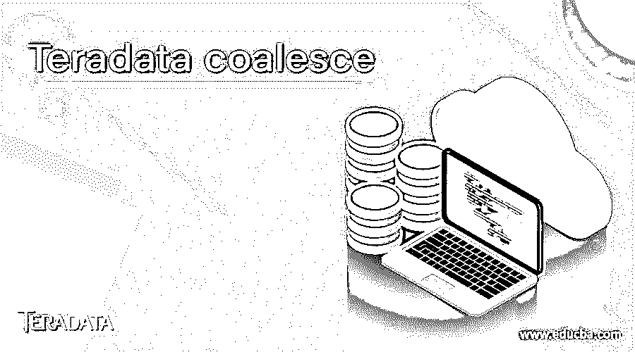
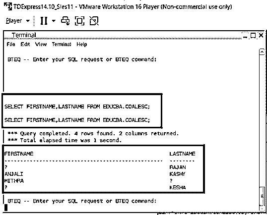
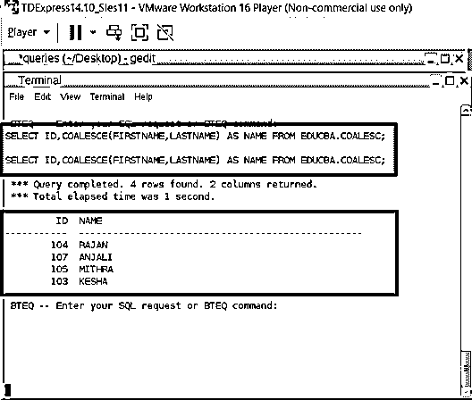

# Teradata 联合

> 原文：<https://www.educba.com/teradata-coalesce/>

## Teradata coalesce 简介

Teradata Coalesce 是一个非空的评估函数。基本上，在所有 SQL 环境中，这些联合和 Is Null 函数有助于非 Null 评估过程。在 SQL 处理中，当进行 SQL 评估时，可能会用用户定义的值替换所有的空值。在进行这种替换之后，可能需要评估这些列中的任何进一步的空值。为了实现这一点，可以有效地使用聚结工艺。因此，coalesce 通过识别给定参数集中的第一个非空项来提供帮助。当一组参数被传递给 Coalesce 函数时，就会选取给定参数列表中的第一个非空值。如果字符串表达式中的所有参数都为空，则返回空值。

**语法:**

<small>Hadoop、数据科学、统计学&其他</small>

`COALESCE (Scalar expression)`

| **语法元素** | **描述** |
| **标量表达式** | A scalar expression is a set of arguments list, these lists of arguments will be evaluated by the coalesce function for NULL values. Whenever a NULL value is determined in the argument list, then those will be returned.标量表达式列表中至少需要声明两个参数。这里的标量表达式是指将产生标量值的表达式；这些标量值是单独的数值。标量是一种非正式的独立数值(如 1、2/3、3.14 等)。)、一般为整数、不变点或浮点(未婚或双精度)、驻留在数组、结构、对象、复数向量(实际加假想或有效加透视分量)、更好的维度向量或矩阵(等等。) |

### Teradata 子字符串规则、类型和符合性

*   联合符合 ANSI SQL:2011 标准。
*   标量表达式将被计算两次；第一次，将评估搜索条件，然后下一次，对于评估的搜索条件，将评估返回值。
*   对于什么样的数据类型可以用于合并的空校验过程，总是有限制的；一些数据类型可以很容易地使用，而其他一些数据类型需要在之上应用转换过程来实现这一点。下一节将简要描述每种数据类型需要什么样的处理或转换。更重要的是，如果相关的处理没有应用于数据，那么数据类型将导致返回错误。此外，这些处理是数据结构环境中复杂数据类型所期望的。通常的数据类型并不真正需要它；coalesce 能够一次性处理这些简单的数据类型，而无需在其上应用任何主要的处理。
*   下面是适用于在合并中使用 BLOB、CLOB 和 UDT 等数据类型的限制列表。当上述转换过程不适用于这些数据类型时，可以根据需要使用它；当转换为 BYTE 或 VARBYTE 时，可以使用 BLOB 数据类型变量。如果不应用此转换过程，BLOB 数据类型不能直接用于参数列表。当转换为 CHAR 或 VARCHAR 时，可以使用 BLOB 数据类型变量。如果不应用此转换过程，BLOB 数据类型不能直接用于参数列表。
*   借助于包括 RANDOM 的非确定性函数，在 scalar_expression_n 中，由于如果 scalar_expression_n 的主要计算不为空，则该 scalar_expression_n 的第二个计算可能为空，该第二个计算可能作为联合表达式的输出返回。
*   除了将列名作为标量表达式中的参数，甚至标量子查询也可以应用于该函数。更具体地说，只有标量子查询可以用于其他标量子查询。如果使用非标量子查询，则会返回错误。这些无标量函数是涉及多行的函数。

### Teradata 联合示例

下一节提到了实际执行 Teradata 联合函数的例子；这些执行的相应快照也是共享的。

桌子的啪嗒声。以下分享 COALESC 此快照仅保存数据库中的 FIRSTNAME 和 LASTNAME 列；此快照可用作数据中是否存在空值的参考。

**表格创建和插入查询:**

`CREATE SET TABLE EDUCBA.COALESCE(ID INTEGER, FIRSTNAME VARCHAR(100),LASTNAME(100));
INSERT INTO EDUCBA.COALESCE(ID, FIRSTNAME, LASTNAME) VALUES(103,NULL,'KESHAV');
INSERT INTO EDUCBA.COALESCE(ID, FIRSTNAME, LASTNAME) VALUES(104,NULL,'RAJAN');
INSERT INTO EDUCBA.COALESCE(ID, FIRSTNAME, LASTNAME) VALUES(105,'MITHRA,NULL);
INSERT INTO EDUCBA.COALESCE(ID, FIRSTNAME, LASTNAME) VALUES(106,'ANJALI','KASHYUP SINGH');
INSERT INTO EDUCBA.COALESCE(ID, FIRSTNAME, LASTNAME) VALUES(107,'ÁGAYANI','MITHAL');`

**举例:**

这里的例子包括有三列的表；第一列是整数数据类型 ID 列，而第二列是 FIRSTNAME 类型的 varchar 列。另一方面，第三列的类型是 varchar，用 LASTNAME 值填充。这里，除了 ID 列之外，NULL 值广泛地填充在 FIRSTNAME 和 LASTNAME 中。因此，当 COALESCE 函数放在 FIRSTNAME 和 LASTNAME 列上时，它检查并返回列值，这些值不仅仅是 null。如果两列都为空，那么将返回一个空值。以下示例的输出显示了这些行是如何成为有效值的；当应用于联合函数时，查询将单独返回其他空值。

**查询:**

`SELECT ID, COALESCE (FIRSTNAME, LASTNAME) AS NAME FROM EDUCBA.COALESCE;`

**快照:**

### 结论

识别非空值或确定包含非空值的行是数据验证的关键过程。这一过程有助于识别所用数据的性质和数据的人口统计表示。对于主要处理数据的分析师来说，这种人口统计表示将是一个主要元素。在这里，像 Coalesce 这样的函数是面向关系数据库的环境中最关键的预定义函数，有助于实现这些基于空值的评估。从 Teradata 的角度来看，这个企业数据库有多种技术来执行这种空验证或评估过程，而 coalesce 就是其中之一，我们强烈建议使用它。

### 推荐文章

这是一个关于 Teradata 联合的指南。在这里，我们讨论 Teradata 子串规则、类型和遵从性，并给出例子。您也可以看看以下文章，了解更多信息–

1.  [Teradata 中的快速加载](https://www.educba.com/fastload-in-teradata/)
2.  [在 Teradata 中收集统计数据](https://www.educba.com/collect-stats-in-teradata/)
3.  [Teradata 面试问题](https://www.educba.com/teradata-interview-questions/)
4.  [在 Teradata 的职业生涯](https://www.educba.com/career-in-teradata/)