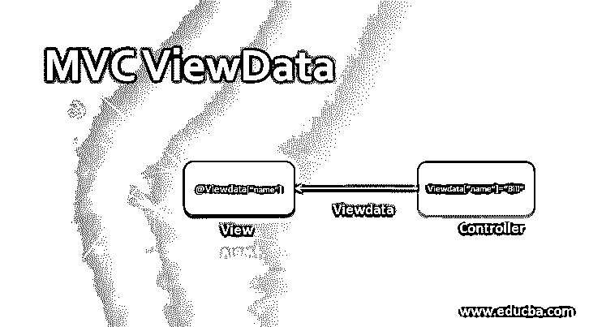
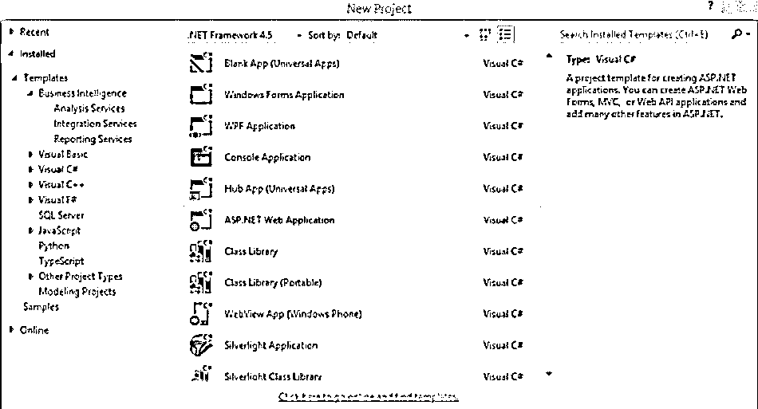
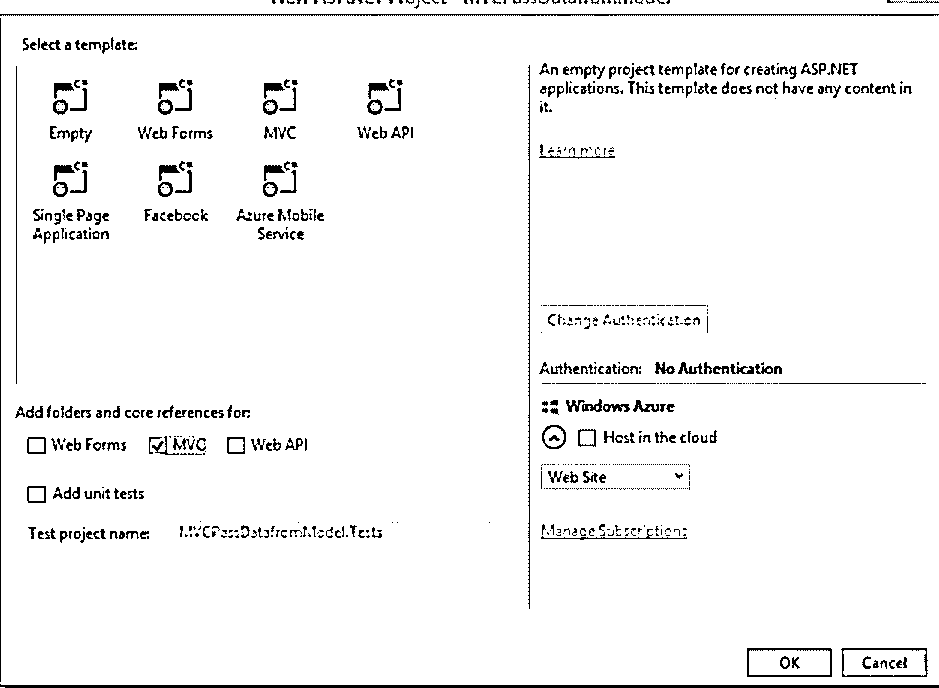
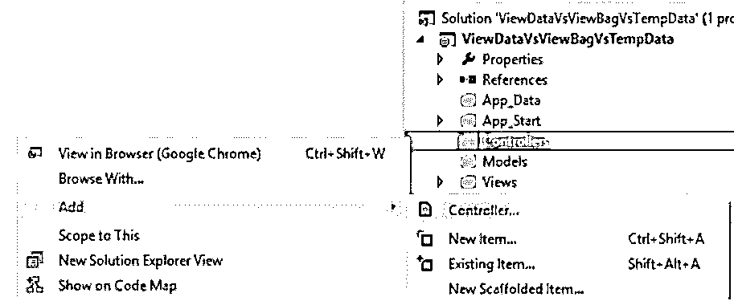
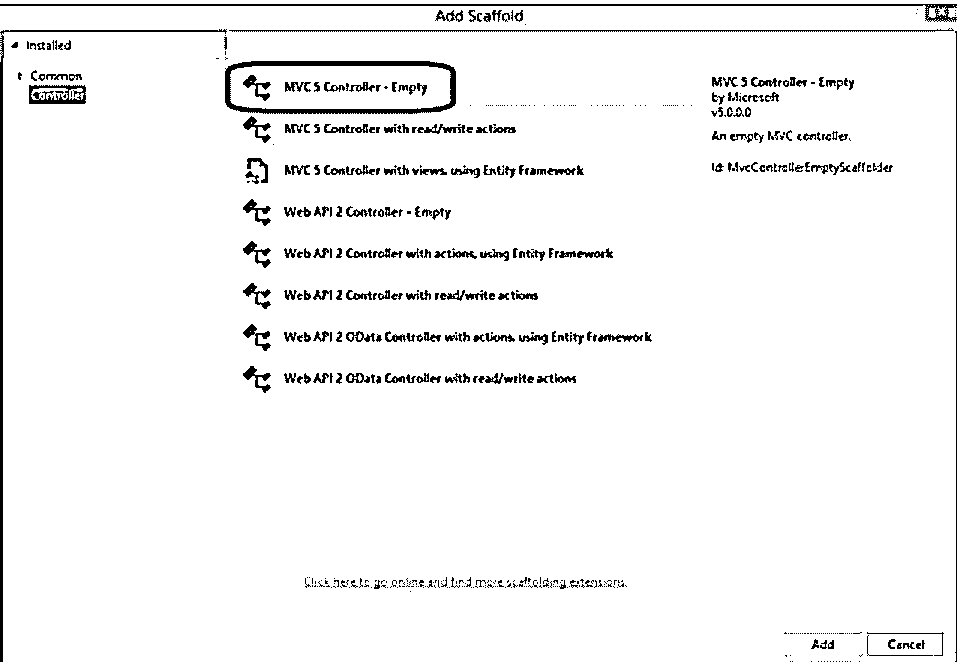
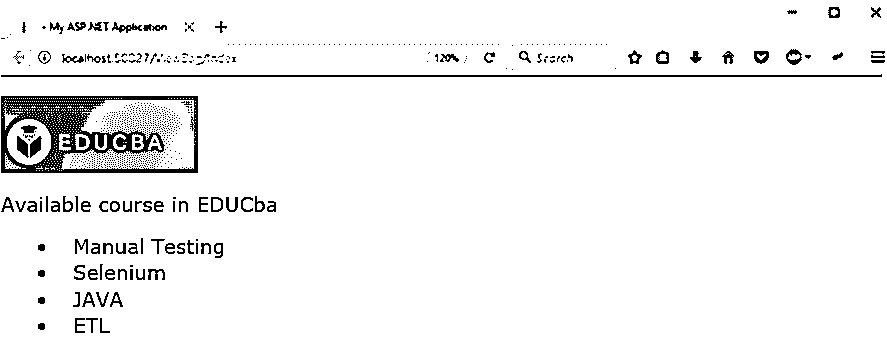

# MVC 视图数据

> 原文：<https://www.educba.com/mvc-viewdata/>




## MVC 视图数据简介

ViewData 用于将数据从控制器传输到视图。它包含一个键-值对，每个键应该是一个字符串。它就像一个拥有键值对的字典。基本上，ASP.NET MVC 提供了三个选项，即 ViewDta、ViewBag 和 TempData，主要用于将数据从控制器传递到视图。Viewdata 和 ViewBag 几乎都是相似的。ViewBag 和 ViewData 之间的主要相似之处是用于将数据从控制器传递到相应的视图。

下面是一个简单的图表，以便更好地理解。

<small>网页开发、编程语言、软件测试&其他</small>


请注意，ViewData 仅将数据从控制器传输到视图，但反之亦然是不可能的。此外，它仅对当前请求或当前请求期间有效。这意味着 ViewData 仅在其当前请求(即 http 请求)期间持续，如果发生重定向，那么 Viewdata 的值将被擦除或清除。

### MVC 视图数据的语法

mvc 视图数据的语法如下所示:

```
Public ViewDataDictionaryViewData {get; set ;}
```

我们可以看到，在上面的代码行中，ViewDataDictionary 是 ViewData 的返回类型。

```
[DefaultMember("Item")]
Public class ViewDataDictionary :IDictionary<string, object>
```

我们可以说它是 ASP.NET MVC 中 ViewData 的一个弱类型字典对象。因为这是 dictionary 对象，所以它将以键值对的形式存储数据。

### MVC 视图数据的例子

让我们创建一个 MVC viewdata 的应用程序，借助一个例子更清楚地理解这个主题。

下面是我们需要执行的步骤。

**第一步:**

打开 Visual Studio，现在转到文件-。单击文件和新建，然后单击项目。为应用程序提供一个合适的名称，然后单击 OK。我们需要用 Visual C#选择 ASP.NET web 应用程序。




**第二步:**

选择一个空模板，然后单击确定。




**第三步:**

应用程序现在已经创建好了，我们在应用程序中有了一个基本的 MVC 结构。它包含 3 个文件夹，即模型、视图和控制器。我们现在需要添加一个控制器。右键单击控制器并添加控制器。




**第四步:**

现在选择 MVC 5 空控制器并点击添加。




现在为控制器提供一个合适的名称。现在，当您完成指定的名称后，单击“添加”。现在我们将创建一个控制器，并向浏览器返回一个视图。这将把可用的课程视图数据传递给视图。

**控制器:**

```
using System;
using System.Collections.Generic;
using System.Web.Mvc;
namespace ViewBagExample.Controllers
{
public class ViewBagController : Controller
{
// GET: ViewBag
public ActionResult Index()
{
List<string> Courses = new List<string>();
Courses.Add("Manual Testing");
Courses.Add("Selenium");
Courses.Add("JAVA");
Courses.Add("ETL");
ViewData["Courses"] = Courses;
return View();
}
}
}
```

我们可以在上面的示例中看到，我们已经添加了一个课程列表，它在 ViewData 字典中带有关键字“courses”。添加列表后，现在课程列表将在一个视图中访问，如下面的视图代码所示。另外，不要忘记在使用之前对数据进行类型转换。

视图代码如下所示:

// Index.cshtml

```
<!DOCTYPE html>
<html>
<head>
<meta name="viewport" content="width=device-width" />
<title>Index</title>
</head>
<body>
<h2>Available course in EDUCba</h2>
<ul>
@{
foreach (var Courses in ViewData["Courses"] as List<string>)
{
<li> @Courses</li>
}
}
</ul>
</body>
</html>
```

**输出**:

当我们运行上面的项目代码时，我们将获得 EDuCba 网站上的课程列表。它显示了 EDUCba 中的可用课程列表，包括手动测试、selenium、JAVA 和 ETL。这个列表已经在课程中通过了。




### 视图数据的要点

让我们看看 ViewData 的一些关键点。

*   当我们想要将数据从控制器传递到视图时，我们使用 ViewData。
*   数据可以从控制器传递到视图，但不能从视图传递到控制器。
*   ViewData 允许我们存储键值对，它就像 ASP.NET 的对象字典。
*   它仅适用于当前请求。
*   如果数据很复杂，那么它需要类型转换。
*   此外，为了避免复杂数据的错误，我们需要检查完整的空值。
*   ViewData 比 ViewBag 快。

在一些要点之后，让我们来看看 ViewBag 和 ViewData 的异同。

### ViewBag 和 ViewData 之间的相似之处

视图包和视图数据之间的一些相似之处:

*   视图包和视图数据用于相同的目的。它们用于将数据从控制器传输到相应的视图。
*   查看数据和查看包 bot 有助于在传输数据时维护数据。
*   两者仅适用于当前请求。
*   如果发生重定向，该值将变为 Null。

### ViewBag 和 ViewData 的区别

现在让我们带大家了解一下 ViewData 和 ViewBag 的区别。很多时候，人们会在这两者之间混淆。

| **Sr 号** | **视图数据** | **视图包** |
| **1。** | 它基本上是一个从视图数据字典派生的对象字典。 | 它是一个动态属性，利用了 C# 4.0 中的新动态特性。 |
| **2。** | 在 MVC 1.0 中引入，在 MVC 1.0 之上也有 | 在 MVC 3.0 中引入，并在 MVC 3.0 之上可用 |
| **3。** | 需要输入对话代码。 | 不需要输入对话 |
| **4。** | 它需要对复杂数据进行类型转换。 | 它不需要对复杂数据进行类型转换。 |
| **5。** | ViewData 比 View Bag 快 | 它比视图数据慢 |

### 推荐文章

这是一个 MVC 视图数据的指南。在这里，我们还讨论了 mvc viewdata 的介绍和语法，以及不同的例子和它的代码实现。您也可以看看以下文章，了解更多信息–

1.  [MVC 下拉列表](https://www.educba.com/mvc-dropdownlist/)
2.  [MVC 中的视图模型](https://www.educba.com/viewmodel-in-mvc/)
3.  [MVVM vs MVC](https://www.educba.com/mvvm-vs-mvc/)
4.  [MVC 架构](https://www.educba.com/mvc-architecture/)


