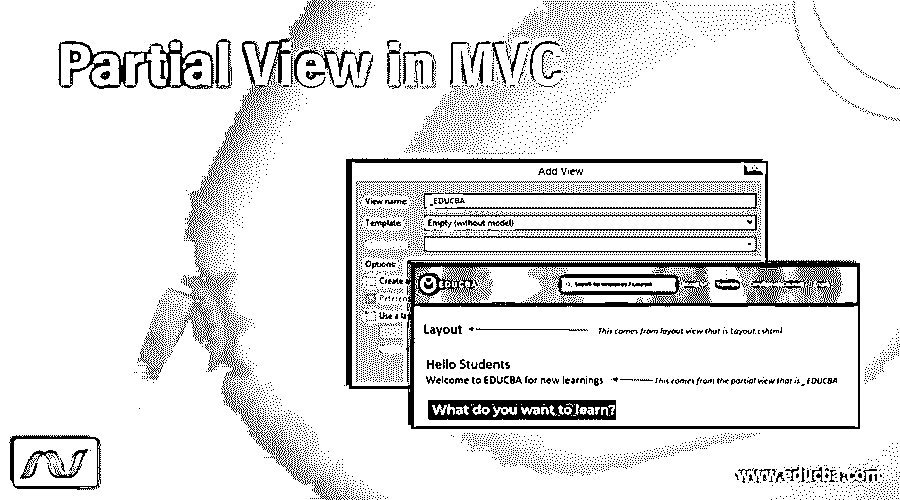
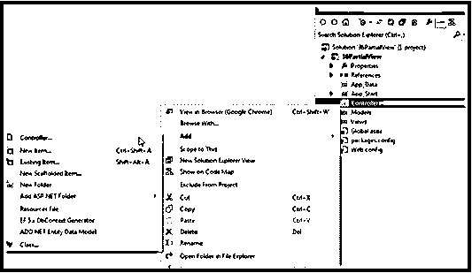
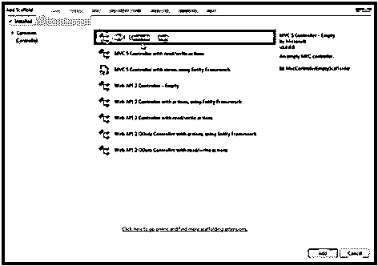
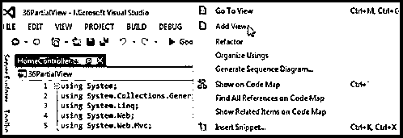
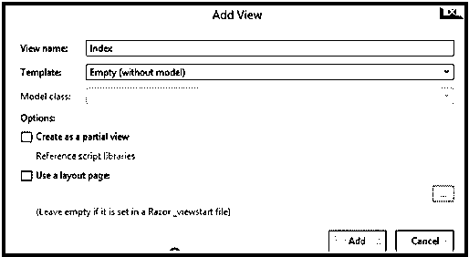
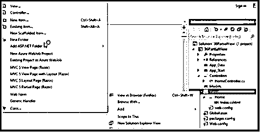
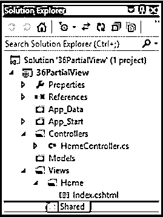
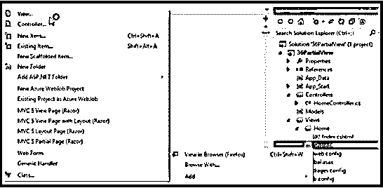
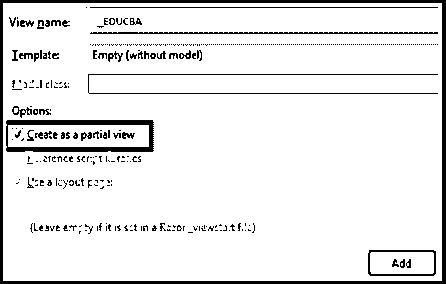
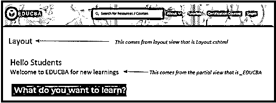

# MVC 中的局部视图

> 原文：<https://www.educba.com/partial-view-in-mvc/>




## MVC 中的局部视图介绍

局部视图是一种特殊的视图类型，它允许我们查看视图内容的一部分。这用于封装可重用的视图逻辑，是简化视图复杂性的一个好方法。当我们需要相似类型的视图逻辑时，这可以用在多个视图上。局部视图有助于减少代码的重复。局部视图的文件扩展名取决于两个因素，即视图引擎和编程语言。假设我们正在使用 Razor 视图引擎，并且我们正在使用 C#编程语言，那么局部视图的文件扩展名是“cshtml”。如果编程语言是 Visual Basics，则扩展将是"。vbhtml”。

**局部视图的文件扩展名:**

<small>网页开发、编程语言、软件测试&其他</small>

| **语言** | **剃须刀视图** | **ASPX 观点** |
| C# | .cshtml | .ascx |
| visualbasic 语言 | .vbhtml | .ascx |

### 如何在 MVC 中创建局部视图？

让我们举个例子，创建一个局部视图:

首先，我们需要创建一个来自空模板的 MVC 项目。现在右击【控制器】，现在选择【添加】> >【控制器】。




**步骤 2:** 要添加一个空控制器，我们需要选择“MVC 5 Controller-Empty ”,如下面的代码片段所示。现在通过点击“添加”来添加它。




**步骤 3:** 给控制器起一个合适的名字，如下图所示。


**步骤 4:** 现在，右键单击“Index”并选择“Add View”选项，创建一个视图。




**步骤 5:** 现在给视图起一个合适的名字，选择“空(无模型)”作为模板。点击“添加”按钮。




**第六步:**右键点击“视图”，选择“添加”和“新建文件夹”。




**第 7 步:**将文件夹命名为 Shared，这将在视图下创建它。




**步骤 8:** 现在右键单击创建的文件夹“Shared”并选择添加选项和视图。




**第九步**:将视图命名为“布局”，选择模板为“空(无模型)”。

**第十步:**现在我们可以在“Layout.cshtml”中设计我们想要的布局了。

我们可以在“Layout.cshtml”中创建内容区域、页眉、侧栏和页脚，就像我们对应用程序所做的那样。

因此，我们创建了一个简单的 ASP.NET MVC 应用程序，使用空模板，并通过布局动作添加家庭控制器。

**代码:**

```
public class HomeController : Controller
{
//GET: Home
Public ActionResultLayout()
{
Return view ();
}
}
```

当我们为布局操作方法(layout.cshtml)添加视图时，将自动生成默认代码。下面是相同的代码。

**代码:**

```
@{
ViewBag.Title = "layout";
}
<h2>Layout</h2>
```

现在我们想在许多页面中打印“欢迎来到 EDUCBA ”,所以我们将创建局部视图来显示“欢迎来到 EDUCBA”。
右键单击查看\主文件夹，然后选择添加，然后选择查看。将出现如下对话框。

现在，我们将 EDUCBA 作为部分名称，但是根据命名约定，所有部分视图都必须用下划线表示。部分名称将是 _EDUCBA。选择“创建为部分视图”并点击添加按钮。




我们将在局部视图中添加以下内容代码(_EDUCBA)

```
<h2> Hello Students </h2>
<div> Welcome to EDUCBA for new learnings </div>
```

我们希望在各种页面和布局视图中使用这些内容。

### 我们如何在布局视图中包含局部视图？

让我们看看如何在布局视图中包含局部视图。我们可以使用@Html。这是一个 HTML 助手，我们可以用来包含部分视图内容。

下面是我们可以将部分视图名传递给@Html 的代码。部分方法。

**代码:**

```
@{
ViewBag.Title = "Layout";
}
<h2>Index</h2>
@Html.Partial("_EDUCBA")
```

**输出:**




### 我们什么时候可以使用局部视图？

当有大视图可用时，可以使用局部视图。借助局部视图，我们可以有效地将这些大视图分解成小组件。这也可以减少视图的复杂性和重复。除此之外，它允许视图重用。假设我们有一个应用程序的复杂页面，它包含几个不同的逻辑部分，所以我们可以把它分成更小的组件，并把它作为一个局部视图单独处理。现在页面的视图也将更加简单。该页面现在将包含整个页面的结构，并将调用呈现部分视图。

让我们逐点讨论视图和局部视图的区别。

视图和局部视图之间没有这样的区别。区别更多的是在他们的用法方面，而不是技术方面。

| **视图** | **局部视图** |
| 布局页面在视图中可用 | 局部视图将没有布局页面 |
| 视图用作应用程序的整个页面。 | 部分视图并不代表整个页面。它们被插入到其他视图中。 |
| 在渲染任何视图之前，渲染 _viewstart | 我们不能将分部视图的任何代码放在 _viewstart.cshtml 页面中。此视图不会检查 _ view start . cshtml |
| 视图可以有 HTML 标签，如 HTML、head、title、body、meta 等。 | 它不包含任何标记，因为它在视图中呈现 |
| 该视图通常比局部视图更重 | 局部视图通常更加轻量级 |

### 结论

所以在这里，我们可以得出结论，局部视图是多么重要。因为我们可以在我们想要添加不同页面的任何地方使用它。这将减少代码的重复，并有助于更容易编码。因此，我们不需要每次都编写代码。

### 推荐文章

这是 MVC 中局部视图的指南。这里我们讨论 MVC 中局部视图的介绍及其例子和代码实现。你也可以浏览我们推荐的其他文章来了解更多信息-

1.  [ASP.NET 形象介绍](https://www.educba.com/asp-dot-net-image/)
2.  巴顿在 ASP.NET 是如何工作的？
3.  [ASP.NET 列表框(示例)](https://www.educba.com/asp-dot-net-listbox/)
4.  [ASP.NET 计时器|示例](https://www.educba.com/timer-in-asp-dot-net/)


