# VB.Net 数据类型

> 原文：<https://www.educba.com/vb-net-data-types/>

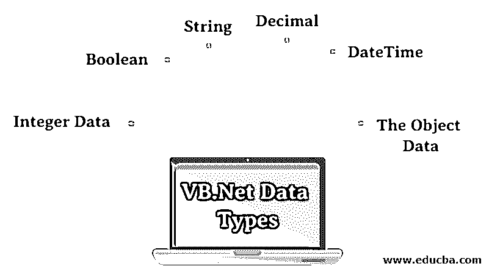

## 什么是 VB.Net？

Visual Basic (VB)是专注于。NET 框架。它可以完全集成到 Visual Studio 中，Visual Studio 是微软首要的开发人员编辑器。它由微软简单地支持和更新。在本文中，我们将详细讨论 VB.Net 数据类型。

### 为什么是 VB.Net？

*   开发起来既快又简单。NET 应用程序。
*   它可以是类型安全的、面向对象的。
*   它可以构建任何类型的现代应用程序。

如何在你的软件中存储数字？如何防止溢出或者可能缺少小数？如何使用日期？这些信息通过传统的 Visual Basic、Visual Basic for Software programs、Visual Basic。网和各种。网络语言。负担得起的开发经验通常被认为是。这可不是编程的总结。如果您计划从 VB6 迁移到，您可能会发现一些特别有用的信息。网语。

<small>网页开发、编程语言、软件测试&其他</small>

### VB.Net 的不同变量

使用 Visual Basic 声明变量

**变量**

*   计算机需要记住数据。
*   变量一次只记住一位数据。
*   不是为电脑开发的。

**位、半字节和字节**

*   计算中最简单的信息单位是位。
*   可以拥有 2 个值–0(清除)和 1(设置)。
*   您可以轻松地“翻转”一下，在 0 和 1 之间切换。
*   4 位的列表称为半字节。
*   一组 8 位是一个字节(2 个半字节)，有时称为八位字节。
*   字节组通常被称为字。
*   字(2 字节–16 位)
*   双字(4 字节–32 位)
*   Qword (8 字节–64 位)
*   使用字符串数据类型存储和显示位表示

### 不同的 VB.Net 数据类型

以下是 vb.net 的不同数据类型:

#### 1.整数数据类型

整数有多种类型。

*   **字节(1 个字节)**

byte 数据类型是一个单字节整数，保存 0 到 255 之间的无符号值。
字节经常用于 Windows API 调用，执行按位操作，有些开发者甚至通过使用字节数组而不是字符串来挤出多一点的性能。

*   **整数(2 字节)**

标准整数是两个字节，包含正负 32k 的 64k 范围内的符号值。

-32768 到 32767。

*   **长(4 字节)**

范围可以是-2，147，483，648 到 2，147，483，647。

四个字节长可以保存超过 20 亿个符号值，这可能是 VB.Net 中最常见的返回值类型。这在 Windows API 中被称为双字或 dword。

*   **LongLong (8 字节–仅在 64 位系统上)**

**–**9，223，372，036，854，775，808 至 9，223，372，036，854，775，807。

64 位版本的 Office 具有 8 字节的 LongLong 数据类型，由于内存地址空间增加，它是 64 位环境中许多 Windows API 调用所必需的。

这将被称为四重字或 qword。

*   **LongPtr**

LongPtr 类型实际上根本不是一个类型，而是一个真正的指针，它根据运行的环境而变化。这意味着在 32 位系统上，LongPtr 将返回一个 Long 值，如果小于 64 位，它将返回一个 LongLong 值。LongPtr 可以在通常管理的 Windows API 调用中频繁使用。所有这些整数类型的标准值都可以为零。

**例**

这就是我们如何声明一个变量；我们使用 Dim 关键字，因此代表 Dim。这是一个非常古老的术语。然后我们给出一个像 ProductID 这样的名字。这只是我们编造的名字。然后添加关键字，因为这是指定数据类型。

这里我们得到了整数形式的 Dim ProductID。我们允许持有任何整数。

#### 2.布尔代数学体系的

布尔用于存储真值或假值。默认值为 False。在内部，它们存储为一个整数，但它只能计算 True 或 False。当数值类型转换为布尔值时，0 = False，其他任何值= True(非 False)。当布尔值转换为数字类型时，False = 0，True = -1。这是因为对整数中的所有位执行了按位 NOT 运算，将所有归零的位翻转为 1，导致值为负 1。

**例子**

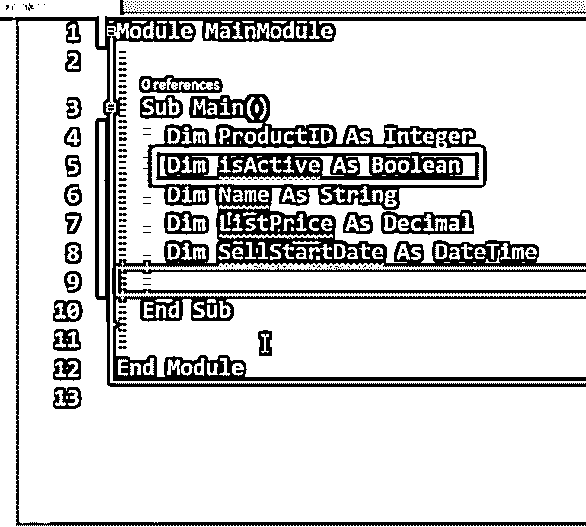

**Dim 与 Boolean** 一样有效，Boolean 可以代表真值或假值。

#### 3.线

字符串数据类型用于保存字符数据，如姓名或其他非数字数据。字符串类型有两种形式，具体取决于它的声明方式。

*   **一个可变长度(~2B 字符)**

可变长度字符串的默认值是空字符串(" ")。

保存任何文本信息的字符串数据类型可以获得大约 20 亿个 Unicode 字符类型。

**例子**

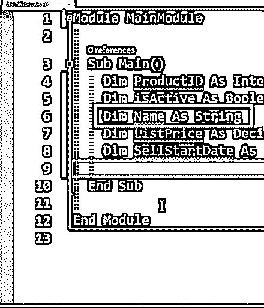

**Dim Name As String** 保存一个字符串值。

#### 4.小数

小数数据类型保存数值数据。范围是+/-7.9…E+28 到 28 个小数位。

**例子**

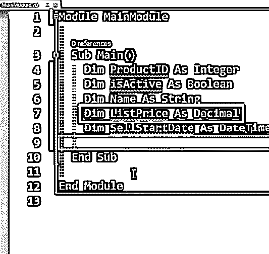

**Dim ListPrice As Decimal** 保存正数或负数的数值数据。

#### 5.日期时间

DateTime 维护数据的日期和时间。午夜(00:00:00)0001 年 1 月 1 日至 9999 年 12 月 31 日 11:59:59 PM。

**例子**

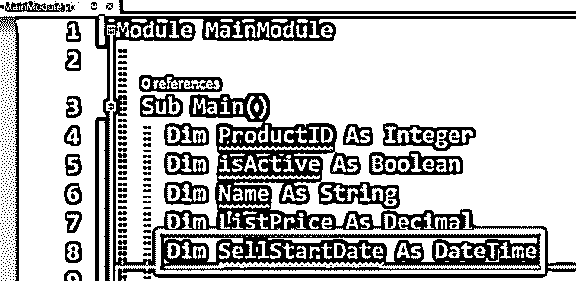

**Dim SellStartDate 为日期时间，**

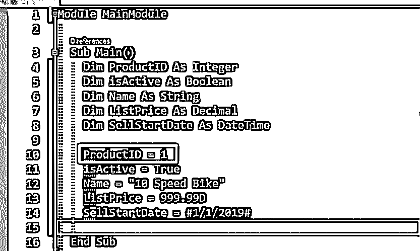

所以起始行号 10 **ProductID = 1** ，这是整数。

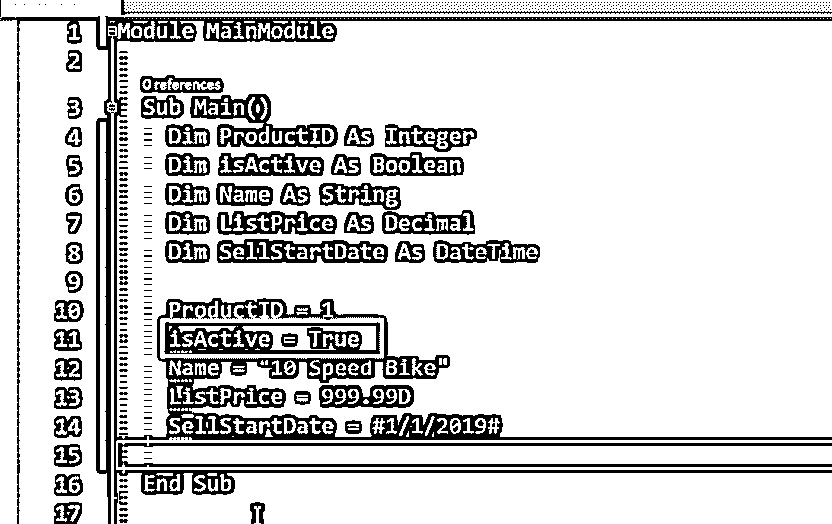

**所以第 11 行 isActive = True** ，是布尔型。

Visual Basic 中的 True“keyword”意味着不能将其用作变量名。

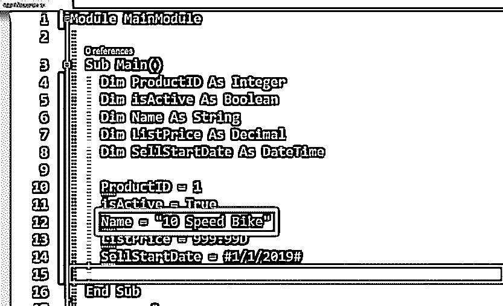

**Name = "10 速自行车"**这是一串。

总是将字符串值放在双引号中。

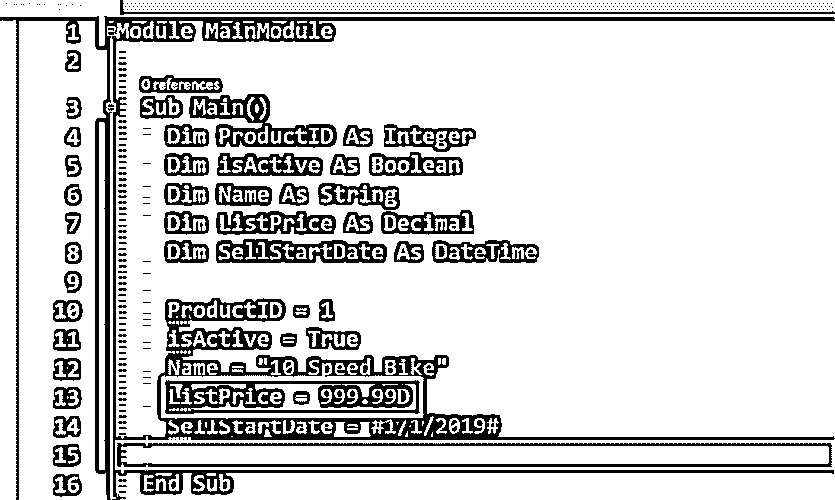

**ListPrice = 999.99D，**小数。

“D”被称为类型文本。d 代表十进制，而双引号""代表字符串。

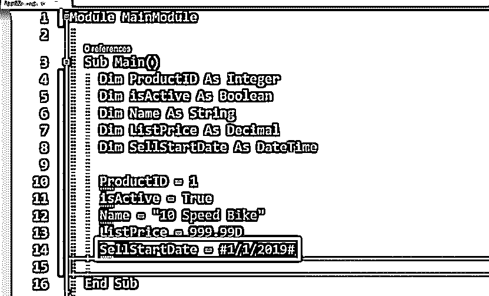

所以第 14 行变量名 **SellStartDate = #1/1/2019#，**也就是日期时间。

“#”(磅)符号是日期时间值的类型文字。就是如何在 Visual Basic 代码中定义 DateTime。

在这里声明和赋值的另一种方法是将所有内容都放在一行。

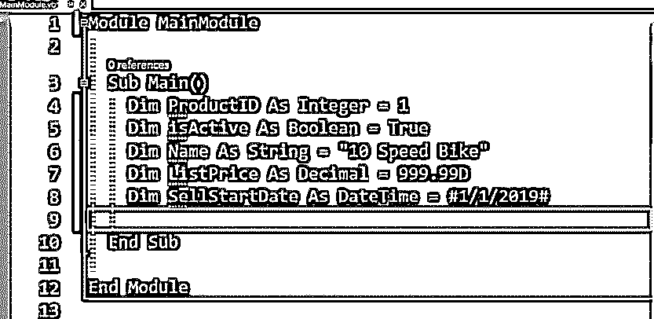

另一种方式你可能会看到声明变量两个变量名有相同的数据类型，并由逗号分隔。

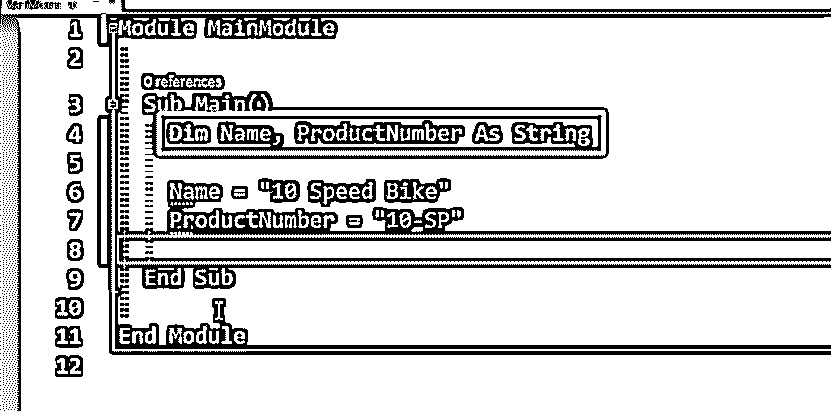

这根本不被认为是一个理想的表演。您必须在单独的行中声明每个变量。

#### 6.对象数据类型

**例子**

**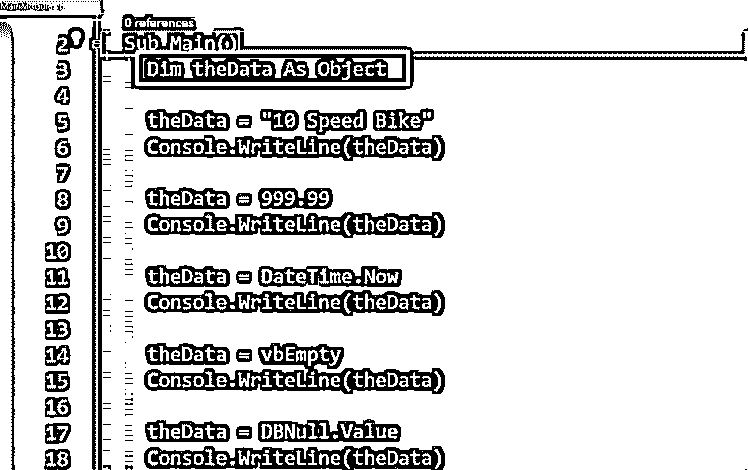

** 

第 3 行**上的数据**以变量**为对象。**它是一种特殊的数据类型，知道如何保存任何其他数据类型。尽可能避免对象数据类型。它占用大量内存，使用起来比其他数据类型慢。

### 结论

Visual Basic 数据类型是 Visual Basic 语言最重要的基础之一。当您能够真正掌握适当的 Visual Basic 数据类型时，您的应用程序的效率会更高，出错的风险也会更小。

### 推荐文章

这是 VB.Net 数据类型指南。这里我们讨论各种类型的 VB.Net 数据类型。您还可以浏览我们推荐的其他文章——

1.  [VB.NET 算子](https://www.educba.com/vb-dot-net-operators/)
2.  [VB.Net 为循环](https://www.educba.com/vb-dot-net-for-loop/)
3.  [Python 数据类型](https://www.educba.com/python-data-types/)
4.  [PL/SQL 数据类型](https://www.educba.com/pl-sql-data-types/)

