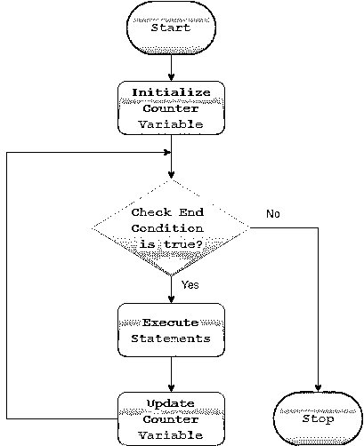
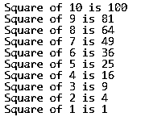
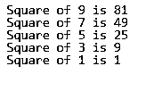
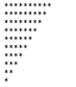

# VB.Net for 循环

> 原文：<https://www.educba.com/vb-dot-net-for-loop/>


## 循环 VB.Net 简介

我们都知道 For 循环。它们用于一次又一次地执行一组语句特定的次数。这正是 VB.Net 的 For loops 所实现的。VB.Net 的 For 循环也称为 For Next 循环。这是因为循环的语法以 Next 语句结束。

**语法:**

<small>网页开发、编程语言、软件测试&其他</small>

```
For counter [ As datatype ] = start To end [ Step step ]
[ statements ]
[Continue For ]
[ statements ]
[ Exit For ]
[ statements ]
Next [ counter ]
```

**Note:** Bold denotes keywords. The rest is variables.

**语法** **细目**

注意语法中的术语数量！不要担心，我们将理解它们中的每一个以及它们在语法中的用途。

*   **For:** 标记循环定义开始的关键字。
*   **计数器:**用作循环控制变量的变量。这个变量的值将决定何时退出循环。它只能是数值。
*   **作为数据类型:**计数器变量的数据类型。这对 VB 来说很重要。Net 在每次迭代中将计数器变量的值与结束表达式进行比较。如果未指定数据类型，则根据 start、end 和 step 变量进行推断。
*   **开始到结束:**表示计数器变量的初始值和终值的数值表达式。当循环执行开始时，计数器变量的初始值由 *start* 表达式设置。在每次迭代之前，计数器变量的当前值与*结束*表达式进行比较。如果计数器的值超过了 end，则循环执行终止。
*   **步骤:**确定每次迭代后计数器变量递增或递减的值。如果未指定，默认值为 1。
*   **语句:**在 for 循环的每次迭代中要执行的语句集。当然，它们是必需的。你还会为什么写 for 循环呢？
*   **Continue For:** 跳过当前迭代中剩余的语句集，继续循环的下一次迭代。
*   **Exit For:** 中断它们进行循环。
*   **下一个:**标志循环定义结束的关键字。

### 流程图

让我们借助流程图来理解 VB.Net For 循环的工作原理。




### For Loop 在 VB.Net 是如何工作的？

以上是基本 For 循环的简单流程图。第一步是用起始值初始化计数器变量。然后将它与结束表达式进行比较。如果 end 表达式的结果为 true，则控制进入循环体并执行语句。如果 end 表达式的结果为 false，则控件退出循环。每次迭代后，计数器变量的值由编译器自动更新。

VB 中还有其他可选元素。Net For 循环。步长变量用于覆盖默认的增量/减量值 1。您可以在步长变量中指定任何数值，计数器变量将由该数值更新。

当您不希望循环的迭代遵循与其他迭代相同的流程时，可以使用 Continue For 语句。举个例子，当你想打印从 1 到 100 的质数时，你要检查的第一个条件是如果这个数是偶数而不是 2，那么你就不要打印这个数，继续下一次循环。

当您希望在迭代过程中退出循环，并且不再进行任何迭代时，Exit For 语句非常有用。例如，当您在一个包含 100 个元素的数组中搜索一个元素时，如果在第 35 <sup>个</sup>位置找到了该元素，您可能不想执行循环的其余 65 次迭代。

### VB.Net For 循环的例子

以下是 VB.Net For 循环的不同示例:

#### 示例#1

下面是一个简单的例子，以降序打印从 1 到 10 的所有数字的平方。

**代码:**

```
Imports System
Public Module Module1
Public Sub Main()
For num As Integer = 10 To 1 Step -1
Console.WriteLine("Square of " & num & " is " & num * num)
Next
End Sub
End Module
```

**输出:**




#### 实施例 2

下面的示例说明了 Continue For 语句的用法。下面的代码不会打印偶数的平方。当然，更有效的方法是将步长变量改为 2。

**代码:**

```
Imports System
Public Module Module1
Public Sub Main()
For num As Integer = 10 To 1 Step -1
If num Mod 2 = 0 Then
Continue For
End IF
Console.WriteLine("Square of " & num & " is " & num * num)
Next
End Sub
End Module
```

**输出:**




#### 实施例 3

下面的例子说明了 Exit For 语句的用法。当数字是 5 的倍数时，下面的代码退出循环。对于数字 10，它不会这样做，因为 Continue For 语句防止在 10 的情况下执行 Exit For 语句。

**代码:**

```
Imports System
Public Module Module1
Public Sub Main()
For num As Integer = 10 To 1 Step -1
If num Mod 2 = 0 Then
Continue For
End IF
If num Mod 5 = 0 Then
Exit For
End IF
Console.WriteLine("Square of " & num & " is " & num * num)
Next
End Sub
End Module
```

**输出:**


#### 实施例 4

额外的例子:嵌套 For 循环。下面的例子说明了如何使用嵌套的 For 循环来打印模式。

**代码:**

```
Imports System
Public Module Module1
Public Sub Main()
For num1 As Integer = 10 To 1 Step -1
For num2 As Integer = num1 To 1 Step -1
Console.Write("*")
Next
Console.WriteLine("")
Next
End Sub
End Module
```

**输出:**




### 结论

循环在任何编程语言中都是非常重要的工具。它们帮助我们用最少的代码执行重复的语句。上面的文章提供了对 VB.Net For 循环的全面深入的理解。Sans 语法中，[对于循环](https://www.educba.com/for-loop-in-c/)的工作方式在任何其他编程语言中都是相似的。您的下一个任务是尝试更多关于 for 循环和嵌套 For 循环的示例。调整条件，创建问题，并使用 For 循环以最有效的方式解决它们。这将帮助你发展自己对循环的理解。

### 推荐文章

这是去 VB.Net 旅游的指南。这里我们讨论一个循环在 VB.NET 中是如何工作的，以及它如何帮助我们用最少的代码和流程图来执行重复的语句。您也可以浏览我们的其他相关文章，了解更多信息-

1.  [While C 中的循环](https://www.educba.com/while-loop-in-c/)
2.  [Python 中的 For 循环](https://www.educba.com/for-loop-in-python/)
3.  [C# For 循环](https://www.educba.com/c-sharp-for-loop/)
4.  [VB.Net 事件](https://www.educba.com/vb-dot-net-events/)


