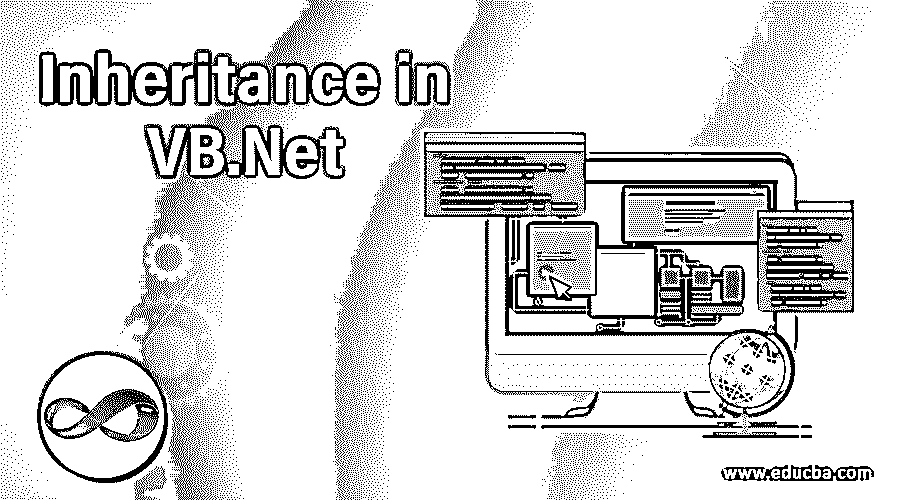

# VB.Net 的遗产

> 原文：<https://www.educba.com/inheritance-in-vb-dot-net/>




## 在 VB.Net 什么是遗产？

继承可以被定义为编程语言的一个特性，它提供了一个利用基类中已经定义的函数的机会。在继承中，基类是将其功能传递给其他类的类。有时也被称为父类。继承基类的类称为派生类，有时也称为子类。正如“继承”这个词本身所表明的，它有助于将值或函数传递给其他一些类。在 VB.Net 中，我们可以同时从派生类继承多个类。继承的目的是减少代码的大小，避免多次定义同一个函数。继承可以被定义为编程语言的属性，它实现了重用已经定义的功能的机制。在用高效的代码开发应用程序时，它非常有用。没有必要一遍又一遍地写同一个函数。可以根据需要多次使用。

### 了解 VB.Net 的遗产

就我们所知，什么是遗传，它做什么。现在我们将通过使用语法来理解它。这个语法会让你意识到如何在 VB.Net 实现继承。

<small>网页开发、编程语言、软件测试&其他</small>

```
[access specifier] Class [Base class name]
Statement 1
Statement 2
..
Statement n
End Class
Class [Derived class name] Inherits [Base class name]
Statement 1
Statement 2
..
Statement n
End Class
```

这里，必须首先定义基础类。然后通过使用“Inherits”关键字，我们可以在程序中实现继承。所以基本上我们至少需要两个类来利用继承。一旦类必须是基类，而其他将是派生类。

### VB.Net 的遗产继承是如何让工作变得如此容易的？

继承是任何编程语言非常重要的特征之一。这使得编码非常容易和精确。代码一旦写好，就可以多次使用。如果已经存在或者已经定义了相同的功能，我们不需要再次定义它。实际上，它通过减少编程时间，帮助开发人员节省同样多的时间，使工作变得简单。

### 在 VB.Net 处理遗产

现在，我们将通过一个例子来看看我们实际上是如何处理继承的。在上一节中，我们学习了实现继承的语法。我们将遵循同样的语法来编写我们的第一个 basic 程序。

```
Base class
Class Hello
Public Sub sayHelloWorld()
Console.WriteLine("Hello World”)
End Sub
End Class
Derived class
Class Welcome: Inherits Hello
Public Sub sayWelcome()
Console.WriteLine("Welcome”)
End Sub
End Class
Class CallAllFunctions
Shared Sub Main()
Dim a As Welcome = new Welcome()
a.sayHelloWorld()
a.sayWelcome()
End Sub
End Class
```

在上面的程序中，我们写了一段代码来显示一些字符串。这里的基类名为 Hello，而派生类名为 Welcome。Welcome 类继承了 Hello 类，因此 Hello 类中的函数可以被 Welcome 类的对象调用，请注意反之是不可能的。这个程序的输出如下。

**输出:**
你好世界
欢迎光临

### 在 VB.Net 继承遗产的优势

继承的特性在编程中非常有益。它实际上在编写复杂程序时帮助很大，因为传递功能的特性减轻了代码的复杂外观。以下是它的一些常见优势

1.  **减少歧义**–代码一旦编写，就可以多次使用。因此，它消除了重复，使代码明确。
2.  **复用性**——遵循一次创建，多次使用的原则。一旦定义了一个函数，我们就可以根据我们的需求使用这个函数 n 次。
3.  **消除编码复杂性**–代码必须精确编写，以便遵循适当的文档，并使其他开发人员易于理解代码。这可以在继承的帮助下完成。
4.  **提高程序效率**–使用继承的程序非常高效，因为与没有继承的相同程序相比，代码行数量很少。

### 所需技能

为了处理继承，了解您需要什么样的技能集是非常重要的。要实现它，你需要的是对编程基础的理解。因为它是所有编程语言的共同特征，如果你对任何编程语言的基础有所了解，你就能够使用它。

### VB.Net 技术和职业发展学习传承的合适受众

所有计算机科学专业的学生都应该在完成学位之前提交一个项目。他们是学习的最佳听众。net，因为使用这个框架做项目有点容易。如果我们谈论专业人士，[VB.Net 目前需求量很大](https://www.educba.com/vb-dot-net-operators/)，由于目前应用的进步，对这项技术的需求将呈指数级增长。

### 结论

VB.Net 是最好的编程语言之一，它提供了大量的特性来使应用程序开发变得非常容易，继承就是其中的一个特性。任何精通。net framework 可以在蓬勃发展的信息技术世界中取得很大成就，发展自己的事业。非常有趣的是，现在开发的大量网络应用程序都是 VB.Net 的产品，而且数量还在与日俱增。

### 推荐文章

这是 VB.Net 继承遗产的指南。在这里，我们借助例子来讨论继承在 VB.Net 是如何工作的。以及它如何以及在哪里有助于职业发展。您也可以浏览我们推荐的其他文章，了解更多信息——

1.  [VB.NET 面试问题](https://www.educba.com/vb-net-interview-questions/)
2.  什么是敏捷和 Scrum？
3.  [VB.Net 字符串函数](https://www.educba.com/vb-dot-net-string-functions/)
4.  [VB.Net 事件](https://www.educba.com/vb-dot-net-events/)


