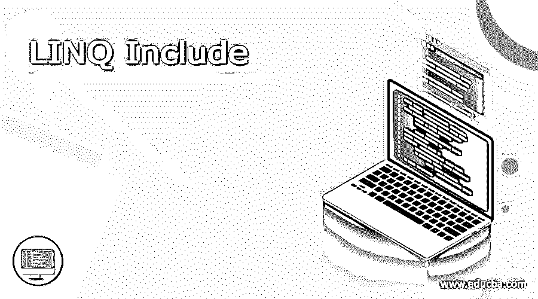
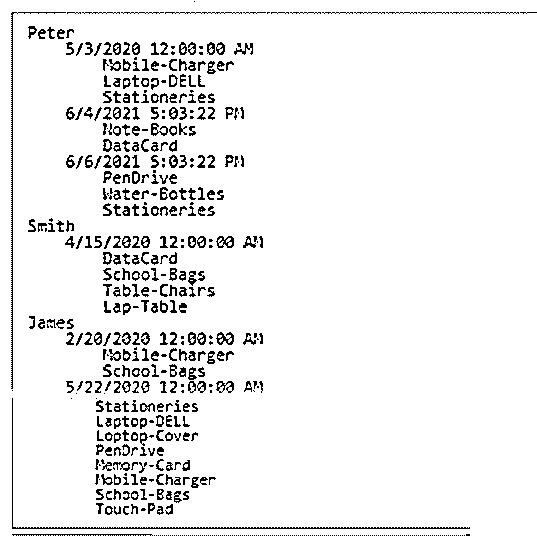

# LINQ 包括

> 原文：<https://www.educba.com/linq-include/>




## 对 LINQ 的介绍包括

LINQ 包括帮助包括从数据库加载的相关实体。它允许在同一个查询中从数据库中检索相似的实体。指向相似实体的 LINQ Include()必须从数据库中读取数据才能进入单个查询。

**语法:**

<small>网页开发、编程语言、软件测试&其他</small>

让我们理解下面的语法，

```
var C_OrderDetails=context.customer details.Include ("OrderDetails").ToList();
```

在这种语法中，我们使用 include 方法来组合同一个查询中的相关实体，就像在单个查询中合并多个实体一样。

### 如何收录 LINQ 作品？

LINQ Include()指向必须从数据库中读取的相似实体，以便在单个查询中获取。让我们理解下面的例子，比如 LINQ 如何包含自动加载相关实体的功能。假设 CustomerDetails 对象具有到其 OrderDetails 的链接，并且这些订单具有对 LineItems 的引用，这些 LineItems 也具有对 ProductDetails 的引用，通过使用 LINQ Include()，它允许您指定要在单个查询中从数据库读取的相关实体。

```
Var COrderDetails=context.CustomerDetails.Include ("OrderDetails").ToList();
```

通过仅使用 SQL 语句而不是使用 Include()方法，我们需要生成以下查询来检索上述内容，

```
SELECT * FROM CustomerDetails;
```

没有使用 Include ("OrderDetails ")，代码如下所示，

```
SELECT * FROM CustomerDetails
JOIN OrderDetails
ON Customer_ID=OrderDetails.Customer_ID;
```

在同一个查询中，我们可以从数据库中读取所有相关的实体，在使用 Include()的情况下，如果我们想在同一个查询中包含 ProductDetails 和 LineItems，它看起来像

```
Var Customer_OrderDetails=
context.CustomerDetails.Include("OrderDetails").Include("LineItems").Include ("ProducDetails").ToList();
```

我们可以让它使用多次调用 Include()来沿着不同的路径获取对象。如果您需要相同路径中的对象，需要进行一次指定整个路径的调用。

### 例子

何时使用 Include 是，如果我们有 N 个查询要执行 N 次，这是很耗时的，那么这就像 select N+1 问题之所以会发生这个问题，只是因为惰性加载机制默认情况下允许执行单个查询 N 个查询来做一些事情。因此，最好避免实体框架中的 select N+1 问题，我们需要使用 Include 方法，它有助于使用 Join 子句构建包含所需数据的单个查询，与多次执行查询相比，这是最足智多谋的方法。

让我们看看使用 LINQ_Include 的示例程序。我们需要包含名称空间系统。数据。LINQ 包含的实体是数据的扩展方法。实体命名空间。实体框架版本通过使用 EntityFramework.dll 和 System.Data.Entity 给出了 LINQ Include()的规定

**代码:**

```
using System;
using System.Data.Entity;
using System.Linq;
using System.Collections.Generic;
public class Program_LINQ_Include
{
public static void Main()
{
// to inserting the data
Inserting_Data();
using (var context = new EntityContext())
{
var customers = context.Customers
.Include(i => i.Invoices.Select(it => it.Items))
.ToList();
Displaying_Data(customers);
}
}
public static void Inserting_Data()
{
using (var context = new EntityContext())
{
context.BulkInsert(CustomerData());
context.BulkInsert(InvoiceData());
context.BulkInsert(ItemData());
}
}
public static List<Customer> CustomerData()
{
List<Customer> list = new List<Customer>()
{
new Customer() { Name ="Peter"},
new Customer() { Name ="Smith"},
new Customer() { Name ="James"}
};
return list;
}
public static List<Invoice> InvoiceData()
{
List<Invoice> list = new List<Invoice>()
{
new Invoice() { Date = new DateTime(2020,5,3), CustomerID = 1},
new Invoice() { Date = DateTime.Now.AddDays(-5), CustomerID = 1},
new Invoice() { Date = DateTime.Now.AddDays(-3), CustomerID = 1},
new Invoice() { Date = new DateTime(2020,4,15), CustomerID = 2},
new Invoice() { Date = new DateTime(2020,2,20), CustomerID = 3},
new Invoice() { Date = new DateTime(2020,5,22), CustomerID = 3},
};
return list;
}
public static List<Item> ItemData()
{
List<Item> list = new List<Item>()
{
new Item() { Name = "Mobile-Charger", InvoiceID = 1},
new Item() { Name = "Laptop-DELL", InvoiceID = 1},
new Item() { Name = "Stationeries", InvoiceID = 1},
new Item() { Name = "Note-Books", InvoiceID = 2},
new Item() { Name = "DataCard", InvoiceID = 2},
new Item() { Name = "PenDrive", InvoiceID = 3},
new Item() { Name = "Water-Bottles", InvoiceID = 3},
new Item() { Name = "Stationeries", InvoiceID = 3},
new Item() { Name = "DataCard", InvoiceID = 4},
new Item() { Name = "School-Bags", InvoiceID = 4},
new Item() { Name = "Table-Chairs", InvoiceID = 4},
new Item() { Name = "Lap-Table", InvoiceID = 4},
new Item() { Name = "Mobile-Charger", InvoiceID = 5},
new Item() { Name = "School-Bags", InvoiceID = 5},
new Item() { Name = "Stationeries", InvoiceID = 6},
new Item() { Name = "Laptop-DELL", InvoiceID = 6},
new Item() { Name = "Loptop-Cover", InvoiceID = 6},
new Item() { Name = "PenDrive", InvoiceID = 6},
new Item() { Name = "Memory-Card", InvoiceID = 6},
new Item() { Name = "Mobile-Charger", InvoiceID = 6},
new Item() { Name = "School-Bags", InvoiceID = 6},
new Item() { Name = "Touch-Pad", InvoiceID = 6},
};
return list;
}
public static void Displaying_Data(List<Customer> list)
{
foreach(var customer in list)
{
Console.WriteLine(customer.Name);
foreach(var invoice in customer.Invoices)
{
Console.WriteLine("\t" + invoice.Date);
foreach(var item in invoice.Items)
{
Console.WriteLine("\t\t" + item.Name);
}
}
}
Console.WriteLine("\t\t");
}
}
```

在上面的程序中，实体框架告诉客户细节也需要他们的发票。通过在 dbcontext 中使用这种方法，它有助于惰性加载保护 n+1 问题。

**输出:**




让我们理解上面的例子，比如 LINQ 如何包含加载相关实体的功能。假设 Customer_Details 对象链接到它的 Invoice_Details，并且这些订单引用 ItemData。同样，我们可以通过使用 LINQ Include()建立到相关对象的几个链接，它允许您指定在单个查询中从数据库读取的相关实体。

### 结论

在本文中，我用几个编程示例解释了 LINQ Include()方法。它允许在同一个查询中检索要从数据库中读取的相关实体。通过使用 Include 方法，我们可以在一次查询中轻松地从数据库中读取所有相关的实体。

### 推荐文章

这是一本 LINQ 指南。在这里，我们讨论 include 方法的介绍、语法和工作方式，以及示例和代码实现。您也可以看看以下文章，了解更多信息–

1.  什么是 LINQ？
2.  [LINQ 内部加入](https://www.educba.com/linq-inner-join/)
3.  [ASP.NET 更新面板](https://www.educba.com/asp-dot-net-updatepanel/)
4.  [Oracle XMLTABLE](https://www.educba.com/oracle-xmltable/)


