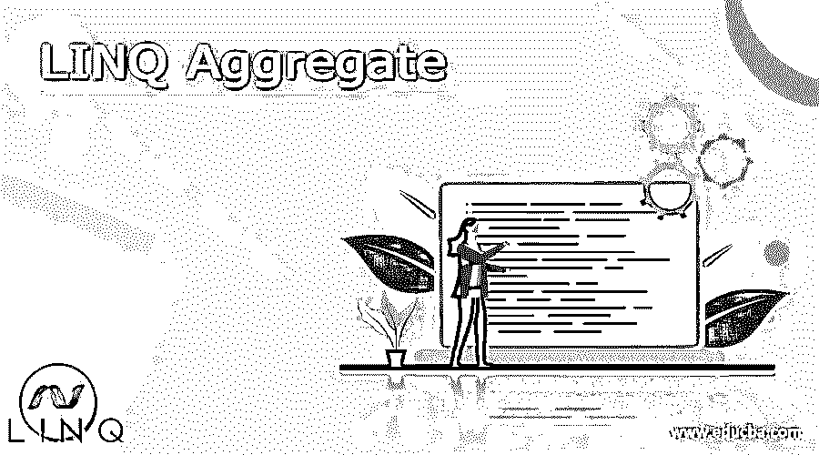
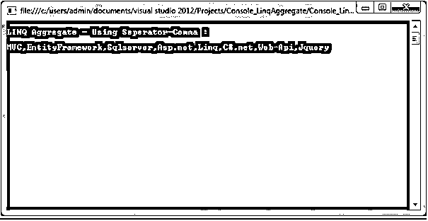
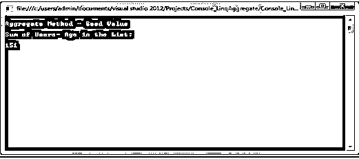
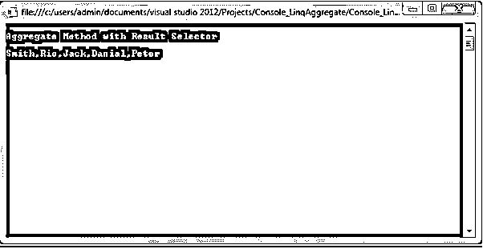

# LINQ 集料

> 原文：<https://www.educba.com/linq-aggregate/>




## LINQ 骨料简介

LINQ 聚合方法可以对序列值或项目集合创建自己的自定义聚合操作。聚合函数需要将几行的值组合在一起作为输入，结果返回一个值。LINQ 聚合函数从第一个值和第二个值开始执行，然后将结果进行下一步运算，将最后一个结果作为第一个值和第三个值，然后继续执行，依此类推。我们可以从命名空间系统中派生出聚合方法。Linq 和方法在类 Queryable 和 Enumerable 中都可用。

**语法:**

<small>网页开发、编程语言、软件测试&其他</small>

LINQ 聚合方法有三个重载方法，它执行一个累加运算。让我们看看下面的聚合扩展方法的语法，

```
public static TSource Aggregate<TSource>(this IEnumerable<TSource> source, Func<TSource, TSource, TSource> func);
```

```
public static TAccumulate Aggregate<TSource, TAccumulate>(this IEnumerable<TSource> source, TAccumulate seed, Func<TAccumulate, TSource, TAccumulate> func);
```

```
public static TResult Aggregate<TSource, TAccumulate, TResult>(this IEnumerable<TSource> source, TAccumulate seed,
```

```
Func<TAccumulate, TSource, TAccumulate> func,
Func<TAccumulate, TResult> resultSelector);
```

### 聚合在 LINQ 是如何运作的？

LINQ 聚合函数产生一个值。LINQ 聚合函数从第一个值和第二个值开始执行，然后将结果进行下一步运算，将最后一个结果作为第一个值和第三个值，然后继续执行，依此类推。aggregate 方法仅支持方法语法，不支持查询语法。可查询类和可枚举类中都有聚合方法。它是命名空间 System.Linq 的扩展方法，下面的例子描述了聚合函数的工作流程。

**代码:**

```
using System;
using System.Collections.Generic;
using System.Linq;
using System.Text;
using System.Threading.Tasks;
namespace Console_LinqAggregate
{
class Program
{
static void Main(string[] args)
{
//Using Aggregate Method to show the seperation of result by use by Comma,
string[] Skill_Set = {"MVC","EntityFramework","Sqlserver","Asp.net","Linq",
"C#.net", "Web-Api","Jquery"};
var Seperated_Result = Skill_Set.Aggregate((string_1, string_2) => string_1 + "," + string_2);
Console.WriteLine("\nLINQ Aggregate - Using Seperator-Comma : \n\n" + Seperated_Result);
Console.ReadLine();
}
}
}
```

这个程序使用了函数 Aggregate((string_1，string_2)，这个方法在集合中应用了 accumulator 函数。该特定种子值是初始累加器值，并且该特定函数选择结果值。

```
var Seperated_Result = Skill_Set.Aggregate((string_1, string_2) => string_1 + "," + string_2);
```

让我们看看调试过程来了解一下聚合函数的工作流程，
最初它包含一个空值如下图所示，


在这里，我们将 Skill_Set 的项目连接在一个单独的字符串中，如下所示，


最后，它用逗号分隔符将所有字符串连接起来，


**输出:**




### 例子

聚合函数需要将几行的值组合在一起作为输入，结果返回一个值。聚合函数是命名空间系统的扩展方法。Linq。让我们以编程的方式来看下面的例子，

#### 示例#1

**代码:**

在这个程序中，它显示了 Aggregate Method-Seed Value，该方法用于在项目集合中添加用户的年龄。在第二个重载函数中，aggregate 方法将第一个参数作为种子值进行累加，将第二个参数作为函数类型委托，让我们以编程方式查看使用种子参数的示例，如下所示。

```
public static TAccumulate Aggregate<TSource, TAccumulate>(this IEnumerable<TSource> source, TAccumulate seed, Func<TAccumulate, TSource, TAccumulate> func);
using System;
using System.Collections.Generic;
using System.Linq;
using System.Text;
using System.Threading.Tasks;
namespace Console_LinqAggregate
{
class Program
{
public class UserClass
{
public string userName { get; set; }
public int userAge { get; set; }
static void Main(string[] args)
{
var get_UserAge = new List<UserClass>()
{
new UserClass { userName = "Smith", userAge = 23 },
new UserClass { userName = "Rio", userAge = 30},
new UserClass { userName = "Jack", userAge = 41},
new UserClass { userName = "Danial", userAge = 25 },
new UserClass { userName = "Peter", userAge = 32 },
};
int get_SumOf_UserAge = get_UserAge.Aggregate<UserClass, int>(0, (get_totalAge, user) => get_totalAge += user.userAge);
Console.WriteLine("\nAggregate Method - Seed Value");
Console.WriteLine("\nSum of Users- Age in the List:");
Console.WriteLine("\n"+get_SumOf_UserAge);
Console.ReadLine();
}
}
}
}
```

在上面的程序中，aggregate 方法用于在项目集合中添加用户的年龄。在第二个重载函数中，aggregate 方法将第一个参数作为种子值进行累加，将第二个参数作为函数类型委托，让我们以编程方式查看使用种子参数的示例，如下所示。


```
int get_SumOf_UserAge = get_UserAge.Aggregate<UserClass, int>(0, (get_totalAge, user) => get_totalAge += user.userAge);
```

**输出:**




#### 实施例 2

**代码:**

在这个用第三个重载方法解释的程序中，其中第三个参数是 Func 委托表达式的结果选择器，我们需要从中获得结果让我们看下面的程序，语法如下，
public static TResult Aggregate<t source，TAccumulate，TResult>(this IEnumerable<t source>source，TAccumulate seed，

```
Func<TAccumulate, TSource, TAccumulate> func,
Func<TAccumulate, TResult> resultSelector);
using System;
using System.Collections.Generic;
using System.Linq;
using System.Text;
using System.Threading.Tasks;
namespace Console_LinqAggregate
{
class Program
{
public class UserClass
{
public string userName { get; set; }
public int userAge { get; set; }
static void Main(string[] args)
{
var get_User = new List<UserClass>()
{
new UserClass { userName = "Smith", userAge = 23 },
new UserClass { userName = "Rio", userAge = 30},
new UserClass { userName = "Jack", userAge = 41},
new UserClass { userName = "Danial", userAge = 25 },
new UserClass { userName = "Peter", userAge = 32 },
};
// String.Empty - lambda expression as str, displays result of seed value
//and removes the last appears comma in the selector
string seperated_UserName = get_User.Aggregate<UserClass, string, string>(
String.Empty,
(str, user) => str += user.userName + ",",
str => str.Substring(0, str.Length - 1));
Console.WriteLine("\nAggregate Method with Result Selector");
Console.WriteLine("\n" + seperated_UserName);
Console.ReadLine();
}
}
}
}
string seperated_UserName = get_User.Aggregate<UserClass, string, string>( String.Empty, (str, user) => str += user.userName + ",", str => str.Substring(0, str.Length - 1));
```

在上面的程序中，我们将 lambda 表达式描述为 str。子字符串(0，字符串。长度–1))；它消除了结果字符串中最后出现的逗号。让我们看看下面的输出，

**输出:**




### 结论

在 LINQ Aggregate()方法中，有各种方法来定位我们的程序，这有助于以可定制的方式创建我们自己的代码。希望本文有助于通过编程方式查看上述示例来理解 Aggregate 方法的必要性和用法。

### 推荐文章

这是 LINQ 骨料指南。在这里，我们讨论了 LINQ aggregate 的简介、语法和工作原理。代码实现示例。您也可以看看以下文章，了解更多信息–

1.  [LINQ 内部加入](https://www.educba.com/linq-inner-join/)
2.  什么是 LINQ？
3.  [ASP.NET 更新面板](https://www.educba.com/asp-dot-net-updatepanel/)
4.  [C#字典](https://www.educba.com/c-sharp-dictionary/)


