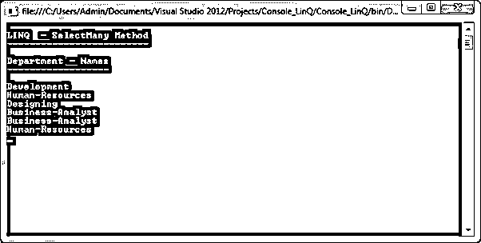
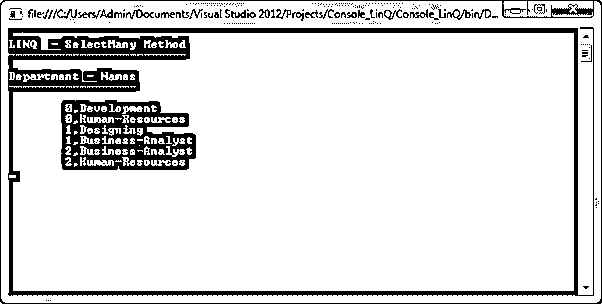
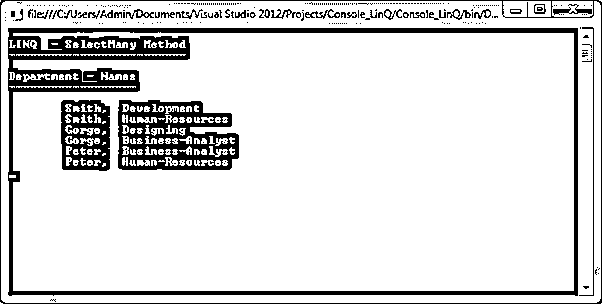

# LINQ 选择多

> 原文：<https://www.educba.com/linq-selectmany/>


## LINQ SelectMany 简介

LINQ 选择多是属于投影运算符的一类查询运算符。SelectMany 运算符用于从称为嵌套集合的集合中选择元素。SelectMany 从嵌套集合中返回单个结果；结果包含每个源值的串联元素。SelectMany 运算符处理记录的组合，并返回单个结果。在这里，SelectMany 操作符组合来自结果链的记录，然后将其转换为单个结果的结果集。

**语法**

<small>网页开发、编程语言、软件测试&其他</small>

让我们用下面的语法来识别 LINQ SelectMany 操作符，

```
public static IEnumerable<TResult> SelectMany<TSource, TResult>(this IEnumerable<TSource> source, Func<TSource, IEnumerable<TResult>> selector);
```

```
public static IEnumerable<TResult> SelectMany<TSource, TResult>(this IEnumerable<TSource> source, Func<TSource, int, IEnumerable<TResult>> selector);
```

```
public static IEnumerable<TResult> SelectMany<TSource, TCollection, TResult>(this IEnumerable<TSource> source, Func<TSource, IEnumerable<TCollection>> collectionSelector, Func<TSource, TCollection, TResult> resultSelector);
```

在此语法中，我们使用 SelectMany 从记录组合中进行选择，并返回单个结果。

### LINQ 有多少精选作品？

在 LINQ 查询运算符中，选择和选择许多属于投影运算符。Select 操作符用于从集合中选择值，而 SelectMany 操作符用于从嵌套集合中选择值，嵌套集合称为集合的集合。SelectMany 操作符将 sequence 中的元素投影到 IEnumerable <t>中，然后最终将平面结果作为单个序列返回。为了清楚地理解操作符的工作，当我们有属性集合时，我们需要一次指定一个集合中的每一项。</t>

### 例子

SelectMany 运算符用于从称为嵌套集合的集合中选择元素。SelectMany 从嵌套集合中返回单个结果；结果包含每个源值的串联元素。

#### 示例#1

**代码:**

在这个程序中，它描述了上面语法标题中所示的第一个语法，如下所示；让我们看看下面的程序，

```
using System;
using System.Collections.Generic;
using System.Linq;
using System.Text;
using System.Threading.Tasks;
namespace Console_LinQSelectMany
{
//Program_Sample - 1
class Program_LINQ_SelectMany
{
// Getting Employee details in EmployeeClass
public class EmployeeClass
{
public int EmployeeID { get; set; }
public string EmployeeName { get; set; }
public List<DepartmentClass> DepartmentList { get; set; }
}
public class DepartmentClass
{
public string Dept_Name { get; set; }
}
class LinqProgram
{
static public void Main()
{
List<EmployeeClass> employeesList = new List<EmployeeClass>();
employeesList.Add(new EmployeeClass
{
EmployeeID = 1,
EmployeeName = "Smith",
DepartmentList = new List<DepartmentClass>()
{
new DepartmentClass { Dept_Name = "Development" },
new DepartmentClass { Dept_Name = "Human-Resources"}
}     });
employeesList.Add(new EmployeeClass
{
EmployeeID = 2,
EmployeeName = "Gorge",
DepartmentList = new List<DepartmentClass>()
{
new DepartmentClass { Dept_Name = "Designing" },
new DepartmentClass { Dept_Name = "Business-Analyst"}
}
});
employeesList.Add(new EmployeeClass
{
EmployeeID = 3,
EmployeeName = "Peter",
DepartmentList = new List<DepartmentClass>()
{
new DepartmentClass { Dept_Name = "Business-Analyst" },
new DepartmentClass { Dept_Name = "Human-Resources"}
}
});
Console.WriteLine("\nLINQ  - SelectMany Method");
Console.WriteLine("-------------------------\n");
Console.WriteLine("Department - Names");
Console.WriteLine("------------------\n");
var getDepartments = employeesList.SelectMany(d => d.DepartmentList);
foreach (var dept in getDepartments)
{
Console.WriteLine(dept.Dept_Name);
}
Console.ReadLine();
}
}
}
}
```

它是 SelectMany 的第一个重载方法；在这里，它显示与每个员工列表关联的部门名称。

```
var getDepartments = employeesList.SelectMany(d => d.DepartmentList);
```


**输出:**




#### 实施例 2

**代码:**

```
using System;
using System.Collections.Generic;
using System.Linq;
using System.Text;
using System.Threading.Tasks;
namespace Console_LinQSelectMany
{
//Program_Sample - 2
class Program_LINQ_SelectMany
{
// Getting Employee details in EmployeeClass
public class EmployeeClass
{
public int EmployeeID { get; set; }
public string EmployeeName { get; set; }
public List<DepartmentClass> DepartmentList { get; set; }
}
public class DepartmentClass
{
public string Dept_Name { get; set; }
}
class LinqProgram
{
static public void Main()
{
List<EmployeeClass> employeesList = new List<EmployeeClass>();
employeesList.Add(new EmployeeClass
{
EmployeeID = 1,
EmployeeName = "Smith",
DepartmentList = new List<DepartmentClass>()
{
new DepartmentClass { Dept_Name = "Development" },
new DepartmentClass { Dept_Name = "Human-Resources"}
}
});
employeesList.Add(new EmployeeClass
{
EmployeeID = 2,
EmployeeName = "Gorge",
DepartmentList = new List<DepartmentClass>()
{
new DepartmentClass { Dept_Name = "Designing" },
new DepartmentClass { Dept_Name = "Business-Analyst"}
}
});
employeesList.Add(new EmployeeClass
{
EmployeeID = 3,
EmployeeName = "Peter",
DepartmentList = new List<DepartmentClass>()
{
new DepartmentClass { Dept_Name = "Business-Analyst" },
new DepartmentClass { Dept_Name = "Human-Resources"}
}
});
Console.WriteLine("\nLINQ  - SelectMany Method");
Console.WriteLine("-------------------------\n");
Console.WriteLine("Department - Names");
Console.WriteLine("------------------\n");
var getDepartments = employeesList.SelectMany((d, index) => d.DepartmentList.Select(i => index.ToString() + "," + i.Dept_Name));
foreach (var dept in getDepartments)
{
Console.WriteLine("\t"+dept);
}
Console.ReadLine();
}
}
}
}
```

它是一个 SelectMany second 重载方法，如语法所示；这里显示每个部门名称，包括每个对象序列的相应索引值。


**输出:**




#### 实施例 3

**代码:**

```
using System;
using System.Collections.Generic;
using System.Linq;
using System.Text;
using System.Threading.Tasks;
namespace Console_LinQSelectMany
{
//Program_Sample - 3
class Program_LINQ_SelectMany
{
// Getting Employee details in EmployeeClass
public class EmployeeClass
{
public int EmployeeID { get; set; }
public string EmployeeName { get; set; }
public List<DepartmentClass> DepartmentList { get; set; }
}
public class DepartmentClass
{
public string Dept_Name { get; set; }
}
class LinqProgram
{
static public void Main()
{
List<EmployeeClass> employeesList = new List<EmployeeClass>();
employeesList.Add(new EmployeeClass
{
EmployeeID = 1,
EmployeeName = "Smith",
DepartmentList = new List<DepartmentClass>()
{
new DepartmentClass { Dept_Name = "Development" },
new DepartmentClass { Dept_Name = "Human-Resources"}
}
});
employeesList.Add(new EmployeeClass
{
EmployeeID = 2,
EmployeeName = "Gorge",
DepartmentList = new List<DepartmentClass>()
{
new DepartmentClass { Dept_Name = "Designing" },
new DepartmentClass { Dept_Name = "Business-Analyst"}
}
});
employeesList.Add(new EmployeeClass
{
EmployeeID = 3,
EmployeeName = "Peter",
DepartmentList = new List<DepartmentClass>()
{
new DepartmentClass { Dept_Name = "Business-Analyst" },
new DepartmentClass { Dept_Name = "Human-Resources"}
}
});
Console.WriteLine("\nLINQ  - SelectMany Method");
Console.WriteLine("-------------------------\n");
Console.WriteLine("Department - Names");
Console.WriteLine("------------------\n");
var getDepartments = employeesList.SelectMany(d => d.DepartmentList, (emp, DepartmentList) => new { emp, DepartmentList });
foreach (var item in getDepartments)
{
Console.WriteLine("\t"+item.emp.EmployeeName + ",\t" + item.DepartmentList.Dept_Name);
}
Console.ReadLine();
}
}
}
}
```

在这个程序中，它遵循第三个重载方法，如上面的语法所示，它显示引用类型，它返回引用每个雇员的部门和雇员对象的对象类型。


**输出:**




### 结论

在本文中，我希望您已经通过几个例子轻松地学会了 SelectMany 操作符。通过使用 SelectMany 方法，我们可以从嵌套集合中返回单个结果。希望这篇文章有助于通过以编程方式查看示例来理解。

### 推荐文章

这是一个 LINQ 精选指南。这里我们用几个例子以及程序和输出来讨论 SelectMany 操作符。您也可以阅读以下文章，了解更多信息——

1.  什么是 LINQ？
2.  [LINQ 内部加入](https://www.educba.com/linq-inner-join/)
3.  [Listbox in C#](https://www.educba.com/listbox-in-c-sharp/)
4.  [IEnumerable C#](https://www.educba.com/ienumerable-c-sharp/)


