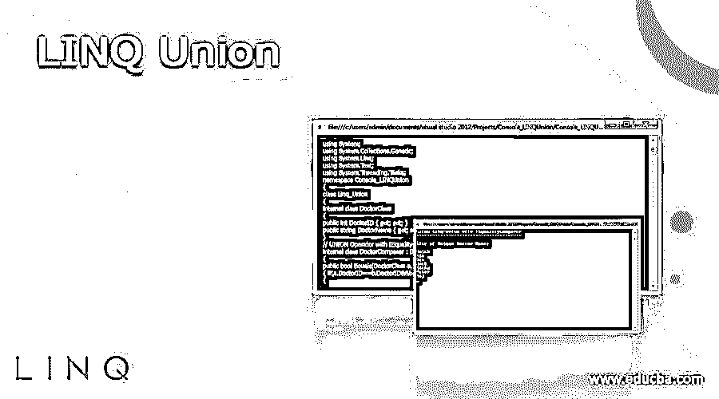
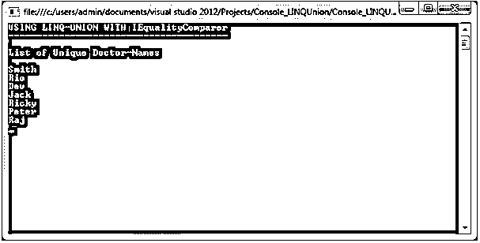

# LINQ 联盟

> 原文：<https://www.educba.com/linq-union/>




## LINQ 联盟介绍

LINQ 联合用于检索两个集合/序列之间的不同元素；它将两个或更多的元素集合组合起来，并最终返回唯一的元素作为结果。LINQ 联合是一种扩展方法，它需要两个集合来组合这两个集合，并从这两个集合中返回不同的元素。LINQ 联合仅支持方法语法；它不支持查询语法。Union 方法出现在可查询类和可枚举类中。

**语法:**

<small>网页开发、编程语言、软件测试&其他</small>

让我们看看 LINQ 联合方法的语法如下:

```
public static IEnumerable<TSource> Union<TSource>(this IEnumerable<TSource> first, IEnumerable<TSource> second);
public static IEnumerable<TSource> Union<TSource>(this IEnumerable<TSource> first, IEnumerable<TSource> second, IEqualityComparer<TSource> comparer);
```

如果您正在处理复杂类型的联合集合，那么您必须利用 IEqualityComparer 接口来获得准确的结果；否则，你只会得到不正确的结果。

### LINQ 的工会是如何运作的？

在 LINQ 联合方法中，它只支持方法语法；查询语法在 union 方法中不可用。union 方法中的可查询类和可枚举类是可以接受的。Union 运算符或方法主要用于将多个集合组合成一个不同的集合；它只返回唯一的元素；因此，它会从集合中移除重复的值。让我们看一个例子如下。

举个例子，

```
Collection X= {20, 40, 60, 80, 100}
Collection Y= {20, 40, 70}
var _result = X.Union(Y);
```

结果是= {20，40，60，70，80，100}在这个结果集合中，元素 20 和 40 出现在两个集合中，所以在结果中，它只返回一次，因为只显示唯一的元素，它消除了重复。让我们来看看独特方法的工作流程如下:

```
static public void Main()
{
string[] Department1 = { "JAVA", "DOTNET", "PHYTHON", "ANDROID" };
string[]Department2 = { "JAVA", "ANDROID", "DESIGNING" };
var unionResult = Department1.Union(Department2);
foreach (var items in unionResult)
{
Console.WriteLine(items);
}
}
```

在上面的代码中，有两个元素 Courses_1 和 Courses_2 的集合，它们包含的课程名称如下:

```
string[]Department1 = { "JAVA", "DOTNET", "PHYTHON", "ANDROID" };
string[]Department2 = { "JAVA", "ANDROID", "DESIGNING" };
```

由此，我们必须只返回两个集合中的唯一元素，它从两个集合中删除了重复的元素，为了唯一地获取所有元素，我们需要使用 Union()方法，

```
var unionResult = Department1.Union(Department2);
```

它只返回集合中的唯一元素，在集合中，它删除只返回一次的集合中的重复元素；让我们看看下面的结果，

```
Result is {"JAVA", "DOTNET","DESIGNING", "PHYTHON", "ANDROID"};
```

### IEqualityComparer 接口的用法

这里我们为 union 方法引入 IEqualityComparer 接口，因为 union 方法不能区分两种类型是否相等；它不能处理复杂类型的集合，所以它返回唯一不正确的结果。为此，我们必须构建一个新的比较器类来实现 IEqualityComparer 接口，以获得准确的结果。IEqualityComparer 接口有两个不同的方法，GetHashCode 和 Equals 方法；我们需要强制实现这两种方法。让我们看一个 IEqualityComparer 接口的例子，并假设 Book 类包含 BookID 和 BookName，

```
class BookComparer : IEqualityComparer<Book>
{
public bool Equals(Book x, Book y)
{
if (x.BookID == y.BookID && x.BookName.ToLower() == y. BookName.ToLower())
return true;
return false;
}
public int GetHashCode(Student obj)
{
return obj. BookID.GetHashCode();
}
}
```

现在可以在 Union 扩展方法中发送 BookComparer 类来获得准确的结果。

```
List<BookClass> BookList_1 = new List< BookClass >();
BookList _1.Add(new BookClass { BookID = 1001, BookName = "The Writer" });
BookList _1.Add(new BookClass { BookID = 1002, BookName = " Success " });
BookList _1.Add(new BookClass { BookID = 1003, BookName = "Life Secret " });
List< BookClass > BookList _2 = new List< BookClass >();
BookList _2.Add(new BookClass { BookID = 1002, BookName = "Success" });
BookList _3.Add(new BookClass { BookID = 1005, BookName = "Team Lead " });
var _resultUnion = BookList _1.Union(BookList _2, new BookComparer());
foreach (BookClass res in _resultUnion)
Console.WriteLine(res. BookName);
```

结果将是“作家、成功、生活秘密、团队领导”，它只返回集合中的独特元素，而删除重复的元素。

### 例子

当处理复杂类型的联合集合时，您必须利用 IEqualityComparer 接口来获得准确的结果。IEqualityComparer 接口有两个不同的方法，GetHashCode 和 Equals 方法；我们需要强制实现这两种方法。让我们看一个示例程序，

**代码:**

```
using System;
using System.Collections.Generic;
using System.Linq;
using System.Text;
using System.Threading.Tasks;
namespace Console_LINQUnion
{
class Linq_Union
{
internal class DoctorClass
{
public int DoctorID { get; set; }
public string DoctorName { get; set; }
}
// UNION Operator with IEqualityComparer
internal class DoctorComparer : IEqualityComparer<DoctorClass>
{
public bool Equals(DoctorClass a, DoctorClass b)
{ if(a.DoctorID==b.DoctorID&&b.DoctorName.ToLower()==b.DoctorName.ToLower())
{
return true;
}
return false;
}
public int GetHashCode(DoctorClass obj)
{
return obj.DoctorID.GetHashCode();
}
}
public class Program
{
public static void Main(string[] args)
{
List<DoctorClass> DoctorList_1 = new List<DoctorClass>();
DoctorList_1.Add(new DoctorClass { DoctorID = 1001, DoctorName = "Smith" });
DoctorList_1.Add(new DoctorClass { DoctorID = 1002, DoctorName = "Rio" });
DoctorList_1.Add(new DoctorClass { DoctorID = 1003, DoctorName = "Dev" });
DoctorList_1.Add(new DoctorClass { DoctorID = 1004, DoctorName = "Jack" });
DoctorList_1.Add(new DoctorClass { DoctorID = 1005, DoctorName = "Ricky" });
List<DoctorClass> DoctorList_2 = new List<DoctorClass>();
DoctorList_2.Add(new DoctorClass { DoctorID = 1002, DoctorName = "Rio" });
DoctorList_2.Add(new DoctorClass { DoctorID = 1003, DoctorName = "Dev" });
DoctorList_2.Add(new DoctorClass { DoctorID = 1007, DoctorName = "Peter" });
DoctorList_2.Add(new DoctorClass { DoctorID = 1009, DoctorName = "Raj" });
DoctorList_2.Add(new DoctorClass { DoctorID = 1001, DoctorName = "Smith" });
var _resultUnion = DoctorList_1.Union(DoctorList_2, new DoctorComparer());
Console.WriteLine("USING LINQ-UNION WITH IEqualityComparer");
Console.WriteLine("---------------------------------------\n");
Console.WriteLine("List of Unique Doctor-Names\n");
foreach (DoctorClass val in _resultUnion)
Console.WriteLine(val.DoctorName);
Console.ReadLine();
}
}
}
}
```

**输出:**




### 结论

LINQ 联合本质上用于组合元素集合并返回不同元素的文章；因此，当处理复杂类型的大量数据时，我们需要实现 IEqualityComparer 接口。我希望这篇文章通过以编程方式查看示例，毫无疑问会有所帮助。

### 推荐文章

这是 LINQ 联盟的指南。在这里，我们讨论了简介、语法、Union 在 LINQ 的工作方式以及示例和代码实现。您也可以看看以下文章，了解更多信息–

1.  [LINQ 聚合](https://www.educba.com/linq-aggregate/)
2.  [LINQ 包括](https://www.educba.com/linq-include/)
3.  [LINQ 左加入](https://www.educba.com/linq-left-join/)
4.  [LINQ 除外](https://www.educba.com/linq-except/)


