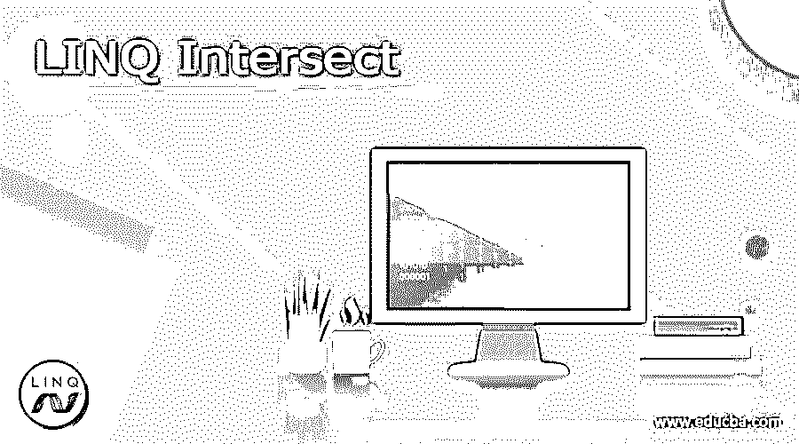

# LINQ 互联系统

> 原文：<https://www.educba.com/linq-intersect/>




## LINQ 互联系统简介

LINQ 交集是集合运算符类别下的一种运算符。Intersect 运算符用于查找集合中的公共元素，它需要两个集合。LINQ 交集返回一个元素的新序列，该元素是两个集合中的公共元素。它仅在方法语法中可用。

**语法:**

<small>网页开发、编程语言、软件测试&其他</small>

这里 LINQ_Intersect 的语法如下:

```
public static IEnumerable<TSource> Intersect<TSource>(this IEnumerable<TSource> first, IEnumerable<TSource> second);
public static IEnumerable<TSource> Intersect<TSource>(this IEnumerable<TSource> first, IEnumerable<TSource> second, IEqualityComparer<TSource> comparer);
```

Intersect 方法有两个重载方法，第一个方法只接受第二个元素序列，而第二个方法接受额外的参数接口 IEqualityComparer，用于在出现复杂问题时比较自定义类型。

### 互联系统在 LINQ 是如何运作的？

LINQ 交集运算符用于查找两个集合之间的公共元素。两个集合必须具有相同的数据类型，intersect 运算符返回集合交集，它描述了两个集合中存在的公共元素。最重要的是，intersect 方法需要两个集合，从那个集合中，它返回一个新的元素集合，其中包含了该集合中存在的公共元素。为了更好的理解，让我们看一个例子，

考虑 A= {10，20，30}和 B= {30，40，50 } intersect 运算符分别从序列 A 和 B 中查找公共元素，因此最终结果将是{30}两个序列中的公共元素都只有数字 30。

让我们看看下面 LINQ-交集运算的编码如下:

```
string[] Customers_Of_Company_A = { "Tina", "Amit", "Jack", "Ritu" };
string[] Customers_Of_Company_B = { "Jack", "Sumit", "Joe", "Alen" };
var intersectResult = Customers_Of_ Company_A.Intersect(Customers_Of_Company_B);
Console.WriteLine("Common Customers from both the companies are:");
foreach (var names in intersectResult)
{
Console.WriteLine(names);
}
```

在上面的代码中，我们有两个客户名称集合，分别来自两家公司 A 公司的客户和 B 公司的客户。通过使用 intersect，我们必须找到在两家公司工作的同名客户，这里我们对 Customers_Of_Company_A 使用 Intersect 运算符，并将第二个公司名称 Customers_Of_Company_B 作为参数传递。

```
var intersectResult = Customers_Of_ Company_A.Intersect(Customers_Of_Company_B);
```

通过使用这段代码，我们将得到结果。最后，我们将得到两个公司都存在的结果“杰克”。

Intersect 的 IEqualityComparer 示例

LINQ 相交方法我们使用 IEqualityComparer 接口，因为当我们处理复杂类型的集合时会导致不正确的结果，所以我们使用这个方法。IEqualityComparer 有两个不同的实现方法，它们是 GetHashCode()和 Equals()。在下面的例子中，我们将以编程方式看到 IEqualityComparer 接口。

### 例子

最重要的是，intersect 方法需要两个集合，从那个集合中，它返回一个新的元素集合，其中包括那些集合中存在的公共元素。

#### 示例#1

**代码:**

```
using System;
using System. Linq;
class LINQ_Intersect
{
static public void Main()
{ // two sequences
char[] sequence1 = {'A', 'S', 'D','F', 'V', 'W'};
char[] sequence2 = {'E', 'R', 'T','S', 'H', 'K'};
// to get the common elements use the intersection of the given sequence
// here we using the Intersect function
var resultIntersect = sequence1.Intersect(sequence2);
Console.WriteLine("Common Elements are: ");
foreach (var num in resultIntersect)
{
Console.WriteLine(num);
}
Console.ReadLine();
}
}
```

**输出:**


在 LINQ 交集方法中，我们使用 IEqualityComparer 接口，因为当我们处理复杂类型的集合时，会导致不正确的结果，所以我们继续使用这个方法。IEqualityComparer 有两个不同的实现方法，它们是 GetHashCode()和 Equals()。让我们看看下面的程序，以便更好地理解。

#### 实施例 2

**代码:**

```
using System;
using System.Collections.Generic;
using System.Linq;
using System.Text;
using System.Threading.Tasks;
namespace Console_LinqIntersect
{
internal class StudentDetails_Class
{
public int Student_ID { get; set; }
public string Student_Name { get; set; }
}
//USING INTERSECT WITH IEqualityComparer
internal class StudentNameComparer : IEqualityComparer<StudentDetails_Class>
{
public bool Equals(StudentDetails_Class a, StudentDetails_Class b)
{
if(string.Equals(a.Student_Name, b.Student_Name, StringComparison.OrdinalIgnoreCase))
{
return true;
}
return false;
}
public int GetHashCode(StudentDetails_Class obj)
{
return obj.Student_Name.GetHashCode();
}
}
public class Program
{
public static void Main(string[] args)
{
List<StudentDetails_Class> MBA_Dept = new List<StudentDetails_Class>();
List<StudentDetails_Class> MCA_Dept = new List<StudentDetails_Class>();
MBA_Dept.Add(new StudentDetails_Class { Student_ID = 1001, Student_Name = "Smith" });
MBA_Dept.Add(new StudentDetails_Class { Student_ID = 1002, Student_Name = "Rio" });
MBA_Dept.Add(new StudentDetails_Class { Student_ID = 1003, Student_Name = "Dev" });
MBA_Dept.Add(new StudentDetails_Class { Student_ID = 1007, Student_Name = "Ritu" });
MBA_Dept.Add(new StudentDetails_Class { Student_ID = 1008, Student_Name = "David" });
MBA_Dept.Add(new StudentDetails_Class { Student_ID = 1009, Student_Name = "Rio" });
MBA_Dept.Add(new StudentDetails_Class { Student_ID = 1010, Student_Name = "Jack" });
MBA_Dept.Add(new StudentDetails_Class { Student_ID = 1004, Student_Name = "Ponting" });
MBA_Dept.Add(new StudentDetails_Class { Student_ID = 1005, Student_Name = "Dev" });
MBA_Dept.Add(new StudentDetails_Class { Student_ID = 1006, Student_Name = "Sarvan" });
MCA_Dept.Add(new StudentDetails_Class { Student_ID = 2001, Student_Name = "Elan" });
MCA_Dept.Add(new StudentDetails_Class { Student_ID = 2002, Student_Name = "Ricky" });
MCA_Dept.Add(new StudentDetails_Class { Student_ID = 2007, Student_Name = "Smith" });
MCA_Dept.Add(new StudentDetails_Class { Student_ID = 2008, Student_Name = "Dev" });
MCA_Dept.Add(new StudentDetails_Class { Student_ID = 2009, Student_Name = "Rio" });
MCA_Dept.Add(new StudentDetails_Class { Student_ID = 2003, Student_Name = "Dev" });
MCA_Dept.Add(new StudentDetails_Class { Student_ID = 2004, Student_Name = "Ram" });
MCA_Dept.Add(new StudentDetails_Class { Student_ID = 2005, Student_Name = "Dev" });
MCA_Dept.Add(new StudentDetails_Class { Student_ID = 2006, Student_Name = "Shasha" });
MCA_Dept.Add(new StudentDetails_Class { Student_ID = 2010, Student_Name = "Mithun" });
var result_Intersect = MBA_Dept.Intersect(MCA_Dept, new StudentNameComparer());
Console.WriteLine("\n\nUSING INTERSECT WITH IEqualityComparer");
Console.WriteLine("--------------------------------------\n");
Console.WriteLine("Common Student Names from Department MBA and MCA:\n");
foreach (var get_student in result_Intersect)
{
Console.WriteLine(get_student.Student_ID+"\t"+get_student.Student_Name);
}
Console.ReadLine();
}
}
}
```

在上面的代码中，我们使用 IEqualityComparer 来检索复杂类型问题的准确结果。在该代码中，我们创建了一个新的类 StudentNameComparer，它实现了 IEqualityComparer <studentdetails_class>。该类与 intersect 运算符一起用于比较自定义学生类型，以从两个集合中检索公共元素，从而获得正确的结果。</studentdetails_class>

**输出:**


### 结论

在本文中，我们学习了用于从集合中寻找公共元素的 LINQ 交集方法。为了实现复杂类型的数据，我们以编程方式用例子解释了 IEqualityComparer 接口。希望这篇文章能帮助你更好地理解。

### 推荐文章

这是 LINQ 互联系统的指南。在这里，我们讨论介绍，语法，如何在 LINQ 互联工程？和代码实现的示例，以便更好地理解。您也可以看看以下文章，了解更多信息–

1.  [LINQ 总和](https://www.educba.com/linq-sum/)
2.  [LINQ 联盟](https://www.educba.com/linq-union/)
3.  [LINQ 选择多](https://www.educba.com/linq-selectmany/)
4.  [LINQ 聚合](https://www.educba.com/linq-aggregate/)


