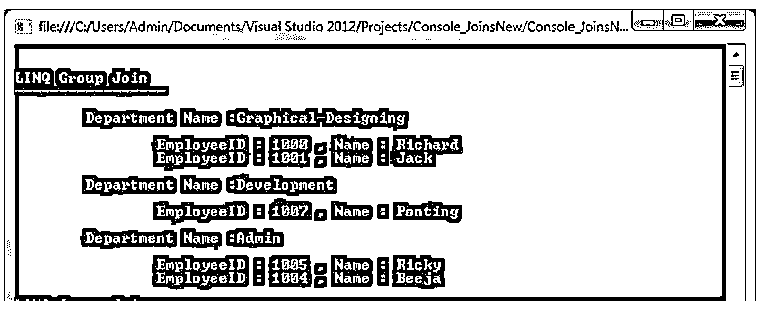
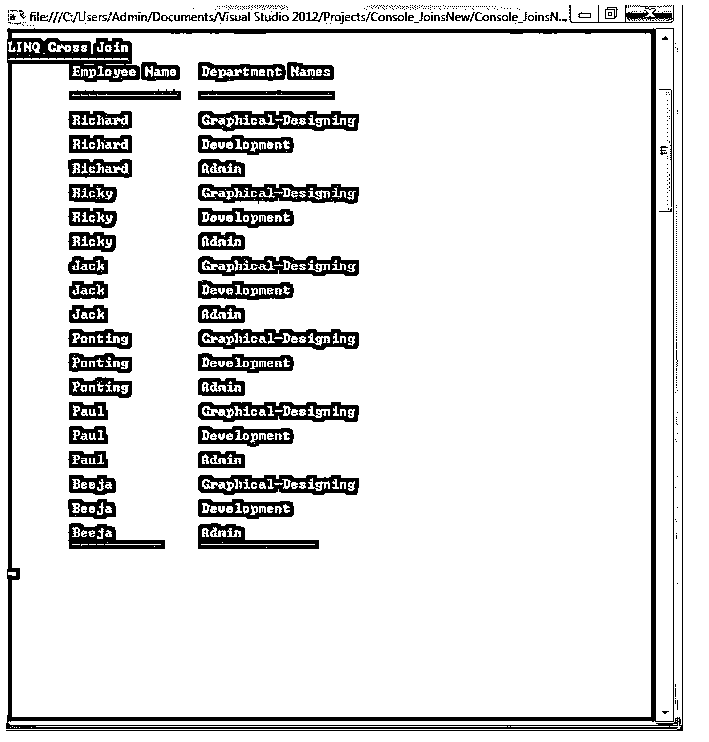

# LINQ 加入

> 原文：<https://www.educba.com/linq-join/>


## LINQ 加盟简介

LINQ 连接运算符用于根据两个或多个数据源之间的公共字段将它们连接在一起，并根据特定条件从集合中检索匹配的记录。因此，它根据数据源中出现的相似属性从两个或更多数据源中获取数据。因此，运算符的功能类似于 SQL 连接。

### LINQ 联接类型

LINQ 联接对两个或更多数据源进行操作；换句话说，您可以说，作为内部集合和外部集合，它从这两个集合返回一个新集合，它包含来自这两个集合的记录/数据。

<small>网页开发、编程语言、软件测试&其他</small>

**LINQ 连接的语法:**

```
public static IEnumerable<TResult> Join<TOuter, TInner, TKey, TResult>(this IEnumerable<TOuter> outer,
IEnumerable<TInner> inner, Func<TOuter, TKey> outerKeySelector,
Func<TInner, TKey> innerKeySelector,
Func<TOuter, TInner, TResult> resultSelector);
```

```
public static IEnumerable<TResult> Join<TOuter, TInner, TKey, TResult>(this IEnumerable<TOuter> outer,
IEnumerable<TInner> inner,
Func<TOuter, TKey> outerKeySelector,
Func<TInner, TKey> innerKeySelector,
Func<TOuter, TInner, TResult> resultSelector,
IEqualityComparer<TKey> comparer);
```

上面的语法包含两个重载方法来执行 join 方法；它包含比较器作为附加参数。

当与 LINQ 一起工作时，我们必须了解五件事。

*   外部数据源。
*   内部数据源。
*   外部键选择器可以看到外部数据源中的公共键。
*   内部键选择器可以看到内部数据源中的公共键。
*   结果选择器将数据检索到结果集中。

在 LINQ 加入，有几种类型；让我们通过一些例子来看看连接的类型及其语法。

#### 1.内部连接

内部连接用于根据特定条件从两个数据源中检索匹配的记录，不匹配的记录将从结果集中删除。

**语法:**

```
Var _innerJoin=dataSource_1.getRecords_1 ()
.join(dataSource_2.getRecords_2()
data1=>data1.ID,
data2=>data2.ID, (data1, data2) =>new
{
_name=data.Name,
....
}).ToList();
```

#### 2.左连接

Left Join 从左侧集合中检索记录，并且只从右侧集合中检索匹配的记录。

**语法:**

```
Var Left_Join= dataSource_1.getRecords_1 ()
.GroupJoin(dataSource_2.getRecords_2(),
data1=>data1.d2_ID,
data2=>data2.ID, (data1, data2) =>new
{
data1,data2
}). SelectMany( x=>x.d2.DefaultEmpty(), (data1,data2)=>new
{
........
});
```

#### 3.交叉连接

交叉联接返回集合中记录的笛卡尔积。

**语法:**

```
Var Cross_Join=data1.records2()
. Join(data2.records2(),
D1=>true,
D2=>true,
(D1,D2)=>new
{
..
});
```

#### 4.群组加入

组连接的工作方式类似于连接操作符，而组连接基于特定的组键在组中检索结果。Group Join 执行基于键的两个集合的连接，并根据匹配的键进行分组，最后返回分组的键和结果的集合。

**语法:**

```
Var Group_Join=data1.records1()
.GroupJoin(
data2.records2(),
D1=>d1.ID,
D2=>D2.d2ID,
(D1,D2)=>new{D1,D2}
);
```

### LINQ 加入的例子

下面是提到的例子:

**代码:**

```
using System;
using System.Collections.Generic;
using System.Linq;
using System.Text;
using System.Threading.Tasks;
namespace Console_LinQJoins
{
class Program
{ //Employee class
public class EmployeeClass_Master
{
public int Emp_ID
{
get;
set;
}
public string Emp_Name
{
get;
set;
}
public string Emp_Qualification
{
get;
set;
}
public int Emp_DeptID
{ get; set; }
}
// Employee department class
public class DepartmentClass_Master
{
public int Dept_ID
{ get; set; }
public int Emp_ID
{ get; set; }
public string emp_DeptName
{ get; set; }
public int Emp_Salary
{ get; set; }
}
class Linq_Joins_ProgramClass
{
static public void Main()
{
List<EmployeeClass_Master> empDetails = new List<EmployeeClass_Master>() {
new EmployeeClass_Master() {Emp_ID = 1000, Emp_Name = "Richard",
Emp_Qualification = "MCA",Emp_DeptID=101},
new EmployeeClass_Master() {Emp_ID = 1005, Emp_Name = "Ricky",
Emp_Qualification = "B.E",Emp_DeptID=103},
new EmployeeClass_Master() {Emp_ID = 1001, Emp_Name = "Jack",
Emp_Qualification = "MCA",Emp_DeptID=101},
new EmployeeClass_Master() {Emp_ID = 1007, Emp_Name = "Ponting",
Emp_Qualification = "B.E",Emp_DeptID=102},
new EmployeeClass_Master() {Emp_ID = 1003, Emp_Name = "Paul",
Emp_Qualification = "M.Sc",Emp_DeptID=102},
new EmployeeClass_Master() {Emp_ID = 1004, Emp_Name = "Beeja",
Emp_Qualification = "B.E",Emp_DeptID=103},
};
List<DepartmentClass_Master> deptDetails = new List<DepartmentClass_Master>()
{
new DepartmentClass_Master() {Dept_ID=101,Emp_ID = 1000, emp_DeptName = "Graphical-Designing", Emp_Salary = 60000},
new DepartmentClass_Master() {Dept_ID=102,Emp_ID = 1001, emp_DeptName = "Development", Emp_Salary = 35000},
new DepartmentClass_Master() {Dept_ID=103,Emp_ID = 1002, emp_DeptName = "Admin", Emp_Salary = 45000},
};
//using Cross Join method
var res_CrossJoin = empDetails
.Join(deptDetails,
emp => true,
dept => true,
(emp, dept) => new
{
Name = emp.Emp_Name,
dName = dept.emp_DeptName
}
);
//using the Group join method
var res_GroupJoin = deptDetails.
GroupJoin(
empDetails,
dept => dept.Dept_ID,
emp => emp.Emp_DeptID,
(dept, emp) => new { dept, emp }
);
//displaying Resultant set of Group Join, Outer Foreach for every department
Console.WriteLine("\n\nLINQ Group Join");
Console.WriteLine("-----------------");
foreach (var item in res_GroupJoin)
{
Console.WriteLine("\n\tDepartment Name :" + item.dept.emp_DeptName+"\n");
//Inner Foreach loop for each employee of a department
foreach (var employee in item.emp)
{
Console.WriteLine("\t\tEmployeeID : " + employee.Emp_ID + " , Name : " + employee.Emp_Name);
}
}
// displaying the result of Cross Join
Console.WriteLine("\nLINQ Cross Join");
Console.WriteLine("---------------");
Console.WriteLine("\tEmployee Name\tDepartment Names\n");
Console.WriteLine("\t-------------\t----------------");
foreach (var data in res_CrossJoin)
{
Console.WriteLine("\n\t{0}\t\t{1}",
data.Name, data.dName);
}
Console.WriteLine("\t-----------\t--------------\n");
Console.ReadLine();
}
}
}
}
```

只有当两个数据源中都存在公共键时，组联接才与它链接的两个或更多数据源相结合。LINQ 组连接用于根据存在公共关键字对记录进行分组。组连接生成分层数据结构；第一数据源的每个元素都与第二数据源配对。

在这个输出中，我们看不到雇员姓名“Paul ”,因为这个雇员不属于任何部门。

**输出:**




在上面的示例程序中，我们使用了组连接和交叉连接。在交叉连接中，我们需要将第一个集合中的每个元素映射到第二个集合中的每个元素，所以交叉连接只是产生集合的笛卡尔乘积。例如，在上面的代码中，第一个集合列表包含 6 个元素，第二个集合包含 3 个元素，因此最终得到的集合将是(6*3)共 18 个元素。




### 结论

在本文中，我们深入了解了 LINQ 连接，它用于使用连接根据给定条件返回元素集合。使用几种类型的连接方法，我们可以很容易地根据几个标准以期望的方式检索我们的记录。

### 推荐文章

这是 LINQ 加盟指南。为了更好地理解，我们在这里讨论介绍以及 LINQ 连接类型。您也可以看看以下文章，了解更多信息–

1.  [LINQ 内部加入](https://www.educba.com/linq-inner-join/)
2.  [LINQ 左加入](https://www.educba.com/linq-left-join/)
3.  [LINQ 截然不同](https://www.educba.com/linq-distinct/)
4.  [LINQ 包括](https://www.educba.com/linq-include/)


