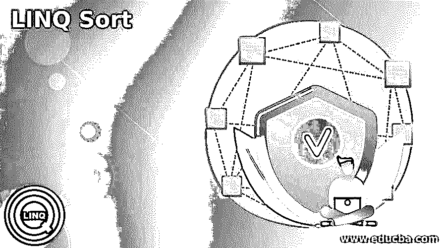
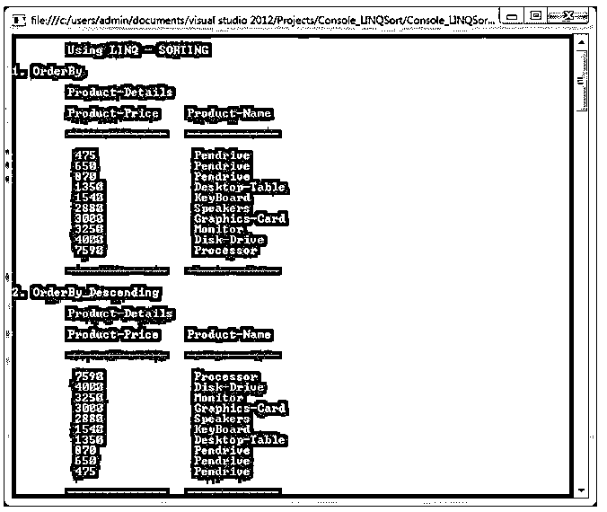
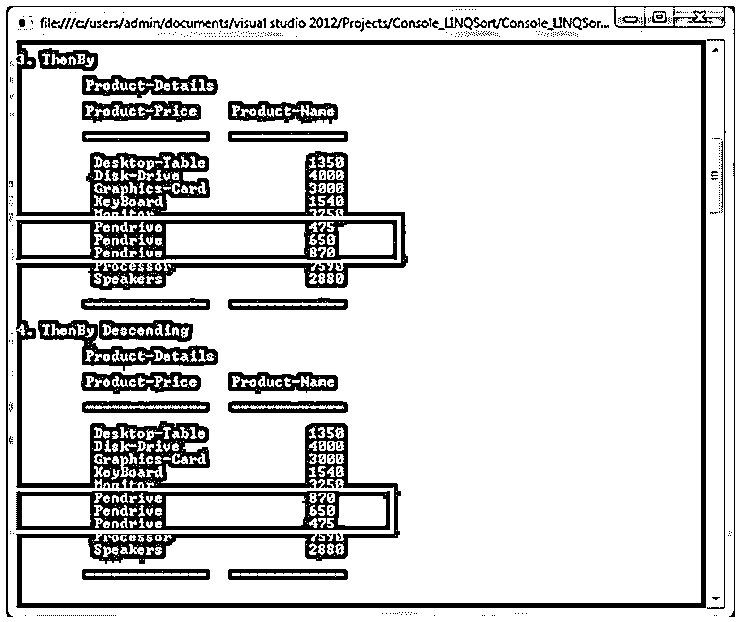
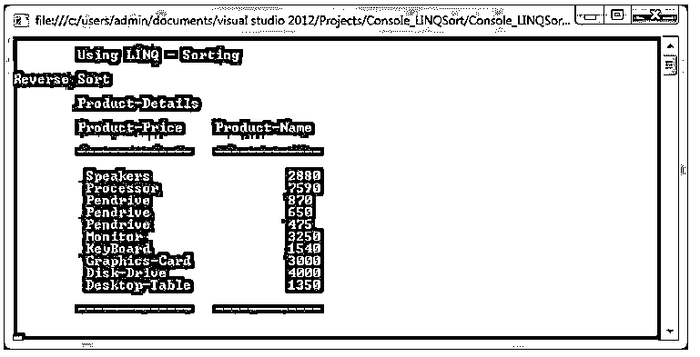

# LINQ 排序

> 原文：<https://www.educba.com/linq-sort/>




## LINQ 排序简介

LINQ 排序用于根据属性对给定的元素集合进行升序或降序的重新排序或重新排列。排序运算符按升序或降序排列项目序列。

在 LINQ，它包括五个排序运算符，它们是:

<small>网页开发、编程语言、软件测试&其他</small>

*   以...排序
*   order by 降序
*   然后呢
*   然后递减
*   反面的

### LINQ 排序的语法

下面给出了五个 LINQ 排序运算符，它们的语法如下:

1.OrderBy

```
var Result_OrderBy = userList.OrderBy(u => u.userName);
```

2.order by 降序

```
var Result_OrderByDesc = userList.OrderByDescending(u => u.userName);
```

3.然后呢

```
var Result_ThenBy = userList.OrderBy(u => u. userName).ThenBy(u => u.userAge);
```

4.然后递减

```
var Result_ThenByDesc = userList.OrderBy(u => u.userName).ThenByDescending(u => u.userAge);
```

5.反面的

```
var Result_Reverse= userList.Reverse();
```

### 在 LINQ，排序是如何工作的？

排序运算符用于根据一个或多个属性按升序或降序重新排列给定的项目集合。

LINQ 排序运算符有五种不同类型，如下所示:

#### 1.OrderBy

OrderBy 排序用于根据特定字段按升序或降序对序列中的值进行排序；默认情况下，它按升序对元素进行排序。

**举例:**

**代码:**

```
var OrderBy = _products.OrderBy(p => p.productCost);
```

在上面的例子中，我们使用了 OrderBy 排序的方法语法；它对产品的成本进行排序，并根据产品成本显示产品名称，默认情况下按升序排序。

#### 2.order by 降序

OrderByDescending 按降序对元素序列进行排序。它仅适用于方法语法。

**举例:**

**代码:**

```
var result_OrderByDesc = _products.OrderByDescending(p => p.productCost);
```

它使用方法语法按降序对元素进行排序；它根据产品的成本按降序列出了产品的详细信息。

#### 3.然后是 By，然后是降序

ThenBy 和 ThenByDescending 排序的主要目的是将另一列与主列一起排序。在 LINQ 排序中，这两种排序都用于次要目的；一旦 OrderBy 和 OrderByDescending 排序完成，就会使用它；这两个是主要分类。ThenBy 和 ThenByDescending 用在主排序 OrderBy 和 OrderByDescending 之后。

//LINQ 排序–then by 方法语法

```
var result_ThenBy = _products.OrderBy(p => p.productName).ThenBy(p => p.productCost);
```

//LINQ 排序–然后降序

```
var result_ThenByDesc = _products.OrderBy(a => a.productName).ThenByDescending(a => a.productCost).ToList();
```

它对列应用额外的排序。这种排序不适用于查询语法；它只能在方法语法中使用。

#### 4.反面的

最后一种分类是 LINQ 的反向分类；这种排序的主要目的是以相反的方向显示列表的顺序。因此，它可以分别用于 OrderBy 和 ThenBy 运算符。它不按升序或降序排序；它只以相反的顺序从当前位置开始显示。

**举例:**

**代码:**

```
var result_Reverse = _products.OrderBy(p => p.productName).Reverse();
```

### LINQ 排序的例子

LINQ 排序运算符将项目序列按升序或降序排列。在 LINQ，它包括五个排序操作符。

让我们以编程方式来看看这五个排序操作符的例子。

#### 示例#1

**代码:**

```
using System;
using System.Collections.Generic;
using System.Linq;
namespace Console_LINQSort
{
class ProductClass
{
public string productName { get; set; }
public int productCost { get; set; }
}
class Program
{
static void Main(string[] args)
{
// Creating the product details List
IList<ProductClass> _products = new List<ProductClass>();
_products.Add(new ProductClass { productName = "Speakers", productCost = 2880 }); _products.Add(new ProductClass { productName = "Graphics-Card", productCost = 3000 });
_products.Add(new ProductClass { productName = "Disk-Drive", productCost = 4000 });
_products.Add(new ProductClass { productName = "KeyBoard", productCost = 1540 });
_products.Add(new ProductClass { productName = "Processor", productCost = 7590 });
_products.Add(new ProductClass { productName = "Monitor", productCost = 3250 });
_products.Add(new ProductClass { productName = "Pendrive", productCost = 475 });
_products.Add(new ProductClass { productName = "Pendrive", productCost = 650 });
_products.Add(new ProductClass { productName = "Pendrive", productCost = 870 });
_products.Add(new ProductClass { productName = "Desktop-Table", productCost = 1350 });
//LINQ SORT- OrderBy Method Syntax -default sort is ascending
var result_OrderBy = _products.OrderBy(p => p.productCost);
//LINQ SORT- OrderByDesc Method Syntax
var result_OrderByDesc = _products.OrderByDescending(p => p.productCost);
//LINQ SORT - ThenBy Method Syntax
var result_ThenBy = _products.OrderBy(p => p.productName).ThenBy(p => p.productCost);
//LINQ SORT - ThenByDescending
var result_ThenByDesc = _products.OrderBy(a => a.productName).ThenByDescending(a => a.productCost).ToList();
Console.WriteLine("\n\tUsing LINQ - SORTING \n");
//Order_By
Console.WriteLine("1\. OrderBy\n");
Console.WriteLine("\tProduct-Details \n");
Console.WriteLine("\tProduct-Price\t Product-Name\n");
Console.WriteLine("\t--------------\t ------------- \n");
foreach (var val in result_OrderBy)
{
Console.WriteLine("\t {0}\t\t {1}", val.productCost, val.productName);
}
Console.WriteLine("\n\t--------------\t ------------- \n");
//Order_By_Desc
Console.WriteLine("2\. OrderBy_Descending\n");
Console.WriteLine("\tProduct-Details \n");
Console.WriteLine("\tProduct-Price\t Product-Name\n");
Console.WriteLine("\t--------------\t ------------- \n");
foreach (var val in result_OrderByDesc)
{
Console.WriteLine("\t {0}\t\t {1}", val.productCost, val.productName);
}
Console.WriteLine("\n\t--------------\t ------------- \n");
//Then_By
Console.WriteLine("3\. ThenBy\n");
Console.WriteLine("\tProduct-Details \n");
Console.WriteLine("\tProduct-Price\t Product-Name\n");
Console.WriteLine("\t--------------\t ------------- \n");
var result = _products.OrderBy(a => a.productName).ThenBy(a => a.productCost).ToList();
foreach (var val in result)
{
Console.WriteLine("\t {0}\t\t {1}", val.productName, val.productCost);
}
Console.WriteLine("\n\t--------------\t ------------- \n");
//ThenBy_Descending
Console.WriteLine("4\. ThenBy Descending\n");
Console.WriteLine("\tProduct-Details \n");
Console.WriteLine("\tProduct-Price\t Product-Name\n");
Console.WriteLine("\t--------------\t ------------- \n");
foreach (var val in result_ThenByDesc)
{
Console.WriteLine("\t {0}\t\t {1}", val.productName, val.productCost);
}
Console.WriteLine("\n\t--------------\t ------------- \n");
Console.ReadKey();
}
}
}
```

**输出:**







#### 实施例 2

这种排序的主要目的是以相反的方向显示列表的顺序。因此，它可以在 OrderBy 和 ThenBy 运算符中使用。它不按升序或降序排序；它只以相反的顺序从当前位置开始显示。

**代码:**

```
using System;
using System.Collections.Generic;
using System.Linq;
namespace Console_LINQSort
{
class ProductClass
{
public string productName { get; set; }
public int productCost { get; set; }
}
class Program
{
static void Main(string[] args)
{
// Creating the product details List
IList<ProductClass> _products = new List<ProductClass>();
_products.Add(new ProductClass { productName = "Speakers", productCost = 2880 });
_products.Add(new ProductClass { productName = "Graphics-Card", productCost = 3000 });
_products.Add(new ProductClass { productName = "Disk-Drive", productCost = 4000 });
_products.Add(new ProductClass { productName = "KeyBoard", productCost = 1540 });
_products.Add(new ProductClass { productName = "Processor", productCost = 7590 });
_products.Add(new ProductClass { productName = "Monitor", productCost = 3250 });
_products.Add(new ProductClass { productName = "Pendrive", productCost = 475 });
_products.Add(new ProductClass { productName = "Pendrive", productCost = 650 });
_products.Add(new ProductClass { productName = "Pendrive", productCost = 870 });
_products.Add(new ProductClass { productName = "Desktop-Table", productCost = 1350 });
var result_Reverse = _products.OrderBy(p => p.productName).Reverse();
Console.WriteLine("\n\tUsing LINQ - Sorting \n");
//Reverse Sorting
Console.WriteLine("Reverse Sort\n");
Console.WriteLine("\tProduct-Details \n");
Console.WriteLine("\tProduct-Price\t Product-Name\n");
Console.WriteLine("\t--------------\t ------------- \n");
foreach (var val in result_Reverse)
{
Console.WriteLine("\t {0}\t\t {1}", val.productName, val.productCost);
}
Console.WriteLine("\n\t--------------\t ------------- \n");
Console.ReadKey();
}
}
}
```

它只是对当前排序的元素列表中的元素进行逆序排序；在这个程序中，我们只是使用 orderby 根据产品的成本进行升序排序，然后使用 Reverse 方法。它只是打印当前列表的逆序，这是列表的相反方向。

**输出:**




### 结论

在本文中，我们已经看到了 LINQ 中不同类型的排序操作符的用法。通过使用这些排序操作符 OrderBy、OrderByDescending、ThenBy、ThenByDescending 和 Reverse，我们可以根据我们的要求以我们想要的方式轻松地对数据进行排序。

### 推荐文章

这是一本 LINQ 排序指南。在这里，我们讨论一下引言,“排序”在 LINQ 是如何工作的？以及更好理解的例子。您也可以看看以下文章，了解更多信息–

1.  [LINQ 内部加入](https://www.educba.com/linq-inner-join/)
2.  什么是 LINQ？
3.  [C#对象到字典](https://www.educba.com/c-object-to-dictionary/)
4.  [c#中的集合](https://www.educba.com/collections-in-c-sharp/)


