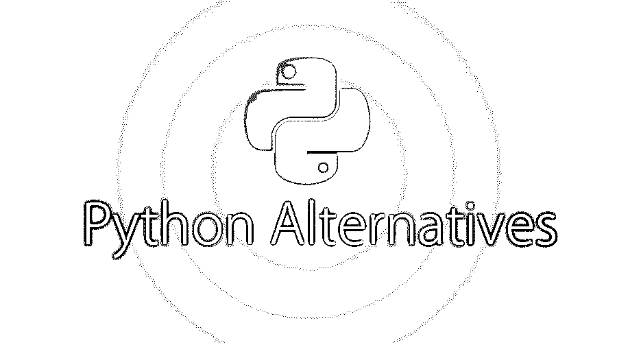
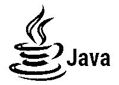
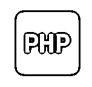
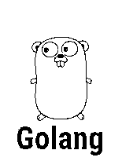
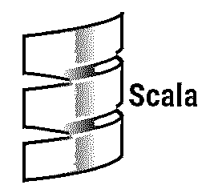

# Python 替代品

> 原文：<https://www.educba.com/python-alternatives/>

## Python 简介

Python 是用于各种应用程序开发过程的著名编程语言，包括基于 web 的应用程序、数据分析应用程序和机器学习实现。Python 的一些替代选项是 NodeJS、Ruby、PHP、Golang、Java 和 Scala。这些 python 替代框架或平台中的大多数都提供了 Python 的所有功能，还有一些具有 Python 的部分特性，并结合了它们自己改进的品质，这使得它们或者等同于 Python，或者比 Python 更好。

### Python 替代列表

下面是不同的 Python 替代方案，如下所示:

<small>网页开发、编程语言、软件测试&其他</small>

#### 1.Java 语言(一种计算机语言，尤用于创建网站)

*   它是一种类似 python 的面向对象语言，用于处理携带非常复杂的业务逻辑的庞大应用程序。
*   许多产品都是用 Java 开发的，目前，所有即将发布的版本都由甲骨文公司负责。
*   Java 提供了多种特性，从基本的 OOPS 概念到多线程、流、lambdas、函数接口等等。
*   你可以使用抽象类、继承、接口等[概念来遵循](https://www.educba.com/abstract-classes-in-javascript/)[设计模式](https://www.educba.com/javascript-design-patterns/)的实现。
*   Rest Webservices， [SOAP web service](https://www.educba.com/soap-web-services-interview-questions/) 可以用 Java 开发(Webservices 用于应用间通信)。
*   基于 Java 的项目通常选择包含 Spring 的堆栈(用于依赖解析、安全性和 JDBC 模板等)。)、Hibernate(用于数据库持久化)和 Java (8 以上优先)。这些都构成了应用程序的后端。
*   基于 Android 的应用程序、基于视频流的应用程序、小程序等。可以用 Java 开发。
*   Java 也是独立于平台的。

#### 2.NodeJS

*   这是目前服务器端开发最常用的技术之一，因为它通过将 [Javascript](https://www.educba.com/javascript-string-functions/) 放入图片中提供了更高的灵活性，所以您不需要为后端和前端学习不同的语言。
*   Node 是基于单线程异步(非阻塞)通信的技术，因此它不会为每个请求启动线程，因此它本质上是轻量级的。它的速度很快，因为它是建立在谷歌浏览器的 V8 Javascript 引擎上的。
*   可以添加多个中间件来执行该任务。
*   人们已经使用节点包管理器发布了他们的包。
*   你可以加入新的服务，比如 Kafka，Twilio，LogDNA，Auth0 等等。在这里非常轻松。
*   小规模公司发现继续使用这种技术进行应用程序开发很容易。
*   使用了一个非常灵活的按需堆栈，叫做 MEAN stack，M-> MongoDB，E-> Express.js，A-> AngularJS 和 N -> AngularJS
*   像 Paypal 和 Linkedin 这样的应用程序使用这种技术。
*   高度兼容 [NoSQL 数据库](https://www.educba.com/what-is-nosql-database/)也因为他们处理 JSON 或 BSON 格式。

#### 3.服务器端编程语言（Professional Hypertext Preprocessor 的缩写）

*   这是有史以来最灵活的语言之一，许多小规模和一些大规模的应用程序都是使用它开发的。
*   像 WordPress 这样基于 PHP 的好产品已经出现在市场上，人们可以很容易地托管和维护他们的网站，也可以很容易地管理内容。
*   PHP 和 MySQL 与解决方案构建结合使用。
*   PHP 的范围有限，因为它仅限于 web 开发领域，而 Python 是一种全栈编程语言，也可以用于数据分析和机器学习。
*   PHP 是一种脚本语言，python 是一种编程语言。
*   因此，PHP 提供的特性中只有一小部分能与 python 相匹配，如果只是 web 应用程序开发是唯一的重点，那么你可以只使用 PHP。

#### 4.红宝石

*   一些像 Github 和 Slideshare 这样的好产品都是用 Ruby 开发的。
*   当我们寻找 web 应用程序开发时，Ruby 和 Rails 构建了一个堆栈。
*   这两者结合起来是如此的强大，以至于你可以用很少的代码在几步之内完成 CRUD 操作，而用 python 你必须为此做很多。
*   Ruby 和 Rails 提供了大量的优势，因为它们为 web 开发生成了一个健康的框架。
*   同样，主要的区别是 python 在数据科学和机器学习等 web 开发之外的领域拥有强大的优势，而 Ruby 只是为了 web 开发而存在。
*   Ruby 将某些东西保持抽象，以使开发人员的生活变得简单，而 python 则将一切都抛给了程序员。
*   就像 Python 一样，Ruby 也是一种跨平台的解释语言。
*   Ruby 是一种动态类型语言，这意味着用 ruby 编写的程序可以在运行时被修改。将数据视为可执行代码的能力称为元编程。

#### 5\. Golang

*   嗯，这种语言是由谷歌开发的，因此谷歌开发的某些产品，如 Kubernetes 和 Docker，只基于 Golang。
*   Go 是一种快速、静态类型、编译的编程语言。Go 在语法上类似于 C 语言，但具有内存安全和垃圾收集等特性。
*   并发机制很好，这使得他们可以为多核和网络机器编写程序。
*   Go 支持运行时反射。
*   Go 是开发单页应用程序和移动应用程序后端的理想工具，但是传统应用程序不需要使用它来开发。
*   Go 提供简单的语法快速编译和基于“结构化类型”的面向对象编程。
*   Go 通过 TCP 和 [UDP 协议](https://www.educba.com/user-datagram-protocol/)支持[套接字编程](https://www.educba.com/socket-programming-in-python/)。
*   用 Go 构建 REST APIs 更加强大和可靠。也许开发人员可以为此从 Node 和 C#迁移到 Golang。
*   Python 是动态类型语言，而 Go 只是静态类型语言。

#### 6.斯卡拉

*   Scala 既是一种[函数式编程](https://www.educba.com/functional-programming-in-javascript/)语言，也是面向对象的语言，这里没有原语，因此一切都是对象，[静态关键字](https://www.educba.com/static-keyword-in-c/)在这里也不重要。Scala 是“可伸缩”和“语言”的缩写。
*   Apache Kafka 和 Apache spark 之类的工具已经大规模建成。
*   Scala 的静态类型有助于避免复杂应用程序中的错误。
*   Scala 设计用于与 Java 运行时环境互操作，Scala 允许函数嵌套并支持 currying。
*   单例对象提供了一种将非类成员的函数分组的便捷方式。
*   使用 Scala 意味着我们需要在一张图片中放入更少的代码，这将是高效的。
*   Scala 还提供了不变性、纯函数、递归、高阶函数、currying 和部分应用函数等特性。

### 结论

Python 是一种全能的函数式语言，因为它必须在 web 开发以及[数据科学和机器学习](https://www.educba.com/data-science-vs-machine-learning/)方面提供很多。现在，这一切都取决于什么完全适合您的应用程序，满足您的业务逻辑，并考虑可伸缩性和复杂性，如约束。

### 推荐文章

这是关于 Python 替代品的指南。在这里，我们讨论了前 6 名 Python 替代者的基本概念及其特性。您也可以阅读以下文章，了解更多信息——

1.  [Python 集合](https://www.educba.com/python-collections/)
2.  [什么是 Python 框架？](https://www.educba.com/python-frameworks/)
3.  [Python 流](https://www.educba.com/python-stream/)
4.  [Python 数组函数](https://www.educba.com/python-array-functions/)

