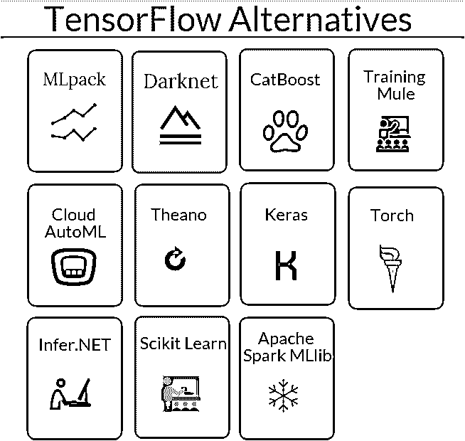

# 张量流替代方案

> 原文：<https://www.educba.com/tensorflow-alternatives/>

## TensorFlow 有哪些替代品？

TensorFlow Alternatives 只不过是当今时代最著名的深度学习库。为了改进搜索引擎并对用户查询做出快速响应，谷歌使用了[深度学习](https://www.educba.com/what-is-deep-learning/)和人工智能概念。

让我们看一个现实生活中的例子。

<small>网页开发、编程语言、软件测试&其他</small>

如果你在[谷歌搜索引擎](https://www.educba.com/popular-search-engines/)中键入任何一个词，比如关键词，它会显示一些与该关键词相关的搜索，换句话说，它只是给出下一个词的一些建议。为了给用户的搜索提供建议，他们必须使用[机器学习概念](https://www.educba.com/machine-learning-tools/)来提高效率。

谷歌不包含大型数据库来给出自动建议，而是包含一些大型计算机来给出这些建议，这里 TensorFlow 将出现在图片中。

[Tensorflow 是一个](https://www.educba.com/what-is-tensorflow/)库，它使机器学习和人工智能能够提高搜索引擎的效率。

在本文中，我们将看到 TensorFlow 的一些替代品，即 TensorFlow 的竞争对手。

### 张量流替代方案

以下是你应该知道的 11 个张量流选项:

#### 1.MLpack

MLpack 是一个用 C++ 编写的[机器学习库。这背后的目标是提供易用性，提供可伸缩性，提高速度。它使机器学习能够通过提供推荐来轻松访问新用户。它为用户提供了高度的灵活性和性能。这可以通过向用户提供模块化的 C++、API 和一组命令行来实现。](https://www.educba.com/what-is-c-plus-plus/)

#### 2.黑暗网络

Darknet 是一个遵循[神经网络框架](https://www.educba.com/what-is-neural-networks/)的开源软件。是用 c 和 CUDA 写的。暗网的安装简单快捷。这不需要太多时间。它同时使用 CPI 和 GPU。

#### 3.CatBoost

CatBoost 是基于[决策树库](https://www.educba.com/decision-tree-in-r/)的[开源梯度提升](https://www.educba.com/gradient-boosting-algorithm/)。它是由 Yandex 研究人员和工程师开发的，被许多组织广泛用于关键字推荐和排名因素。它基于矩阵网算法。

#### 4.训练骡子

使用 Training Mule，标记图像变得很容易，因为它提供了一组数据库以获得最佳结果。它用于托管网络，并通过提供 API 提供在云中处理模型的便利访问。

#### 5.云汽车

云自动训练[机器学习模型](https://www.educba.com/machine-learning-models/)在有限的机器学习专家的帮助下高质量地进行。

#### 6.提亚诺

Theano 是一个开源项目，由魁北克蒙特利尔大学(YoshuaBengio 的家乡)在 BSD 的许可下发布。它是由 LISA(现在的 MILAs)小组开发的。

Theano 是来自 Python 的一个库，它优化了数学表达式的编译，特别是许多矩阵值。Theano 使用 [NumPy 语法](https://www.educba.com/what-is-numpy/)来表达计算，并编译它们以在 CPU 或 GPU 架构上成功运行。我们不能直接学习否定，因为它是非常深入的学习。事实上，最受欢迎的 Python 项目之一使深度学习的学习变得如此容易，这是向你们所有人强烈推荐的。这些项目为 Python 提供了数据结构和行为，旨在快速可靠地创建深刻的学习模型，同时确保 Theano 开发和执行快速有效的模型。

例如，千层面库提供了 Theano 的类来创建深度学习，但它仍然需要 Theano 语法来学习。

#### 7\. Keras

Keras 是一个基于 Python 的开源神经网络库。它可以运行在 Tensor-Flow、Microsoft Cognitive Toolkit、Theano 或 PlaidM 的上层。旨在允许对深度神经网络进行快速实验，它被设计为用户友好、模块化和可扩展的。该 API 是“为人而设计的，而不是为机器而设计的”,并遵循最佳认知负荷减少实践。可以组合起来创建新模型的独立模块有神经层、成本函数、优化器、初始化方案、激活兼容性和正则化方案。作为新的类和函数，新的模块很容易添加。没有单独配置文件的模型用 [Python 代码](https://www.educba.com/introduction-to-python/)定义。使用 Keras 的主要原因是基于他们的指导原则，主要是基于易于使用的原则。我们推荐我们自己的 ModelSerializer 类，用于在导入模型后进一步保存和重新加载模型。

#### 8.火炬

torch 是一个开源的机器学习库，是一个科学计算的框架，是一种基于 Lua 编程语言的脚本语言。它提供了广泛的[深度学习算法](https://www.educba.com/deep-learning-algorithms/)，并使用 LuaJIT 脚本语言，以及底层 C 实现。它还有一个 N 维的强力数组。torch 是一种科学的计算机结构，广泛支持 GPU 优先学习机算法。得益于一种简单快速的语言，LuaJIT 和底层 C/CUDA 实现使用起来简单高效。

#### 9.Infer.NET

微软发布了其跨平台 Infer。Net 基于模型的机器学习环境。它的程序由高性能代码框架编译，以实现一种允许实质性可伸缩性、近似确定性、贝叶斯推理的方法。模型学习也适用于数据特征问题，包括实时数据、异构数据、未标记的信息和具有缺失部分的数据，以及具有已知失真的数据。

#### 10\. Scikit Learn

Scikit-learn 于 2007 年发布。这是一个用于机器学习的开源库。它是基于 Matplotlib、SciPy 和 NumPy 概念设计的。scikit-learn 框架不关心数据加载和操作数据，而是更关心[数据建模](https://www.educba.com/what-is-data-modeling/)。

#### 11.Apache Spark MLlib

Apache Spark MLlib 是另一个 TensorFlow 替代方案。它被用作机器学习的分布式框架。为了开发一个开源项目，Apache Spark Mllib 被广泛使用，因为它主要专注于机器学习，以实现简单的接口。它包含一个用于可扩展职业培训的库。它在更高的层次上支持像决策树、回归、聚类和 API 这样的算法。

### 结论

在本文中，我们看到了 TensorFlow 机器学习工具的替代工具。

### 推荐文章

这是 TensorFlow 替代方案的指南。这里我们讨论了基本概念和一些已知的张量流替代方案。您也可以浏览我们推荐的其他文章，了解更多信息——

1.  [什么是大数据技术？](https://www.educba.com/what-is-big-data-technology/)
2.  [关于 Redux 替代品的完整教程](https://www.educba.com/redux-alternatives/)
3.  什么是 SOA 替代方案？
4.  [Android 的最佳替代品](https://www.educba.com/android-alternatives/)
5.  [tensor flow 游乐场指南](https://www.educba.com/tensorflow-playground/)
6.  [Tensorflow 基础| tensor flow 安装](https://www.educba.com/tensorflow-basics/)
7.  [了解不同版本的 TensorFlow](https://www.educba.com/tensorflow-versions/)

