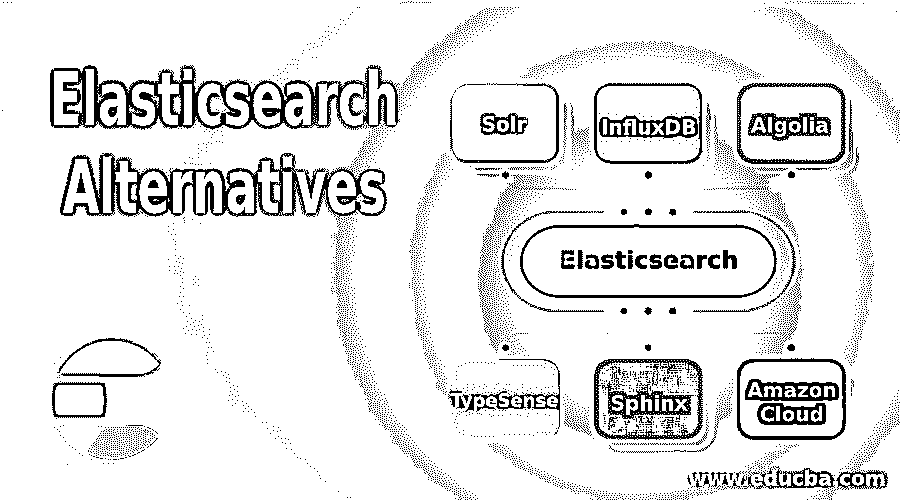

# 弹性搜索替代方案

> 原文：<https://www.educba.com/elasticsearch-alternatives/>

## 弹性搜索备选方案介绍

Elasticsearch 是一个开源的、高度可扩展的分析和搜索引擎。它是用 Java 开发的，基本上是 Apache Lucene 库的包装器。它由一个 HTTP web API 接口组成。它没有存储所有数据的 JSON 文档模式。Lucene 是当前数据界的大事件，但它是一个具有非常高效和强大的 API 的库。像 elastic search 这样的大多数当前搜索引擎都是库的包装器。基于需求的各种应用需要不同类型的搜索引擎。虽然 elasticsearch 迎合了他们的大部分需求，但是也有很多 Elasticsearch 的开源替代品。

### 弹性搜索的特征

*   用 Java 实现。
*   采用向量空间模型、信息检索等..来匹配最可能的结果。
*   有 REST API 接口(支持 HTTP)。
*   Kibana 是一个可视化工具，用于可视化日志以理解操作。
*   主要用于与[物联网](https://www.educba.com/iot-features/)、[移动、云计算](https://www.educba.com/mobile-cloud-computing/)等相关的应用。
*   索引是由 Lucene 索引器完成的。

### 弹性搜索的 6 大选择

以下是 elasticsearch 的备选方案:

<small>网页开发、编程语言、软件测试&其他</small>

#### 1.索尔

Solr(读作 solar)是一个开源的搜索引擎，构建在 Java 语言的 Apache Lucene 库之上。它是用 Java 开发的。它由 HTTP/XML web API 接口组成。Solr 查询是 JSON 文档的形式。

*   Solr 的重点主要是文本搜索和相关操作。
*   Solr 支持 JSON，但是这个特性是最近才添加的。当 Solr 最初构建时，它的主要语言是 XML。
*   Solr 从 2004 年开始进入这个行业，可以肯定地说，它是一个成熟的产品，有一个庞大的社区。Elasticsearch 对行业来说相对较新。从任何人都可以对产品做出贡献的意义上来说，Solr 是真正的开源。
*   只有在 SolrCloud 和 zookeeper 的帮助下才可以扩展。
*   Solr 有点老派。虽然它有大量的文档，但是在 Solr 上进行设置和实验有点乏味。Solr 现在正致力于使它更加友好。

#### 2.InfluxDB

InfluxDB 是一个 TSDB(时间序列数据库)。它是开源的，由 Influxdata 开发。InfluxDB 是用 Go 语言开发的。它主要用于高可用性存储应用和需要时间序列数据的应用，如物联网的实时分析和传感器数据领域。

*   InfluxDB 使用 SQL 查询来检索以键值对方式存储的数据。
*   InfluxDB 通过 HTTP、TCP 和 UDP 协议支持数据。
*   InfluxDB 是一个基于时间的数据库，因此它可以用于需要在一定时间内监控数据(如传感器数据)的应用程序中。

#### 3.类型感

Typesense 是一个快速、简洁的开源搜索引擎。它是从零开始构建的，并且允许输入错误。它更适合低规模的高性能系统。Typesense 支持 Ruby、Python、JavaScript 和 shell。

*   支持即时搜索。
*   支持自动建议。
*   支持分面搜索。
*   设置和使用它的工作量最小。

#### 4.阿尔及利亚人

Algolia 是一个搜索引擎，通过 Saas 模式(软件即服务)提供网络搜索。Algolia 还通过外部托管的搜索引擎提供服务。它主要由两个功能组成，搜索分析和搜索实现。Algolia 完全是用 c++开发的。

*   支持各种语言的后端 API。
*   除了 API 之外，它还提供了前端小部件以获得更好的用户体验。Algolia 在人机界面方面比其他产品更好，因为它有一个带有各种过滤器的仪表板，用户可以配置这些过滤器，以一种非常简化的方式查看用户行为/历史或任何数据。
*   丰富而广泛的文档有助于更好地使用/开发应用程序。

#### 5.狮身人面像

Sphinx 是一个开源的全文搜索引擎，为客户提供全文搜索。

它可以用作基于 SQL 的数据库的存储引擎(sphinxSE)。它也可以用作独立的服务器。Sphinx 守护进程支持 MySQL，客户端可以使用 SQL APIs(如 INSERT、SELECT 等)进行访问。Sphinx 像任何其他 SQL 数据库一样使用模式。它还可以为 MariaDB 和 SQL 扩展它的特性。

*   Sphinx 包含它存储/操作的数据的属性。支持的类型包括整数、字符串、JSON、浮点值、UNIX 时间戳和多值属性。
*   Sphinx 根据索引找到查询的数据。它的索引器对它托管的所有数据创建一个完整的索引。
*   目前支持 python、ruby、Perl、Java 和 PHP 的 API。它还支持第三方程序。
*   将引擎与用户应用程序集成非常容易。

#### 6.亚马逊云搜索

亚马逊云搜索是亚马逊提供的一项服务。类似 Elasticsearch 的亚马逊云搜索也由亚马逊提供，但它完全由 AWS(亚马逊网络服务)开发和管理。这要容易得多，因为设置亚马逊云搜索非常简单和容易。它提供了内置的索引和基本的搜索过滤器。用户可以根据他们的应用需求配置或添加额外的搜索过滤器。

*   默认情况下，亚马逊云搜索负责备份过程。它自动保存快照，无需任何手动干预。
*   亚马逊云搜索通过 AWS 提供的身份访问管理(IAM)服务提供安全性。
*   它是高度可扩展的，因为它完全托管在云中。当亚马逊云服务器达到其最大阈值时，它会自动扩展到下一个服务器，反之亦然。这有助于存储管理并节省大量资金，因为用户只需为他们使用的东西付费。
*   它有一个亚马逊云手表，这是一个监控系统，集成在。它可以监控请求、文档、数据分区等。并基于设置的前提条件发送警报。
*   亚马逊云搜索支持 RESTful APIs 和很多 SDK。它们在 java、python、Ruby PHP、.Net，还有 Noje.js。

关于性能搜索引擎的研究正在进行中。现有研究的结果并不具体。选择搜索引擎完全取决于组织和他们的应用。上面给出了利弊的描述，以得到一个简要的了解。

### 推荐文章

这是一个弹性搜索替代方案的指南。在这里，我们讨论了弹性搜索的介绍和特点，以及弹性搜索的 6 大备选方案。您也可以看看以下文章，了解更多信息–

1.  [Redis 的顶级备选方案](https://www.educba.com/redis-alternatives/)
2.  [Splunk 替代开源软件](https://www.educba.com/splunk-alternatives/)
3.  [什么是 Logstash？Logstash 如何工作？](https://www.educba.com/what-is-logstash/)
4.  【Cassandra 与 MySQL 的主要区别