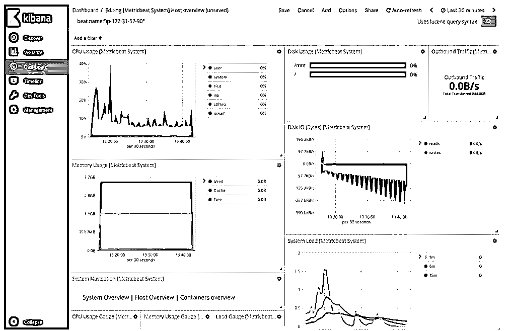
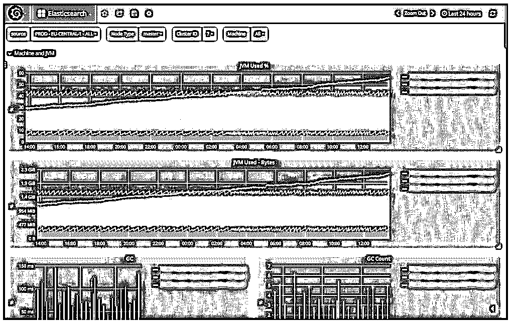
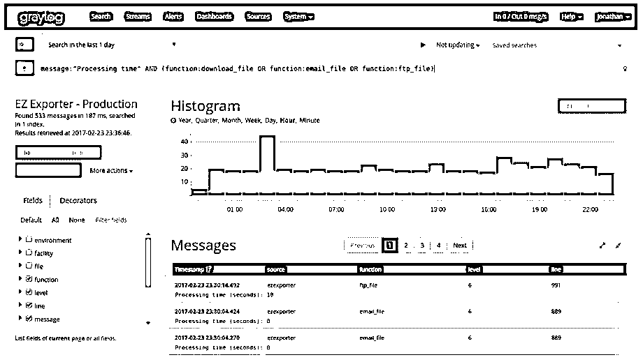
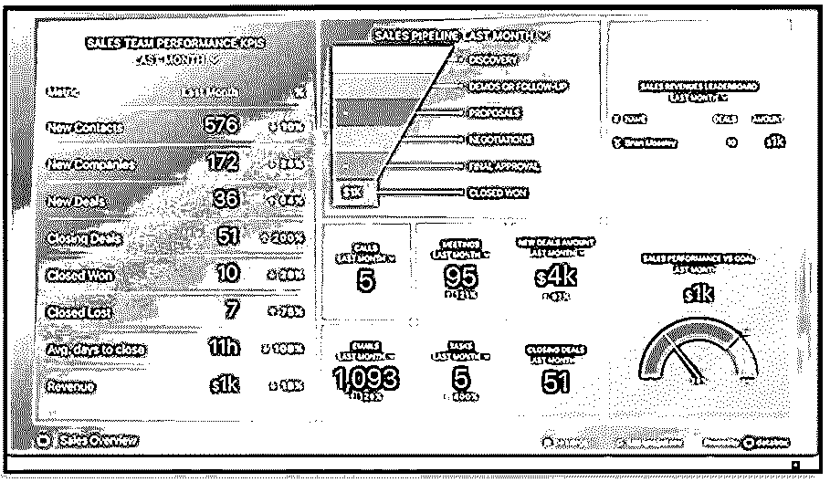
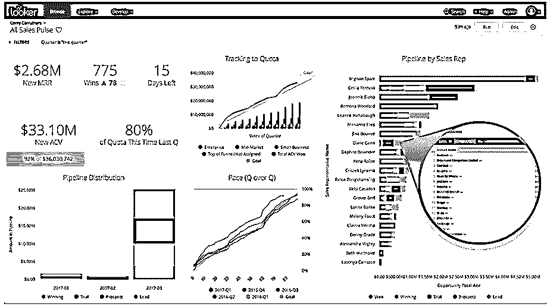
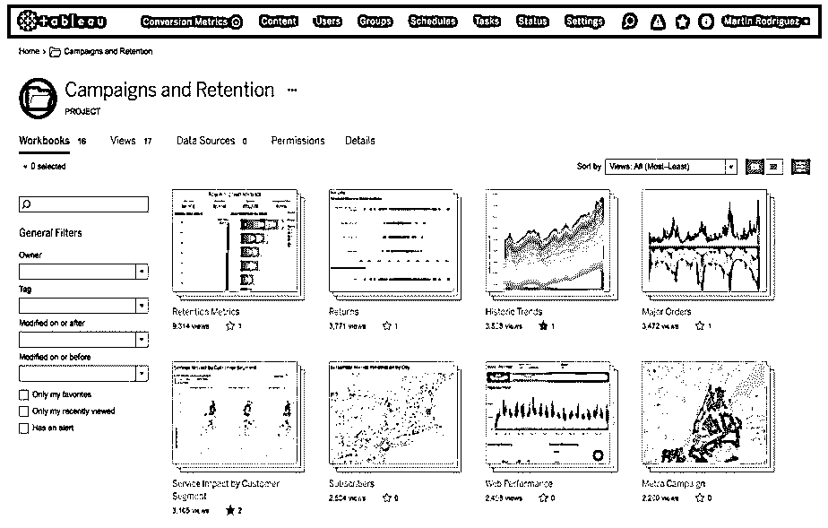
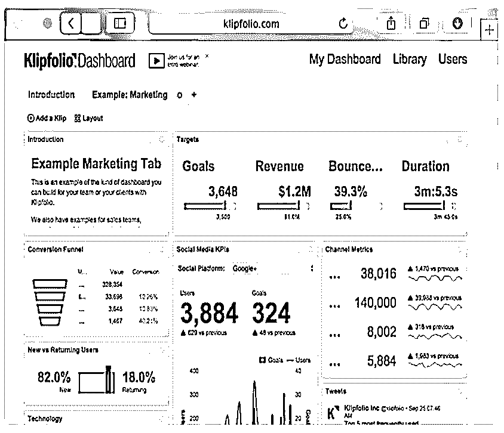

# 基巴纳替代品

> 原文：<https://www.educba.com/kibana-alternatives/>

## Kibana 替代品介绍

以下文章提供了 Kibana 替代方案的概要。Kibana 是一个强大的数据可视化工具，帮助公司应对各种因素。Kibana 是 ELK stack 的一部分，它通常伴随着 Elasticsearch 而来。但是 Kibana 并不是市场上唯一一个可视化弹性搜索数据的工具，而且还有很多工具可供使用，有些是付费的，有些是开源的，我们可以用来代替 Kibana。Kibana 是市场上最好的，但是 Kibana 的一些特性也不是开源的。要使用所有功能，我们还必须为此付费。因此，我们可以看到一些替代方案，这样我们就可以找到数据可视化和决策制定的最佳工具。

**基巴纳仪表盘:**

<small>网页开发、编程语言、软件测试&其他</small>

### 最佳的 6 种基巴纳替代品

市场上有许多最佳的替代数据可视化工具，我们可以用它们来代替 Kibana。但是我们觉得 6 个最著名的数据可视化工具可以用来代替 Kibana。

#### 1.格拉夫纳

**特点:**是一款开源工具。

Grafana 是一个开源的数据可视化工具，类似于 Kibana，但与 Kibana 不同，我们可以在不同类型的数据上使用该工具，但最常用的是 Graphite、InfluxDB 和 Elasticsearch。Grafana 的另一个特性是，与 Kibana 相比，它提供了更多的度量支持。

Grafana 有一个更多的功能，有助于取代 Graphite-web，帮助用户创建非常简单的仪表板。在 Grafana 可视化中，我们称之为面板，在每个不同的面板中，我们可以使用来显示不同类型的数据可视化，从而使其更加美观。Grafana 可以帮助图形、单 sat、表格、热图和自由文本面板类型。

像 Kibana 一样，Grafana 也提供定制选项，帮助用户以他们想要的任何方式分割数据。用户还可以选择颜色、标签、面板大小等。

#### 2.灰色日志

Graylog 是另一个用于数据可视化的开源工具。它是一个日志管理平台，所有的数据都在一个集中的系统中。Graylog 每天可以传输大量的数据，然后开始处理所有的海量数据，并根据用户的要求存储以供将来处理。Grafana 的 web 绑定允许与数据进行交互，以在不到几毫秒的时间内提取所有数据信息，并将数据整理成有用的不同类型的可视化方法，如图表、表格等。

Grafana 目前有三种类型的许可协议:

1.  开源(功能有限但数据无限)
2.  免费企业版(所有企业版功能，但数据仅限于数据/天)
3.  商业许可(在这种情况下所有产品的可用性和数据特性都根据价格选择提供)

#### 3.数据箱

Databox 是一个用于业务分析目的的工具。在这个平台上，它将你的所有数据一次拉到一个地方，这样用户就可以轻松地跟踪所有数据并实时发现见解。Databox 最大的优点是，我们可以在一个控制面板中混合和匹配来自不同来源的数据，以便更好地控制这些数据，从而提高分析性能。他们提供了许多集成方法，以便我们可以直接使用谷歌分析，销售力量，脸书，Shopify，等等。

**报表功能:**

*   可定制的仪表板
*   数据源连接器
*   拖放
*   向下钻
*   财务报表
*   预测
*   营销报告
*   OLAP
*   报告导出
*   销售报告
*   计划/自动报告

**商业智能:**

*   临时报告
*   标杆管理
*   仪表盘
*   关键绩效指标
*   性能指标
*   预测分析
*   盈利能力分析
*   发布/共享
*   记分卡
*   策略计划
*   趋势/问题指标
*   视觉分析

#### 4.检查员

Looker Business Intelligence 是一款非常广泛的数据分析工具，能够为实际决策提供完整的实时数据分析。Lookers 为用户提供了选择不同类型可视化工具的完全控制权，并且他们可以在仪表板上创建自定义可视化面板，以控制更多的决策。库中可视化的一些常见示例有图表、和弦图、web 图表、单词云、热图等。

Looker 还提供分析编程方法块的功能，用户可以使用 SQL 查询模式、数据模型。甚至 Looker 可视化工具的块也是内置的，但是它们仍然提供定制方法来根据用户需求定制仪表板块。Looker 还提供从一个程序软件到另一个程序软件的数据传输功能，以便更好地控制数据。

Lookers 还为海量数据分析提供大数据集成。Looker 不是免费版本。

#### 5.活人画

Tableau 是市场上最好的数据可视化工具。它提供了最佳的可视化前端设施，提供了对各种数据的可见性，否则这些数据将保持为单独的、无用的数据点。它使用可视化查询语言(VizQL)提供了一种更具交互性的方式来可视化数据。Tableau 最大的优点是它可以创建结构化或非结构化数据的数据可视化。Tableau 的其他功能包括故事板和提取地理空间数据的空间文件连接器。

Tableau 服务器提供安全访问数据源和更详细地分析业务信息。它们还具有将您组织的绩效与竞争对手和行业标准进行比较的功能，我们称之为基准测试。它还具有预测未来可能性的功能，因此企业和行业可以对其公司的增长做出正确的决策。

Tableau 还可以从 SQL 等不同的数据库获取数据进行数据分析。这个特性使得 Tableau 更加广泛，因为使用数据库技术是其使用跨数据库技术的能力。

这允许从不同的来源收集数据，并同时一起分析所有数据，而不是从单个数据库中获得数据。

Tableau 具有以 pdf、电子表格文件、图像、交叉表等形式从软件向外部世界发送数据报告的功能。

#### 6\. Klipfolio

该工具直接与您的数据进行交互，以便做出即时决策，并了解您的业务表现如何。只需点击一下鼠标，它就可以将本月的数据与上月或去年同期的数据进行比较。

在这个工具中，添加了更多的功能，比如从调色板拖放数据可视化选项，以开始组装您的自定义仪表板。像其他工具一样，这些工具也有可视化效果，如图表、项目符号图和散点图。或者，我们也可以在 web 上使用我们的仪表板结果，将自定义 HTML 注入到您的仪表板中。这个 Klipfolio 不是完全开源的。

### 结论

市场上有许多数据可视化工具，其中只有一些是完全开源的，大多数都提供免费许可，但功能不全。要获得上面显示的所有功能，我们必须通过许可证或每月计划。但是，如果组织非常小，他们只想进行分析，那么我们可以选择免费的开源软件，之后，我们可以使用 python 或 R studio 进行进一步的分析。因为创业公司或个体商人无法按月支付美元价格。因此，我们最好使用 Python 或 R Studio 来获得进一步的结果。这将需要一些时间，但我们不需要为分析结果支付任何额外的费用。

### 推荐文章

这是一个指南基巴纳替代品。在这里，我们讨论了基巴纳备选方案的介绍，其中有 6 个最佳备选方案，并有详细的解释。您也可以看看以下文章，了解更多信息–

1.  [基巴纳可视化](https://www.educba.com/kibana-visualization/)
2.  [什么是基巴纳？](https://www.educba.com/what-is-kibana/)
3.  [弹性搜索备选方案](https://www.educba.com/elasticsearch-alternatives/)
4.  [什么是 Logstash？](https://www.educba.com/what-is-logstash/)

