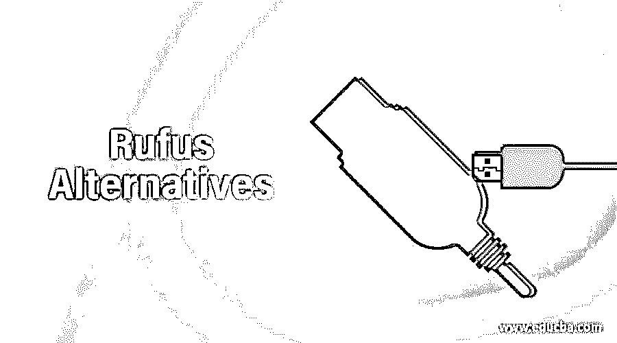

# 鲁弗斯备选方案

> 原文：<https://www.educba.com/rufus-alternatives/>

## Rufus 替代品介绍

Rufus 是一个软件程序，允许用户将便携式驱动器输入可用于各种目的的可引导驱动器，包括闪存驱动器或其他 USB 驱动器。当用户在没有安装操作系统的系统上执行研究时，这是最简单的方法之一。它还可以用于在设备上运行低级实用程序，并充当 flash DOS 固件。但它仅限于 Windows 操作系统，有时会降低系统速度。因此，在本文中，我们将看到 Rufus 的替代方案，它们运行相对较快，并且不会降低机器速度。除此之外，我们列出了所有计算机操作系统的软件，如 Windows、macOS、Linux 和 Ubuntu。这些软件可以从 Windows 设备构建可引导的 macOS 介质，反之亦然。这些工具还将有助于从 Linux 机器上构建一个可引导的 Windows 驱动器。这是鲁弗斯的替代者名单。

### 鲁弗斯的 7 大选择

rufus 的替代品列表如下:

<small>网页开发、编程语言、软件测试&其他</small>

#### 1.蚀刻师

Etcher 是一款开源的免费图像烧录软件，它可以让 SD 卡和 USB 图像的烧录变得尽可能的快速和简单。Etcher 允许各种类型的系统映像，如 ISO、IMG、DMG 等。它提供了一个伟大的功能，称为图像验证。它在刷新之前验证可移动驱动器和系统映像。因此，它通过避免在损坏的 USB 设备上写入映像来节省时间。

##### 蚀刻机的特点

*   它是硬盘友好，使驱动器选择容易。
*   它不会改变或擦除整个硬盘驱动器。
*   它有一个用户友好的界面。
*   它支持所有主要的操作系统以及系统映像。
*   它比鲁弗斯快。

#### 2.PowerISO 电源

PowerISO 是一个广泛使用的软件，帮助创建可引导的 USB 驱动器，并将映像格式转换为 ISO、虚拟驱动器、安装盘等。但是，PowerISO 仅支持 Windows 操作系统。

##### PowerISO 的功能

*   对于刷新 Windows 操作系统，它是 Rufus 的最佳替代品
*   它有助于创建，安装，刻录，提取图像文件
*   它支持所有的 BD/ CD/ DVD 文件
*   它在闪烁图像方面比鲁弗斯更快

#### 3.UNetbootin

UNetbootin 是 Universal Netboot Installer 的缩写，它是一个广泛用于 Linux 发行版的 Rufus 替代品，用于创建实时可引导 USB 驱动器。插入 USB 并指示设备从 USB 驱动器启动后，USB 就可以用于在几乎任何计算机上运行 Linux 操作系统。UNetbootin 支持所有主要平台，包括 Windows、Linux 和 macOS。

##### UNetbootin 的特点

*   用户可以通过任何机器轻松创建基于 Linux 的可引导 USB 驱动器。
*   它有一个快速闪烁的系统图像。
*   它支持所有操作系统。

#### 4.通用 USB 安装程序

通用 USB 安装程序以前是为 Linux 发行版开发的，但是，它也可以轻松地刷新 Windows ISO 映像。通用 USB 安装程序是用于刷新 Linux 和 Windows 系统映像的最流行的软件之一。它有助于在几分钟内创建可启动的 USB 驱动器。它提供了一个内置的 USB 格式化工具，可以在安装后清理 u 盘上的存储。

##### 通用 USB 安装程序的功能

*   这是容易和用户友好的界面。
*   它比鲁弗斯更快

#### 5.闪光灯

FlashBoot 是一个伟大的工具，安装 Windows 从开始或重新安装。它有免费版和专业版。免费版有助于在 USB 上创建新的可启动 Windows 副本，而专业版用于执行现有设置的克隆。因此，通过不丢失数据、设置或应用程序，可以节省在新电脑上重新安装所有东西的时间。因此，它可以作为一个可移植的 Windows 备份。

##### Flashboot 的功能

*   它会恢复所有文档、设置和应用程序
*   它是高度便携的
*   它支持多个 Windows 版本
*   它可以 standalone.EXE 文件以及自定义内容

#### 6.多引导 USB

MultuBootUSB 是 python 开发的免费开源跨平台软件。它使用户能够安装多个实时 Linux 和卸载。

##### multibootusb 的功能

*   它可以在 Windows 和 Linux 上无缝运行。
*   它最小化了开发，因为 Linux 和 Windows 的代码基础是相同的。
*   作为开源软件，它允许用户根据需要使用、重新发布、修改。
*   用户可以随时查看源代码。
*   MultiBootUSB 支持各种发行版。MultiBootUSB 不包含预先配置的发行版专用文件。
*   在整个部署过程中，配置文件是动态变化的，因此用户可以获得每个发行版的所有现有引导选项。

#### 7.媒体创建工具

媒体创建工具由微软开发，用于在 PC 上轻松安装 Windows 10。用户将从微软的服务器上下载 Windows 10，并自动创建一个可启动的 USB。这是一个自动工具，可以检测兼容软件并从 Windows 10 下载最新的 ISO 映像。但是，该工具仅限于 Windows 操作系统。

##### 媒体创建工具的功能

*   它速度更快，用户友好
*   它不会降低系统的速度

### 推荐文章

这是一个指南鲁弗斯替代品。在这里，我们还讨论了 rufus 的介绍和前 7 个备选方案以及解释。您也可以看看以下文章，了解更多信息–

1.  [新遗迹替代品](https://www.educba.com/new-relic-alternatives/)
2.  [分享替代方案](https://www.educba.com/shareit-alternatives/)
3.  [Wrike 替代方案](https://www.educba.com/wrike-alternatives/)
4.  [远程桌面替代方案](https://www.educba.com/remote-desktop-alternatives/)

