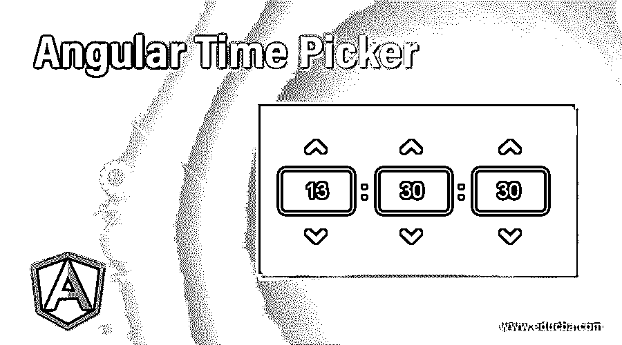
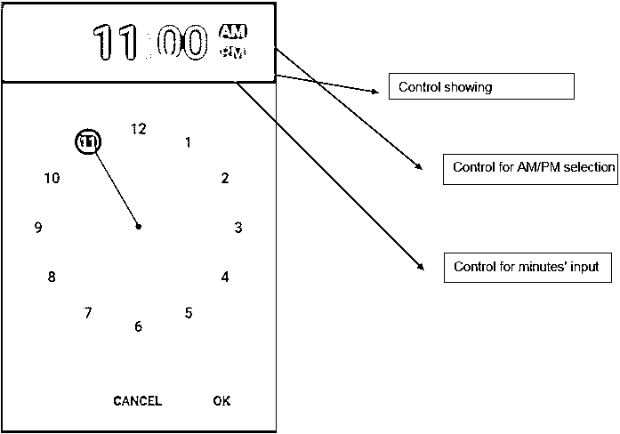

# 角度时间选择器

> 原文：<https://www.educba.com/angular-time-picker/>




## 角度时间选择器简介

在现代 web 应用程序中,“我的时代”的用户需要以各种可接受的格式输入或选择一个时间段，以实现时间选择器，在这些情况下，作为一种标准实践，许多库和框架都实现了日期和时间选择器。时间选择器是一个 UI 组件，允许用户以特定的格式从给定的用户界面输入或选择时间，这是许多现代 web 应用程序中非常常见的功能和需求。有些时候，根据要求，我们在屏幕上一起选择日期和时间。

由于时间选择器是一个常见的 UI 组件，许多第三方库提供了时间选择器的实现。在这里，我们将讨论在 Angular 中实现的两个常见的时间选择器，以及在 Angular 项目中添加它们的步骤。

<small>网页开发、编程语言、软件测试&其他</small>

### ng-引导时间选择器

ng bootstrap 是一个 Angular 库，使用 Angular 和 bootstrap 构建，ng-bootstrap 在 Angular 组件和指令中有许多构建，如果一个项目使用 bootstrap 类作为项目的样式，可以在项目中使用这个日期选择器小部件。下面是实现 ng-bootstrap 提供的时间选择器的步骤。

#### 1.安装 ng 引导程序

要在项目中添加 ng bootstrap，我们可以对 npm 和 yarn 使用下面的命令。

**代码:**

```
npm install --save @ng-bootstrap/ng-bootstrap (If using NPM)
```

**或**

```
yarn add @ng-bootstrap/ng-bootstrap (If using Yarn)
```

一旦安装了 ng bootstrap，我们必须在我们的核心模块中导入 NgbModule 并更新导入数组

**代码:**

```
import {NgbModule} from '@ng-bootstrap/ng-bootstrap'; @[NgModule](https://angular.io/api/core/NgModule)({
imports: [ NgbModule], declarations: []
})
```

ng-bootstrap 提供了 NGB 时间选择器组件，这是一个帮助我们选择小时、分钟和秒并创建时间选择器的组件。

#### 在我们的模板中添加 ngb-timepicker

下面的代码演示了如何在组件的模板中添加组件。

**代码:**

```
<ngb-timepicker [(ngModel)]="time"></ngb-timepicker>
```

**输出:**


这段代码使用 ngModel 指令进行双向数据绑定，值存储在。ts 文件。这个选定的时间存储在一个 JSON 对象中:

**代码:**

```
Selected time: {
"hour": 1,
"minute": 30,
}
```

ng-bootstrap 项目还为我们提供了一种在时间选择器中配置秒数的方法，下面是一个示例。

**代码:**

```
<ngb-timepicker [(ngModel)]="time" [seconds]="seconds"></ngb-timepicker>
```

**输出:**


#### JSON 响应

```
Selected  time:  { "hour":  13,
"minute":  30,
"second":  30
}
```

#### 子午线开/关

在 ngb 时间选择器中，还有一个打开和关闭子午线的选项，子午线属性可以传递给 ngb 时间选择器，并根据最后的选择*进行切换。*在下面的例子中，ngb-timepicker 接受 meridian 的布尔值，并根据输入中传递的值打开或关闭它。

#### 模板文件

**代码:**

```
<ngb-timepicker [(ngModel)]="time" [meridian]="meridian"></ngb-timepicker>
<button class="btn btn-lg btn-outline-{{meridian ? 'success' :
'danger'}}" (click)="toggleMeridian()">
Meridian - {{meridian ? "ON" : "OFF"}}
</button>
```

#### 组件. ts 文件

**代码:**

```
toggleMeridian() {
this.meridian = !this.meridian;
}
```

**输出:**这是两个输出，第一个有经络，第二个没有经络。


#### 旋转开关开/关

Ngb 时间选择器还提供显示和隐藏微调器的配置，微调器是用户界面中的上下箭头。在此示例中，toggleSpinner 是事件侦听器函数，它切换 show spinner 属性

#### 模板文件

**代码:**

```
<ngb-timepicker [(ngModel)]="time" [spinner]="showSpinner">
</ngb-timepicker>
<button (click)="toggleSpinner()">
Spinners - {{showSpinner ? "SHOW" : "HIDE"}}
</button>
```

**Component.ts 文件**

```
toggleSpinner() {
this.showSpinner = !this. showSpinner;
}
```

**输出:**这里是有无旋转器的输出。在第二个输出中，根据配置缺少微调器。


**没有微调器的输出:**微调器丢失，因为这里的配置是假的。


#### ng-bootstrap 中时间选择器的全局配置

ng 引导时间选择器中还提供了国际化和全局配置选项。为了在我们的项目中添加这些配置，我们可以添加以下导入并在我们的模块中使用它们。

时间对象的全局配置

NgbTimepickerConfig 将被导入用于全局配置。

**代码:**

```
import {NgbTimepickerConfig} from '@ng-bootstrap/ng-bootstrap'; 
import {NgbTimeStruct} from '@ng-bootstrap/ng- bootstrap';
```

在 NgbTimeStruct 对象的帮助下，我们可以拥有一个全局配置对象，之后添加的所有对象都将按照类中提供的全局配置进行构造。我们需要将 NgbTimeStruct 添加到组件装饰数组中的提供者数组中。

**代码:**

```
export class NgbdTimepickerConfig {
time: NgbTimeStruct = {hour: 10, minute: 10,
second: 0};
constructor(config: NgbTimepickerConfig) {
config.seconds = true;
config.spinners = false;
}
}
```

**输出:**


### 角度中的材料时间选取器

下一个材料时间选择器(ngx-material-timepicker)是一个非常流行的时间选择器库，带有材料 UI 实现。对于使用材质 UI 的项目，我们可以使用 ngx-material-timepicker 实现时间选择器功能。




要使用 ngx-material-timepicker 包实现材质 UI 时间选择器，首先，我们需要安装该包:

**1。**在项目中添加 ngx-material-timepicker 的命令:

```
npm install --save ngx-material-timepicker
```

**或**

```
yarn add --save ngx-material-timepicker
```

**2。**下一步是将 timepicker 模块导入到我们应用程序的模块中

```
import {NgxMaterialTimepickerModule} from 'ngx-material-timepicker';
```

**3。**现在我们应该在导入数组中添加 NgxMaterialTimepickerModule，下面是在导入数组中添加 NgxMaterialTimepickerModule 的代码。

```
@NgModule({
imports: [NgxMaterialTimepickerModule]
})
```

**4。**现在项目中有了材质 UI 时间选择器模块，我们可以将它添加到项目的组件中，下面是相同的代码片段。

```
<ngx-material-timepicker #picker></ngx-material-timepicker>
```

在 Angular material time picker 中有许多格式和验证选项，可以根据项目的要求使用。

除了上面提到的两个包之外，Angular 中还有许多第三方库，它们为我们提供了对时间选择器的控制，其中一些是付费的，一些是免费的，只有少数几个控件可以使用:

*   电信公司 kendo Angular UI
*   Mdbootstrap 角度材质 UI

### 推荐文章

这是一个角时间选择器的指南。在这里，我们讨论了一个角时间选择器与 ng 引导时间选择器和材料时间选择器的介绍。您也可以浏览我们的其他相关文章，了解更多信息——

1.  [角度控制器](https://www.educba.com/controllers-in-angularjs/)
2.  [角度 7 分量](https://www.educba.com/angular-7-components/)
3.  [角度特征](https://www.educba.com/angular-features/)
4.  [角度动画](https://www.educba.com/angularjs-animations/)


