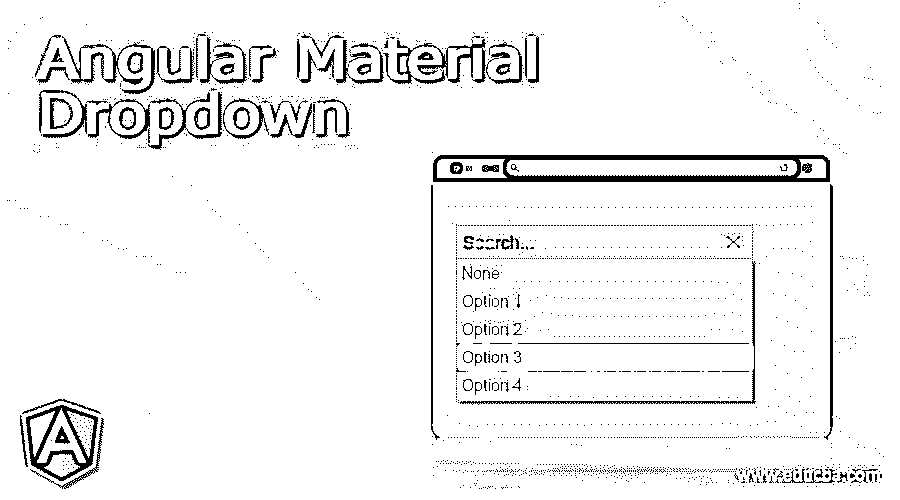

# 角形材料下拉菜单

> 原文：<https://www.educba.com/angular-material-dropdown/>




## 角形材料下拉菜单的定义

Angular material dropdown 是 Angular material 的一个组件，angular material 组件正在帮助构建有吸引力的 UX 和 UI 网页。html select 标签用于在 html 中创建一个下拉列表。为了创建一个有角度的材质下拉菜单，我们需要使用 mat-select 控件。Angular material 通过使用一组选项(如本地的“选择元素”)将组件作为 mat-select 从控件中选择值。

### 角形材料下拉菜单概述

*   要使用角度材料选择，我们需要从表单控件中使用 mat-select 从多个选项中选择值。
*   mat-select 设计用于在 mat-form-field 组件下工作。我们可以通过向 mat-select 添加 mat-option 来为 select 添加选项。
*   每个 mat-option 都包含 value 属性，该属性由所选用户通过选择该选项来设置值。
*   这是用户显示的 mat 选项的内容。有角的材料支持在垫-形式-领域内选择元素的使用。本机控件包含可访问性和可用性的优点。
*   提供设计风格材料的选择的角度材料组件的角度材料下拉输入允许从下拉列表中选择项目。
*   我们在下拉列表或角形材料列表中定义的角形材料提供了材料的设计风格，允许我们在下拉菜单选择中提供帮助。
*   正如我们所知，angular material 是一个为 angular framework 构建的 UI，它包含了许多组件，如模型或卡片。
*   在角度组件中选择组件允许我们从相关选项列表中选择单个或多个项目。它通过使用角形材料提供了具有设计外观的选择选项的功能。
*   为了使用 select 组件，我们需要导入 MatSelectModule。如果不导入这个模块，我们就不能在我们的应用程序中使用它。
*   我们还需要从下拉列表中的表单字段和输入角度材料应用模块。
*   角形选择组件材料将被包裹在垫形场组件内。基本上，在 AngularJS 中提供下拉菜单是非常有用和重要的。

### 如何创建有角度的材料下拉列表？

*   要配置角材下拉菜单，我们需要在系统中安装角材 CLI。下面的例子说明了如何安装角材 CLI。
*   要配置 angular material 下拉菜单，我们需要在系统中安装 Angular CLI。我们可以使用 npm 命令安装 angular CLI。

```
npm install -g @angular/cli
```

*   在这一步安装 Angular CLI 后，我们将为 Angular 项目创建工作空间。我们正在创建一个名为 angular-material-dropdown 的工作空间。下面的例子显示创建我们的角度项目的工作空间如下。我们正在添加角度路由。该选项将在创建工作区时弹出。此外，我们选择 CSS 作为样式表格式。

```
ng new angular-material-dropdown
```

*   在这一步创建了项目的工作空间后，我们将安装角度 CDK、角度动画和角度材质，如下所示。

```
npm install @angular/material –save
```

*   在这一步安装了角度材质、cdk 和动画之后，我们在我们的项目中添加了同样的东西，如下所示。下面的例子显示了添加角度素材库如下。

```
cd angular-material-dropdown/

ng add @angular/material
```

*   在 material.module.ts 文件中添加代码。我们可以看到，在下面的例子中，我们已经导入了多个模块用于我们的项目。

**代码—**

<small>网页开发、编程语言、软件测试&其他</small>

```
import { NgModule } from '@angular/core';

@NgModule({

imports: [

MatSelectModule

………

MatInputModule

]

} )

export class MaterialModule { }
```

*   在 app.component.ts 文件中添加代码。在本例中，我们将接口名称导出为下拉列表。

**代码—**

```
import { Component } from '@angular/core';

export interface dropdown {

……………

brands: dropdown [] = [

}
```

*   在 app.component.html 文件中添加代码。在下面的例子中，我们正在创建基本的 mat-select 下拉菜单。

**代码—**

```
<h4>Basic mat-select</h4>

<mat-form-field>

………

</select>

</mat-form-field>
```

### 角形材料下拉示例

*   我们将项目名称创建为 angular-material-angulardropdown。
*   我们正在为我们的角度项目创建工作空间。我们正在创建一个名为 angular-material-angulardropdown 的工作空间。下面的例子显示创建我们的角度项目的工作空间如下。我们正在添加角度路由。该选项将在创建工作区时弹出。此外，我们选择 CSS 作为样式表格式。

```
ng new angular-material-angulardropdown
```

*   在这一步中创建项目后，我们将在我们的项目中添加相同的内容，如下所示。以下示例显示了添加角度材料库，如下所示。

```
cd angular-material-angulardropdown/
```

```
ng add @angular/material
```

*   在 app.component.ts 文件中添加代码。在下面的例子中，我们可以看到我们已经导出了 AppModule 类。

**代码—**

```
import { NgModule } from '@angular/core';

…………….

MatInputModule,

MatFormFieldModule,

MatSelectModule

],

providers: [],

bootstrap: [AppComponent]

})

export class AppModule { }
```

*   在 app.component.html 文件中添加代码。我们可以看到，我们已经使用组件添加了显示下拉菜单的 html 代码。

**代码—**

```


<mat-form-field appearance = "outline">

</mat-option>

</mat-select>

</mat-form-field>


```

### 结论

mat-select 设计用于在 mat-form-field 组件下工作。我们可以通过向 mat-select 添加 mat-option 来为 select 添加选项。它是 angular material 的一个组件，angular material 组件正在帮助构建有吸引力的 UX 和 UI 网页。

### 推荐文章

这是一个有角度的材料下拉指南。在这里，我们讨论定义，概述，以及如何创建一个有角度的材料下拉？示例分别用代码实现。您也可以看看以下文章，了解更多信息–

1.  [棱角分明的物质 NPM](https://www.educba.com/angular-material-npm/)
2.  [角材登录表单](https://www.educba.com/angular-material-login-form/)
3.  [有角度的材料覆盖图](https://www.educba.com/angular-material-overlay/)
4.  [角形材料展开面板](https://www.educba.com/angular-material-expansion-panel/)


