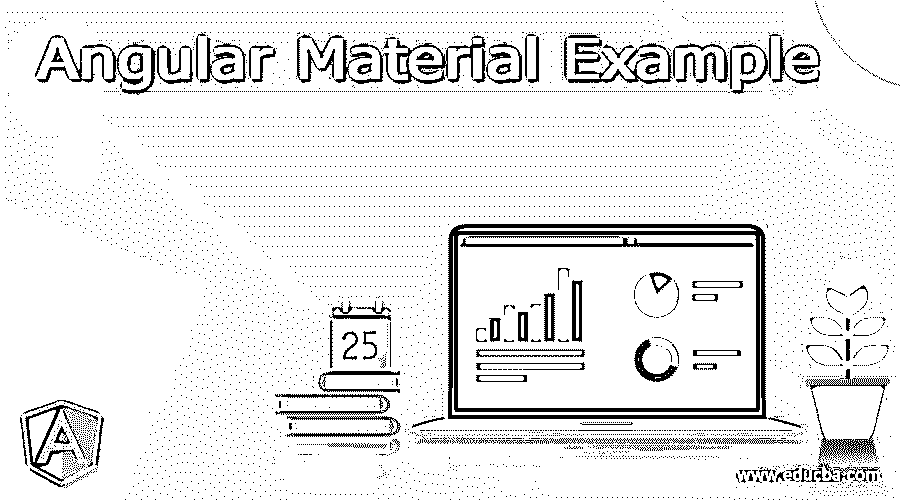
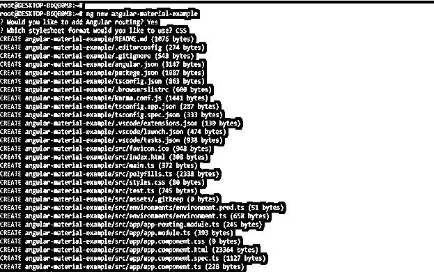

# 角形材料示例

> 原文：<https://www.educba.com/angular-material-example/>




## 角形材料示例的定义

Angular material 示例通过使用具有设计规范的 Angular 框架，帮助我们创建高质量的应用程序。角形材料提供了大量现成的角形构件，而这些构件是基于材料的设计。基本上 angular material 是 AngularJS 开发者的 UI 组件库。Angular material 将帮助我们为 web 应用程序构建功能性的、一致的网页。

### 角形材料示例

*   我们使用有棱角的材料来创造一个专业的用户界面。谷歌是在 2014 年创立材料设计的。
*   它将为用户界面的开发建立一套指导方针和原则，用户界面包括动作、交互。角钢的材料设计将通过角钢的材料来实现。
*   Angular material 将包括表单、按钮和导航的多种模式和组件。
*   最新版本的 angular material 将展示如何在我们的项目中添加材质设计。
*   第一种方法是，我们需要将 ng add 命令添加到 angular CLI 中，以便通过使用 angular schematics 快速添加角度材料。
*   下面的步骤显示了如何设置角度材料的例子如下。我们正在配置角材的项目举例如下。要配置 angular material 示例项目，我们需要在系统中安装 angular material CLI。下面的例子说明了安装角材的 CLI 如下。
*   要配置 angular material，我们需要在系统中安装 angular CLI 的示例如下。

```
npm install -g @angular/cli
```


<small>网页开发、编程语言、软件测试&其他</small>


*   在这一步安装 angular CLI 后，我们将为 angular 项目创建工作空间。我们将工作空间名称创建为角度-材质-示例。下面的例子显示创建我们的角度项目工作空间如下。我们正在添加角度路由。该选项将在创建工作区时弹出。此外，我们将样式表格式选择为 CSS。

```
ng new angular-material-example
```




3.在这一步创建了角度材质示例项目的工作空间后，我们正在安装角度 CDK，角度动画和角度材质如下。在下面的例子中，我们将角度材质和 cdk 安装到新配置的项目目录中。我们还安装了角度动画，因为一些角度材质组件需要动画。我们需要在我们的前端应用程序中包含动画支持来启用动画。我们使用下面的命令来安装角度材质，cdk 和动画。

```
npm install @angular/material –save
```


4.安装角度材料后，cdk 和动画在这一步，我们在我们的项目中添加相同的如下。下面举例说明添加角材库如下。

```
cd angular-material-example/
```

```
ng add @angular/material
```


5.现在我们需要在我们的应用程序配置文件中添加模块。所以现在我们需要打开 app.module.ts 文件，需要导入浏览动画模块，需要添加到数组中的导入如下。下面的例子显示了将模块添加到应用程序配置文件中如下。

**代码—**

```
import { BrowserAnimationsModule } from '@angular/platform-browser/animations';
imports: [
BrowserModule, BrowserAnimationsModule
],
```


6.我们还可以在项目中添加 HammerJS。一些组件依赖于 HammerJS 对手势的支持。因此，我们需要在应用程序中添加 HammerJS 来获得组件的所有特性。为了安装 HammerJS，我们需要进入终端，然后执行下面的命令。下面的例子显示了如何使用 npm 命令安装 HammerJS。

```
npm install –save HammerJS
```


7.现在我们在应用程序中导入这个库，这个库将驻留在 main.ts 文件中，如下所示。以下示例显示了将库导入 main.ts 文件。

**代码—**

```
import 'hammerjs';
if (environment.production) {
  enableProdMode ();
}
platformBrowserDynamic ().bootstrapModule (AppModule)
  .catch(err => console.log (err));
```


8.现在我们正在导入材质主题。在我们的应用程序中，主题是设计材料组件的样式所必需的。我们可以在 AngularJS 中选择自定义或预建的主题。主题只不过是样式表。要添加材质主题，我们需要编辑 style.css 文件，并需要添加以下行。

**代码—**

```
@import '~@angular/material/prebuilt-themes/style.css';
```


### 角形材料的使用

*   角形材料用于以结构化的方式设计应用程序。angular material 的组成部分是开发一致性和功能性的 web 应用程序。
*   通过使用棱角分明的材料，我们可以实现更快和反应迅速的网站。有角度的材料将吸引用户，并访问应用程序中存在的元素组件。棱角分明的材料也有助于通过使用独特的风格和形状来开发我们的应用程序。角状材料的成分将使我们的应用更加符合设计的要求。
*   它将成功设计的经典原则与技术和创新相结合。棱角分明的材料包含了内置的响应式设计。角材包含了标准的 CSS。Angular material 是跨平台的浏览器，用于创建 web 组件。

### 有角度的材质 UI 元素

*   Angular material 提供了 AngularJS 在开发基于 web 的应用程序时支持的不同类型的 UI 元素。以下是 angular material package 提供的重要 UI 元素。
*   输入 6)表单字段 1)复选框 16)图标
*   按钮 7)选择 12)单选按钮 17)进度条
*   卡片 8)列表 13)日期选择器 18)对话框
*   网格列表 9)表格 14)分页器 19)菜单
*   工具栏 10)标签 15)滚动条 20)分隔线
*   使用 AngularJS 开发基于 web 的应用程序时，Angular material 组件非常有用。
*   众所周知，angular material 正在提供多种组件来开发基于 web 的应用程序。

### 结论

Angular material 将为开发用户界面建立一套指导方针和原则，用户界面包括动作、交互。角钢的材料设计将通过角钢的材料来实现。Angular material 示例通过使用具有设计规范的 Angular 框架，帮助我们创建高质量的应用程序。

### 推荐文章

这是一个指导有角材料的例子。这里我们分别讨论角材的定义、使用、UI 元素、代码实现的例子。您也可以看看以下文章，了解更多信息–

1.  [有角度的材料覆盖图](https://www.educba.com/angular-material-overlay/)
2.  [有角度的素材滑块](https://www.educba.com/angular-material-slider/)
3.  [角形材料网格](https://www.educba.com/angular-material-grid/)
4.  [角状材料单选按钮](https://www.educba.com/angular-material-radio-button/)


