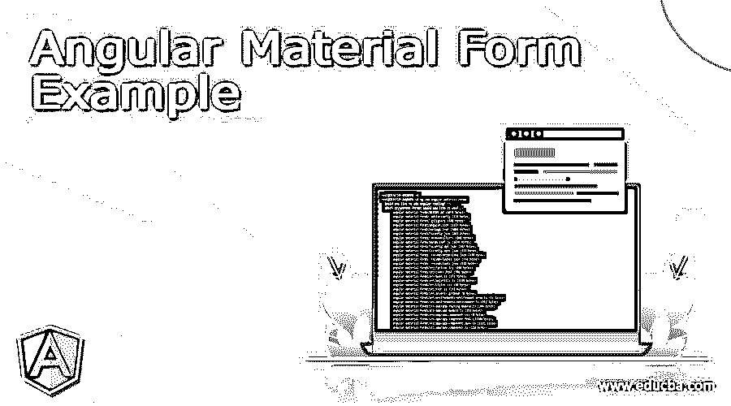
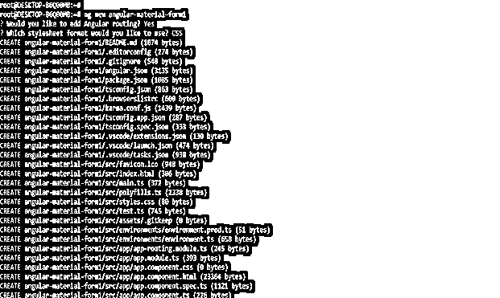
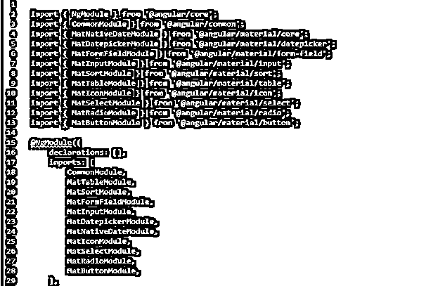
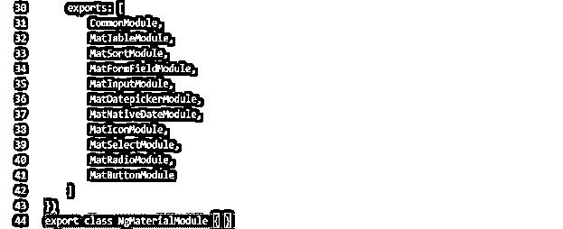
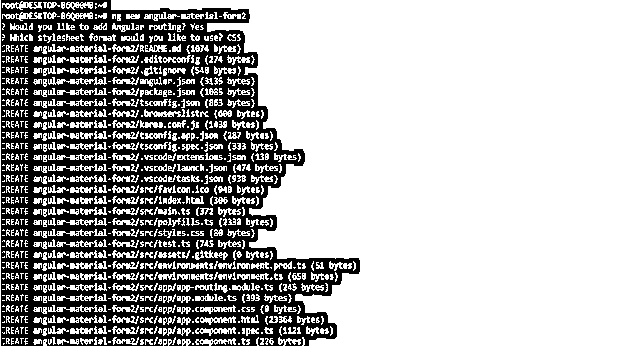
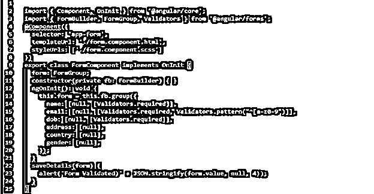
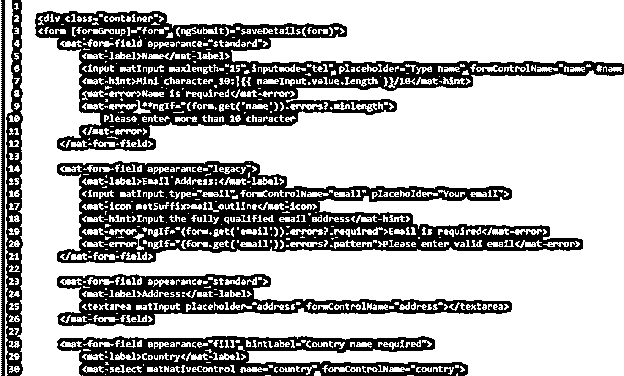
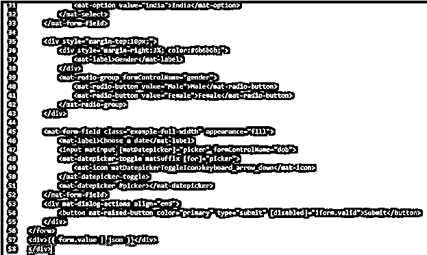
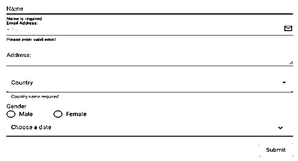

# 角形材料形式示例

> 原文：<https://www.educba.com/angular-material-form-example/>




## 角形材料的定义示例

角材料形式的例子包含的形式，我们已经在一个网络应用程序的发展。基本上，mat 表单字段组件用于包装有角度的材料组件，并应用文本字段样式，这是常见的字段文本样式，如提示消息和下划线。表单域将引用包装器的组件，表单域的控件将引用我们已经包装的组件。

### 如何创造有棱角的物质形态？

*   我们可以使用与选择组件一起使用的角形材料表单中的一些特征。这包括前缀、后缀、主题和错误消息。
*   为了将选项添加到 select 中，我们需要将 mat-option 元素添加到 mat-select 元素中。
*   原生控件将包含可访问性、性能和可用性优势。在内部使用本地 select 将导入输入模块，并将本地控件属性添加到 select 元素中。
*   mat-select 和 select 将支持对表单和反应表单模块的指示。对于本机模块，select 也支持 compareWith 函数。
*   下面的步骤显示了如何创建有角度的材料形式如下。要配置角材表单项目，我们需要在系统中安装角材 CLI。下面的例子说明了如何安装角材 CLI。

1.  为了创建有角度的材料形式，我们需要在我们的系统中安装 angular CLI。我们可以使用 npm 命令安装角材 CLI。

```
npm install -g @angular/cli
```


<small>网页开发、编程语言、软件测试&其他</small>


2.在这一步安装 angular CLI 后，我们将为 angular 项目创建工作空间。我们将工作空间名称创建为 angular-material-form1。下面的例子显示创建我们的角度项目工作空间如下。我们正在添加角度路由。该选项将在创建工作区时弹出。此外，我们将样式表格式选择为 CSS。

```
ng new angular-material-form1
```




3.在这一步创建了角度材质表单项目的工作空间后，我们正在安装角度 CDK，角度动画和角度材质如下。

```
npm install @angular/material –save
```


4.安装角度材料后，cdk 和动画在这一步，我们在我们的项目中添加相同的如下。下面举例说明添加角材库如下。

```
cd angular-material-form1/
```

```
ng add @angular/material
```


5.现在我们将现有代码替换到 material.module.ts 文件中，如下所示。

**代码—**

```
import { NgModule } from '@angular/core';
……
@NgModule({
declarations: [],
imports: [
CommonModule,
MatTableModule,
MatSortModule,
MatFormFieldModule,
MatInputModule,
MatDatepickerModule,
MatNativeDateModule,
MatIconModule,
MatSelectModule,
MatRadioModule,
MatButtonModule,
],
exports: [
CommonModule,
MatTableModule,
MatSortModule,
MatFormFieldModule,
MatInputModule,
MatDatepickerModule,
MatNativeDateModule,
MatIconModule,
MatSelectModule,
MatRadioModule,
MatButtonModule
]
})
export class NgMaterialModule { }
```







6.现在，我们将所有模块导入到自定义的模块材料文件中。保持模块分离角形材料非常容易维护。在下面的例子中，我们正在导入反应如下的材料模块和表格模块。

**代码—**

```
import { NgMaterialModule } from './ng-material/ng-material.module';
@NgModule({
......
imports: [
...
NgMaterialModule,
], } )
```


*   在 AngularJS 中，我们可以创建一个在 mat form 字段内部使用的表单。这在创建一个组件后很有用，该组件将通过使用表单域共享多种行为。为了在我们的项目中使用角形材料的表单域，我们需要添加带有 matFormFieldControl 接口的组件。

### 棱角分明的材料形态设计范例

*   下面的例子展示了棱角分明的材料形态设计的例子如下。首先，我们为 angular 项目创建工作空间。我们将工作空间名称创建为 angular-material-form2。下面的例子显示创建我们的角度项目工作空间如下。我们正在添加角度路由。该选项将在创建工作区时弹出。此外，我们将样式表格式选择为 CSS。

```
ng new angular-material-form2
```




*   现在我们在我们的项目中添加库如下。下面举例说明添加角材库如下。

```
cd angular-material-form2/
```

```
ng add @angular/material
```


*   为了在我们打字稿中创建有角材料形式的例子，我们需要有角材料验证的规则。在下面的示例中，我们正在创建表单并将验证添加到 app.component.ts 文件中。

**代码—**

```
@Component ({
Selector : 'app-form',
templateUrl: './form.component.html',
styleUrls: ['./form.component.scss']
})
export class FormComponent implements OnInit {
form: FormGroup;
constructor (private fb: FormBuilder) { }
ngOnInit (): void {
this.form = this.fb.group ({
name: [null, [Validators.required]],
email: [null, [Validators.required, Validators.pattern ("^[a-z0-9")]],
dob: [null, [Validators.required]],
address: [null],
country: [null],
gender: [null],
});
}
saveDetails(form) {
alert ('Form Validated)' + JSON.stringify(form.value, null, 4));
} }
```




*   在上面的示例中，required 属性用于指定所提供的值。我们也可以使用 minlength 属性来指定 char 的最小数量。我们也可以使用 maxlength 属性来指定字符的最大数量。我们使用模式属性来指定提供的值匹配的正则表达式。
*   现在，我们正在模板中添加 material form 组件。我们在模板中使用多个组件。mat-form-field 组件用于包装 angular 组件并应用文本字段的样式。标签组件允许表单域作为可选属性。Mat select 组件用于从多个选项中选择值。Mat 单选按钮提供的功能与单选按钮提供的功能相同。

**代码—**

```
<div class="container">
<form [formGroup] = "form" (ngSubmit) = "saveDetails(form)">
<mat-form-field appearance = "standard">
<mat-label> Name </mat-label>
<input matInput maxlength = "15" inputmode = "tel" placeholder = "Type name" formControlName = "name" #nameInput>
……
</div>
</form>
<div>{{ form.value | json }}</div>
</div>
```










### 结论

我们可以使用与选择组件一起使用的角形材料表单中的一些特征。基本上，mat 表单字段组件用于包装有角度的材料组件，并应用文本字段样式，这是常见的字段文本样式，如提示消息和下划线。

### 推荐文章

这是一个指导角形材料成型的例子。在这里，我们讨论的定义，概述，如何创建有角度的材料形式，例子与代码实现分别。您也可以看看以下文章，了解更多信息–

1.  [有角的物质形态](https://www.educba.com/angular-material-form/)
2.  [棱角分明的材料设计](https://www.educba.com/angular-material-design/)
3.  [棱角分明的物质 NPM](https://www.educba.com/angular-material-npm/)
4.  [角材登录表单](https://www.educba.com/angular-material-login-form/)


