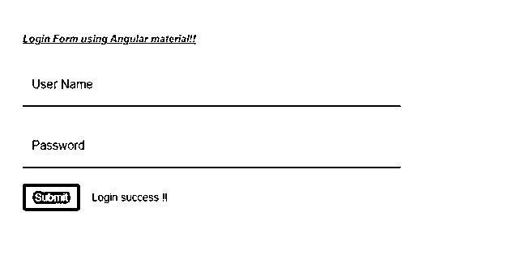

# 角材料登录表单

> 原文：<https://www.educba.com/angular-material-login-form/>

## 角材登录表单介绍

以下文章提供了 Angular material 登录表单的概要。我们可以使用构建标签中的材料创建任何类型的表单；他们都提出了默认的风格和设计。通过使用它们，我们可以创建一个只包含输入文件和提交用户请求的按钮类型的登录表单。我们可以通过在素材库中使用简单的输入 HTML 标签来创建它。登录表单充当用户进入应用程序的入口点；只有登录后，他们才能访问用户的功能。通过使用素材库提供的 inbuild 类和模块，我们可以使登录表单更具交互性，素材库将为我们提供默认的样式和设计，这使得登录页面(其中使用的组件)更加用户友好。在本教程的下一节中，我们将看看我们的应用程序中登录表单的实现，以及要使其正常工作需要哪些配置。

**语法**

<small>网络开发、编程语言、软件测试&其他</small>

为了创建登录表单，我们需要在模板上使用不同的标签和指令，以便使用素材库创建完整的登录表单；它易于使用和保存；让我们仔细看看语法，创建它需要哪些字段，见下文；

1)输入字段:取用户名

2)输入字段(密码):从用户处获取密码

3)按钮:根据输入执行进一步的动作。

仔细看看练习语法；为了更好地理解，见下文；

`<input type""your type>
<input type""your type>
<button>your label</button>`

### 如何在 Angular material 中创建登录表单？

截至目前，我们已经知道，要在 angular material 中创建任何形式，我们可以利用素材库提供的现有 class 和 directive 标签；为此，我们需要将素材库与 angular 应用程序一起安装在应用程序中。在本教程的下一节中，我们将看到如何按照步骤来设置项目。首先，我们来看看素材库创建登录表单；让我们开始吧；

1)输入字段(用户名):要将用户名作为输入，我们可以使用 HTML 中的输入标签，并进行适当的修改；让我们仔细看看下面的语法:

**例如:**

`<mat-form-field class="example-full-width" appearance="fill">
<mat-label>User name</mat-label>
<input matInput placeholder="enter user name" value="">
</mat-form-field>`

2)我们还需要为密码创建相同的字段，在该字段中，我们将获取用户密码，并验证用户是否被授权。

3)按钮:现在，我们需要一个按钮来提交用户凭证并执行进一步的操作。让我们仔细看看如何使用素材库创建它；见下文；

**例如:**

`<button mat-button>label</button>`

所以从上面这段代码中，我们可以看到，对于输入字段，我们使用的是‘matInput ’,对于按钮，我们使用的是来自素材库的‘mat-button’。

现在，让我们从需要采取的步骤开始，以便为初学者初步加强我们的角度材料项目；见下文；

1)首先，安装 Angular CLI，它使我们能够下载项目所需的包和库。您可以通过在命令上键入以下命令来下载它，请确保您已经安装了 node，见下文；

**例如:**

npm install -g @angular/cli)以上命令将在我们的系统中全局安装 CLI；因此，我们可以在需要时全局使用它。

3)现在，在这一步中，我们将尝试从头开始创建新的 angular 项目；这个项目将不是一个材料项目，我们必须通过在我们的项目中安装材料依赖关系来添加它。所以只需在你的命令提示符下执行下面的命令，并按回车键见下文；

**语法:**

`ng new your project name`

**例如:**

`ng new my-first-project`

此命令将创建名为 my-first-project 的项目；您可以用提到的任何名称创建您的项目。

4)为了确保万无一失，请尝试下面提到的一个命令，将所有需要的库安装到我们的项目中，

**例如:**

`npm install`

5)现在，您可以通过键入下面提到的简单命令来测试和运行您的项目。这只是为了确保我们在正确的轨道上，并且我们的项目没有任何错误或缺陷。

**例如:**

`ng serve`

6)进入浏览器，尝试使用以下 URL 运行应用程序:

**例如:**

`http://localhps:4200`

默认情况下，angular 项目运行在端口 4200 上；如果需要，您可以根据自己的需要进行更改。

7)现在一切都设置好了，我们有了我们的 angular 项目，现在我们只要在命令提示符下运行下面的命令，就可以将素材库添加到我们的项目中；

**例如:**

`ng add @angular/material`

### 角材料登录表单示例

下面提到了不同的例子:

**1)demo.login.component.html 电码**:

`<h5><u><i>Login Form using Angular material!!</i></u></h5>
<form class="example-form">
<mat-form-field class="example-full-width" appearance="fill">
<mat-label>User Name</mat-label>
<input matInput placeholder="Enter your name" name="usename"
[(ngModel)] ="username">
</mat-form-field>
<mat-form-field class="example-full-width" appearance="fill">
<mat-label>Password</mat-label>
<input matInput placeholder="Enter your password" value="" name="password" type="password" [(ngModel)]= "password">
</mat-form-field>
<button mat-raised-button color="primary" (click)="submit()">Submit</button>
 <button mat-button color="accent">Login success !!</button>
</form>`

2) demo.login.component.ts 代码:

`import {Component} from '@angular/core';
/**
* @title login demo
*/
@Component({
selector: 'login-demo',
styleUrls: ['demo.login.component.css'],
templateUrl: 'demo.login.component.html',
})
export class LoginFormDemo {
username : string ="";
password : string ="";
show: boolean= false;
submit(){
console.log("user name is " + this.username)
this.clear();
}
clear(){
this.username ="";
this.password = "";
this.show = true;
}
}`

**3)index.html 电码**:

`<!DOCTYPE html>
<html lang="en">
<head>
<meta charset="utf-8">
<meta name="viewport" content="width=device-width, initial-scale=1.0">
<link href="https://fonts.googleapis.com/icon?family=Material+Icons&display=block" rel="stylesheet">
<title>login demo</title>
</head>
<body class="mat-app-background">
<demo-login>Loading..</demo-login>
Current build: 12.1.1
</body>
</html>`

**4) module.ts 代码**:

`import {NgModule} from '@angular/core';
import {MatButtonModule} from '@angular/material/button';
import {MatInputModule} from '@angular/material/input';
@NgModule({
exports: [
MatButtonModule,
MatInputModule,
] })
export class DemoLogonFormMaterial {}`

**输出:**

提交前:

提交后:

在控制台上，查看用户名:

### 结论

通过使用素材库，我们可以使我们的页面和用户界面更加友好和吸引人，否则我们可以使用普通的 HTML 标签来创建相同的东西，但这使它看起来更好，并且数据的处理也容易执行进一步的操作。开发人员也容易维护和理解。

### 推荐文章

这是一个有角度的材料登录表单指南。在这里，我们讨论如何在 Angular material 中创建一个登录表单，以及示例和输出。您也可以看看以下文章，了解更多信息–

1.  [角度 CLI](https://www.educba.com/angular-cli/)
2.  [角度 7 特征](https://www.educba.com/angular-7-features/)
3.  [角度时间选择器](https://www.educba.com/angular-time-picker/)
4.  [安装角度](https://www.educba.com/installing-angular/)

