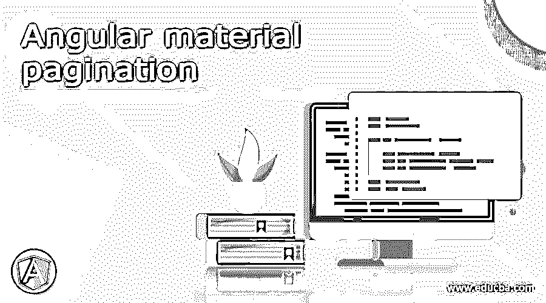

# 有角度的材料分页

> 原文：<https://www.educba.com/angular-material-pagination/>




## 角度材质分页介绍

角材还为我们提供了一个最有用的特性，使用它可以快速构建，这就是分页。Angular material 为我们提供了一个构建模块，可以导入到我们的应用程序中，并直接用于在我们的应用程序中创建分页。分页的基本目的是当数据的数量或容量非常大时，将数据分成不同的页面。它有助于在不同的页面上划分和显示数据；它增加了数据的可读性，并使处理大量数据变得更容易。在本教程的下一节中，我们将看到如何使用 build 模块中的素材库在应用程序中实现分页，使之对初学者来说更加容易、快捷、快速和稳定。

**语法**

<small>网页开发、编程语言、软件测试&其他</small>

正如我们所见，我们可以使用素材库中可用的模块和指令来构建分页；让我们仔细看看素材库给出的分页语法见下文；

```
<mat-paginator [length]="your value"
[pageSize]="your page size"
[pageSizeOptions]="your value">
</mat-paginator>
```

正如您在上面的语法中看到的，我们正在尝试借助“mat-paginator”创建分页，并指定指令的属性来初始化我们的分页。要使用它，我们必须在模块内部导入适当的模块以避免错误。在本教程的下一节中，我们将更仔细地研究练习语法，以便更清楚和理解。

### 在角状材料中分页是如何工作的？

分页有助于我们将数据分成大小相等的每页；它帮助我们以一种良好的方式显示数据。此外，我们可以很容易地导航到任何我们想要的年龄。我们还可以指定每页上的数据限制，只需对分页的属性进行少量更改。在这一节中，我们将了解如何在现有的应用程序中实现分页，以及实现这一功能所需的所有配置；让我们开始吧；

1) **MatPaginatorModule** :为了实现分页，我们将在我们的根模块或任何子模块中导入“MatPaginatorModule”以便在应用程序中使用它。作为参考，请遵循下面的代码使用这个见下文；

**例如:**

```
import {MatPaginatorModule} from '@angular/material/paginator';
```

2) **MatPaginator** :该组件来自素材库，负责提供分页中的导航。它有几个属性可以用来实现分页；让我们从下面开始看；

*   **pageSizeOptions: number[]** :将所有页面尺寸选项显示给用户；这是一个年龄大小的数组。
*   **pageSize: number** :这将决定每页显示多少数据；默认值为 50。
*   **length: number** :需要分页的数据个数。
*   **pageIndex:编号**:默认为 0。

它还包含下面提到的一些方法；

*   **首页**:将移动到首页。
*   getNumberOfPagaes :这将返回页数。
*   **hasPreviousPage** :检查上一页是否存在，返回类型为 Boolean。
*   **hasNextPage** :返回布尔值，检查是否有下一页。
*   **上一页**:移动到上一页。
*   **下一页**:移动到下一页。

现在，让我们从需要采取的步骤开始，以便为初学者初步加强我们的角度材料项目；见下文；

1)首先，安装 angular CLI，它使我们能够下载项目所需的包和库。您可以通过在命令上键入以下命令来下载它，请确保您已经安装了 node，见下文；

**例如:**

npm install -g @angular/cli)以上命令将在我们的系统中全局安装 CLI；因此，我们可以在需要时全局使用它。

3)现在，在这一步中，我们将尝试从头开始创建新的 angular 项目；这个项目将不是一个材料项目，我们必须通过在我们的项目中安装材料依赖关系来添加它。所以只需在你的命令提示符下执行下面的命令，并按回车键见下文；

**例如:**

```
ng new your project name
>> ng new my-first-project
```

此命令将创建名为 my-first-project 的项目；您可以用提到的任何名称创建您的项目。

4)为了确保万无一失，请尝试下面提到的一个命令，将所有需要的库安装到我们的项目中，

**例如:**

```
npm install
```

5)现在，您可以通过键入下面提到的简单命令来测试和运行您的项目。这只是为了确保我们在正确的轨道上，并且我们的项目没有任何错误或缺陷。

**例如:**

```
ng serve
```

6)进入浏览器，尝试使用以下 URL 运行应用程序:

**例如:**

```
http://localhps:4200
```

默认情况下，angular 项目在端口 4200 上运行；如果需要，您可以根据自己的需要进行更改。

7)现在一切都设置好了，我们有了我们的 angular 项目，现在我们只要在命令提示符下运行下面的命令，就可以将素材库添加到我们的项目中；

**例如:**

```
ng add @angular/material
```

### 角度材质分页示例

下面提到了不同的例子:

1)index.html 电码:

```
<!DOCTYPE html>
<html lang="en">
<head>
<meta charset="utf-8">
<meta name="viewport" content="width=device-width, initial-scale=1.0">
<link href="https://fonts.googleapis.com/icon?family=Material+Icons&display=block" rel="stylesheet">
<title>Demo pagination</title>
</head>
<body class="mat-app-background">
<paginator-demo>Loading ..</paginator-demo>
Current build: 12.1.1
</body>
</html>
```

2)模块. ts 代码:

```
import {NgModule} from '@angular/core';
import {MatPaginatorModule} from '@angular/material/paginator';
@NgModule({
exports: [
MatPaginatorModule,
]
})
export class DempPaginationModule {}
```

3) demo.pagination.component.ts 代码:

```
import {Component} from '@angular/core';
/**
* @title Demo pagination
*/
@Component({
selector: 'paginator-demo',
templateUrl: 'demo.pagination.component.html',
})
export class DemoPagination {}
```

4)demo.pagination.component.html 电码:

```
<h5><u><i>Demo pagination using Angular material !!</i></u></h5>
<mat-paginator [length]="200"
[pageSize]="20"
[pageSizeOptions]="[5, 10, 25, 100]">
</mat-paginator>
```

**输出:**


**点击后大小数组:**


### 结论

通过使用分页，如果我们有成千上万的可用数据，我们可以轻松地管理我们的数据，并以一种良好的方式显示给用户，而无需滚动其他整个页面。此外，它可以在现有代码中进行一些更改和配置后直接使用，易于维护，并且可供开发人员阅读。

### 推荐文章

这是一个有角度的材料分页指南。在这里，我们讨论分页是如何在 Angular material 中工作的，以及示例和输出。您也可以看看以下文章，了解更多信息–

1.  [AngularJS ng 级](https://www.educba.com/angularjs-ng-class/)
2.  [角度时间选择器](https://www.educba.com/angular-time-picker/)
3.  [角度范围](https://www.educba.com/scope-in-angularjs/)
4.  [角度日期过滤器](https://www.educba.com/angularjs-date-filter/)


