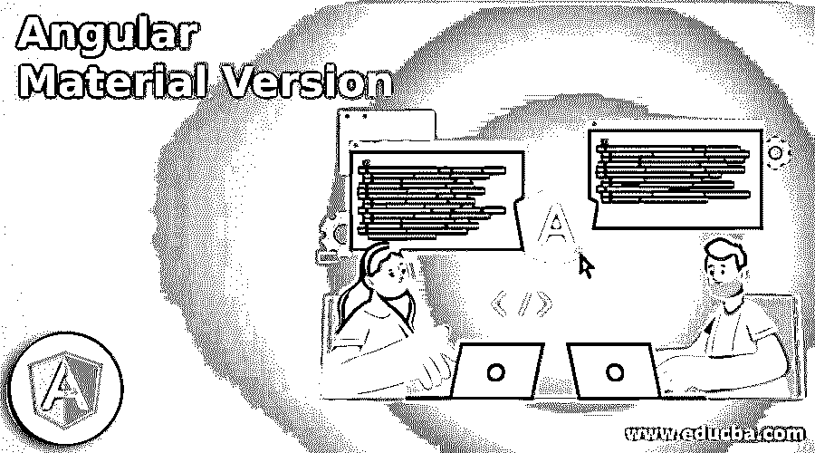

# 棱角材质版本

> 原文：<https://www.educba.com/angular-material-version/>

## 角形材料版本介绍

Angular material 是一个库，用于使用材料组件创建应用程序，这对于开发人员来说非常重要，因为素材库在官方网站上有很好的文档记录，任何初学者和有经验的开发人员都可以浏览并开始使用它。他们还根据角素材库的版本划分了功能区。我们可以很容易地选择并开始使用它。如果我们想使用任何特定版本的素材库，那么我们可以在他们的官方网站上使用“npm”下载它，他们提到了安装和开始使用它的适当命令。在这里，我们将看到素材库的版本历史，以及他们在每个版本中所做的更改，还有针对初学者的不同版本的安装命令。

### 不同角度的材料版本

正如我们已经知道的，我们有不同的材料版本可用，我们可以使用这些版本开始使用素材库开发应用程序。此外，它为我们提供了不同的组件列表，可以在应用程序中直接使用这些列表来构建任何特定类型的组件，例如按钮、图标、开关等等，具体取决于我们的需求。但是所有这些使得应用程序的开发非常快，因为我们可以直接使用它们，而不需要太多的编码。

<small>网页开发、编程语言、软件测试&其他</small>

让我们来看看素材库的不同版本历史:

#### 1.角形材料版本 5.2.2

这是我们在 angular material 官方网站上看到的最后一个版本的 material，如果你愿意，你可以开始使用这个版本。它提出了一个非常基本的组件。

*   表单控件
*   航行
*   布局
*   按钮和指示器
*   弹出窗口和模型
*   数据表

以下是在您的系统上安装该软件的步骤:

形容词（adjective 的缩写）首先去 npm 官方网站选择你想工作的版本并安装参考见下面的网址。

**网址:**【https://www.npmjs.com/package/@angular/material? T2】activeTab =版本

b.在命令提示符下执行下面的命令来安装它。

**代码:**

`npm i @angular/material@5.2.2`

#### 2.角形材料版本 6.4.7

这是角素材库官网上列出的第二个版本。

**网址:**【https://v6.material.angular.io/components/categories T2】

下面列出了一些改进和功能:

*   向巴泽尔引入持续迁移
*   此外，他们还对 cdk 文档进行了改进
*   我们可以找到新的 cdk 或集合指令
*   虚拟滚动
*   拖放
*   提高可访问性，代码健康，以及更多的总线修复

它包含了前一版本的所有组件，但也包含了这个版本的许多改进和错误修复。

#### 3.角形材料版本 7.3.7

这是 7.XX 系列 angular material 在其官方网站上列出的第三个版本。作为参考，请找到其官方网站的 URL，查看详细的组件，并根据他们拥有的文档开始使用它们。

**网址:**【https://v7.material.angular.io/ T2】

我们可以从 npm 官方网站使用下面的命令来安装这个特定的版本，下面可以执行这个命令来安装这个特定的版本。

**代码:**

`npm i @angular/material@7.3.7`

下面是此版本引入的一些改进和功能列表。

*   他们提出了高级的表格改进，包括行内编辑、列大小调整和选择指令
*   还要修复 bug
*   改进自动化工具和自己的构建
*   与 MDC web 团队合作制定计划

#### 4.角形材料版本 8.2.3

这是 angular material library 上列出的第四个版本，再次进行了一些改进和 bug 修复。作为参考，请参见下面的角度材料文档的 URL，如果您愿意，它将帮助您使用此版本构建您的应用程序。他们有很好的文档来理解它的用法。

**网址:**【https://v8.material.angular.io/ T2】

要安装这个特定的版本，请遵循下面的命令，或者去 npm 官方网站查看所有可用的版本。

**代码:**

`npm i @angular/material@8.2.3`

下面是这个特定版本的一些特性、改进和错误修复。

*   计划把他们的建筑从 gulp 改成 bazel
*   创建和使用新的 API 兼容版本的素材库，它可以由 MDC web 提供支持
*   由于性能问题和改进，他们不再使用 tslint，转而使用 ng-update
*   工作、创建和改进线束基础设施

#### 5.角形材料版本 9.2.4

这是 angular material library 上列出的第四个版本，再次进行了一些改进和 bug 修复。作为参考，请参见下面的角度材料文档的 URL，如果您愿意，它将帮助您使用此版本构建您的应用程序。他们有很好的文档来理解它的用法。

**网址:**【https://v9.material.angular.io/ T2】

要安装这个特定的版本，请遵循下面的命令，或者去 npm 官方网站查看所有可用的版本。

**代码:**

`npm i @angular/material@9.2.4`

下面是这个特定版本的一些特性、改进和错误修复。

*   API 兼容，将继续与此版本兼容，并由 MDC 提供支持
*   使用日期范围选择器
*   继续改进线束基础设施

### 结论

我们看到的最新版本是 12.1.XX，对于素材库，所有关于其设置的所需文档都已经可用，我们可以从素材库开始使用，因为它非常易于使用和维护，并提供了所有所需的功能和组件，可用于非常快速地开发应用程序，而无需为开发人员带来太多麻烦。

### 推荐文章

这是一个有角度的材料版本指南。这里我们分别讨论引言和不同角度的材料版本。您也可以看看以下文章，了解更多信息–

1.  [AngularJS ng 级](https://www.educba.com/angularjs-ng-class/)
2.  [角度 CLI](https://www.educba.com/angular-cli/)
3.  [角度日期过滤器](https://www.educba.com/angularjs-date-filter/)
4.  [角度 7 形式验证](https://www.educba.com/angular-7-form-validations/)

