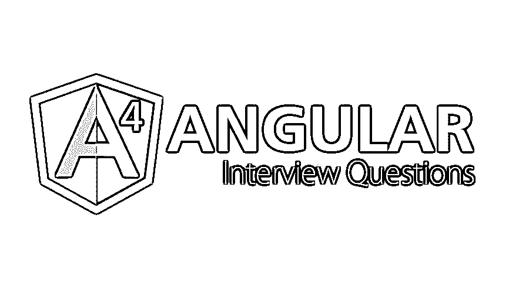

# 有角度的 4 个面试问题

> 原文：<https://www.educba.com/angular-4-interview-questions/>

## Angular 4 面试问答介绍

Angular JS 是一个基于 JavaScript 的 web 应用程序框架，它是基于 MVW(无论什么模型视图)的设计模式。angular JS 框架是 Google 开发的。它最初发布于 2010 年。它是在麻省理工学院的许可下授权的。它完全是用 JavaScript 编写的。Angular 4 版本于 2017 年发布。angular 框架主要基于 Typescript。
Angular 4 紧接着 Angular 2 而不是 Angular 3 发布，具有主要功能，是一个突破性的版本。它支持跨平台，在 web 应用开发中可以用来开发单页面应用。

现在，如果你正在寻找一份与 Angular 4 相关的工作，那么你需要准备 2022 Angular 4 面试问题。的确，每个面试都因不同的职位而不同。在这里，我们准备了四个重要的面试问题和答案，它们将帮助你在面试中取得成功。

<small>网页开发、编程语言、软件测试&其他</small>

以下是面试中经常被问到的 10 个重要的 2022 Angular 4 面试问题和答案。这些问题分为以下两部分:

### 第 1 部分-角度 4 面试问题(基础)

第一部分包括基本的面试问题和答案

#### 1.什么是绑定以及 Angular 4 中不同类型的绑定？

**答案:**
Angular 4 中绑定的过程是在应用中不同层的视图和模型组件之间建立同步的过程。从 Angular 2 开始，数据绑定的特性就可用了。不同种类的绑定是双向绑定、事件绑定和属性绑定。这种数据绑定是角度组件中的一个重要且关键的因素。双向绑定是事件绑定和属性绑定功能的组合，其中事件绑定被定义为将变量或属性的值从视图组件层更新到模型组件层的过程，而属性绑定被定义为更新模型组件中的变量或属性并在视图组件中显示这些值的过程。

#### 2.Angular 4 中的组件和指令有什么区别？

**答案:**
Angular 4 中的组件定义为与 HTML 文件或 UI 元素等网页组件交互的基本类。组件将被定义为使用装饰器的组件。每个组件都将被指定一个预定义的模板。可以使用 Angular 指令定义一个类，使其成为一个可以在运行时通过处理和实例化来使用的指令。

#### 3.什么是 Typescript，它将如何在 Angular 4 中发挥作用？

**答案:**
Typescript 是微软开发的通用编程语言，也是 JavaScript 编程语言的超集。Angular 4 框架完全建立在 Typescript 语言之上。Typescript 是 Angular 使用的主要语言，Angular 被视为一等公民。Typescript 可用于开发 Angular 应用程序，代码将在稍后使用 transpilers 进行传输，以支持多个或不同版本的浏览器平台。

#### 4.Angular 4 中有哪些组件？

**答案:**
这是面试中常见的有棱角的 4 个面试问题。Angular 4 中的组件被定义为与网页组件(如 HTML 文件)交互的基本类。组件将被定义为使用装饰器的组件。每个组件都将被指定一个预定义的模板。可以使用@Component 定义一个组件，它被称为装饰器。选择器、样式和模板可以在组件内部定义，以实现进一步的功能。

#### 5.Angular 4 中有哪些模块？

**答:**
Angular 中的一个模块被定义为一个文件，所有的指令、组件、管道和服务被分组并链接在一起，使其成为一个完美的工作 Angular 应用程序。每个 Angular 应用程序都有一个根模块，它将在 app.module.ts 中定义，这是一种类型脚本文件格式。要在 Angular 4 中定义模块，可以使用 NgModule。

### 第 2 部分-角度 4 面试问题(高级)

现在让我们来看看高级面试问题。

#### 6.Angular 4 中的路由是什么？

**答案:**
[角度应用中的路由](https://www.educba.com/what-is-routing/)是将路由应用到不同组件的过程，以显示主要在单页面应用中定义的组件内容。这个路由配置可以在根 AppModule 中定义。Angular 中的路由器功能使用户能够在执行多种功能的同时从一个任务导航到不同的其他任务。通过将 URL 映射到不同的组件，路由被定义为应用程序。

#### 7.Angular 4 中有哪些指令？

**回答:**
Angular 4 中的指令可以定义为扩展的 HTML 属性，可以定义为[自定义属性](https://www.educba.com/c-sharp-custom-attribute/)。Angular 4 中的指令可以是预定义的，也可以是自定义的，以操作 DOM 元素的功能。在 Angular 4 中有三种不同的指令，它们是组件、结构指令和属性指令。组件只是带有模板的指令。结构指令被定义为通过添加或删除 DOM 元素来改变 DOM 结构。属性指令被定义为对组件、元素或任何其他指令的行为的修改。

#### 8.Angular 4 中的孤立单元测试是什么？

**答案:**
这是面试中常见的棱角分明的 4 个面试问题。隔离单元测试被定义为以隔离的方式对组件或类执行测试的过程，而不是与其他组件建立任何依赖关系。这意味着测试将基于每一个独立的组件和元素孤立地进行。独立单元测试在测试角服务和管道时非常有用。在 Angular 中开发管道的过程需要仔细测试，以便在模型和视图组件之间产生有效的数据操作，管道在显示之前将被转换为不同的类型。

#### 9.Angular 4 中有哪些服务？

**答案:**
Angular 中的服务定义为在一个组件中使用其他组件的核心功能的过程。需要跨不同组件使用的数据连接等应用程序可以通过使用 Angular 4 中的服务来实现。通过使用服务建立从模型到视图或从视图到模型呈现数据的过程。服务是在互不了解的不同类之间应用通信的最佳方式。

#### 10.Angular 4 中的依赖注入(DI)是什么？

**答案:**
Angular 4 中的依赖注入定义为隔离不同组件间的依赖和紧耦合的过程。这将保存其他组件中组件的依赖关系。角度依赖注入是创建依赖于其他对象的对象的方法。其他组件的实例将使用注射特征创建或注射到另一个组件中。

### 推荐文章

这是一个有角度的 4 个面试问题和答案列表的指南，以便候选人可以轻松地解决这些面试问题。在这篇文章中，我们研究了面试中经常被问到的四个面试问题。您也可以阅读以下文章，了解更多信息——

1.  [棱角 2 面试问题](https://www.educba.com/angular-2-interview-questions/)
2.  [棱角分明的 JS 面试问题](https://www.educba.com/angular-js-interview-questions/)
3.  [Java EE 面试问题](https://www.educba.com/java-ee-interview-questions/)
4.  [Junit 面试问题](https://www.educba.com/junit-interview-questions/)

