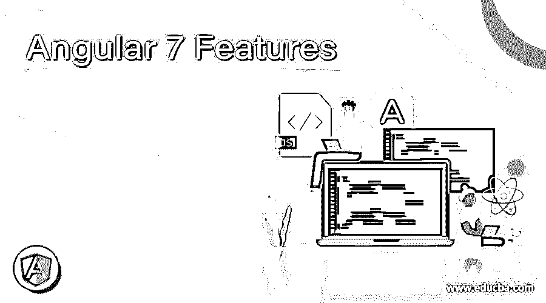

# 角度 7 特征

> 原文：<https://www.educba.com/angular-7-features/>

## 角度 7 特征的定义

Angular 7 是 Angular 的主要版本之一，因为它提供了一整套令人兴奋的新功能，改进了性能和错误处理。这是许多开发网络应用程序的公司最期待的版本。这次版本升级主要集中在 Ivy 项目上，该项目重写了编译器和运行时代码，使 Angular 成为一个更好的框架

### Angular 7 的特点

1.  应用程序性能提高
2.  CLI 提示
3.  新角度编译器
4.  拖放
5.  节点 v10 支持
6.  增强的错误处理
7.  虚拟滚动
8.  棱角分明的材料& CDK
9.  捆绑预算
10.  相关性更新

让我们详细讨论一下 Angular 7 的特点。

<small>网页开发、编程语言、软件测试&其他</small>

#### 1.应用程序性能提高

Google 的 Angular 开发团队发现了一个问题，不需要的文件反射-元数据也被添加到生产中，而理想情况下只有在开发时才需要。因此，旧版本的 Angular 比 Angular 7 慢。已通过从 polyfill.ts 文件中自动移除此文件并仅在构建步骤中添加此文件修复了此问题。这样 Angular 7 据说性能更好更高效。

#### 2.CLI 提示符

顾名思义，在 Angular 7 中，Angular CLI 不仅仅是一个公共的命令行界面，还会提示开发人员获取各种输入，如要使用的主题、路由等。Angular 7 升级为使用 CLI 7 . 0 . 2 版。当开发人员试图运行类似 ng add @angular/material，ng new 这样的命令时，这是非常有用的，他们会被提示一些问题，以根据需求下载确切的材料。

#### 3.新角度编译器

angular 7 推出了新编译器的一个特性，这个新编译器在 Angular 中被称为 Angular 兼容性编译器(ngcc)。角度兼容性编译器(ngcc)编译器能够使用提前编译(AOT)在 8 阶段旋转中运行。角度兼容编译器 ngcc 工具将非 ivy 编译器编译的 node_module 转换为 ivy 兼容格式。通过这种方法，Angular 7 应用程序可以实现束尺寸的大幅缩减(高达 95-99%)

#### 4.拖放

为 Angular 7 开发人员提供拖放界面，以便轻松管理和处理元素列表。这个新功能将基本上允许开发人员使用组件开发工具包 CDK 自动渲染和重新渲染的项目/元素列表。此功能还支持自定义拖动选项、自由拖动、动画、占位符、预览等。所有这些都是通过 CDK 拖放功能实现的

#### 5.节点版本 10 支持

angular 7 的另一个重要特性和增强是，它提供了与 node version 10 的向后兼容性，node version 10 有更多的附加功能和好处。与此同时，angular 7 将一如既往地继续支持节点版本 8

#### 6.增强的错误处理

Angular 7 在错误处理方面有了很大的改进和提高

#### 7.虚拟滚动

虚拟滚动是对现有滚动效果的补充。众所周知，旧版本的 Angular 也有这种滚动功能，但 Angular 7 不仅有滚动功能，还有虚拟滚动功能。当有一个巨大的元素列表，并且开发人员需要根据 DOM 中数据的可见性从 DOM 中加载和卸载数据时，虚拟滚动就出现了。因此，虚拟滚动通过允许应用程序容器的高度与尚未呈现的剩余数据的高度相同来提高应用程序性能。使用虚拟滚动，仅呈现视图中的可见项目，这提供了更快的最终用户体验。

#### 8.角形材料和组件开发套件

随着 Angular 7 版本的发布，Angular 材质也进行了一些小的更新。与 Angular Material 和组件开发工具包一起更新的功能有刷新功能、数据的动态加载和卸载、虚拟滚动效果、CDK 的拖放功能，以及 Angular 7 版本中添加的更多功能

#### 9.捆绑预算

Angular 7 提供了一个新特性来管理 Angular 应用程序的包限制。早期版本的 Angular 将包限制设置为默认值，并且不具备更新功能。截至目前，随着新的 Angular 7 发布，其捆绑包大小的预算限制范围可以从下限到 2MB，上限为 5MB。现在可以根据开发人员的要求更改这些设置了。需要注意的是，每当应用程序达到或超过 5MB 的预算上限时，应用程序就会抛出一个错误。此功能还提高了角度应用的性能

#### 10.相关性更新

Angular 7 提供了对许多更高级的依赖项的支持。

**TypeScript 3.1**–Angular 中支持的 TypeScript 版本已从 2.7 更新到 3.1，当您的应用程序使用 Angular 7 时，也必须使用该版本

**RxJs 6.3**–RxJs 最新的激动人心的功能现在可以用于 Angular 7

此外，角形材料和角形核心模块也进行了更新。

### 结论

Angular 7 是主要版本之一，它提供了许多新功能，可以在任何 Angular 应用程序中使用，从更高版本的支持到大型复杂应用程序的高效性能。Angular 7 提供了更好的性能、改进的错误处理、拖放功能、虚拟滚动、新编译器以及更多新功能。此外，它使应用程序易于构建和运行，使开发人员的工作更简单。

### 推荐文章

这是一个关于 Angular 7 特性的指南。这里我们讨论角 7 的定义和特征。您也可以看看以下文章，了解更多信息–

1.  [角度 7 分量](https://www.educba.com/angular-7-components/)
2.  [角的 ng-if](https://www.educba.com/angularjs-ng-if/)
3.  [角度日期过滤器](https://www.educba.com/angularjs-date-filter/)
4.  [AngularJS ng 级](https://www.educba.com/angularjs-ng-class/)

