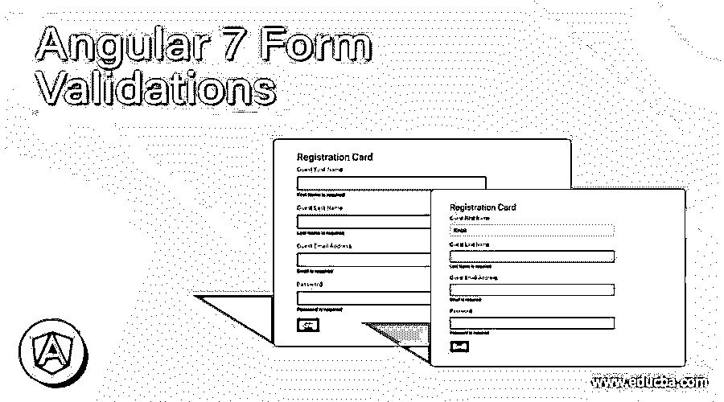
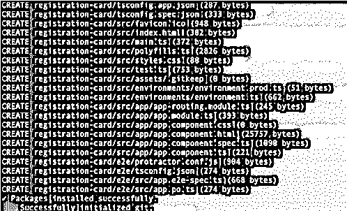
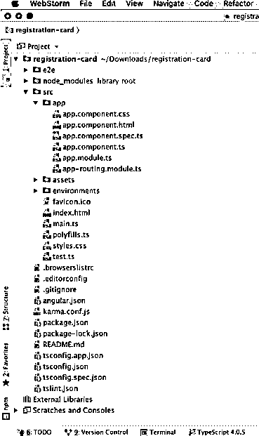
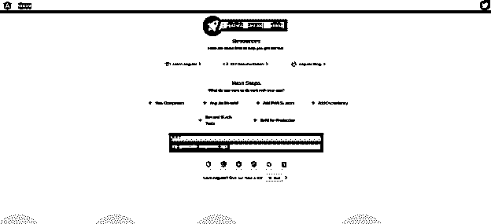
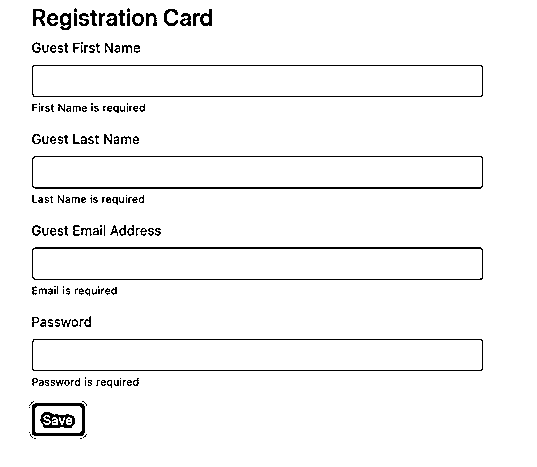
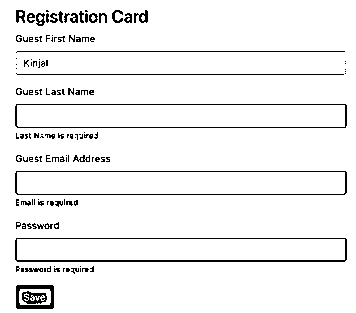
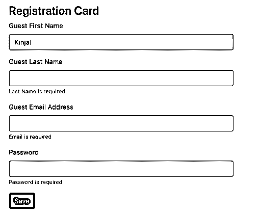
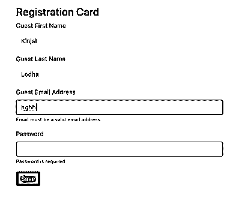
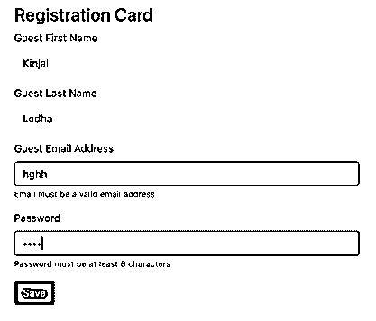
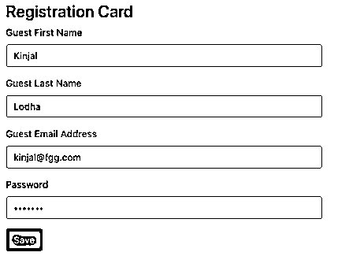

# 角度 7 形式验证

> 原文：<https://www.educba.com/angular-7-form-validations/>




## 角度 7 的定义形式验证

表单是任何应用程序的重要组成部分，在每个重要的步骤中，从注册新用户、登录应用程序、收集用户反馈等等，都会用到表单。捕捉和验证用户在这些表单上的输入以及评估数据的准确性和完整性都可以通过 Angular 7 表单来完成。Angular 7 提供了两种类型的表单验证，一种用于反应式表单，另一种用于模板驱动的表单。基于验证状态，UI 可以显示适当的用户友好的消息。

**Angular 7 中的模板驱动表单验证**

<small>网页开发、编程语言、软件测试&其他</small>

模板驱动的表单验证类似于直接在 HTML 模板中使用的 HTML 5 表单验证。表单中的输入字段有各种不同的属性。每当表单中的值发生变化时，就会触发角度验证器，进而为表单中的每个输入字段生成一个验证结果列表。验证结果可以是无效、有效或空状态的列表。

**角度 7 中的反应形式验证**

反应式表单通过组件类很有用，而不是通过属性在 HTML 模板中使用。每当控件的值改变时，Angular 调用组件类内部的函数来重新验证字段。

表单控件中使用的验证器函数有两种类型，同步的和异步的。

**同步**–同步验证器总是作为表单控件中的第二个参数传递。它接受表单控件实例，并立即返回验证结果。这可以是一个验证器列表。

**异步**–异步验证器总是作为表单控件中的第一个参数传递。它采用控制实例的形式，并返回一个发出一组验证结果的承诺或可观察值。这可以是一个验证器列表。

### 在 Angular 7 应用中使用反应式表单的步骤


*   第一步是使用 Angular CLI 从头开始创建一个 Angular 应用程序

此命令将在您的系统上安装 angular CLI，以便您可以进一步使用它从头开始构建 angular 应用程序





*   下面显示的下一个命令帮助开发人员从头开始创建一个 angular 应用程序，该应用程序的名称是 registration-card
*   现在我们将导航到注册卡文件夹，下面是代码的结构




*   为了测试基本设置是否良好，应用程序是否在本地主机上启动，让我们在本地运行应用程序


*   打开任何浏览器(Chrome/IE/firefox ),浏览本地主机 url，检查应用程序是否正在加载 http://localhost:4200/




*   要使用 ReactiveFormsModule，我们需要在 module.ts 中导入此角度模块。这是所有模块都应注入的位置，否则应用程序将无法使用 ReactiveFormsModule 功能。

**应用模块 ts**

```
import { BrowserModule } from '@angular/platform-browser';
import { NgModule } from '@angular/core';
import { AppRoutingModule } from './app-routing.module';
import { AppComponent } from './app.component';
import { ReactiveFormsModule } from '@angular/forms';
@NgModule({
declarations: [
AppComponent
],
imports: [
BrowserModule,
AppRoutingModule,
ReactiveFormsModule
],
providers: [],
bootstrap: [AppComponent]
})
export class AppModule { }
```

我们已从@angular/forms 模块导入了 ReactiveFormsModule。

*   下一步是在 app.component.ts 文件中使用表单验证器和表单生成器

**FormBuilder**–来自 **@angular/forms** 的 FormBuilder 组件为开发人员提供了创建 Form builder 实例的能力，该实例允许我们对表单中需要的所有字段进行分组。

**表单组**–表单组组件由 **@angular/forms** 提供，使用【表单组】指令与 app.component.html 的模板绑定。这将是可在 component.ts 文件中使用的表单的名称。

**验证器**——验证器由**提供，@angular/forms** 附带了很多验证属性，可以在 app.component.ts 文件中对表单内的每个字段进行指定。

**app.component.ts**

```
import { Component, OnInit } from '@angular/core';
import { FormGroup, FormBuilder, Validators } from '@angular/forms';
@Component({
selector: 'app-root',
templateUrl: './app.component.html',
styleUrls: ['./app.component.css']
})
export class AppComponent implements OnInit{
title = 'registration-card';
registrationCard: FormGroup;
isFormSaved = false;
constructor(private formBuilder: FormBuilder) {}
ngOnInit() {
this.registrationCard = this.formBuilder.group({
guestFName: ['', Validators.*required*],
guestLName: ['', Validators.*required*],
emailAddress: ['', [Validators.*required*, Validators.*email*]],
password: ['', [Validators.*required*, Validators.*minLength*(6)]]
}, {
// Custom Validators can be added here
});
}
saveCardDetails() {
this.isFormSaved = true;
// If Registration Card encounters any erros in any of the input fields
if (this.registrationCard.invalid) {
return;
}
console.log(' Form has Been Saved Successfully');
}
get regCard() {
// Using getter to track the form object and use it directly in template with the alias name as regCard
return this.registrationCard.controls;
}
}
```

在上面的示例中，我们创建了一个名为 FormBuilder 的 formbuilder 组件实例。formGroup 指令被分配给可以在模板中进一步使用的注册卡。

这个 app.component.ts 中编写的下一个重要行是对表单的所有输入字段进行分组。这是通过调用 formBuilder.group 方法来完成的，该方法采用第一个参数，即具有键-值对的输入字段列表，其中键是输入字段名称，值是需要应用于该特定字段的验证器列表。

**例如**

```
password: ['', [Validators.required, Validators.minLength(6)]]
```

formBuilder.group 的第二个参数是可以在 helper 文件中定义的自定义验证器的列表。

*   在 angular 7 应用程序中使用反应式表单的最后一步是修改模板文件，以使用适当的指令并与组件交互。

**app.component.html**

```
<div class="container">
<div class="row">
<div class="col-md-6 offset-md-3">
<h3>Registration Card</h3>
<form [formGroup]="registrationCard" (ngSubmit)="saveCardDetails()">
<div class="form-group">
<label>Guest First Name</label>
<input type="text" formControlName="guestFName" class="form-control" [ngClass]="{ 'is-invalid': isFormSaved && regCard.guestFName.errors }" />
<div *ngIf="isFormSaved && regCard.guestFName.errors" class="invalid-feedback">
<div *ngIf="regCard.guestFName.errors.required">First Name is required</div>
</div>
</div>
<div class="form-group">
<label>Guest Last Name</label>
<input type="text" formControlName="guestLName" class="form-control" [ngClass]="{ 'is-invalid': isFormSaved && regCard.guestLName.errors }" />
<div *ngIf="isFormSaved && regCard.guestLName.errors" class="invalid-feedback">
<div *ngIf="regCard.guestLName.errors.required">Last Name is required</div>
</div>
</div>
<div class="form-group">
<label>Guest Email Address</label>
<input type="text" formControlName="emailAddress" class="form-control" [ngClass]="{ 'is-invalid': isFormSaved && regCard.emailAddress.errors }" />
<div *ngIf="isFormSaved && regCard.emailAddress.errors" class="invalid-feedback">
<div *ngIf="regCard.emailAddress.errors.required">Email is required</div>
<div *ngIf="regCard.emailAddress.errors.email">Email must be a valid email address</div>
</div>
</div>
<div class="form-group">
<label>Password</label>
<input type="password" formControlName="password" class="form-control" [ngClass]="{ 'is-invalid': isFormSaved && regCard.password.errors }" />
<div *ngIf="isFormSaved && regCard.password.errors" class="invalid-feedback">
<div *ngIf="regCard.password.errors.required">Password is required</div>
<div *ngIf="regCard.password.errors.minlength">Password must be at least 6 characters</div>
</div>
</div>
<div class="form-group">
<button class="btn btn-primary">Save</button>
</div>
</form>
</div>
</div>
</div>
```

在上面的 HTML 文件中，我们使用了:

```
[formGroup]="registrationCard"
```

这会将 forGroup 与 component 绑定在一起

```
formControlName="emailAddress"
```

这个名称稍后在组件类中用来指代验证

除此之外，如果开发人员需要添加任何额外的验证器，也可以在这里为它们编写定制逻辑。

**输出:**

1.  没有填写任何字段，请单击“保存”





2.添加客人的名字




3.未添加客人电子邮件地址




4.游客电子邮件地址已添加，但不正确




5.密码小于 6




6.所有字段都已正确添加




7.细节已保存


### 结论-角度 7 形式验证

Angular 7 表单验证非常有用，在构建用户交互式 Web 应用程序的每一个环节都会用到。Angular 7 表单验证是最简单的 HTML 5 验证方法，它使用模板驱动的验证，也可以在 Angular 应用程序中直接使用反应式表单，并验证组件类中的字段。根据需求，可以为每个输入字段使用各种内置的以及定制的验证器。通过 Angular 7 表单显示适当的用户友好的消息也是非常容易和简单的。

### 推荐文章

这是一个角度 7 形式验证的指南。在这里，我们讨论在 Angular 7 应用中使用反应式表单的定义和步骤。您也可以看看以下文章，了解更多信息–

1.  [角的 ng-if](https://www.educba.com/angularjs-ng-if/)
2.  [角度数过滤器](https://www.educba.com/angularjs-number-filter/)
3.  [角度日期过滤器](https://www.educba.com/angularjs-date-filter/)
4.  [AngularJS vs Bootstrap](https://www.educba.com/angularjs-vs-bootstrap/)


