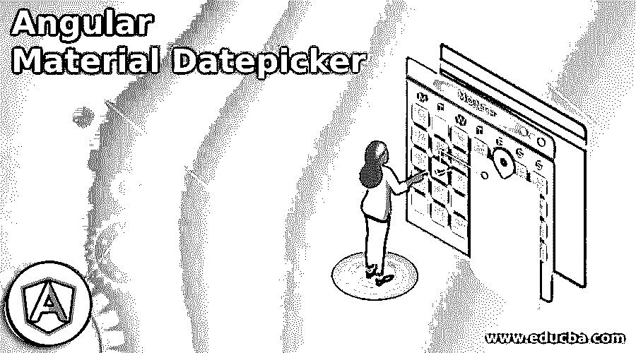
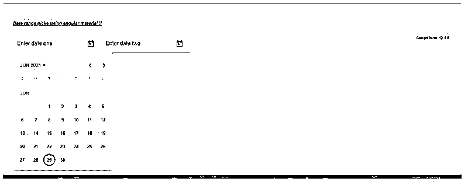

# 角度材料日期选择器

> 原文：<https://www.educba.com/angular-material-datepicker/>

## 角度材料日期选择器简介

Angular material 还为我们提供了一个最常用的功能，那就是一个日期选择器，它使得开发人员可以使用素材库来简单地使用它。以前，使用日期选择器非常耗时且困难，但通过使用素材库，我们可以直接使用它，只需使用素材库提供的简单指令。为此，我们可以使用预定义的模块提供的材料，我们只需作出小的配置，使其工作。

此外，用户可以通过文本框输入数据，也可以从日期选择器中选择日期。在这里，我们将详细了解如何使用素材库实现这一点，以及为了在我们的 angular 应用程序中正确工作，我们必须进行哪些更改和导入。

<small>网页开发、编程语言、软件测试&其他</small>

### 角度材料日期选择器的语法

为了使用它，我们将使用素材库提供的指令。

`<mat-date-range-input>
<input matStartDate placeholder=" " formControlName="start">
<input matEndDate placeholder=" " formControlName="end">
</mat-date-range-input>`

正如你在上面的语法中看到的，我们使用了“mat-date-range-input”和“matStartDate”，“matEndDate”来指定我们的开始和结束日期。

### 如何在角度素材中创建和使用 Datepicker？

现在我们已经知道了如何在 material 中创建一个 datepicker，为此我们必须对现有的 import 语句进行修改。这个日期选择器提供并允许用户在输入文件中输入日期，如果需要，他们也可以从日期选择器中选择日期。但是我们创建 datepicker 是为了减少用户的工作量，并使 UI 对用户来说更具迭代性。

在这里，我们将了解使用物料日期选择器所需的配置，以使其正常工作。

#### 1.MatDatepickerModule

这个模块需要导入到我们的应用程序中。这为我们提供了一个使用日期选择器的指令，我们也可以创建任意多的日期选择器，我们甚至可以提到日期选择器的开始日期和结束日期。下面是几行代码，我们必须将它们导入到我们的包中，为了使用 datepicker，请将相同的导入引用复制粘贴到根模块或您想要使用它的任何子模块中。

**举例:**

**代码:**

`import {MatDatepickerModule} from '@angular/material/datepicker';`

#### 2\. input[matDatepicker]

这可用于将输入连接到 datepicker，我们可以将其导出为“matDatepickerInput”。

我们对其中的一些有不同的性质，下面提到:

*   部
*   最大
*   日期过滤器
*   日期变更
*   数据输入

下面是在项目中设置角度材质的步骤:

1.首先安装 angular CLI，它使我们能够下载项目所需的包和库。

您可以通过在命令中键入以下命令来下载它，以确保您已经安装了该节点。

**举例:**

`npm install -g @angular/cli)`

上述命令将在我们的系统中全局安装 CLI，因此我们可以在需要时全局使用它。

2.现在，在这一步中，我们将尝试从头开始创建新的 angular 项目，该项目不是一个材质项目，我们稍后必须通过在项目中安装材质依赖来添加它。

因此，只需在命令提示符下执行下面的命令，然后按 enter 键，如下所示:

**举例:**

`ng new your project name
>> ng new my-first-project`

该命令将创建名为 my-first-project 的项目，您可以使用提到的任何名称创建您的项目。

3.只是为了确保尝试下面提到的一个命令，将所有需要的库安装到我们的项目中。

**举例:**

`npm install`

4.现在，您可以通过键入下面提到的简单命令来测试和运行您的项目。

这只是为了确保我们在正确的轨道上，我们的项目已经创建，没有任何错误或缺陷。

**举例:**

`ng serve`

5.进入浏览器，尝试使用下面的 URL 运行应用程序。

**举例:**

**http://localhps:4200**

默认情况下，angular project 在端口 4200 上运行，如果需要，您可以根据需要进行更改。

6.现在一切都设置好了，我们有了我们的 angular 项目，现在我们将通过在命令提示符下运行下面的命令，将素材库添加到我们的项目中。

**代码:**

`ng add @angular/material`

**例子**

**1。模块代码:**

`import {NgModule} from '@angular/core';
import {MatDatepickerModule} from '@angular/material/datepicker';
@NgModule({
exports: [
MatDatepickerModule,
] })
export class DemoDateMaterial {}`

**2。index.html 代码:**

`<!DOCTYPE html>
<html lang="en">
<head>
<meta charset="utf-8">
<meta name="viewport" content="width=device-width, initial-scale=1.0">
<link href="https://fonts.googleapis.com/icon?family=Material+Icons&display=block" rel="stylesheet">
<title>date range picker angular material</title>
</head>
<body class="mat-app-background">
<date-range-picker-demo>Loading..</date-range-picker-demo>
Current build: 12.1.0
</body>
</html>`

**3。date.demo.component.ts 代码:**

`import {Component} from '@angular/core';
import {FormGroup, FormControl} from '@angular/forms';
/** @title Date range picker comparison ranges */
@Component({
selector: 'date-range-picker-demo',
templateUrl: 'date-range-picker-demo.html',
styleUrls: ['date-range-picker-demo.css'],
})
export class DateRangeDemo {
}`

**4。HTML 或模板代码:**

`<h5><u><i>Date range picker using angular material !!</i></u></h5>
<mat-form-field appearance="fill">
<mat-label>Enter date one </mat-label>
<mat-date-range-input [rangePicker]="picker">
<input matStartDate placeholder="Start date">
<input matEndDate placeholder="End date">
</mat-date-range-input>
<mat-datepicker-toggle matSuffix [for]="picker"></mat-datepicker-toggle>
<mat-date-range-picker #picker></mat-date-range-picker>
</mat-form-field>
<mat-form-field appearance="fill">
<mat-label>Enter date two </mat-label>
<mat-date-range-input [rangePicker]="picker">
<input matStartDate placeholder="Start date">
<input matEndDate placeholder="End date">
</mat-date-range-input>
<mat-datepicker-toggle matSuffix [for]="picker"></mat-datepicker-toggle>
<mat-date-range-picker #picker></mat-date-range-picker>
</mat-form-field>`

**输出:**

### 结论

通过使用它，我们可以很容易地在 angular 应用程序中创建 datepicker。此外，它易于阅读、处理和维护，开发人员只需进行少量配置即可阅读。默认情况下，样式也是通过素材库完成的，因此我们也不需要在素材库上工作。但是如果需要，我们可以修改它。

### 推荐文章

这是一个有角度的材料日期选择器指南。这里我们讨论一下简介以及如何在 angular 素材中创建和使用 datepicker？您也可以看看以下文章，了解更多信息–

1.  [AngularJS ng 级](https://www.educba.com/angularjs-ng-class/)
2.  [角度 CLI](https://www.educba.com/angular-cli/)
3.  [角度日期过滤器](https://www.educba.com/angularjs-date-filter/)
4.  [角度 7 形式验证](https://www.educba.com/angular-7-form-validations/)

