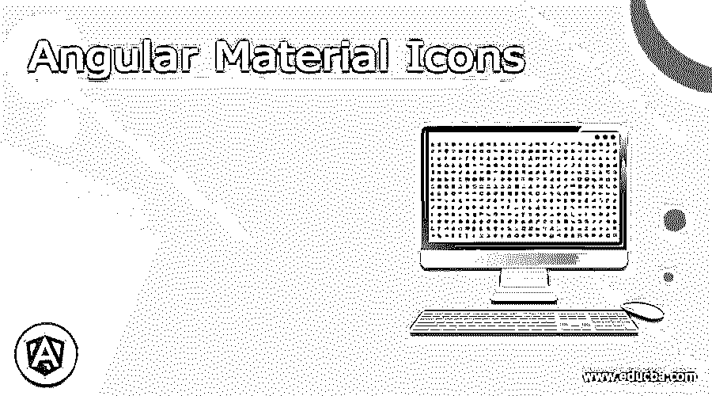
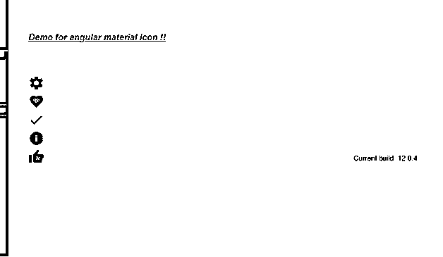

# 有角度的材料图标

> 原文：<https://www.educba.com/angular-material-icons/>




## 角形材料图标的定义

在 angular 中，我们有素材库，可以用来快速开发和设计我们的应用程序，并使用内置标签进行设计。它还为我们提供了 mat-icon，负责显示图标，它可以显示和支持两种类型的图标，即字体和 SVG，但它不支持基于位图的格式，如 png、jpg 等。我们可以在现有的 angular 应用程序中使用这个库，只需使用几个命令从 angular CLI 添加和安装这些库，这让我们很容易使用。此外，我们必须导入一些包，以便在我们的模板中使用 mat-con 指令来显示图标，在本教程的下一节中，我们将看到如何安装所需的库，以及如何实现在我们的应用程序中显示图标，以便初学者更好地理解和清楚。

**语法:**

<small>网页开发、编程语言、软件测试&其他</small>

正如我们所知，我们将使用 mat-icon 指令在 UI 上显示我们的图标，我们只需要在模板内创建这个标签，让我们仔细看看语法，以便更好地理解，见下文；

```
<mat-icon aria-hidden="false" aria-label="your label">name of your icon</mat-icon>
```

正如你在上面的例子中看到的，我们正在尝试显示我们在上面的行中提到的图标，我们只需要提到名称，它就会开始为我们工作。

为了更好地理解和清楚起见，让我们举一个实践例子，见下文；

**例如:**

```
<mat-icon aria-hidden="false" aria-label="Example home icon">favorite</mat-icon>
```

它将显示角形图标列表中名为收藏夹的图标。在接下来的部分中，我们将为初学者介绍项目中图标库的完整配置。

### 如何在有角度的素材中使用图标？

因为我们已经看到了在我们的应用程序中启用图标库的几个点。但在本节中，我们将首先了解使 angular 应用程序正常工作所需的完整配置，为了使应用程序正常工作，我们首先需要创建 angular 项目，然后我们将使用 angular CLI 中的几个命令在其中安装 angular 素材库。但首先，仔细看看材料图标的内部工作细节，所以让我们开始；

1) MatIconRegistry:首先我们有 MatIconRegistry，这是一个注册表，它是一个可注入的服务，帮助和支持我们关联图标名称和定义 CSS 的别名。我们可以把名字和 SVG、HTML 等联系起来。

2)在这个材质图标的帮助下，我们可以通过使用角度材质的 mat-icon 指令来显示字体图标或 SVG 图标。它很容易使用，但是这个指令存在于需要导入的 MatIconModule 中，否则它会给我们带来错误。

3) MatIconModule:这个模块需要导入到我们想要显示图标的项目或根模块中，它允许我们使用 mat-icon 指令在我们创建的模板上显示我们的图标。这个模块存在于“@angular/material/icon”包中。

现在，让我们从需要采取的步骤开始，以便为初学者初步加强我们的角度材料项目，见下文；

1)首先安装 angular CLI，它使我们能够下载项目所需的包和库。您可以通过在命令上键入以下命令来下载它，请确保您已经安装了 node，见下文；

**例如:**

```
npm install -g @angular/cli)
```

上述命令将在我们的系统中全局安装 CLI，因此我们可以在需要时全局使用它。

2)现在，在这一步中，我们将尝试从头开始创建新的 angular 项目，该项目将不是我们稍后必须通过在项目中安装材料依赖项来添加的材料项目。因此，只需在您的命令提示符下执行下面的命令，并按回车键，见下文；

**例如:**

```
ng new your project name
```

```
>> ng new my-first-project
```

该命令将创建名为 my-first-project 的项目，您可以使用提到的任何名称创建您的项目。

3)只是为了确保尝试下面提到的一个命令来将所有需要的库安装到我们的项目中，

**例如:**

```
npm install
```

4)现在，您可以通过键入下面提到的简单命令来测试和运行您的项目。这只是为了确保我们在正确的轨道上，我们的项目没有任何错误或缺陷。

**例如:**

```
ng serve
```

5)进入浏览器，尝试使用以下 URL 运行应用程序:

例如:

http://localhps:4200

默认情况下，angular project 在端口 4200 上运行，如果需要，您可以根据需要更改它。

6)现在一切都设置好了，我们有了我们的 angular 项目，现在我们只要在命令提示符下运行下面的命令，就可以将素材库添加到我们的项目中；

**例如:**

```
ng add @angular/material
```

### 例子

确保使用前面的步骤正确配置 angular 项目，让我们开始；

**icon-demo . component . ts:**

```
import {Component} from '@angular/core';
/**
* @title different icons
*/
@Component({
selector: 'icon-demo',
templateUrl: 'icon-demo.html',
})
export class IconDemo {}
```

**模块:ts:**

```
import {NgModule} from '@angular/core';
import {MatIconModule} from '@angular/material/icon';
@NgModule({
exports: [
MatIconModule
]
})
export class DemoIconModule {}
```

**HTML 代码:**

```
<h5><u><i>Demo for angular material icon !!</i></u></h5>
<mat-icon aria-hidden="false" aria-label="Example home icon">favourite</mat-icon>
<br/>
<mat-icon aria-hidden="false" aria-label="Example home icon">settings</mat-icon>
<br/>
<mat-icon aria-hidden="false" aria-label="Example home icon">favorite</mat-icon>
<br/>
<mat-icon aria-hidden="false" aria-label="Example home icon">done</mat-icon>
<br/>
<mat-icon aria-hidden="false" aria-label="Example home icon">info</mat-icon>
<br/>
<mat-icon aria-hidden="false" aria-label="Example home icon">thumb_up</mat-icon>
```

**index.html:**

```
<!DOCTYPE html>
<html lang="en">
<head>
<meta charset="utf-8">
<meta name="viewport" content="width=device-width, initial-scale=1.0">
<link href="https://fonts.googleapis.com/icon?family=Material+Icons&display=block" rel="stylesheet">
<title>Demo for material icon!!</title>
</head>
<body class="mat-app-background">
<icon-demo>Loading..</icon-demo>
Current build: 12.0.4
</body>
</html>
```

**输出:**




### 结论

通过使用这一点，我们可以简单容易地开始开发我们的应用程序帮助设计。只需简单地将库和模块添加到根模块中，我们就可以开始在我们的应用程序中直接使用它，这对开发人员来说也很方便。

### 推荐文章

这是一个有角度的材料图标指南。这里我们讨论一下定义，语法，如何在有角的素材中使用图标？并附有代码实现的示例。您也可以看看以下文章，了解更多信息–

1.  [角度 CLI](https://www.educba.com/angular-cli/)
2.  [角度 7 形式验证](https://www.educba.com/angular-7-form-validations/)
3.  [角度 7 特征](https://www.educba.com/angular-7-features/)
4.  [角的 ng-if](https://www.educba.com/angularjs-ng-if/)


