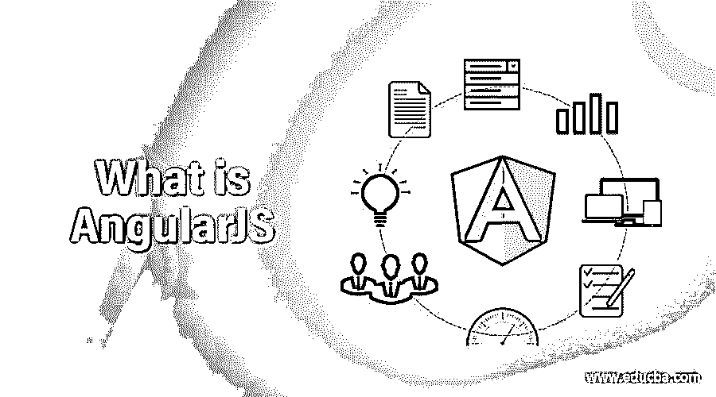
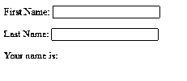

# 什么是安古拉杰

> 原文：<https://www.educba.com/what-is-angularjs/>

## AngularJS 概述

2009 年在 Brat Tech LLC，开发人员 Misko Hevery 和 Adam Abrons 开发了一个 AngularJS 框架，此后在前端开发和构建单页面应用程序方面发生了一场革命。AngularJS 是一个 javascript 框架，它将 Html 元素与 [javascript 对象](https://www.educba.com/javascript-objects/)绑定在一起。数据绑定和依赖注入是 AngularJs 的一些主要特性，它们节省了编写冗长代码的时间，使开发人员和浏览器更容易工作。这是如何实现的将被深入解释，但是你现在只需要记住这些术语。在这个主题中，我们将学习 AngularJS 版本。

**AngularJS 的版本**

<small>网页开发、编程语言、软件测试&其他</small>

AngularJS 是 Angular 1.x 版本，之后开发 Angular 2，与 Angular 1.x. works 不同。

### 为什么是 AngularJS 版本，它是如何工作的？

AngularJS 帮助我们开发交互式单页应用。单页面应用程序，我的意思是你访问的单个页面将使用 javascript 加载所有其他[内容。这个特性有助于应用程序快速有效。](https://www.educba.com/what-javascript-can-do/)

当我们使用 javascript 和 HTML 构建应用程序时，您必须使用 JS 函数和对象将视图绑定到模型。但是如果你认为这些双向数据绑定在实际的工业应用中，同样的方法会因为冗长的代码而变得乏味。这就是为什么需要学习和发展成角肌的主要原因之一。

在开始开发以 AngularJS 为基础的应用程序之前，是时候学习一些基本概念了:

*   **模型:**模型包含数据、对象、逻辑。
*   **视图:**它是应用程序的视觉呈现，也称为用户界面。
*   **查看双向绑定模型:**JavaScript 对象，即您想要绑定到 Html DOM 的对象，例如文本框、输入或任何 Html 标签，反之亦然，可以通过使用一些预定义的 AngularJS 库轻松完成。
*   **控制器:**控制器是连接模型和视图的 javascript 函数。
*   **服务:** [AngularJS 服务](https://www.educba.com/angularjs-services/)是 javascript 函数，执行由 javascript 维护和测试的特定任务或功能。服务的一些例子是$scope、$http、$rootScope。
*   **表达式:**表达式用于将数据与 Html 绑定。此功能也称为插值。表达式是用{{ expression }}花括号写的。表达式被求值，可以不用 html 标签来编写。
*   **模块:**模块作为一个容器，包含了 angular 应用程序的不同部分，如控制器、服务、指令等。

### 指令和范围

让我们关注一些预定义的指令以及它们是如何工作的。这个指令的大部分以 Angular 中的“ng”开头。

**1。范围**

*   范围定义了 javascript 对象，通过它可以从模型到 HTML 访问数据。作用域是两者之间的连接器。
*   一些作用域服务是$scope，$rootScope。$ '定义这些服务是预定义的，不能修改。记住，HTML 是不区分大小写的，但是 AngularJS 是区分大小写的，所以$Scope 会抛出一个未定义的错误。
*   要求在我们的控制器函数中声明这些，angular 会自动注入。

**2。ng-控制器**

*   该指令用于创建控制器的实例/对象，HTML DOM 将通过该实例/对象与实际逻辑进行通信。
*   HTML 表示，在创建 Html DOM 时，任何带有'-'的标签都将被忽略。
*   一旦创建了 DOM，Angular 解释器就会找到一个 ng-controller 指令，并创建一个特定控制器的实例，同时提供一个$scope 服务。
*   在一个 HTML 页面上可以有许多 ng-controller。

**3。ng-app**

*   该指令充当包含控制器、指令、过滤器、表达式等的容器。它注册或启动应用程序或模块。
*   在你的 Html 中只存在一个 ng-app。在一个 ng-app 下，可以有多个 ng-controller。

这用$rootScope 服务实例化了一个应用程序对象。

*   因此，$rootScope 变量/函数在完整的应用程序中是可访问的。

**4。ng-型号**

*   ng-model 用于将 html 中的数据绑定到模型对象。它提供双向绑定。

**5。ng-if**

*   为了在 Html 标签上执行条件语句，使用 ng-if。如果条件为假，那么 DOM 不包含 DOM 上的 div。

**6\. ng 键**

*   除了使用{{}}进行插值，还可以使用 ng-bind。

**7。ng-禁用**

*   根据条件，可以禁用视图中的元素。

**8。ng-显示**

*   如果 ng-show 的给定条件为真，那么特定元素将显示在 DOM 上。

**9。ng-隐藏**

*   如果 ng-hide 的给定条件为真，那么特定元素将在 DOM 中保持隐藏。

10。ng-重复

*   它将使用提供的数组或列表的长度重复 Html 上的特定 div 或 span。

**11。ng-click**

*   在 html 元素上的 click 事件中，它将执行提供的功能或任务。

**Note:** The best way to learn any language is to code it. So let’s see our first code.

### AngularJS 版本示例

以下是一些例子:

#### 示例#1

**代码:**

`<!DOCTYPE html>
<html>

<body>

First Name: <input type="text" ng-model="fname">

Last Name: <input type="text" ng-model="lname">

Your name is: {{ fname +" "+ lname}}

</body>
</html>`

**输出:**

上面的代码片段中有几点需要注意:

*   在第 3 行，一个 angular.min.js 文件被添加到页面中，它将加载运行 AngularJS 应用程序所需的所有库。
*   AngularJS 主要有两个库，angular.js 和这个文件的压缩版本 angular.min.js。
*   在第 5 行中，您可以看到指令为 ng-app，它在创建 Html DOM 时被 Html 忽略，并被 AngularJS 作为启动应用程序的指令之一。
*   在第 6，7 行，ng-model 用于将您将要输入到 textbox 中的文本绑定到变量 fname 和 lname。记住，这些变量是区分大小写的。
*   在第 8 行，您可以看到表达式{{fname +" "+ lname }}，angular 将计算并显示您在文本框中输入的数据。这就是所谓的插值。

#### 实施例 2

让我们再举一个例子:

**代码:**

`<!DOCTYPE html>
<html>

<body>

First Name: <input type="text" ng-model="customerName">

Last Name: <input type="text" ng-model="customerAge">

Customer name is {{ customerName }} and age is {{ customerAge}}

</body>
</html>`

**输出:**

在本例中，第 5 行创建了一个名为 CustomerApp 的应用程序，包括所有的应用程序部分。在下一行，创建了一个控制器，并命名为 firstcontroller。$scope 被声明为函数参数。AngularJS 会自动将其注入到应用程序中直接使用；开发人员不必显式地创建它。

这个特性被称为[依赖注入](https://www.educba.com/dependency-injection-in-spring/)。以类似的方式，ng-controller 用于 ng-app 标签下的同一个控制器。请记住，应用程序或控制器的范围将是 div 结束的地方或您定义应用程序或控制器的任何地方。在这种情况下，您不能在第 16 行之后访问控制器或应用程序。

### 推荐文章

这是一个什么是 AngularJS 版本的指南。这里我们讨论 AngularJS 的版本，包括指令、范围以及 AngularJS 是如何工作的。您也可以看看以下文章，了解更多信息–

1.  [AngularJS 架构](https://www.educba.com/angularjs-architecture/)
2.  [角度 JS 应用](https://www.educba.com/angular-js-application/)
3.  [角度单位测试](https://www.educba.com/angularjs-unit-testing/)
4.  [职业生涯](https://www.educba.com/career-in-angularjs/)