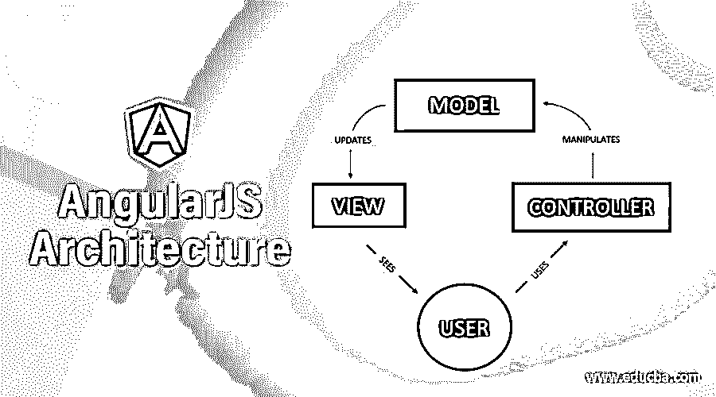
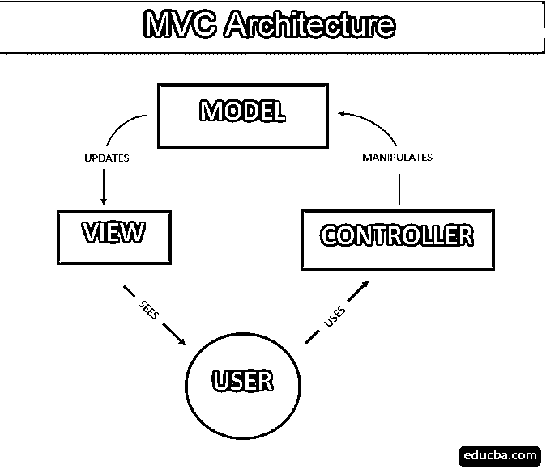

# 棱角建筑

> 原文：<https://www.educba.com/angularjs-architecture/>

## AngularJS 建筑概述

AngularJS 是一个框架，旨在将 HTML 的功能从简单的静态语言扩展到更动态的客户端数据直观语言。AngularJS 是 100% JavaScript。它有助于编写更易管理的客户端代码。它在客户端本身赋予了开发人员更多的代码控制和数据操作能力。为了实现这一点，AngularJS 有一个合适的设计模式。这被称为 MVC 模式。让我们在下一节了解更多。在本主题中，我们将学习 AngularJS 建筑**。**

### 安古拉吉斯的建筑

AngularJS 建立在 [MVC 设计模式](https://www.educba.com/what-is-mvc-design-pattern/)之上。MVC 架构背后的原则在 AngularJS 中得到了很好的体现。人们可能已经知道 MVC 是许多服务器端语言的健壮架构。AngularJS 在客户端也融合了 MVC 模式。

<small>网页开发、编程语言、软件测试&其他</small>

#### MVC——模型、视图、控制器

MVC 模式代表模型视图控制器模式。

*   **模型:**是架构的最底层。它负责保存和维护应用程序数据。数据在页面的整个生命周期中维护，有时甚至在页面之间维护。该模型基于从控制器接收的指令自我更新。

*   **视图:**视图是应用程序的正面。它是体系结构的表示层，负责向用户显示数据。它保存了任何浏览器兼容语言(通常是 HTML)的 UI 页面的完整代码。视图由其各自的控制器触发。视图根据用户与应用程序的交互向其控制器发送请求。控制器然后基于从服务器接收的响应重新生成视图。

*   **控制器:**控制器是视图和模型背后的处理大脑。它决定生成、重新生成或破坏视图和模型。所有的业务操作和代码逻辑都写在控制器内部。(一些开发人员更喜欢在模型本身中编写业务逻辑)。控制器还负责向服务器发送请求并接收响应。然后，它根据响应更新视图和模型。简而言之，控制器控制一切。

MVC 架构可以通过下图用图形表示。

MVC 是健壮的，因为它是基于关注点分离的软件开发原则的。有几个控制器操作特定的数据集并管理各自的视图和模型。因此，应用程序逻辑与用户界面层是分离的。

### 安圭拉 MVC

这都是关于 MVC 及其原则的。让我们了解一下，这些原则是如何实施的

*   **作用域****–**作用域是保存应用程序数据的模型。范围变量附加到 DOM，变量属性通过绑定来访问。
*   **带数据绑定的 HTML****–**angular js 中的视图不是常规的 HTML。它是一个数据绑定的 HTML。数据绑定有助于在 HTML 标签中呈现[动态数据。这样，模型会定期更新 DOM。](https://www.educba.com/basic-html-tags/)
*   **ng controller****–**ng controller 指令负责模型、视图和业务逻辑之间的协作。由 ngController 指令指定的控制器类控制范围和视图。

### 概念概述

好了，现在我们知道 AngularJS 是建立在 MVC 架构之上的。就这些吗？没别的事了吗？当然有。

为了理解 AngularJS 应用程序的行为，需要理解一些重要的概念。

让我们来理解他们。

*   **模板:**模板是 HTML 元素以及特定于 AngularJS 的元素和属性。AngularJS 应用程序的动态性是通过将模板与来自模型和控制器的数据相结合来实现的。

*   指令:指令是表示可重用 DOM 组件的属性或元素。指令直接操纵底层 HTML DOM 来呈现动态视图。这让开发人员不必担心原生 HTML 元素和属性。

*   **双向数据绑定:** AngularJS 通过数据绑定自动同步模型和视图之间的数据。模型被认为是应用程序数据的唯一来源。视图始终是模型的投影。模型一变，视图就变，反之亦然。这被称为双向绑定。这是通过在浏览器上实时编译模板来实现的。

*   **路由:** AngularJS 应用程序是单页面应用程序(SPA)，很多焦点放在页面之间的路由上。AngularJS 有一个健壮的路由机制，它从与组件相关联的路由器中指定的路由列表中进行 URL 匹配。这意味着每当浏览器请求 URL 时，都会呈现相关联的子组件，而不是整个页面。

*   **服务:**一个控制器与一个视图耦合。这意味着只在控制器内部编写对其视图逻辑上有用的代码是一个好习惯。独立于视图的逻辑可以移动到其他地方，以便它也可以被其他控制器重用。服务开始发挥作用了。服务将可重用的业务逻辑从视图特定的逻辑中分离出来。视图特定的逻辑驻留在特定的控制器中，而公共业务逻辑由所有控制器共享。

一般来说，访问后端数据的代码也是在服务中编写的。

*   **依赖注入:**现在我们已经将独立于视图的逻辑移动到一个共享位置，我们如何控制访问共享服务的权限？这是通过依赖注入(DI)完成的。依赖注入是一种软件设计模式，它处理如何创建对象以及它们如何获得它们的依赖关系。AngularJS 中的所有东西，从指令到控制器到服务，几乎所有东西都是通过 DI 连接的。

### AngularJS 建筑的有趣之处

AngularJS 之所以被命名为 AngularJS，是因为 HTML 标签中有尖括号。该项目旨在使 HTML 更加动态和数据友好，因此开发人员决定以 HTML 中的尖括号命名它。

### 结论

这篇文章涵盖了 AngularJS 建筑的所有重要概念。这是理解 AngularJS 应用程序各种元素工作的良好开端。下一步是创建一个功能完整的多控制器 AngularJS 应用程序，它也可以从后端获取数据。这会让你很好地实践角度的概念。

### 推荐文章

这是 AngularJS 架构的指南。这里我们讨论架构、angularJS 中的 MVC 以及概念概述。您也可以浏览我们推荐的其他文章，了解更多信息——

1.  [AngularJS 面试问题](https://www.educba.com/angularjs-interview-questions-for-experienced/)
2.  [角度动画](https://www.educba.com/angularjs-animations/)
3.  [AngularJS 中的控制器](https://www.educba.com/controllers-in-angularjs/)
4.  [角度验证](https://www.educba.com/angularjs-validation/)