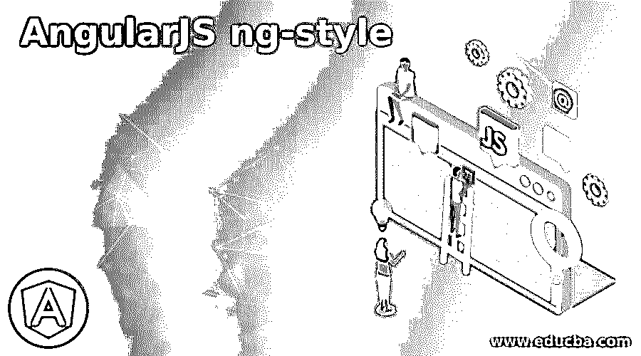
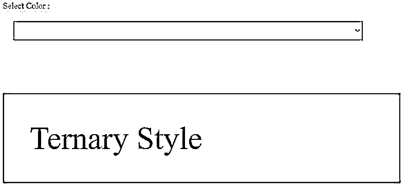
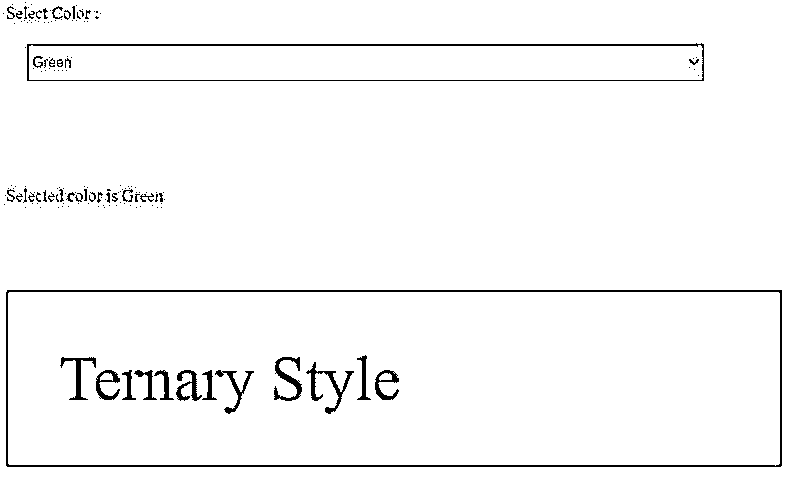
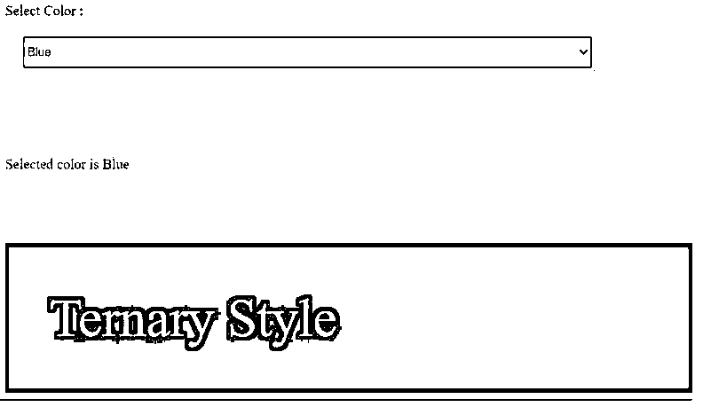

# angularjs 的 ng 风格

> 原文：<https://www.educba.com/angularjs-ng-style/>

## AngularJS ng 风格简介

AngularJS ng-style 是一个内置的 AngularJS 指令，在 HTML 视图中用于设计网页和使用可以有条件处理的 CSS 样式。每当开发人员需要根据某些条件或模型值的变化来动态处理 HTML 视图上的 CSS 样式时，就会使用该指令，并且可以在控制器中通过从 HTML 视图向控制器发出方法调用来处理该指令，其中方法名称作为 ng-style 指令的值传递。这可以用于任何 HTML 标签，如 div、span、paragraph、select、input 等。

**AngularJS ng-style 的语法**

<small>网页开发、编程语言、软件测试&其他</small>

在 HTML 标记中编写 ng 风格的指令有多种方法。

1.使用 ng-style 在控制器中进行方法调用，并在控制器中处理样式。

`

`

2.使用 ng-style 编写的另一种方法是添加条件表达式，比如二元或三元运算符。

`

`

3.在 HTML 标签中使用带有模型值的 ng 样式。

`<input ng-model=”modelValue” type=”text” place holder =”Enter width”>
`

ng-style 指令可以用于任何 HTML 元素，并且可以有条件地使用。

### ng 风格的指令在 AngularJS 中是如何工作的？

*   在 AngularJS 框架中，重要的是要知道 AngularJS 框架提供的所有内置指令都将始终用 ng 前缀表示。ng 风格的指令非常简单，在 HTML 视图中非常容易使用。该指令用于处理开发人员在向 HTML 页面添加样式时需要添加的任何条件，比如开发人员需要根据一些标准不断改变网页的颜色，如滚动效果、单击复选框、更改控制器中的某些值或控制器中的任何其他复杂逻辑，所有这些都可以通过在任何 HTML 元素中使用 ng-style 指令作为属性来解决。
*   ng-style 属性指令接受任何条件二进制或三进制表达式作为值。此外，它接受在控制器内部定义的任何方法调用，控制器可以根据需要处理它。ng-style 指令也可以用于处理基于模型值的视图和 CSS 样式，因此当模型值改变时，ng-style 将被执行并更新 CSS 样式。ng-style 指令以优先级 0 执行，在插值方面也没有什么限制。很少有 CSS 样式名对于 ng 样式的对象来说是无效的键，因此在单引号中提到 CSS 样式键是非常重要的。

### AngularJS ng 风格示例

以下是 AngularJS ng 风格的示例:

#### 示例#1

**代码:**

**Index.html**

`<!DOCTYPE html>
<html>
<head>

</head>
<body ng-app="cssStylingApp" ng-controller="cssStylingCtrl">

Select Color :

<select class="any-style-for-dropdown"
ng-options="color.key for color in colors" ng-model="selectedColor">
</select>

Selected color
is {{selectedColor.key}}

</body>
</html>`

**Script.js**

`var app = angular.module('cssStylingApp', []);
app.controller('cssStylingCtrl', function($scope) {
$scope.colors = [
{'key': 'Black', 'value': 'black'},
{'key': 'Red', 'value': 'red'},
{'key': 'Blue', 'value': 'blue'},
{'key': 'Light blue', 'value': 'cyan'},
{'key': 'Green', 'value': 'green'}];
});`

上面的例子显示了在 AngularJS HTML 视图中使用 ng-style 指令是多么容易，并且可以根据开发人员的需要调整条件。使用 select 标记将颜色列表添加到 HTML 中，并添加 ng-options 属性，其中 colors 是颜色对象的列表，每个颜色对象由键和值组成。其中 key 是颜色的名称，它应该显示在下拉菜单内的 UI 上，value 应该是 CSS 样式颜色的名称，它可以添加到 ng-style 指令内的 CSS 属性“Color”中。ng-options 的模型值由整个选定对象组成。这个模型值具有双向绑定，并作为值添加到 ng-style 指令中。现在，随着模型值的改变，ng 样式将被触发，并将更新 CSS 颜色属性。

上面使用的 ng-style 的另一个例子是在 div 块中直接使用 ng-style 来添加左边距属性。还是那句话，确保语法和上面显示的一样，CSS 属性必须在引号中定义；否则，编译根本不会准备好该属性。最后，确保在脚本标签中包含 AngularJS 依赖项，以便能够使用 AngularJS 的 ng-repeat 指令。

`
`

这里简单的样式被添加到一个 div 块中，这里使用了 CSS 属性 margin-left。同样，确保它在引号中，并且语法与上面相同。

`<select class="any-style-for-dropdown"
ng-options="color.key for color in colors" ng-model="selectedColor">
</select>`

这里我们添加了一个从控制器中选择的颜色列表。每个颜色对象由控制器中最初定义的一个键和值组成。模型值 selectedColor 将保存对应于下拉列表中所选值的整个对象，并可用于访问颜色键和颜色值。

`ng-style="{'color': selectedColor.value}">`

这里已经初始化了 ng-style 指令，并添加了 CSS 属性 color，其中该 CSS 属性的值是动态的，并将根据下拉列表中的 selectedColor 模型值进行反映。

**输出:**

**输出 1:**

**输出 2:**

**输出 3:**

<u>

</u> 

#### 实施例 2

**代码:**

**Index.html**

`<!DOCTYPE html>
<html>
<head>

</head>
<body ng-app="cssStylingApp" ng-controller="cssStylingCtrl">

Select Color :

<select class="any-style-for-dropdown"
ng-options="color.key for color in colors" ng-model="selectedColor">
</select>

Selected color
is {{selectedColor.key}}

Ternary Style

</body>
</html>`

**Script.js**

`// Code goes here
var app = angular.module('cssStylingApp', []);
app.controller('cssStylingCtrl', function($scope) {
$scope.colors = [
{'key' : 'Black', 'value' : 'black'},
{'key' : 'Red', 'value' : 'red'},
{'key' : 'Blue', 'value' : 'blue'},
{'key' : 'Light blue', 'value' : 'cyan'},
{'key' : 'Green', 'value' : 'green'}];
$scope.modifyColor = function() {
return {
'color': $scope.selectedColor.value
};
}
$scope.blueValue = {
"color" : "white",
"background-color" : "black",
"font-size" : "60px",
"padding" : "50px"
}
$scope.otherValue = {
"color" : "black",
"background-color" : "cyan",
"font-size" : "60px",
"padding" : "50px"
}
});`

上面的例子，除了 ng 风格现在作为控制器内部的一个函数被处理，而不是直接在 UI 上处理它之外，一切都和上面的一样。当需要在控制器上进行一些修改或计算时，可以使用这种方法，然后将值添加到 CSS 样式属性中。

ng 风格的另一个例子是使用三元运算符。如果在 HTML 视图中使用三元运算符，Ng-style 可以很好地工作。这里我们根据三元运算符中的条件修改背景颜色。

`ng-style="modifyColor()"`

进行控制器中定义的函数调用。这个方法应该返回 CSS 属性。

`ng-style="selectedColor.key == 'Blue' ? blueValue :
otherValue"`

使用基于所选颜色的键的条件，我们可以决定使用哪个 CSS 属性，它将相应地反映在 UI 上。

**输出:**

**输出 1:**

**输出 2:**

**输出 3:**

### 结论

ng-style 是 AngularJS 中的一个指令，它通常用于内置的 AngularJS 指令，该指令用于使用具有条件能力的 CSS 属性来设置 HTML 视图的样式。使用这个指令有多种形式，需要正确的语法，您已经准备好了。

### 推荐文章

这是一个 AngularJS ng 风格的指南。在这里我们讨论介绍，ng 风格的指令如何在 AngularJS 中工作？和示例。您也可以看看以下文章，了解更多信息–

1.  [角度引导日期选择器](https://www.educba.com/angular-bootstrap-datepicker/)
2.  [角度时间选择器](https://www.educba.com/angular-time-picker/)
3.  [角度 7 分量](https://www.educba.com/angular-7-components/)
4.  [Angular 2 架构](https://www.educba.com/angular-2-architecture/)

