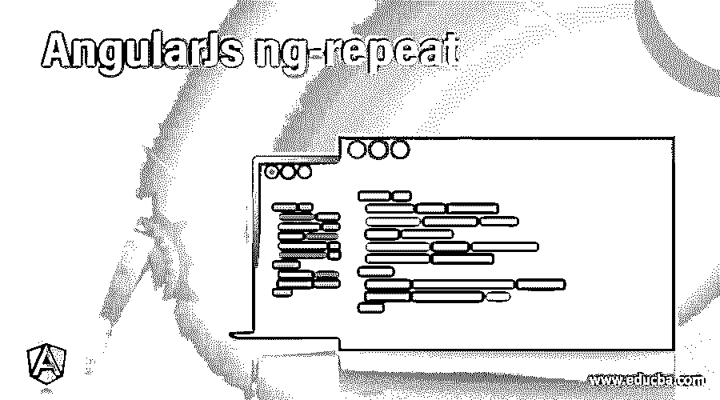
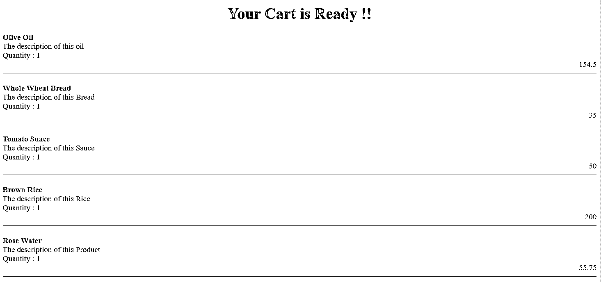

# 安圭拉的 ng-repeat

> 原文：<https://www.educba.com/angularjs-ng-repeat/>

## AngularJs ng-repeat 简介

AngularJS ng-repeat 是一个内置的 AngularJS 指令，基本上用于 HTML 视图中，以遍历 UI 上的内容列表，并在 HTML 页面中利用或显示任何特定对象或列表中每个元素的所有对象，以及任何 AngularJS 应用程序中的样式。ng-repeat 属性可以和任何元素标签一起使用，比如 div、paragraph、href 等。Html 的。

### Angular CLI 如何工作？

在 AngularJS 框架中，知道 AngularJS 框架提供的所有内置指令总是用 ng 表示是非常重要的。只要在 AngularJS 应用程序的 HTML 页面中声明了 ng-repeat 指令属性，框架就知道要做什么，因为它是内置的，定义是用 AngularJS 框架本身定义的。每次调用 ng-repeat 时，它都会为列表/集合中的每个对象初始化一个模板，每个模板元素都有自己的作用域。

<small>网页开发、编程语言、软件测试&其他</small>

可以使用 ng-repeat 标记中定义的局部变量来引用每个对象。ng-repeat 应该在任何 HTML 标记中用作属性，比如 div、paragraph、table、button、href 等。要知道列表中每个对象的索引并跟踪它，可以使用 track by $index 属性。使用 track by eachObject.id 也可以通过对象内部存在的其他 id 参数(不是$index)进行跟踪。除了$index，AngularJS 还定义了一些可以与 ng-repeat 一起使用的属性，例如

*   **$ first–**如果对象是列表中的第一个对象，将返回 true
*   如果对象是列表中的最后一个对象，**$ Last–**将返回 true
*   **$ middle–**如果对象在列表之间，将返回 true
*   **$ odd—**如果$index 的值是奇数，则返回 true
*   **$ even–**如果$index 的值是偶数，它将返回 true

ng-init 还可以与 ng-repeat 指令一起使用，这可以帮助您为列表中的每个对象添加一个额外的参数，只针对模板实例的范围。

在使用 ng-repeat 时，需要注意的是，任何以$符号开头的对象都不会被 ng-repeat 指令读取并被忽略，因为它的 AngularJS 和$是 AngularJS 用于公共或私有属性的前缀。

**举例:**

**Index.html**

`<html ng-app="myGroceryApp">
<head>

</head>
<body>
<div ng-controller='GroceriesController'>
<h1>Your Cart is Ready !!</h1>
<div class="grocery-list-class" ng-repeat="grocery in groceriesList track by $index" ng-init="quantity = 1" ng-click="viewEachGrocery(grocery)">
<div class="each-list-style">
<div class="name">{{grocery.name}}

<div class="desc">{{grocery.description}}

<div class="qunatity">Quantity : {{quantity}}

<div class="amt"> {{grocery.amount}}

</body>
</html>`

**Script.js**

`angular.module('myGroceryApp', [])
.controller('GroceriesController', function($scope) {
$scope.groceriesList = [];
var grocery1 = {"name": "Olive Oil", "description": "The description of this oil",
"amount": 154.50};
var grocery2 = {"name": "Whole Wheat Bread", "description": "The description of this Bread",
"amount": 35};
var grocery3 = {"name": "Tomato Suace", "description": "The description of this Sauce",
"amount": 50};
var grocery4 = {"name": "Brown Rice", "description": "The description of this Rice",
"amount": 200};
var grocery5 = {"name": "Rose Water", "description": "The description of this Product",
"amount": 55.75};
$scope.groceriesList.push(grocery1, grocery2, grocery3, grocery4, grocery5);
});`

在上面的例子中，我们试图使用 ng-repeat 指令在 UI 上以表格形式显示已经添加到购物车中的食品清单。

确保在脚本标签中包含 AngularJS 依赖项，以便能够使用 AngularJS 的 ng-repeat 指令。

`ng-repeat="grocery in groceriesList track by $index"`

这里的杂货是杂货列表中的每个对象，杂货列表是购物车中所有杂货的列表。我们使用 track by $index 来跟踪食品清单中的每一个食品

`ng-init="quantity = 1"`

ng-init 可用于在每个杂货店中添加任何新参数，这里我们为杂货店列表中的每个杂货店添加了默认为 1 的 quantity

`ng-click="viewEachGrocery(grocery)"`

当您需要查看杂货列表中的每个杂货细节时，可以使用该指令。函数 view each fuckage 以杂货为参数，是杂货列表的每个对象。

此外，如果我们需要使用过滤器根据金额或任何其他参数过滤元素，过滤器可以与 ng-repeat 指令一起使用，很容易过滤掉元素。

仅仅通过使用一些简单和容易的 CSS 样式，我们将能够正确地安排购物车，并在 UI 上查看内容，就像我们希望下面的上述代码的输出一样。

### 结论-角度 ng-重复

AngularJS 中的 ng-repeat 指令是非常有用的，也是使用最广泛的内置 AngularJS 指令之一，用于遍历元素列表，在 UI 上显示对象以及 CSS 样式，通过索引进行跟踪，代码非常少，易于使用和理解。知道语法是所有需要的，你已经准备好了。过滤器也可以与这个 ng-repeat 指令一起使用，以使它更有效。

### 推荐文章

这是一个角度重复的指南。这里我们讨论 Angular CLI 如何工作，AngularJs ng-repeat 的例子以及代码和输出。您也可以看看以下文章，了解更多信息–

1.  [AngularJS 货币过滤器](https://www.educba.com/angularjs-currency-filter/)
2.  [安装角度](https://www.educba.com/installing-angular/)
3.  [角滤波器](https://www.educba.com/angularjs-filters/)
4.  [Angular 2 架构](https://www.educba.com/angular-2-architecture/)

