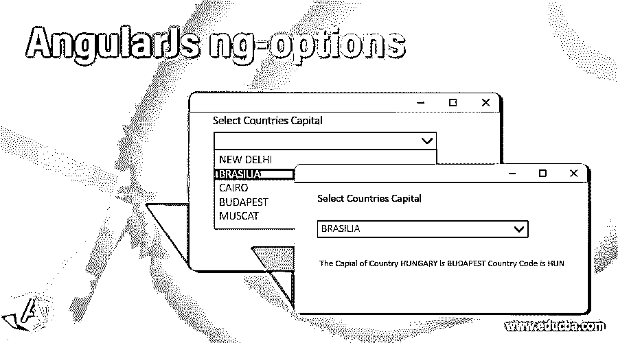

# angularjs 的 ng 选项

> 原文：<https://www.educba.com/angularjs-ng-options/>

## angular js ng-选项介绍

AngularJS ng-options 是一个内置的 AngularJS 指令，在 HTML 视图中广泛使用，用于遍历 UI 上包含对象的内容列表，并在 HTML 页面中利用或显示列表中每个元素的任何特定对象属性对象，以及 AngularJS 应用程序中的样式。例如，ng-change 属性在 UI 中与 dropdown 一起使用，并提供添加附加选项或默认选定选项值的能力。

**语法**

<small>网页开发、编程语言、软件测试&其他</small>

在 HTML select 标记中编写 ng-options 指令有多种方法

*   **利用要在 UI 上显示的对象参数**

`
Country

<select class="any-style-for-dropdown"
ng-options="country.capital for country in vm.Countries" ng-model="vm.selectedCountry">
</select>`

*   **ng-options 的另一种写法**

`
Country

<select class="any-style-for-dropdown"
ng-options="country as country.capital for country in vm.Countries" ng-model="vm.selectedCountry">
</select>`

*   **预选选项**

`
Country

<select class="any-style-for-dropdown"
ng-options="country as country.capital for country in vm.Countries" ng-model="vm.selectedCountry">
<option value="" selected>Select</option>
</select>`

ng-options 指令总是与 HTML 元素 select 一起使用，后者用于显示下拉列表中的值。

### ng-repeat 指令在 AngularJS 中是如何工作的？

在 AngularJS 框架中，知道 AngularJS 框架提供的所有内置指令总是用 ng 表示是非常重要的。

ng-options 属性总是与使用 select HTML 元素的 HTML 下拉列表一起使用。select HTML 元素接受需要在 UI 上显示的选项列表，所以现在需要在 UI 下拉列表中显示的值并不总是常量值；一些值来自一些外部服务，或者在控制器中操作它之后，我们希望在 UI 上使用对象列表，在这种情况下 ng-options 就出现了。Ng-options 允许开发人员创建一个本地对象变量，可以在 ng-options 值中使用该变量来引用列表中每个对象的特定属性。因此，如果您需要在页面加载时显示一个特定的值作为默认值，那么可以通过使用 HTML option 元素和使用所选的属性来实现。这将保持默认值被选中。

ng-init 还可以与 ng-options 指令一起使用，这可以帮助您为列表中的每个对象添加一个额外的参数，只针对模板实例的范围。

使用 ng-options 时需要注意的是，任何以$符号开头的对象都不会被 ng-options 指令读取，并且会被忽略，因为它的 AngularJS 和$是 AngularJS 用于公共或私有属性的前缀。

另外，需要注意的另一点是，ng-model 是 ng-options 无缝工作所必需的，因为这个模型值被设置为 HTML 视图中的选定值。

**举例:**

**Index.html**

`<html ng-app="countryApp">
<head>

</head>
<body>
<div ng-controller='CountryController'>
<div title="Country List">Select Countries Capital

<select class="any-style-for-dropdown"
ng-options="country.capital for country in Countries" ng-model="selectedCountry">
</select>
<div class="select-country" ng-if="selectedCountry">The Capital of Country
{{selectedCountry.name}}

is

{{selectedCountry.capital}} 
Country Code is
{{selectedCountry.code}}

</body>
</html>`

**Script.js**

`angular.module('countryApp', [])
.controller('CountryController', function($scope) {
$scope.Countries = [{
'code': 'IND',
'capital': 'NEW DELHI',
'name': 'India'
},{
'code': 'BR',
'capital': 'BRASILIA',
'name': 'BRAZIL'
},
{
'code': 'EGY',
'capital': 'CAIRO',
'name': 'EGYPT'
},
{
'code': 'HUN',
'capital': 'BUDAPEST',
'name': 'HUNGARY'
},
{
'code': 'OMN',
'capital': 'MUSCAT',
'name': 'OMAN'
}] });`

在上面的例子中，我们试图使用 select 标签在 UI 上显示一个国家首都列表，这样它将显示在下拉列表中，其中包含可用的各种国家首都，它们与国家名称和国家代码绑定在一起。我们在 select HTML 标记中添加了一个 ng-options 指令，所以只要下拉列表的值从当前的 ng-model 值更改过来，ng-model 就会获得国家对象值。这些 ng 选项将只在下拉列表中显示国家/地区的首都，尽管模型值将由所选择的条目国家/地区对象组成。此外，由于国家是代码、首都和名称的对象，所以我们显示每个国家的首都，并且在选择任何一个首都时，模型将返回整个对象，这可以进一步用于访问国家代码和国家名称。确保在脚本标签中包含 AngularJS 依赖项，以便能够使用 AngularJS 的 ng-repeat 指令。

`ng-options="country.capital for country in Countries"`

在这里，Countries 是一个国家对象的列表，国家是国家列表中的每个对象。countries.capital 将用于在 UI 的下拉列表中显示国家的人均值

`ng-model=" selectedCountry"`

模型值将保存对应于下拉列表中所选值的整个对象，并可用于访问国家名称和国家代码。

仅仅通过使用一些简单和容易的 CSS 样式，我们将能够查看上述代码的输出。

**输出:**

### 结论–角度 ng-选项

ng-options 是 AngularJS 中的一个指令，这是一个广泛使用的内置 AngularJS 指令，用于遍历包含每个元素中的对象的元素列表，并在 UI 上显示对象特定的参数以及 CSS 样式，将选定的值存储在模型变量中，代码非常少，易于使用和理解。知道语法是所有需要的，你已经准备好了。过滤器也可以与这个 ng-options 指令一起使用，以使它更有效。

### 推荐文章

这是一个 AngularJs ng 选项的指南。这里我们讨论 ng-repeat 指令如何在 AngularJS 中工作，以及示例和输出。您也可以看看以下文章，了解更多信息–

1.  [角度如何工作](https://www.educba.com/how-angular-works/)
2.  [AngularJS 货币过滤器](https://www.educba.com/angularjs-currency-filter/)
3.  [角度验证](https://www.educba.com/angularjs-validation/)
4.  [Angular 2 架构](https://www.educba.com/angular-2-architecture/)

