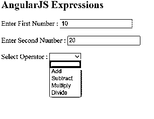
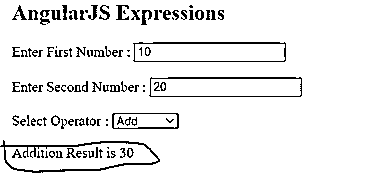
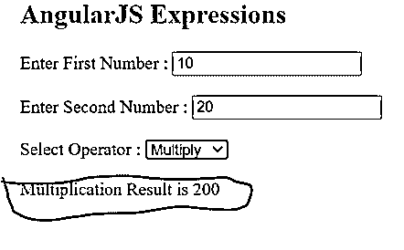
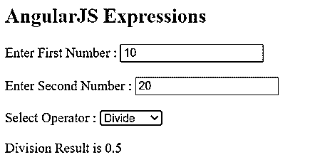
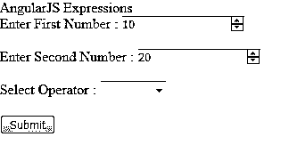
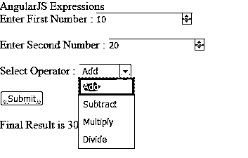
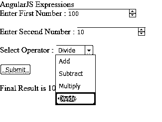

# 角度表达式

> 原文：<https://www.educba.com/angularjs-expressions/>

## AngularJs 表达式介绍

AngularJS 表达式类似于小的 JavaScript 代码，可以在 HTML 视图中使用插值(双花括号)和 AngularJS 指令作为该指令的属性来编写。AngularJS 解析这些表达式，并在编写表达式的地方准确返回结果。这些表达式可以是字符串、运算符或变量。AngularJS 表达式就像 JavaScript 表达式一样，但没有什么增强。

**语法**

<small>网页开发、编程语言、软件测试&其他</small>

在 HTML 视图中使用

**使用表达式作为运算符**

`
 AngularJS expression Example 1 : {{ 10 - 5 }} 
`

**使用表达式作为指示属性**

`<button ng-click=”expressionFunc”> AngularJS expression Example 2 </button>`

**使用表达式作为文字/变量**

`
 AngularJS expression Example 1 : {{ name + ‘ ‘ + age }} 
`

### AngularJS 中的表达式是如何工作的？

In 表达式就像 JavaScript 一样，使用插值或指令属性在 HTML 视图中直接计算小代码片段。这些表达式总是绑定到 HTML 的范围，不能在该范围之外计算。表达式可以包含文字、运算符、变量或指令属性，其中可以调用函数来计算表达式。

在复杂逻辑中使用 AngularJS 表达式的另一种方法是从 HTML 视图中调用函数，并在控制器中定义函数。$eval()方法可以直接在 HTML 视图中使用来评估你的表达式

使用表达式的另一个优点是还可以使用过滤器，可以是用户定义的过滤器或 AngularJS 内置过滤器。如果表达式求值抛出一些错误，那么 AngularJS 在内部处理它，并根据出现的错误返回 undefined 或 null。

表达式的一些限制是:

1.  AngularJS 表达式不能是任何条件语句或循环语句
2.  AngularJS 表达式不允许声明函数
3.  正则表达式不能与表达式一起使用(请改用 ng-pattern)
4.  不能在表达式内部创建新对象
5.  表达式中不能使用逗号、Void 或按位运算符

### AngularJs 表达式示例

这里我们讨论下面提到的例子

#### 示例#1

将运算符用作 AngularJS 表达式

**Index.html**

`<html ng-app="app">
<head>

</head>
<body>

<h2> AngularJS Expressions</h2>

Enter First Number : <input type="number" ng-model="firstNumber"/>
  
Enter Second Number : <input type="number" ng-model="secondNumber"/>
 
 
Select Operator : <select ng-model="selectedOp" ng-options="op for op in operators">
</select>
 

Addition Result is {{firstNumber + secondNumber}}

Subtraction Result is {{firstNumber - secondNumber}}

Multiplication Result is {{firstNumber * secondNumber}}

Division Result is {{firstNumber / secondNumber}}

 

</body>
</html>`

**Script.js**

`angular.module('app', [])
.controller('ExpressionsController', function ($scope) {
$scope.operators = ["Add", "Subtract", "Multiply", "Divide"];
});`

上面的例子显示了在 HTML 视图中使用表达式来计算操作符并在编写表达式的地方准确返回结果是多么容易。

`<input type="number" ng-model="firstNumber"/>`

这里输入类型 number 用于接受来自用户的第一个数字 first number。

`<input type="number" ng-model="secondNumber"/>`

这里输入类型 number 用于接受来自用户的第二个数字 second number。

`<select ng-model="selectedOp" ng-options="op for op in operators">`

在这里，dropdown 为用户提供了不同的操作选项，如加、减、乘、除。

`
 Addition Result is {{firstNumber + secondNumber}}` **T3】**

根据从下拉列表中选择的操作，在表达式中计算该操作。

**输出:**

**Output1:输入第一个和第二个数字**

**输出 2:选择加法运算符，检查加法结果** **lt**

**输出 3:选择乘法运算符并验证乘法结果**

**输出 4:选择除法运算符并验证除法结果**

**例 2**

将运算符用作表达式

**Index.html**

`<html ng-app="app">
<head>

</head>
<body>

<h2> AngularJS Expressions</h2>

Enter First Number : <input type="number" ng-model="firstNumber"/>
  
Enter Second Number : <input type="number" ng-model="secondNumber"/>
 
 
Select Operator : <select ng-model="selectedOp" ng-options="op for op in operators">
</select>
 
 
<button ng-click="evaluateExpression()">Submit</button>
 
 
Final Result is {{finalVal}}
 

</body>
</html>`

**Script.js**

`angular.module('app', [])
.controller('ExpressionsController', function ($scope) {
$scope.operators = ["Add", "Subtract", "Multiply", "Divide"];
$scope.evaluateExpression = function () {
if ($scope.selectedOp === 'Add') {
$scope.finalVal = $scope.firstNumber + $scope.secondNumber;
}
if ($scope.selectedOp === 'Subtract') {
$scope.finalVal = $scope.firstNumber - $scope.secondNumber;
}
if ($scope.selectedOp === 'Multiply') {
$scope.finalVal = $scope.firstNumber * $scope.secondNumber;
}
if ($scope.selectedOp === 'Divide') {
$scope.finalVal = $scope.firstNumber / $scope.secondNumber;
}
}
});`

上面的例子显示了在 directive 属性中使用表达式是多么容易，并且可以在控制器中编写复杂的逻辑，可以从 ng-click 属性的 HTML 视图中调用控制器。

`<input type="number" ng-model="firstNumber"/>`

这里输入类型 number 用于接受来自用户的第一个数字 first number。

`<input type="number" ng-model="secondNumber"/>`

这里输入类型 number 用于接受来自用户的第二个数字 second number。

`<select ng-model="selectedOp" ng-options="op for op in operators">`

在这里，dropdown 为用户提供了不同的操作选项，如加、减、乘、除。

`<button ng-click="evaluateExpression()">Submit</button>`

在这里，单击 Submit 按钮，调用在控制器中定义的 evaluate expression 函数。

**最终结果是{{finalVal}}** 

评估结果后，可以在这里看到最终值

**Output1:输入第一个和第二个数字**

**输出 2:选择加法运算符，检查加法结果**

**输出 3:选择乘法运算符并验证乘法结果**

**输出 4:选择除法运算符并验证除法结果**

### 结论

AngularJS 表达式在应用程序中非常有用，它有许多优点和缺点。它使得小脚本编码更容易，因为它可以直接在 HTML 视图中完成，并且复杂的逻辑可以在控制器中评估。有不同类型的表达式，并且总是会在应用程序中使用，所以了解它们是必须的。

### 推荐文章

这是一个角度表达的指南。在这里，我们讨论表达式如何在 AngularJS 和例子中工作，以及输出。您也可以看看以下文章，了解更多信息–

1.  [角度时间选择器](https://www.educba.com/angular-time-picker/)
2.  [角度异常-禁用](https://www.educba.com/angularjs-ng-disabled/)
3.  [AngularJS ng 级](https://www.educba.com/angularjs-ng-class/)
4.  [角滤波器](https://www.educba.com/angularjs-filters/)

