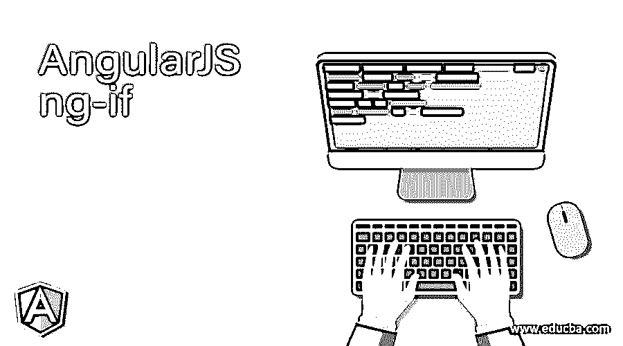
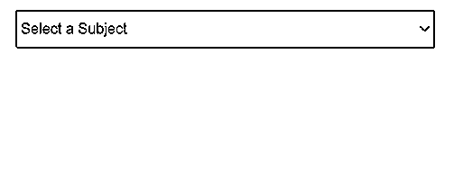

# 安圭拉的 ng-if

> 原文：<https://www.educba.com/angularjs-ng-if/>

## 角度的定义 ng-if

AngularJS ng-if 是一个内置的 AngularJS 指令，可以在 HTML 视图页面上使用，根据 ng-if 中定义的表达式的计算结果，在 HTML 视图中删除或添加特定的部分。顾名思义，如果分配给 ng-if 指令的表达式计算结果为真布尔值，那么该元素将被添加到 HTML 视图中，否则它将从 DOM 中完全删除。

**语法:**

<small>网页开发、编程语言、软件测试&其他</small>

**与输入元素一起使用**

`<input type="email" ng-if=“isValidEmail()”
ng-model="emailValue" placeholder="Enter Email id"/>`

**与选择元素一起使用**

`<select ng-model="selectedSubject" ng-if=“showDropdown()"
ng-options="subject as subject.value for subject in subjects">
<option value="" selected>Select a Subject</option>
</select>`

**与 DIV 元素一起使用**

`
This section will be displayed only if ng-if is evaluated to TRUE
`

除了这些 ng-if 指令，还可以用于输入类型电子邮件、电话、复选框、单选按钮、名称和所有类型的 HTML 标签。

### AngularJS ng-if 是如何工作的？

在 AngularJS 框架中，知道 AngularJS 框架提供的所有内置指令将总是用 ng 前缀表示是非常重要的。ng-if 指令中定义的表达式计算为布尔值，即 True 或 False，基于该值，元素显示在 HTML DOM 上。每当 ng-if 表达式求值为假值时，就从 DOM 本身中删除该元素。ng-if 和 ng-show 指令之间的一个非常重要的区别是，当 ng-if 指令的表达式求值为 FALSE 时，元素将从 DOM 本身中删除，而在 ng-show 的情况下，当表达式返回 FALSE 值时，元素将在 DOM 中隐藏，而不是使用 display hidden 的 CSS 属性删除。

需要注意的另一点是，当使用 ngIf 删除一个 HTML 元素时，它的作用域被完全破坏，当该元素恢复到视图中时，会创建一个新的作用域。该作用域继承自 ng-if 的父作用域。AngularJS ng-if 指令以优先级 600 执行，并且可以作为多元执行。

### 例子

让我们来讨论一些有棱角的例子。

#### 示例#1

**Index.html**

`<html ng-app="subjectapp">
<head>

</head>
<body>
<div ng-controller='SubjectController'>
<select class="subject-dropdown" ng-model="selectedSubject"
ng-if="onChangeOfSubjects()"
ng-options="subject as subject.value for subject in subjects">
<option value="" selected>Select a Subject</option>
</select>
<div class="text-msg" ng-if="selectedSubject">The subject selected is {{subjectValue}}
and subject Code is {{subjectCode}}

</body>
</html>`

**Script.js**

`angular.module('subjectapp', [])
.controller('SubjectController', function($scope) {
$scope.subjects = [{'key': '01', 'value': 'English'},
{'key': '02', 'value': 'History'},
{'key': '03', 'value': 'Mathematics'},
{'key': '04', 'value': 'Science'},
{'key': '05', 'value': 'French'}];
$scope.onChangeOfSubjects = onChangeOfSubjects;
function onChangeOfSubjects() {
$scope.subjectValue = $scope.selectedSubject.value;
$scope.subjectCode = $scope.selectedSubject.key;
}
});`

在上面的例子中，我们试图使用一个 select 标签在 UI 上显示一个主题列表，这样它将在下拉列表中显示各种可用的主题。在 select HTML 标记中，我们添加了 ng-if 指令，所以只要下拉列表的值从当前的 ng-model 值改变，ng-if 就会被触发。这个 ng-if 将执行相应控制器中定义的函数 onChangeOfSubjects。同样，由于 Subject 是一个键值对的对象，我们将显示所选主题的名称及其对应的主题代码。确保在脚本标记中包含 AngularJS 依赖项，以便能够使用 AngularJS 的 ng-repeat 指令。

`ng-if="onChangeOfSubjects()"`

这里 onChangeOfSubjects 方法将被执行，只要 ng-if 被触发。它可以接受任意数量的参数，我们不传递任何参数，因为我们将在控制器中使用范围模型值。

`ng-model="selectedSubject"`

如上所述，ng-if 只能与 ng-model 一起使用，所以我们在 select 中使用了 ng-model

仅仅通过使用一些简单和容易的 CSS 样式，我们将能够查看上述代码的输出。

**输出:**

#### 实施例 2

**Index.html**

`<html ng-app="emailapp">
<head>

</head>
<body>
<div ng-controller='EmailController'>
<input class="email-input" type="email"
ng-if="onChangeOfEmail()"
ng-model="emailValue" placeholder="Enter Email id"/>
<p class="text-msg" ng-if="emailValue">Email id {{emailValue}} is {{validityValue}}

</body>
</html>`

**Script.js**

`angular.module('emailapp', [])
.controller('EmailController', function($scope) {
$scope.onChangeOfEmail = onChangeOfEmail;
function onChangeOfEmail() {
var re = /^(([^<>()[\]\\.,;:\s@\"]+(\.[^<>()[\]\\.,;:\s@\"]+)*)|(\".+\"))@((\[[0-9]{1,3}\.[0-9]{1,3}\.[0-9]{1,3}\.[0-9]{1,3}\])|(([a-zA-Z\-0-9]+\.)+[a-zA-Z]{2,}))$/;
$scope.validityValue = re.test($scope.emailValue) ? 'Valid' : 'Invalid';
}
});`

在上面的例子中，我们试图使用 input 标签在 UI 上接受作为电子邮件 id 的输入，以便它将显示电子邮件 id。对于输入的 HTML 标记，我们添加了 ng-if 指令，所以只要输入了电子邮件 id 或者更改了当前的 ng-model 值，就会触发 ng-if。这个 ng-if 将执行相应控制器中定义的 onChangeOfEmail 函数。在这个控制器方法中，我们将根据定义的模式验证电子邮件 id 是否是有效的电子邮件 id。如果有效，我们将范围变量值赋为有效，如果无效，将无效字符串赋给 validityValue。确保在脚本标记中包含 AngularJS 依赖项，以便能够使用 AngularJS 的 ng-repeat 指令。

`ng-if=" onChangeOfEmail ()"`

这里 onChangeOfEmail 方法将被执行，只要 ng-if 被触发。这个方法将检查它是否是一个有效的电子邮件 id。

`ng-model=" emailValue "`

如上所述，ng-if 只能与 ng-model 一起使用，所以我们在 select 中使用了 ng-model

仅仅通过使用一些简单和容易的 CSS 样式，我们将能够查看上述代码的输出。

**输出:**

**T2】**

 **

### 结论

AngularJS 中的 ng-if 指令是另一个最受欢迎和最有用的内置 AngularJS 指令，可用于有条件地修改 HTML 视图中的元素。知道语法是所有需要的，你已经准备好了。

### 推荐文章

这是一个 AngularJS ng-if 的指南。在这里，我们还讨论了 AngularJS ng-if 的定义和如何在 AngularJS 中工作，以及不同的例子和代码实现。您也可以看看以下文章，了解更多信息–

1.  [角度数过滤器](https://www.educba.com/angularjs-number-filter/)
2.  [角度日期过滤器](https://www.educba.com/angularjs-date-filter/)
3.  [AngularJS ng 级](https://www.educba.com/angularjs-ng-class/)
4.  [角度异常-禁用](https://www.educba.com/angularjs-ng-disabled/)

**