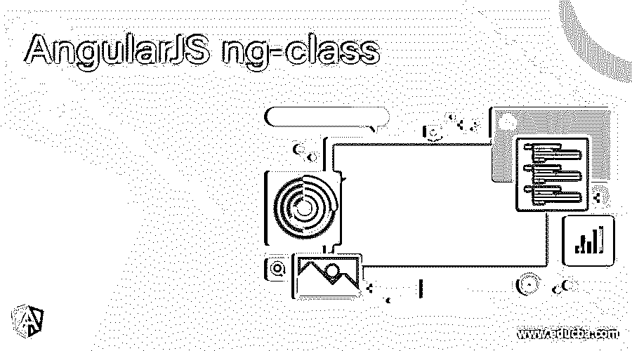
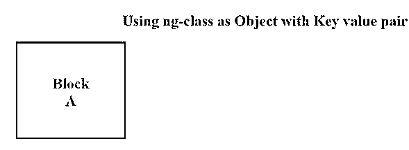
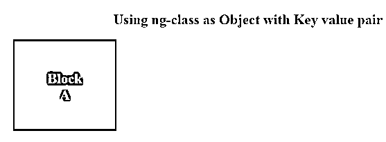
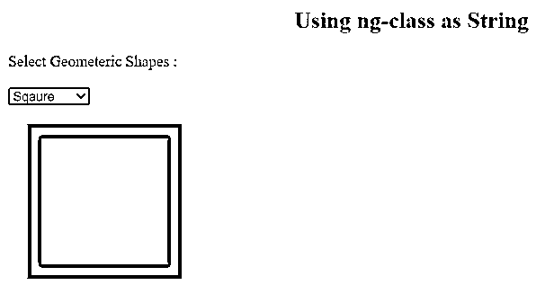
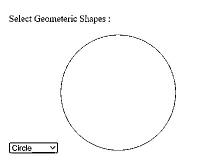
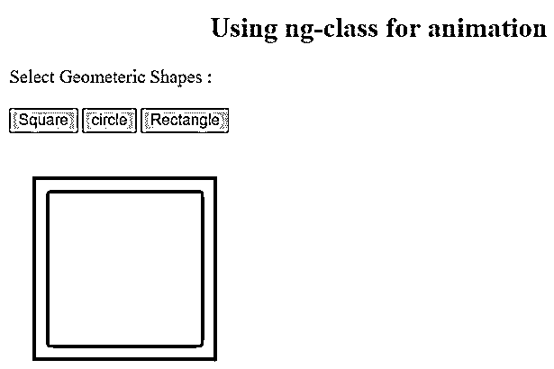

# AngularJS ng 级

> 原文：<https://www.educba.com/angularjs-ng-class/>

## AngularJS ng 类的定义

AngularJS ng-class 是一个内置的 AngularJS 指令，在 HTML 视图中用于设计网页和使用 CSS 样式，这些样式可以根据表达式的计算进行有条件的动态处理。每当开发人员需要根据某些条件动态处理 HTML 视图上的 CSS 样式，或者根据模型值动态添加 CSS 类列表，或者只是在 ng-class 指令中定义一个字符串时，就会使用该指令。这可以用于任何 HTML 标签，如 div、span、paragraph、select、input 等。AngularJS ng-class 指令不会再次添加相同的类，如果它已经被添加到 HTML 元素中。

**语法:**

<small>网页开发、编程语言、软件测试&其他</small>

在 HTML 标记中编写 ng-class 指令有多种方法。

**使用 ng-class 指令，其中表达式计算为字符串**

`

`

**使用 ng-class 编写的另一种方法是添加条件表达式，如二元或三元运算符**

`

`

**在 HTML 标签中使用 ng-class 和类数组**

`

`

ng-class 指令可以与任何 HTML 元素一起使用，并且可以作为字符串或样式数组有条件地使用。

### ng-class 指令如何在 AngularJS 中工作？

在 AngularJS 框架中，知道 AngularJS 框架提供的所有内置指令将总是用 ng 前缀表示是非常重要的。

ng-class 指令是一个非常简单并且在 HTML 视图中非常容易使用的指令。该指令用于处理开发人员在向 HTML 元素添加不同或多个 CSS 样式时需要添加的任何类型的条件，例如开发人员需要根据一些标准不断改变网页的颜色，如滚动效果、单击复选框、更改控制器中的某些值或控制器中的任何其他复杂逻辑，所有这些都可以通过在任何 HTML 元素中使用 ng-class 指令作为属性来解决。在 HTML 视图中，可以通过以下三种不同方式使用 ng-class 指令:

1.  使用带有**表达式的 ng-class 指令作为键-值对**的对象，其中键是 CSS 类名或任何 CSS 属性(如粗体、斜体),值将是表达式求值(模型值或某些条件语句),并基于值字段的真值应用相应的键
2.  将 ng-class 指令与计算结果为字符串的表达式一起使用，其中字符串可以是定义了 CSS 属性的模态值，并且可以动态添加。
3.  使用带有表达式的 ng-class 指令作为对象或字符串或两者组合的数组。这将有助于根据条件评估向 HTML 元素添加更多的类。

Ng-class 指令也可以用于处理基于模型值的视图和 CSS 样式，因此当模型值改变时，ng-class 将被执行并更新 CSS 样式。

Ng-class 指令在优先级为 0 时执行，在插值方面几乎没有限制。ng-class 指令绝对适用于 CSS 动画，并将额外的 CSS 类应用于动画的开始和结束，但这不会干扰 HTML 元素上已经存在的任何预先存在的 CSS 过渡。

### AngularJS ng-class 示例

让我们来讨论角类的例子。

#### 示例#1

**Index.html**

`<!doctype html>
<html ng-app>
<head>

</head>

<body>

<h2>Using ng-class as Object with Key value pair
<h2>

Block A

  
<h2>Using ng-class as String</h2>

Select Geometeric Shapes :

 
<select ng-model="geometricShapes">
<option value="square">Sqaure</option>
<option value="circle">Circle</option>
<option value="rectangle">Rectangle</option>
</select>

<h2>Using ng-class as Array</h2>

Select Geometeric Shapes :

 
<input type="button" value="Square" ng-click="geoShape='square'">
<input type="button" value="circle" ng-click="geoShape='circle'">
<input type="button" value="Rectangle" ng-click="geoShape='rectangle'">  

</body>
</html>`

**Script.js**

`function ngClassCtrl($scope) {
}`

上面的例子显示了在 AngularJS HTML 视图中使用 ng-class 指令有多容易，以及有多少种不同的方式，并可以根据开发人员的需要调整条件。首先，我们基于布尔变量 block 有条件地使用 ng-class 指令，根据真值，ng-class 指令将挑选 CSS 类应用于特定的 HTML 元素。

上面使用的 ng-class 的另一个例子是直接使用 ng-class 指令来计算字符串，无论在下拉列表中选择什么值，CSS 类都将应用于 HTML 元素。

ng-class 指令的最后一个例子展示了如何将动画与 ng-class 一起使用，它将按预期工作，而不会对现有的动画或 CSS 属性造成任何问题。

`
`

这里 ng-class 指令被有条件地使用，在这里点击块 **blockA** 变量变为真，一旦它变为真，CSS 类**selected-Block**就被应用到这个块，反之亦然。

`<select ng-model="geometricShapes">`

这里简单地选择 HTML 标签与 ng-model 值一起用作 **geometricShapes。**

`<option value="square">`

在 select HTML 标记中，每个选项字段由不同的形状组成，其中值为方形、圆形和矩形。因此，当下拉菜单改变时，该值将更新并存储在**几何形状**模型值中

`

`

这个 div 块用于根据从下拉列表中选择的模型值显示不同的 CSS 样式，这里 ng-class 使用了一个字符串

`<input type="button" value="Square" ng-click="geoShape='square'">`

此输入类型按钮，点击此按钮，模型值**几何形状**变为平方值。

`
`

这是一个 div 块，它将应用 CSS 类 **geoShape** 以及**动画类**中的现有动画。

**输出 1:A 块未点击时的默认状态**

**输出 2:点击模块 A**

**输出 3:下拉列表中没有选择值时的默认状态**

**输出 4:从下拉菜单中选择方块**

<u>

</u> 

**输出 5:从下拉菜单中选择圆圈**

**输出 6:应用动画前的默认状态**

**

** 

**输出 7:点击方块动画出现**

**

** 

### 结论

ng-class 是 AngularJS 中的一个指令，通常用于内置 AngularJS 指令，该指令用于使用具有条件能力的 CSS 属性设计 HTML 视图，作为 CSS 类的字符串和数组。使用这个指令有各种不同的形式，只需要正确的语法就可以了。

### 推荐文章

这是一个 AngularJS ng 级的指南。在这里，我们还将讨论 ng-class 指令的定义以及它是如何在 AngularJS？以及不同的示例及其代码实现。您也可以看看以下文章，了解更多信息–

1.  [角度异常-禁用](https://www.educba.com/angularjs-ng-disabled/)
2.  [角度时间选择器](https://www.educba.com/angular-time-picker/)
3.  [AngularJS 自定义滤镜](https://www.educba.com/angularjs-custom-filter/)
4.  [AngularJS 货币过滤器](https://www.educba.com/angularjs-currency-filter/)