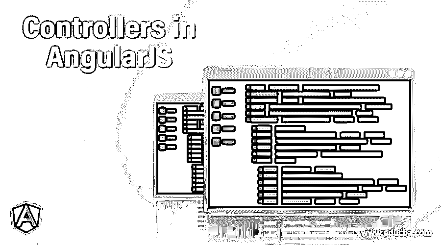
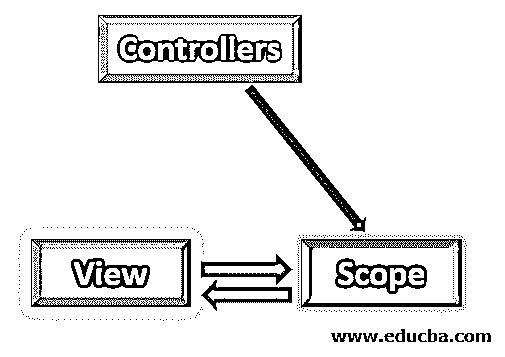

# AngularJS 控制器

> 原文：<https://www.educba.com/controllers-in-angularjs/>




## AngularJS 中的控制器简介

核心上，Controller 只不过是一个 [AngularJS 应用程序](https://www.educba.com/what-is-angularjs/)中的一个 Javascript 函数。AngularJS 框架为控制器函数附加了一些特殊的行为。这些控制器函数的特殊之处在于控制器接收$scope(一个 Javascript 对象)作为参数。控制器是 AngularJS 框架提供的 [MVC 架构](https://www.educba.com/mvc-architecture/)的基本构建块之一，它包含业务逻辑并保持视图和模型同步。




<small>网页开发、编程语言、软件测试&其他</small>

$scope 是视图和控制器之间的粘合剂。控制器有数据，它传递这些数据，并在$scope 的帮助下查看。视图是 DOM 层，控制器是 DOM 层和业务数据之间的连接线。控制器可以通过以下方式与 DOM 关联:

*   通过使用 ngController。
*   通过定义路由和相关联的。
*   控制器转换为常规控制器。

控制器主要用于设置一个初始的$scope 对象，并向$scope 添加行为。理想情况下，控制器应该是精简的，只做附加视图所需的最少的业务逻辑，保持控制器精简的一般设计方法是将公共和重复的逻辑传递给角度服务或工厂，并将这些服务注入到所有需要的控制器中。控制器上的应用程序继电器，用于数据流和视图与模型的同步。

### 在 AngularJS 应用程序中实现控制器

ng-controller 指令是将控制器附加到视图的最常见方式。Angular 提供了控制器函数来给 angular 模块添加一个控制器，这里第一个参数是控制器的名字，第二个是一个依赖项和控制器函数的数组。

这是一个创建 MyController 的示例，并将包含字符串“John”的 name 属性附加到$scope:

**代码:**

```
var firstApp = angular.module('firstApp',[]);
firstApp.controller('MyController', ['$scope', function($scope) {
$scope.name = 'John';
}]);
```

该代码片段创建一个名为 first app 的 angularJS 模块，并将一个控制器附加到名为 MyController 的模块。如上所述，MyController 接收$scope 对象并向其添加属性名称，值为“John”。

下一步，我们必须将这个控制器关联到一个视图或 HTML 片段，下面是将 MyController 附加到一个视图或 DOM 的代码示例。

**代码:**

```
<div ng-controller="MyController">
Hello, I am {{name}}
</div>
```

这个 HTML 代码片段使用 ng- controller 指令将上面示例中创建的“MyController”附加到一个视图，它还在视图/模板上呈现$scope 对象的 name 属性。

我们还可以将方法或函数附加到控制器上，并在特定事件发生时从视图或 DOM 层调用它们。

**代码:**

```
var myApp = angular.module('myApp', []);
myApp.controller('ClickController', ['$scope', function($scope) {
$scope.count = 0;
$scope.clicked = function() {
$scope.count++;
};}]);
```

该代码片段显示了如何在控制器的帮助下将方法附加到 DOM，在本例中，ClickController 单击了一个方法，该方法将$scope 对象的 count 属性加 1。

下面的 HTML 代码延续了上面的例子。

**代码:**

```
<div ng-controller="ClickController">
<button ng-click="clicked()">Click Here</button>
<p>You have clicked {{count}} times!</p>
</div>
```

在这个视图模板中，使用 ng-controller 指令将 ClickController 附加到 div，在 view 中单击按钮时，scope 对象的 count 属性增加 1，view 也相应地更新。

### 嵌套控制器

因为我们有嵌套函数，所以同样我们也可以在 AngularJS 应用程序中创建一个嵌套控制器。在嵌套控制器的情况下，子控制器总是可以访问父控制器或封闭控制器的属性和方法，但是父控制器不能访问子控制器的属性和方法。

**代码:**

```
<body ng-app="myApp">
<div ng-controller="parentController">
Message: {{parentsMessage}}
<div ng-controller="childController">
Parent Message: {{ parentsMessage}} </br>
Child Message: {{ChildsMessage}}
</div>
Child Message: {{ ChildsMessage}}
</div>
</body>
```

这是一个显示嵌套控制器的代码示例，parentController 是 child controller 的父级，两者在同一个 angular 模块中，有各自的数据和方法。子控制器将能够访问来自 parentController 的消息，并可以在 DOM 上呈现它。放置父控制器，将无法访问子控制器的属性，即 ChildMessage。

**代码:**

```
var ngApp = angular.module('myApp', []);
ngApp.controller('parentController', function ($scope) {
$scope. parentsMessage = "Hello from Parent Controller";
});
ngApp.controller('childController', function ($scope) {
$scope. ChildsMessage = " Hello from Child Controller ";
});
```

这是 ngApp 模块和模块中定义的控制器的 Javascript 代码。

即 parentController 和 childController。

### 角度控制器中的方法

如前所述，我们可以在控制器中使用方法，也可以在视图或 DOM 中传递它们，这里有一个代码示例来演示控制器中的方法以及视图模板中方法的使用。

**代码:**

```
<div ng-app="myApp" ng-controller="employeeCtrl"> First Name: <input type="text" ng-model="fName"><br> Last Name: <input type="text" ng-model="lName"><br>
<br>
Full Name: {{getFullName()}}
</div>
```

在本例中，我们将两个属性“fName”和“lName”以及一个名为 getFullName 的方法放在传递给 employee controller 的$scope 对象中。在这个模板/视图中，我们调用模板或视图中的 getFullName 方法。在这个模板 ng-model 中，angularJS 指令用于实现双向数据绑定或者将更新从视图传递到模型。

**代码:**

```
var myApp = angular.module('myApp', []); myApp.controller(‘employeeCtrl’, function($scope) {
$scope.fName = "John";
$scope.lName = "Dee";
$scope. getFullName = function() {
return $scope. fName + " " + $scope. lName;
}; });
```

这是在上面的视图中使用的控制器函数，并且使用由 employeeCtrl 向视图/DOM 公开的数据和方法。这段代码展示了我们如何定义控制器，上面的代码片段展示了如何在视图中使用它。

### 具有依赖性的控制器

在现实世界的应用程序中，大多数时候控制器会有额外的依赖项，下面是演示我们如何创建一个控制器并将额外的依赖项注入其中的代码片段。

**代码:**

```
Var myApp = angular.module('myApp',['ui.client, 'ngEmp']); App.controller('myController', ['$log', '$location', function($log, $location, $scope)
{
$scope.name =”John”;
$scope.sayHello = function(){alert('say hello');}
$log.log('I am using log service');
$location.path("/myPath")
}]);
```

在本例中，myController 具有额外的依赖项，即位置和日志服务，这些依赖项被添加到一个数组中，然后添加到控制器功能中，最后，这些服务在控制器中用于日志记录和导航。

### 推荐文章

这是 AngularJS 中的控制器指南。在这里，我们讨论了 AngularJs 控制器方法的介绍和实例，以及在 AngularJS 应用程序中创建和使用控制器。您也可以看看以下文章，了解更多信息–

1.  [角度 JS 应用](https://www.educba.com/angular-js-application/)
2.  [角度单位测试](https://www.educba.com/angularjs-unit-testing/)
3.  [AngularJS 架构](https://www.educba.com/angularjs-architecture/)
4.  [角滤波器](https://www.educba.com/angularjs-filters/)