# 角度事件

> 原文：<https://www.educba.com/angularjs-events/>

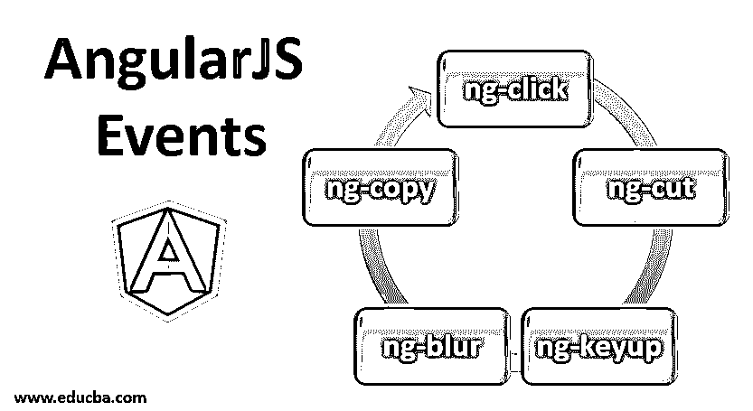

## AngularJS 事件简介

AngularJS 可以被描述为一个用于为移动和网络开发建立单页面应用程序的 JavaScript 框架。SPA 是一个单独的页面，其中许多知识仍然相似，支持少量数据，您可以通过单击附加类别/选项进行定制。这整个过程可以减轻你的工作，只需允许超过成本，提高效率，加载网页更快。在本主题中，我们将学习 AngularJS 事件。

通过使用 AngularJS 的[，你可以使用指令以及使用](https://www.educba.com/what-is-angularjs/) [HTML 属性](https://www.educba.com/html-attributes/)，只需通过表达式将数据绑定到 HTML。AngularJS 可以是一个 MVC 架构，让 web 应用从一开始构建起来就很简单。AngularJS 1.0 是 2010 年推出的，如果今天讨论的话，AngularJS 的最新版本可以是 2019 年 3 月发布的 1.7.8。AngularJS 还是一个开源框架，由 Google 使用一个庞大的程序员社区来管理。

<small>网页开发、编程语言、软件测试&其他</small>

**先决条件**

在学习 AngularJS 之前，您需要了解以下基本知识

*   Java Script 语言
*   超文本标记语言
*   半铸钢ˌ钢性铸铁(Cast Semi-Steel)

### 角度基础

以下是角度的基本要素

#### **指令**

前缀 ng 的意思是角度。 **ng-** 可以说是为[角键指令](https://www.educba.com/angularjs-directives/)预留的前缀。他们可能会建议您不要在以后的 Angular 版本的指令中使用确切的 ng 前缀来防止冲突。Ng 可以是 Angular 的缩写。

AngularJS 中一些指令的实例

*   **ng-new** 指令可用于产生新的角度应用
*   **ng-update** 指令更新您的惊人的应用程序及其依赖关系
*   **ng-app** 指令可用于初始化 AngularJS 应用程序。
*   **ng-init** 指令初始化应用程序信息。

ng-app 指令也向 AngularJS 解释了在 AngularJS 应用程序中哪个元素是“企业家”。

#### 公式

*   通过 AngularJS 的表达式将在双花括号中描述。
*   用于在指令中编写表达式:ng-bind="expression "。

**例如**

**输出:**

#### 控制器

*   应用 AngularJS 将由简单的控制器控制。
*   应用程序控制器可以用 ng-controller 指令来描述。
*   控制器被称为 JS 对象，用常规 JS 对象构造器构造。

### 解释 AngularJS 事件

不同类型的事件位于 AngularJS

AngularJS 充满了令人难以置信的事件，并包括一个基本模型，说明如何向 HTML 添加事件侦听器。它促进了大量与鼠标和键盘相关的事件。这些事件中的大多数将被放在一个 HTML 元素中。如果您同时编写了 HTML 和 AngularJS 事件，这两个事件都可以执行，这意味着 AngularJS 事件永远不会覆盖 HTML 事件。

以下是一些重要事件。

*   ng-副本
*   ng-click
*   ng 切割
*   ng-dblclick
*   ng-按键
*   吴键印刷机
*   好极了
*   ng-鼠标按下
*   ng 鼠标输入
*   ng-鼠标离开
*   ng-鼠标移动
*   ng-鼠标悬停
*   吴大老鼠
*   ng 模糊

我们要分析的是与事件的交流。

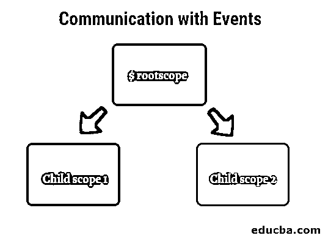

Angular JS 包括一个全局事件总线，允许您在一个作用域上引发事件，并让其他作用域监听该事件并对其做出响应。您可以通过事件传递附加参数，以便其他侦听器能够适当地响应事件。事件相当简单，但是有一些问题。

首先，监听一个事件，只需用事件名称的参数调用作用域上的$on()方法。那么任何具有该名称的事件都将触发您的回调。另一方面，提出一个事件需要一点计划。

假设我有一个在子范围 1 中引发的事件，但是我们想在子范围 2 中监听该事件。不幸的是，我们不能让它发生。

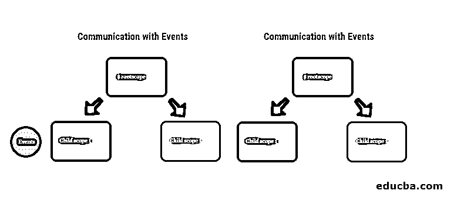

在 Angular JS 中有两个引发事件的选项。

首先是调用 scope。$broadcast，它在起始作用域上引发事件，然后将其向下发送到所有子作用域。

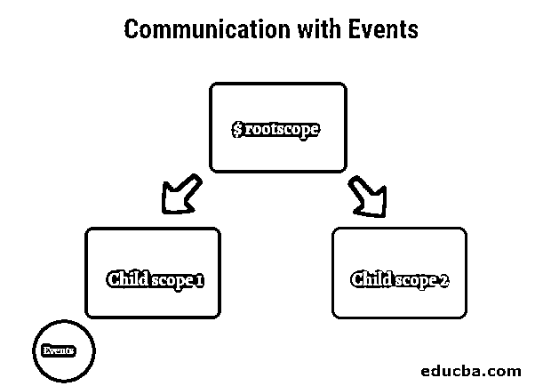

另一种选择是调用 scope。$emit，它在起始作用域上引发事件，然后沿作用域链向上发送。

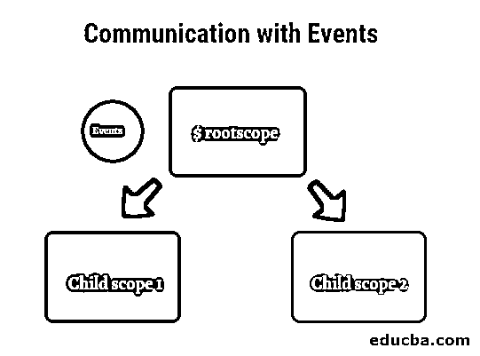

但是没有一个真正全球性的方法来从一个孩子的角度进行广播。实现这一点的方法是获取$rootScope 并对其调用$broadcast，然后将其发送到所有子作用域。

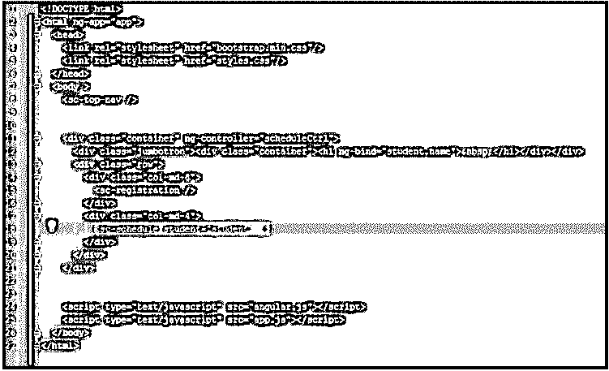

现在让我们来调整我们的代码，使它能够处理事件而不是继承的范围。因此，我们注意到我们希望事件解决的第一个问题是，在这里，在目录控制器中，这个 registerCourse()方法在调度数据上调用 push right。那不是它的工作。

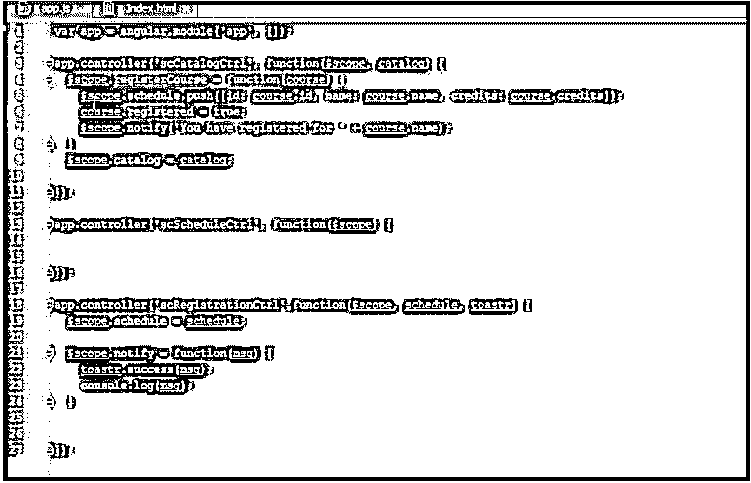

向时间表添加项目不是目录控制器应该做的事情。相反，它应该做的是通知其他人一门课程正在注册，然后相信其他对象会将课程更正添加到课程表中。当然，处理时间表的对象应该是调度控制器。

因此，让我们转到调度控制器并添加一个事件监听器。我们将称我们的活动课程为注册课程。事件回调的第一个参数是事件对象，之后是引发事件时放置的任何附加参数。

因此，我们将计划这样一个事实，即无论是谁提出了该事件，都将把提出该事件的课程也放在该事件上。然后从这里开始，我们可以执行最初在 registerCourse()方法中完成的逻辑。

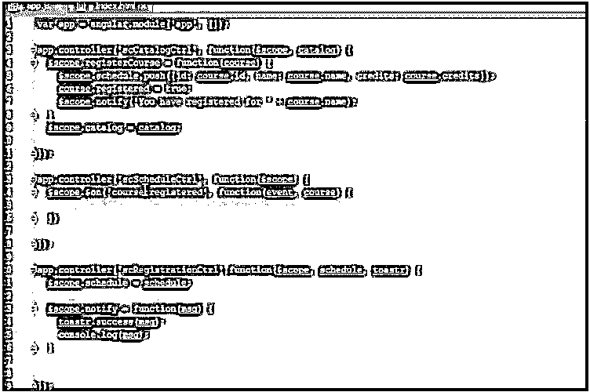

我们将去掉$scope，只引入计划服务，而不是依赖已经在$scope 上的计划。由于我们将时间表放在这里，我们不再需要将它放在我们的注册控制器上。

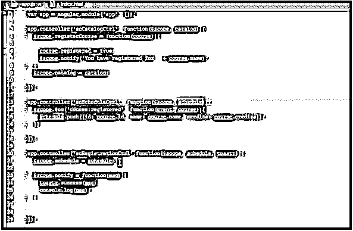

所以我们可以把这一行拿出来，移到我们的时间表控制器，现在把这种依赖关系从注册控制器中去掉。

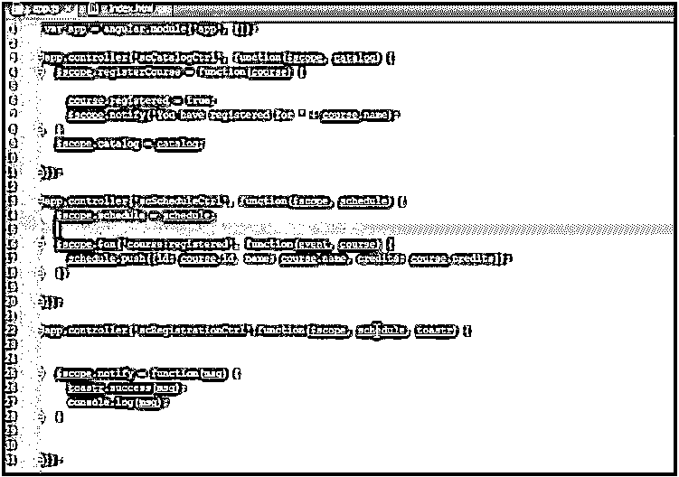

现在，我们听到了这里的事件，但没有人提出这个事件，这很好。Catalog 控制器上 registerCourse()方法中的位置。

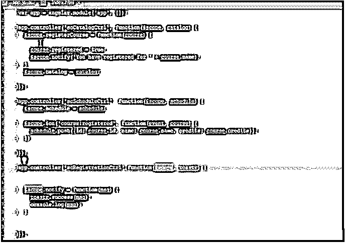

目录控制器不能引发可由时间表控制器监听的事件，因为它们是同级的。所以我们需要做的是引入对$rootScope 的依赖。

然后从这里，我们可以调用$rootScope。$broadcast()引发我们正在寻找的事件，并添加该事件所需的参数。

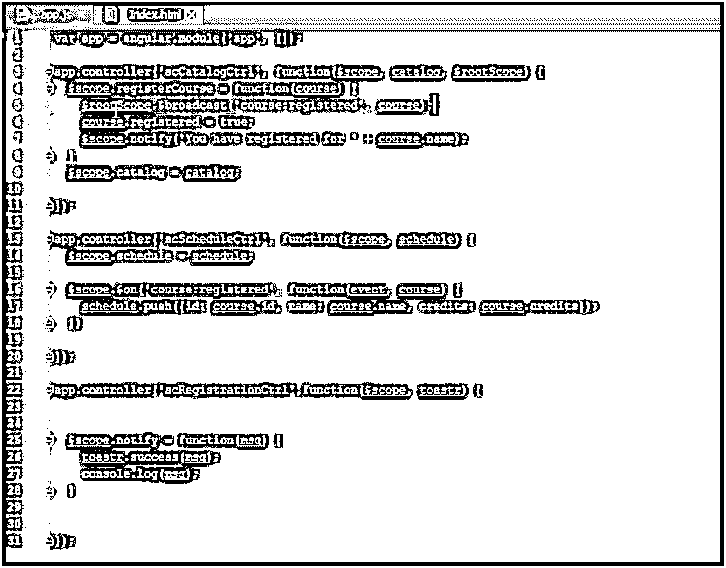

现在我们又有了一个可以清理的东西。就在这里，我们调用$scope.notify，但是我们已经引发了我们为该课程注册的事件。每当有课程注册时，我们应该让其他人来处理通知。

因此，让我们回到注册控制器，向它添加一个事件侦听器。

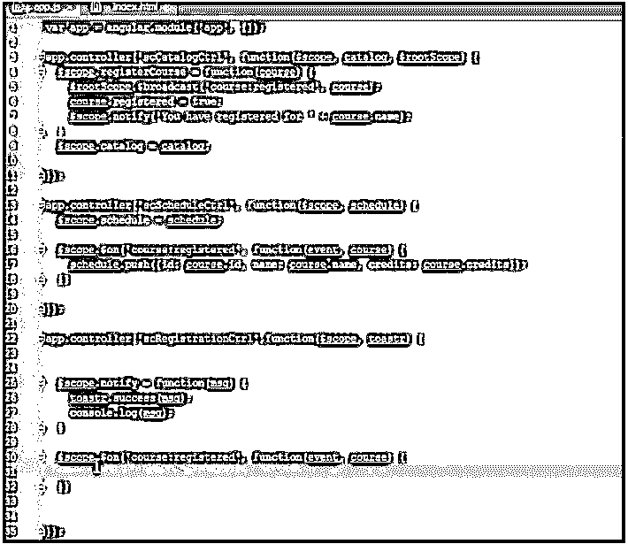

然后，从这里，我们可以调用代码来进行通知。在注册控制器中这样做似乎更合适，因为这是我们定义 notify()方法的地方。

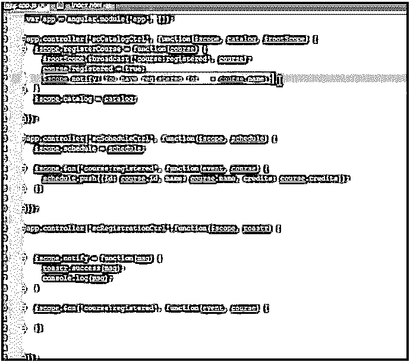

让我们在浏览器中检查这个输出，看看它是如何工作的。

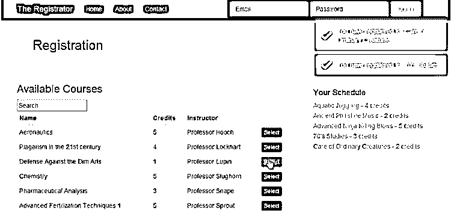

我们的改变效果很好。

现在让我们来看看代码，分析一下使用事件的好处和缺点。我们注意到的第一个好处是，每个控制器中的逻辑都与该控制器有关。

Catalog 控制器具有当有人单击 Register Course 按钮时引发事件的逻辑，以及将课程标记为已注册的逻辑。时间表具有关于向时间表添加项目的逻辑，注册控制器具有关于通知的逻辑。正因为如此，我们没有控制器带来与他们无关的服务。

此外，我们的根控制器不会因为无关的依赖项而变得杂乱无章。不过，也有一些缺点。任何处理事件的人都可以取消该事件。这可能会导致严重的错误。

如果某个特定的处理程序取消了某个事件，而仍需要监听该事件的侦听器没有进行处理。我们将控制器与这些事件联系起来。

事件的缺点是我们使用字符串作为事件名，很难防止事件名冲突。

唯一的保护措施是为事件名制定一个好的命名策略。

### 结论

*   消除服务器状态
*   支持本地应用知识
*   它很容易将视图逻辑放到 JavaScript 中
*   需要创新的技能信息和程序

### 推荐文章

这是一份 AngularJS 事件指南。在这里，我们讨论的基本角度和不同的角度事件的例子。您也可以看看以下文章，了解更多信息–

1.  [角度单位测试](https://www.educba.com/angularjs-unit-testing/)
2.  [AngularJS 架构](https://www.educba.com/angularjs-architecture/)
3.  [角度指令](https://www.educba.com/angularjs-directives/)
4.  [职业生涯](https://www.educba.com/career-in-angularjs/)