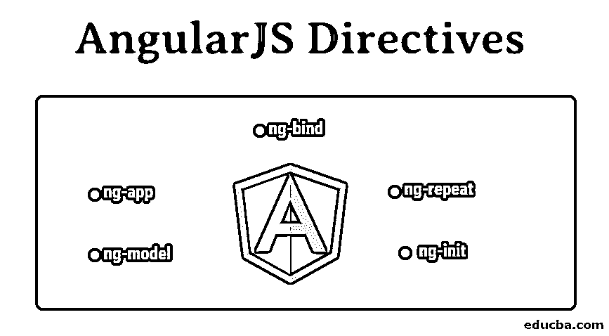

# AngularJS 指令

> 原文：<https://www.educba.com/angularjs-directives/>

## AngularJS 是什么？

AngularJS 是前端开发中最流行的基于 JavaScript 的 web 框架之一。此外，它还用于单页应用程序(spa)的开发。AngularJS 是一个开源框架，主要由 Google 和一个致力于解决单页面应用开发中所面临问题的个人社区维护。在本主题中，我们将学习 AngularJS 指令。

AngularJS 什么都不是，但它扩展了现有的[HTML](https://www.educba.com/what-is-html/)；它被添加到带有<脚本>标签的 HTML 页面中。AngularJS 通过轻松添加附加属性，使 HTML 站点对用户操作的响应更加灵敏。AngularJS 的最新稳定版本截至目前是 1.6.x。

<small>网页开发、编程语言、软件测试&其他</small>

### AngularJS 指令

AngularJS 是一个高效的框架，支持基于模型-视图-控制器(MVC)的架构。此外，它还提供了双向数据绑定、控制器、服务、指令、模板、[路由器](https://www.educba.com/what-is-router/)、过滤器、依赖注入等核心特性。这些都是协同工作使 AngularJS 高效的主要特征。

该指令是 AngularJS 中非常有用的特性之一。它扩展了现有的 HTML，并使用核心 JavaScript 轻松开发具有新行为的网页。此外，它允许我们编写自己的定制标签，并将它们映射到现有的 HTML 中。该功能提供了更多的自由度，并允许开发人员在 web 应用程序中相应地创建和使用定制元素时具有更大的灵活性。此外，他们也可以设计自己的指令。本文将主要关注 AngularJS 指令，并尝试了解这一核心特性。

指令不过是 HTML 中 DOM 元素的标记，比如属性名、元素名、CSS 类或注释。然后，AngularJS 的编译器将指定的行为附加到该元素上。每个指令都有一个名称，以“ng-”开头。每个指令都可以决定它在 DOM 元素中的使用位置。AngularJS 中已经提供了一些现有的指令，同样，我们可以自己定义它们。

我们将看看三个主要的内置指令，它们将 AngularJS 框架分为三个主要部分。

**1。ng-app:** 这个指令告诉编译器这是 AngularJS 应用程序。在 DOM 中定义它的指令成为应用程序的根元素。

**代码:**

`<!DOCTYPE html>
<html>

<body>

<! -- main code -->

</body>
</html>`

AngularJS 作为 JavaScript 文件提供，并使用

**2。ng-model:** 该指令将来自 web 页面的值(主要来自输入字段)绑定到应用程序变量。基本上，该指令允许将数据从输入发送到 AngularJS 应用程序，该应用程序可以在其他地方使用。

**代码:**

`<body>

 Enter: <input type="text" ng-model = "input"> 

</body>`

**输出:**

ng-model 指令将输入值绑定到名为“input”的应用程序变量。然后，在下一个示例中，我们将看到如何在网页上显示相同的值。

**3。ng-bind:** 该指令将 AngularJS 应用程序中的值绑定到 web 页面。即它允许将数据从应用程序转发到 HTML 标签。

**代码:**

`<body>

 Enter: <input type="text" ng-model = "input"> 

 

</body>`

**输出:**

我们使用应用程序变量“input”中的“ng-model”指令捕获的数据使用“ng-bind”绑定到标签元素

。我们现在可以运行这个应用程序，看看 AngularJS 如何动态地更新页面上输入的值。

除此之外，AngularJS 中还有其他一些重要的指令。

**4。ng-repeat:** 这个指令重复一个 HTML 元素，用于对象数组。这个指令在像在网页上显示表格元素这样的场景中非常有用。

**5。ng-init:** 该指令用于在 AngularJS 应用程序加载网页之前初始化其值。

### 创建新指令

我们可以在现有的 AngularJS 指令的基础上创建自己的自定义指令。只使用 JavaScript 创建新的指令是非常容易的。新指令是通过使用。指令”功能。例如

`<body ng-app = "appName">
<custom-Directive> </custom-Directive>

</body>`

Angular.module 是创建模块的 AngularJS 函数。我们已经创建了一个名为 custom directive 的自定义指令，并为其编写了函数。每当我们在网页上使用这个指令，这个函数就会被执行。在这种情况下，它是一个包含 HTML 代码的返回模板。

在命名指令时，我们需要使用 camel case 命名约定，在调用它时，我们需要使用“-”分隔的命名约定。

#### 有 4 种方法可以调用指令

**1。元素名称**

如上一个示例中使用的:

`<custom-Directive> </custom-Directive>`

**2。属性**

`
 
`

**3。类别**

`
 
`

要使用类名调用指令，我们必须在定义它时添加值为“C”的 restrict 属性。

`app.directive("customDirective", function() {
return {
restrict : “C”,
template : "<h1> Welcome to AngularJS Directives..! </h1>"
};
});` 

**4。评论**

`<! -- directive: custom-Directive -->`

要使用注释调用指令，我们必须在定义它时添加值为“M”的 restrict 属性。

`app.directive("customDirective", function() {
return {
restrict : “M”,
replace: true,
template : " <h1> Welcome to AngularJS Directives..! </h1> "
};
});`

replace 属性:true 是强制的，它会用一个指令替换原来的注释；否则，注释将不可见。

### 结论

因此，这是 AngularJS 中一个非常强大的功能。该指令允许我们引入新的语法，就像标记一样，并为它们附加特殊的行为。AngularJS 中有可用的指令，非常有用；我们还可以定义自己的自定义指令并使用它们。自定义指令为开发人员提供了极大的灵活性和自由度。指令以创新的风格和特性为现有的 HTML 添加了新的功能。

### 推荐文章

这是 AngularJS 指令的指南。这里我们讨论基本概念，三个主要的内置指令，它们将 AngularJS 框架分成三个主要部分。您也可以看看以下文章，了解更多信息–

1.  [AngularJS 架构](https://www.educba.com/angularjs-architecture/)
2.  [HTML 列表样式](https://www.educba.com/html-list-styles/)
3.  [角度控制器](https://www.educba.com/controllers-in-angularjs/)
4.  [角度验证](https://www.educba.com/angularjs-validation/)