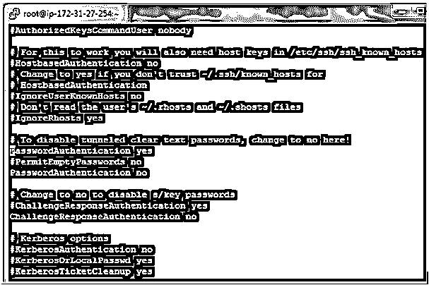
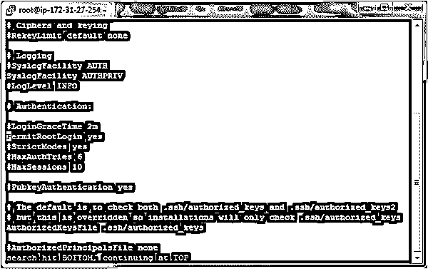
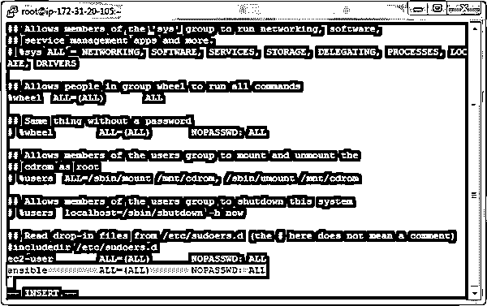
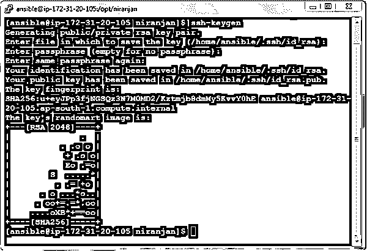
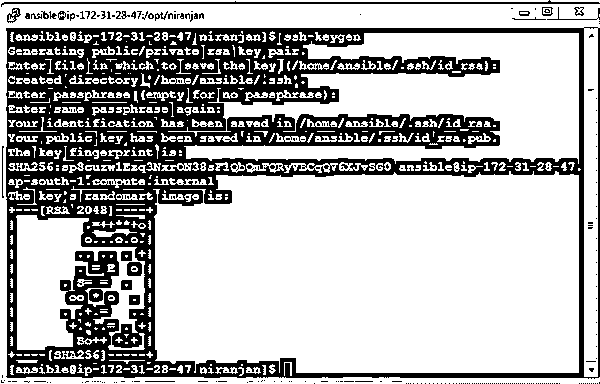
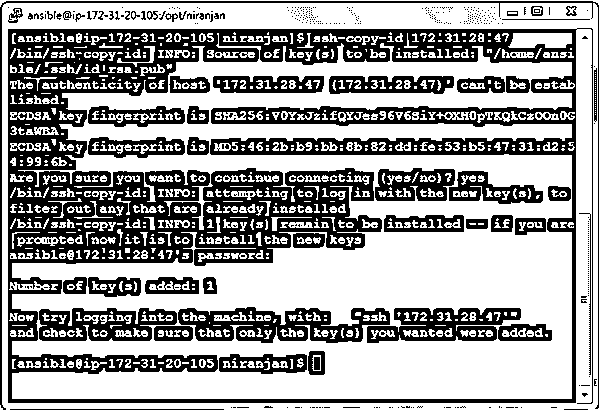
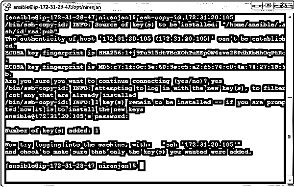
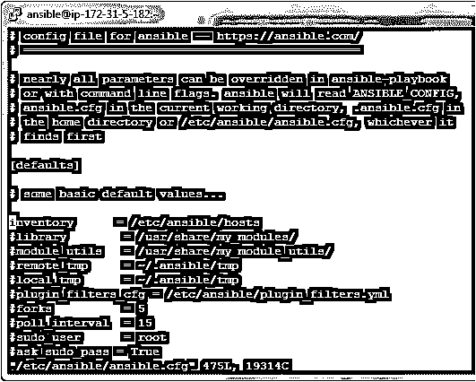
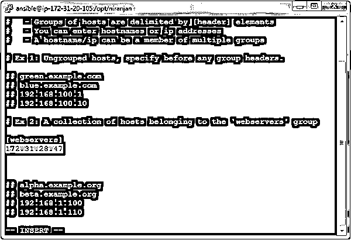

# 如何安装 Ansible？

> 原文：<https://www.educba.com/install-ansible/>

## 如何安装 Ansible？

以下文章概述了如何安装 Ansible？Ansible 充当了一个稳定的引擎，每个软件应用程序都可以很好地部署在其中。除了从部署的角度来看，ansible 还提供了其他属性，比如对云相关服务的支持。称为 ansible-playbook 的组件允许精确地实现上述属性，此外，它还允许作业执行的自动化处理。

ansible-playbook 的布局安装在非常灵活的语言上，例如 YAML，它也倾向于采用人类可读的格式。像 SSH(Secured shell host)这样的服务器端元素用于建立 Ansible 与其相应节点的连接。此外，SSH 和 Ansible 连接的设置涉及到要连接的节点，这是一个无恶魔的过程，不涉及代理。

<small>网页开发、编程语言、软件测试&其他</small>

### 安装 Ansible 的先决条件

*   **发行版:**CentOS/Ubuntu Linux/Debian/RHEL/
*   专门用于 python 的友好设计语言
*   **PyYAML:** Python 编程语言发射器和解析组件
*   **parmiko:** SSHv2 协议库，python 原生的
*   **httplib2:** 一个包含客户端 python 的库

### 安装 Ansible 的步骤

下面给出了安装 Ansible 所需的步骤:

#### 使用 YUM 安装 Ansible

**步骤 1:** 在集合机器上形成通用 id，例如，具有 SUDO 特权的。自动化任务中涉及的所有 ID 都可以使用该 ID。

**代码:**

`# user and Ansible
# passwd ansible`

**步骤 2:** 更正与运行机器相关联的/etc/ssh/sshd_config 文件，并且取消所有 PasswordAuthentication 和 PermitRootLogin 行的注释。

两台机器都执行上面列出的一组步骤。当终端系统要重新启动时，会发生这种情况

**# systemctl 重启 ssh**

**第三步:**对于完全机械化的任务，在每次都必须键入完整密码的情况下，将不使用非密码预期 SSH 验证。在对执行 ssh <目标机器>和 ssh <控制机器>命令进行修改后，每次键入密码都不是完成可完成任务的正确技术。

**步骤 4:** 为了实现无密码认证，必须执行以下步骤列表。最初将 Ansible 用户添加到两台机器上的/etc/sudoers 文件中，这很好地允许 Ansible 用户执行所有需要 root 权限的命令。添加完所需的元素后，终端退出。

**第五步:**切换到用户 Ansible。

控制机器 su-ansible 和目标机器 su-ansible<u>

</u> 

<u>

</u> 

**目标机器:**

<u>

</u> 

**目标机器 ssh-copy-id <控制-机器 IP-地址> :**

<u>

</u> 

<u>

</u> 

**目标机器:ssh ansible@ < IP 地址控制机器> :**

<u>

</u> 

<u>

</u> 

步骤 6: Wget 必须安装在两台相关的机器上。

**$ sudo yum install get -y**

**步骤 7:** 启用 EPEL 回购允许我们在控制机上安装 ansible。可以使用 Fedora 安装附加软件包[。](https://www.educba.com/install-fedora/)

**代码:**

`$ get http://dl.fedoraproject.org/pub/epel/epel-release-latest-7.noarch.rpm
$ sudo rpm -ivh epel-release-latest-7.noarch.rpm
$ sudo yum install ansible -y
$ ansible --version`

**步骤 8:** 编辑 ansible.cfg 文件，在控制机上启用库存文件参数。

**代码:**

`$ sudo vi /etc/ansible/ansible.cfg`

**步骤 9:** 使用 Ansible 中的库存来跟踪和管理目标机器。通常，该文件位于/etc/ansible/hosts 中，并允许编辑。每台需要的机器都与这些组相关联。在每个组中都应用了组名和方括号。在一个服务器中标记多个组。

**步骤 10:** 为了执行 webservers 组，允许执行下面列出的 ansible 命令。Ping 允许测试特定的功能，以及主机系统是否可以作为清单文件中提到的连接参数来建立。

**代码:**

`$ ansible webservers –m ping`

<u>

</u> 

使用 MacOS 的可行安装命令。

**代码:**

`sudo easy_install pip
sudo pip install ansible`

使用 CentOS/Fedora 安装 Ansible 的命令。

**代码:**

`sudo yum install ansible`

使用 Ubuntu 安装 Ansible 的命令。

**代码:**

`sudo apt-get install software-properties-common
sudo apt-add-repository PPA0:ansible/ansible
sudo apt-get update
sudo apt-get install ansible`

### 可行的基本命令

下面给出了可行的基本命令:

*   **主机连接验证:** # ansible <组> -m -ping
*   **重启主机系统:**# ansi ble<group>-a "/sbin/reboot "
*   **创建新用户:** #匿名<组> -m 用户-a " name =匿名密码= <加密密码>
*   **用户删除** **:** #可回复<组> -m 用户-a“姓名=可回复状态=不在”
*   **权限变更:** # ansible <组>-m file-a " dest =/home/ansible/file 1 . txt mode = 777 "
*   **用更新验证包安装:**# ansi ble<group>-m yum-a " name = httpd state = latest "
*   **验证没有更新的包安装:**# ansi ble<group>-m yum-a " name = httpd state = present "
*   **验证包版本:**# ansi ble<group>-m yum-a " name = httpd-1.8 state = present "
*   **验证包安装:**# ansible<group>-m yum-a " name = httpd state = existing "
*   **显示主机信息** **:** # ansible <组> -m 设置|少

### **结论**

Ansible 无疑是市场上一个非常稳定的系统，主要致力于软件部署和管理软件配置。ansible setup 的所有上述语句都是以一种非常优化的方式完成的。此外，ansible 展示了对其平台非常强大的支持，并且正在集成云服务和方法。

### 推荐文章

这是安装 Ansible 的指南。这里我们讨论了如何在不同的操作系统中使用命令安装 Ansible。您也可以阅读以下文章，了解更多信息——

1.  [可拆卸的展开器](https://www.educba.com/ansible-untar/)
2.  [可行的架构](https://www.educba.com/ansible-architecture/)
3.  [可回答的包括](https://www.educba.com/ansible-include/)
4.  [易变库存](https://www.educba.com/ansible-inventory/)

