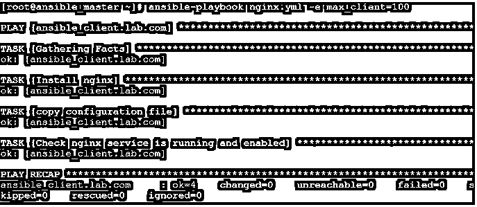
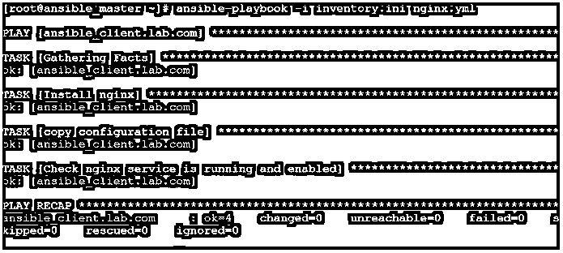

# 翻译剧本

> 原文：<https://www.educba.com/ansible-playbooks/>

## Ansible 剧本简介

Ansible playbook 是一个文件，其中包含一组需要在特定服务器或一组服务器上应用的说明或配置。它是用 YAML 的另一种标记语言编写的。它描述了我们环境中服务器的理想状态配置。我们还可以使用 Ansible Playbook 来编排一些手动订购的流程。Ansible 剧本比 Ansible 中的临时命令更强大，因为我们只能在临时命令中运行一个任务，然而，我们可以在 Ansible 剧本中编写多个剧本并在一个剧本下运行多个任务。我们使用“ansible-playbook”命令来执行剧本。

### 可翻译剧本的属性

让我们使用下面的剧本(nginx.yml)来了解 Ansible 剧本的属性:

<small>网页开发、编程语言、软件测试&其他</small>

`---
- hosts: ansible_client.lab.com
vars:
http_port: 80
remote_user: root
tasks:
- name: Install nginx
yum:
name: nginx
state: latest
tags: nginx_service
- name: copy configuration file
template:
src: /root/index.html
dest: /usr/share/nginx/html
notify:
- restart nginx
- name: Check nginx service is running and enabled
service:
name: nginx
state: started
enabled: yes
tags: nginx_service
handlers:
- name: restart nginx
service:
name: nginx
state: restarted`

**1。hosts:** 它定义了一个服务器或一组服务器，我们希望在这些服务器上运行它下面提到的任务。我们可以使用一种模式来定义主机。我们可以使用模式来定义主机。我们可以针对一个或多个服务器或一个或多个由冒号分隔的组运行任务，比如 host1:host2 或 webserver:dbserver。我们可以使用通配符，就像“web*”定义所有以“web”开头的主机一样。清单中必须存在定义的主机。一些模式示例如下:–

| **图案** | **目标** |
| 全部或(*) | 清单中的所有主机 |
| 节点 1 或组 1 | 只有一个主机或一个组 |
| 节点 1:节点 2:节点 3 或组 1:组 2:组 3 | 组 1、组 2 和组 3 中的多台主机或所有主机 |
| 第一组:！第二组 | 组 1 中的所有主机，但不在组 2 中 |
| 组 1:&组 2 | 组 1 中同时属于组 2 的所有主机 |

如果我们在清单中的所有主机上运行行动手册，那么我们可以控制主机的顺序。我们可以将“订单”定义为库存、反向库存、已排序、反向排序和洗牌。

**2。vars:** 它定义了我们可以在剧本中使用的变量。与其他编程语言相同。

**3。remote_user:** 定义任务将在哪个用户下运行在主机上。如果需要，我们可以为每个任务定义不同的远程用户。如果远程用户不是 root 用户，我们可以使用“become”关键字并将其设置为“yes ”,以向 remote_user 提供 sudo 访问，但是，在上面的示例中，我们是在“root”用户下运行任务的。

**4。任务:**我们在剧本中定义任务。它定义了在提到的主机上做什么。任务按照行动手册中的定义从上到下依次执行。每个任务都有一个与之关联的模块，该模块告诉任务必须在主机上执行什么操作。Ansible 的强大之处在于模块，Ansible 中有很多预建的模块，我们也可以创建自己的模块。例如，它有一个“yum”模块在基于 RedHat 的操作系统上安装软件包，“service”模块使用服务，“file”模块使用文件，“shell”模块在主机上执行 shell 命令，等等。

在上面的例子中，我们使用了“yum”、“template”和“service”模块。

**5。标签:**我们可以给任务一个标签，并且可以在运行剧本时指定标签，这样只有那些具有相同标签的任务才会运行。如果在同一个重头戏中有许多任务，例如，很少的任务与 web 服务器相关，很少的任务与 DB 服务器相关，那么我们可以用一个标签标记与 web 服务器相关的任务，用不同的标签标记 DB 服务器，每当我们需要只运行与 web 服务器相关的任务时，我们可以使用与 web 服务器相关的标签，反之亦然。

我们在上面的例子中使用了标记‘nginx _ service’。

**6。处理程序:**它定义了在完成任何与“notify”属性相关联的任务后，如果对主机进行了任何更改，将执行的下一个操作。即使多个任务通知了同一个处理程序，处理程序也只执行一次。它在剧中所有任务完成后的结尾运行。一个任务可以通知多个处理程序。

在上面的例子中，我们有一个名为“重启 nginx”的处理程序，它将由“复制配置文件”任务触发，因为如果有任何配置更改，我们需要重启 nginx 服务。

**让我们使用下面的命令运行上面的行动手册，并理解在从命令行执行行动手册时可以传递的选项:–**

**语法:**

`ansible-playbook <playbook_name><optional_arguments>`

**举例:**

`ansible-playbook nginx.yml`

**解释:–**在上面的例子中，我们在没有任何可选参数的情况下运行了 Ansible 剧本‘nginx . yml’。剧本里有一个剧本。它开始播放并运行一个名为“收集事实”的默认任务。在收集了关于主机的事实之后，它运行第一个任务，即“安装 nginx ”,然后第二个任务“复制配置文件”,该任务也触发处理程序，因为该任务对主机进行了一些更改，然后执行最后一个任务，以确保 nginx 服务正在运行并已启用。所有任务完成后，处理程序“restart nginx”会在最后运行。

**我们来了解一下色标:–**

1.  **绿色—**主机未发生任何变化
2.  **黄色–**主机已更改
3.  **红色—**由于某种原因，任务失败

### 可翻译剧本的论据

有许多可选参数可以传递给 ansible-playbook 命令，让我们讨论一些基本选项:-

**1。–list-hosts**:它不改变主机上的任何内容，只是显示将要执行该游戏的主机列表。

**举例:**

`ansible-playbook nginx.yml –list-hosts`

**2。–list-tags:**显示剧本中所有可用的标签。

**举例:**

`ansible-playbook nginx.yml --list-tags`

**3。–list-tasks:**显示剧本中所有可用的任务，以及与该任务相关联的标签:–

**举例:**

`ansible-playbook nginx.yml --list-tasks`

**4。–skip-tags:**我们可以跳过用–skip-tags 指定的任务。它将运行与标签不匹配的其他任务或根本没有任何标签的任何任务。这里，它运行“复制配置文件”,因为该任务没有在上面的行动手册中指定的任何标记。其他任务有标签“nginx_service”

**举例:**

`ansible-playbook nginx.yml --skip-tags nginx_service`

**5。-e:** 它允许我们将任何额外的变量设置为剧本使用的 key=value 对。我们也可以使用'–extra-var '或' extra-vars '。

**举例:**

`ansible-playbook nginx.yml–e max_client=100`

**6。-I or-inventory 或 inventory-file:** 用于在运行剧本时提供不同的存货文件，而不是默认。

**举例:**

`ansible-playbook  -i inventory.ini nginx.yml`

**Note: –** We use the ‘-h’ option to know all the available options.

### 结论

Ansible playbook 允许我们重用代码，因为我们可以将文件保存为 YAML 文件，并在需要时运行。它将所有任务组织在一个文件中，以便更好地理解。我们可以将这些剧本放在任何 SCM(源代码管理)工具上，并且利用 SCM 工具的优势。

### 推荐文章

这是一本翻译剧本指南。在这里，我们讨论 Ansible 剧本的属性和参数以及相应的例子，以便更好地理解。您也可以阅读以下文章，了解更多信息——

1.  [可翻译版本](https://www.educba.com/ansible-versions/)
2.  [可旋转拱顶](https://www.educba.com/ansible-vault/)
3.  [可承担的角色](https://www.educba.com/ansible-roles/)
4.  [可行的架构](https://www.educba.com/ansible-architecture/)

