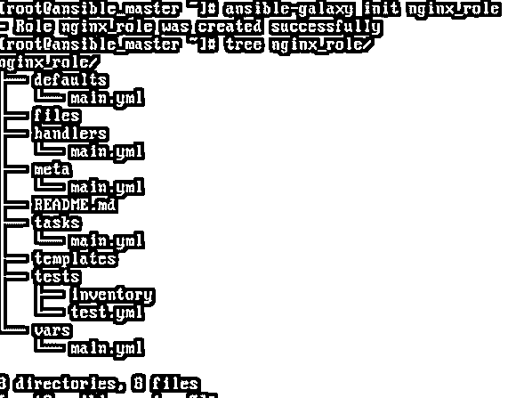
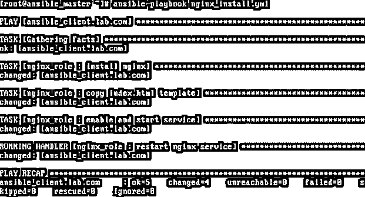
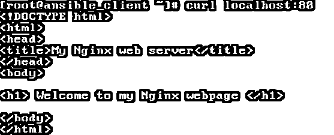
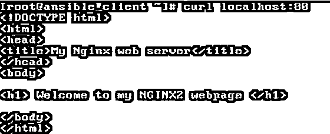
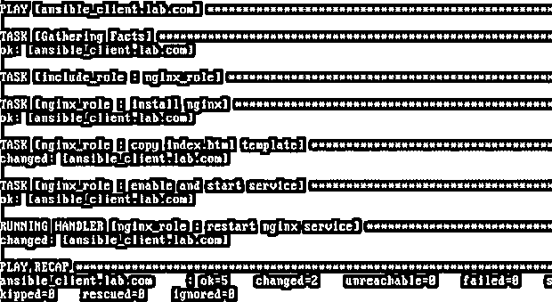
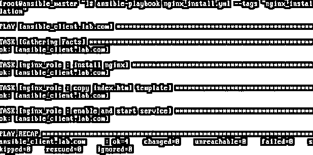
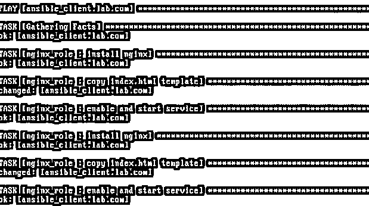
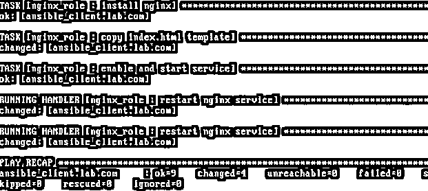
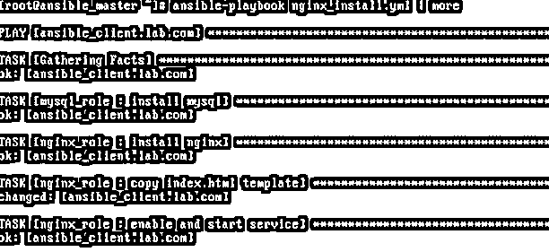

# 可变角色

> 原文：<https://www.educba.com/ansible-roles/>

## 什么是可转换的角色？

Ansible 角色用于简化 Ansible 剧本，这意味着我们可以将复杂的 Ansible 剧本分解为独立和可重用的角色，这些角色用于根据预定义的文件结构自动加载某些 var_files、任务和处理程序。我们可以调用任何可翻译剧本中的角色，因为它是可重用的，彼此独立的。我们还可以使用角色轻松地共享配置模板。如前所述，角色需要一个标准化的文件结构，这意味着至少有一个目录存在，并且必须有一个 main.yml，但是我们可以删除其他不使用的目录。角色的默认位置是“/etc/ansible/roles”。

我们有一个命令‘ansi ble-galaxy init<role_name>’来为我们创建一个角色骨架。它创建预定义的目录结构和文件如下:-</role_name>

<small>网页开发、编程语言、软件测试&其他</small>

**语法:**

`$ansible-galaxy init nginx_role`

**解释:**在上面的例子中，我们创建了一个名为‘nginx _ role’的角色，并使用 tree 命令查看新创建角色的目录结构。大多数目录都有 main.yml 文件，该文件作为角色对应目录的入口点。

### 可变角色的功能

让我们了解一下每个文件夹的功能:–

*   **任务:**我们保留我们的任务或者将由角色执行的行动，但是为了可读性和更好的可管理性，我们也可以将任务单独保存在其他文件夹中，并且如果需要，可以使用 include 将其添加到角色中。如果这个目录在角色中使用，那么它必须包含 main.yml。
*   **Vars:** 它存储角色中使用的变量。它的优先级最高，我们只能通过命令行(CLI)传递变量来覆盖它。它还有一个 main.yml 文件。
*   **Defaults:** 它还存储了默认变量之外的变量，这意味着在运行游戏时应该对其进行更改，但是如果没有定义或传递默认变量，角色将使用默认变量。它的优先级最低。
*   **处理程序:**它包含可以使用 notify 关键字标记运行的处理程序，notify 关键字-如果一个任务发生变化，只标记处理程序，并且处理程序除了被多个任务通知外，只触发一次。它不仅被定义它的相同角色使用，而且被该角色之外的任何地方使用。
*   **文件:**文件目录包含可以通过该角色部署的静态文件。它不像简单的普通文件那样包含 var 文件或模板。我们可以在没有路径的情况下引用这个目录中的文件。它不包含 main.yml 文件。
*   **模板:**它包含我们可以通过该角色部署的模板。它也没有 main.yml 文件。
*   **Meta:** 我们可以配置角色依赖和其他配置，如 allow_duplicates 等。

### 实现可变角色的示例

我们用一个例子来理解一下。我们将在一台 CentOS 客户端机器上安装 nginx，替换默认的 index.html 页面，并确保该服务已启用且正在运行。我们将对这些文件进行如下编辑:-

#### 1.nginx_role/tasks/main.yml

**语法:**

`# tasks file for nginx_role
- name: install nginx
yum: name=nginx state=latest
- name: copy index.html template
template:
src: index.html
dest: /usr/share/nginx/html
notify: restart nginx
- name: enable and start service
service:
name: nginx
enabled: yes
state: started`

**解释:**在上面的文件中，我们有 3 个任务，如果“复制 index.html 模板”任务对主机进行了任何更改，该任务将触发处理程序“重启 nginx”。

#### 2.nginx_role/template/index.html

**语法:**

`<!DOCTYPE html>
<html>
<head>
<title>My Nginx web server</title>
</head>
<body><h1>Welcome to my {{ type_of_webserver }} webpage </h1></body>
</html>`

**解释:**在上面的 index.html 文件中，我们有一些 html 代码和一个名为‘type _ of _ web server’的变量，我们将在 main.yml 中定义这个变量，它驻留在默认目录中。

#### 3.nginx_role/handlers/main.yml

**语法:**

`# handlers file for nginx_role
- name: restart nginx service
service: name=nginx state=restarted
listen: “restart nginx”`

**解释:**在上面的文件中，我们有一个监听“restart nginx”的处理程序，这与 tasks/main.yml 中“复制 index.html 模板”任务下提到的带有通知键的值相同。

#### 4.engine _ role/defaults/main . yml 中的函数

**语法:**

`# defaults file for nginx_role
type_of _webserver: Nginx`

**解释:**在上面的文件中，我们已经定义了变量‘type _ of _ web server’的值，当角色将由可翻译剧本执行时，该变量将在 index.html 中被替换。我们也可以在 vars/main.yml 中定义这个变量。这取决于变量的行为，就像如果变量的值最不可能改变，那么最好在 vars/main.yml 中定义变量。

#### 5.翻译剧本

在对上面的文件进行修改之后，让我们创建一个可行的剧本。角色文件夹和剧本必须在同一个文件夹中，或者角色必须在默认目录/etc/ansible/roles 中，否则我们必须提到角色的完整路径。

**语法:**

`# Install nginx Playbook
- hosts: ansible_client
become: yes
roles:
- nginx_role`

#### 6.运行 Ansible 行动手册

**代码:**

`$ansible-playbook nginx_install.yml`

**输出:**

**解释:**在上面的例子中，第一个 playbook 安装了 nginx，然后将 index.html 文件复制到目的地并启用 nginx 服务并启动它。它也触发了处理程序。在成功完成上述 Ansible playbook 之后，如果我们尝试在客户机上的端口 80 上连接 localhost，我们会得到下面的输出，确认我们已经在客户机上成功安装了 nginx 服务。另外，如果我们注意到它已经用 defaults/main.yml 文件中提到的值替换了变量' type_of_webserver'。

我们可以覆盖行动手册中的默认变量，如下所示:

**代码:**

`# Install nginx Playbook
- hosts: ansible_client
become: yes
roles:
- nginx_role
vars:
type_of_webserver: “NGINX2”`

**输出:**

**解释:**在上面的例子中，更改默认变量的值，并成功运行剧本后，我们在尝试连接 Nginx 服务器时得到了上面的输出。

### 可承担角色的重要性

以下是一些要点:

**1。**我们还可以使用“include_role”或“import_role ”,通过角色内嵌来导入行动手册中的角色。经典方式和角色内联之间的主要区别在于，角色是在剧本解析期间以经典方式加载的，而角色可以在运行时按照剧本中提到的条件加载，当我们使用角色内联时，如下所示:-

**代码:**

`# Install nginx Playbook
- hosts: ansible_client
become: yes
tasks:
- include_role:
name: nginx_role
when: “ansible_facts[‘os_family’] == ‘RedHat’”`

**输出:**

**说明:**在上面的例子中，playbook 在客户端使用 CentOS 操作系统的情况下运行成功。在下面的快照中，在将行动手册中的 os_family 值更改为“Debian”后，行动手册跳过了该角色。

**输出:**

**2。**我们也可以给角色分配标签。

**代码:**

`# Install nginx Playbook
- hosts: ansible_client
become: yes
roles:
- role: nginx_role
tags:
- nginx_installation`

**输出:**

**解释:**在上面的例子中，我们在执行 ansible-playbook 时传递了‘–tags’选项，它运行了该角色中定义的所有任务。它被称为 Ansible 标签继承。

**3。**角色重复。角色只能执行一次，即使它在剧本中被多次定义，除非在每个定义中传递了不同的参数。

**代码:**

`# Install nginx Playbook
- hosts: ansible_client
become: yes
roles:
- nginx_role
- nginx_role`

**输出:**

它只能运行两次，我们在每个角色定义中传递不同的参数，或者我们用“allow_duplicates: true”为该角色更新 meta/main.yml，如下所示:

**代码:**

`# Install nginx Playbook
- hosts: ansible_client
become: yes
roles:
- role: nginx_role
vars:
type_of_webserver: “NGINX2”
- role: nginx_role
vars:`

**输出:**

**解释:**在上面的例子中，你可以看到它运行了两次，如果我们连接到 nginx 服务器，它有下次传递的变量值，正如我们在下面的快照中看到的:-

**输出:**

**4。**角色依赖。我们可以在 meta/main.yml 文件中定义角色依赖关系，这意味着如果我们运行一个包含某个角色的剧本，并且该角色在其 meta/main.yml 文件中提到了角色依赖关系，那么将首先执行依赖关系下提到的角色。这里，我们将创建一个新角色“mysql_role”并使其成为“nginx_role”的依赖角色，为此，我们需要更新“nginx_role”的 meta/main.yml，如下所示:-

**代码:** mysql_role/tasks/main.yml

`# tasks file for mysql_role
- name: install mysql
yum: name=mysql state=latest
notify: restart nginx`

**代码:**engine _ role/meta/main . yml

`dependencies:
- role: mysql_role`

**输出:**

**解释:**在上面的例子中，我们可以看到它首先运行了‘MySQL _ role’，然后是‘nginx _ role’。没有变化，因为 MySQL 已经安装在客户端上。

**5。**我们还可以在角色中包含自定义模块和插件。我们需要在角色目录结构中创建一个库文件夹，并将模块放在该文件夹中。

### 结论

Ansible 角色是 Ansible 的简单但健壮的特性，它以标准化的文件结构组织一组变量、任务、文件、处理程序和依赖关系。我们可以使用‘ansi ble-galaxy’创建任何角色的骨架。我们可以从 [Ansible Galaxy](https://www.educba.com/ansible-galaxy/) 中搜索和下载角色，因为社区成员上传了许多预先构建的角色。

### 推荐文章

这是一个可转换角色的指南。在这里，我们讨论什么是可能的角色、的功能、重要性以及用示例代码实现的示例。您也可以浏览我们的其他相关文章，了解更多信息——

1.  [可翻译版本](https://www.educba.com/ansible-versions/)
2.  [可旋转拱顶](https://www.educba.com/ansible-vault/)
3.  [可行的架构](https://www.educba.com/ansible-architecture/)
4.  [可变滤波器](https://www.educba.com/ansible-filters/)

