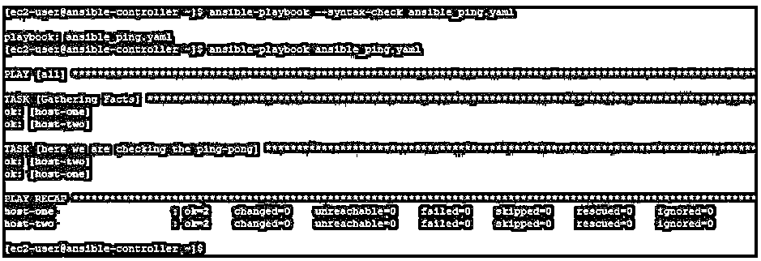

# 可回答的 Ping

> 原文：<https://www.educba.com/ansible-ping/>

## Ansible Ping 简介

在 Ansible 中，要在远程主机上执行任务，我们需要对目标远程主机有一些基本要求，以便 Ansible 环境可以按预期设置和工作。这些需求主要与网络、用户管理、Python 在目标远程机器上的权限和可用性有关。我们可以一个接一个地手工检查这些需求，或者我们可以使用像 ping 这样的模块来测试这些需求中的大部分。当使用 ping 时，返回值要么是字符串形式的成功，要么是失败时的错误消息。Ansible ping 模块一个非常有用但简单的测试模块，用于检查目标远程机器的连通性和可工作性。它试图检查远程机器上的一些东西，这是 Ansible 以稳定的方式工作的基本需求。

因此，ping 模块用于检查远程目标机器上的以下要求。

<small>网页开发、编程语言、软件测试&其他</small>

*   网络连接
*   当前用户登录
*   可用 Python 可用性

在目标远程机器上检查这些东西之后。它根据成功或失败返回一个值。这个模块应该作为对您的 Ansible 环境的第一次检查，以识别不可访问的机器。这样你的剧本就不会失败。因为 Ansible playbook 的工作行为是这样的，即它将在第一次出现故障时失败，并且将不会继续，即使后来的任务是可行的。对于目标 Windows 环境，Ansible 提供 win_ping 模块，对于目标网络设备，Ansible 提供 net_ping 模块。

### Ansible Ping 是如何工作的？

Ansible ping 模块以非常简单的方式工作，并分别以定义/默认字符串或错误的形式返回成功或失败。该模块没有任何特殊的参数或选项。

下面是在使用它之前应该知道的几点。

*   在成功验证远程主机上的登录能力和可用 python 的可用性之后。默认情况下，它返回 pong 字符串，这基本上意味着远程机器上的连接性和可用 Python 足够好，可以工作。
*   这在 ICMP 上不起作用，但默认情况下在 SSH 或任何其他定义的连接方法上起作用。
*   一个可接受的参数是接受 pong、crash 或其他字符串值的数据。
*   默认为 pong。这表示成功时的返回值。
*   如果提供的数据带有值 crash，那么这个模块将返回一个异常。
*   虽然我们可以在剧本中使用这个模块，但是这个模块主要是与直接在终端上使用的命令/usr/bin/ansible 一起使用。
*   Ansible Core 团队保证该模块具有向后兼容性。

### 可回答的 Ping 示例

下面是提到的例子:

这里我们有一个名为 ansible-controller 的 Ansible 控制服务器和两个名为 host-1 和 host-2 的远程主机。我们将创建剧本，在 ansible-controller 节点上运行 Ansible 命令，并在远程主机上查看结果。

#### 示例#1

在本例中，我们使用如下所示的 ansible 命令，使用该命令我们尝试检查 Ansible 在远程目标节点上工作的状态。

**代码:**

`ansible all -m ping -v`

**输出:**

这里我们看到，当使用 Ansible ping 模块。它检查远程目标机器上的网络连接、通过 SSH 和 python 解释器的登录能力。

#### 实施例 2

在下面的示例中，我们将尝试在行动手册中运行该模块。这不是最有用的，但当我们有条件先测试连接，然后开始做其余的任务时可以使用。

**代码:**

`hosts:
all
tasks:
name: here we are checking the ping-pong ping:`

**现在运行该行动手册，如下所示:**

`ansible-playbook --syntax-check ansible_ping.yaml`

**输出:**

现在，在名为“var_ping”的变量中注册输出，然后使用本手册中的调试模块打印返回值，如下所示，我们可以看到，在输出中，我们将 pong 作为返回值。

**代码:**

`hosts:
all
tasks:
name: here we are checking the ping-pong ping:
register: var_ping
debug:
var: var_ping`

**如下运行:**

`ansible-playbook ansible_ping.yaml`

**输出:**

#### 实施例 3

在本例中，我们将尝试将返回值从默认的 pong 更改为 crash。我们可以写一个如下的剧本。这里我们期望它会返回一个异常。

**代码:**

`hosts:
all
tasks:
name: Here we are trying to return "crash" on successful ping:
data: crash`

**运行剧本如下:**

`ansible-playbook ansible_ping_crash.yaml -v`

我们得到如下所示的输出，可以看到两个目标远程机器都返回了一个异常。

**输出:**

#### 实施例 4

在这个例子中，我们将尝试在成功的测试验证时返回一个名为“test”的值。我们将在名为“var_ping”的变量中注册返回值。然后使用调试模块，我们将打印返回的字符串。

为此，我们创建了如下行动手册:

**代码:**

`hosts: all
gather_facts:
no tasks:
ping:
data: test
register: var_ping
debug:
var: var_ping`

**现在运行该行动手册，如下所示:**

`ansible-playbook ansible_ping_string.yaml`

我们得到如下所示的输出，可以看到我们在返回字符串中得到“test”。

**输出:**

#### 实施例 5

在本例中，我们将从文件中删除 ssh 密钥。ssh/ authorized_keys，这样就不可能从 Ansible 控制器节点到 host-one 建立无密码连接。我们不会对 host-2 做任何更改。现在检查 ping 模块，如下所示。

**代码:**

`ansible all -m ping`

我们得到的输出如下，在这里我们可以看到，虽然网络连接是面向 host-one 的，Python 也是可用的。但是由于无密码 SSH 验证不起作用，主机 1 上的 ping 测试失败了。另一方面，它在主机 2 上工作。

**输出:**

### 结论

正如我们在上面的例子中看到的，Ansible ping 模块是一个有用且易于使用的模块，它可以告诉您目标远程主机的连接状态。虽然这个简单的测试模块不像其他的 Ansible 模块那样有很多选项，但是我们需要这种模块来检查基本的可操作性。

### 推荐文章

这是一个可回答的 Ping 的指南。在这里，我们讨论 Ansible Ping 的介绍，它是如何工作的以及编程示例。您也可以看看以下文章，了解更多信息–

1.  [可变寄存器](https://www.educba.com/ansible-register/)
2.  [可行的特别命令](https://www.educba.com/ansible-ad-hoc-commands/)
3.  [Ansible 将用户添加到组](https://www.educba.com/ansible-add-user-to-group/)
4.  [可旋转的塔](https://www.educba.com/ansible-tower/)

